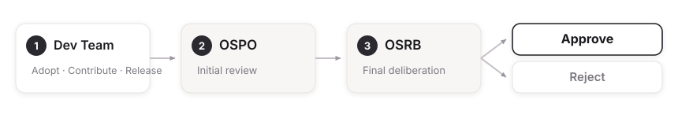

## What is OSPO?

OSPO (Open Source Program Office) is the organization responsible for managing open source within a company. Technology, legal, and infrastructure teams collaborate to establish and execute open source policies, and to manage community relationships.

SK Telecom's OSPO bridges developers and the legal team. It supports developers in maximizing the benefits of open source, while managing the legal risks that open source usage brings around licensing and security. The goal is for open source adoption to be a strategic, responsible decision rather than just a technical choice.

## Key Roles of SK Telecom's OSPO

{}
- **Strategic planning**: Establishing and improving policy, analyzing usage, setting a roadmap
- **Education and guidance**: Regular training, usage/contribution/release guides, compliance checklists
- **Community management**: Supporting contributions, releasing and maintaining SK Telecom's own projects
- **Policy execution**: License/security/IP review, automation tools such as ONOT
{}

### 1. Strategic Planning

OSPO establishes and regularly refines the company's open source policies, analyzes development teams' usage patterns, and sets a mid-to-long-term roadmap so the organization can leverage open source systematically.

### 2. Education and Guidance

OSPO delivers regular open source training for developers and establishes clear policies and guidance on usage, contribution, and release. Compliance checklists and templates simplify the review process.

### 3. Community Management

OSPO encourages and supports developers' contributions to external projects, while releasing SK Telecom's internally developed technology as open source, managing those projects, and engaging external contributors.

### 4. Policy Execution

OSPO reviews license compliance when development teams use open source, and evaluates security vulnerabilities and IP issues. It also develops and operates automation tools such as ONOT to streamline recurring compliance work.

## SK Telecom's Open Source Decision-Making Structure

SK Telecom's open source governance is a two-stage structure: OSPO (operations) and OSRB (decision-making). OSPO receives adoption, contribution, and release requests from development teams, conducts an initial review, and presents them to OSRB (Open Source Review Board). OSRB, made up of leaders from technology, legal, infrastructure, and security, conducts the final deliberation on license, security, and IP grounds and decides on approval.

[Learn more about OSRB →](/about/osrb/)

## Guidance and Support Provided by OSPO

### Using Open Source

Adopting external open source follows this process:

1. License identification and policy-fit review
2. Compatibility check against licenses already in use
3. Security vulnerability check
4. Approval and documentation (for future audits or disputes)

[View Open Source Usage Guide →](/guide/use/)

### Contributing to Open Source

Contributing to an external project is supported through this process:

1. Reviewing the target project's license, community activity, and legal risk
2. CLA/DCO review and signing
3. Contributing code that complies with the project's license and policy
4. Documenting the contributed code's license and confirming IP protection

[View Open Source Contribution Guide →](/guide/contribute/)

### Releasing Open Source

Releasing internally developed technology follows this process:

1. Pre-approval review for core IP and security concerns
2. License selection (SK Telecom typically uses Apache 2.0)
3. Removing internal information and writing documentation
4. Public release on GitHub and community management

[View Open Source Release Guide →](/guide/release/)

## Contact and Communication

### Email Contact

All inquiries regarding SK Telecom OSPO and open source management can be sent to opensource@sktelecom.com.

### Online Channels

SK Telecom's open source projects can be found on GitHub at [https://github.com/sktelecom](https://github.com/sktelecom). Feedback such as bug reports and feature requests can be filed through each project's Issues section.

[View detailed contact information →](/about/contact/)
