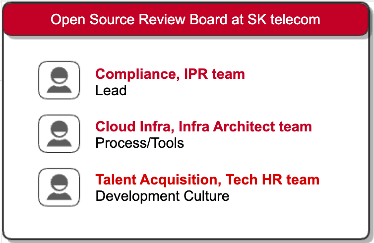

The Open Source Review Board (OSRB) is an organization composed of managers of open source, legal team, patent team, development team, and infrastructure team to manage the open source governance of a company.

* OSRB creates policies and processes for open source program and defines R&R within the company to carry out them.
* OSRB discusses solutions and prepare countermeasures when open source issues arise in a company.
* If necessary, OSRB reports issues to executives to receive feedback on risk mitigation measures.

# OSRB at SK telecom 

SK Telecom's OSRB is led by the IPR team, and the Infra Architect team and Tech HR team participate as members.

