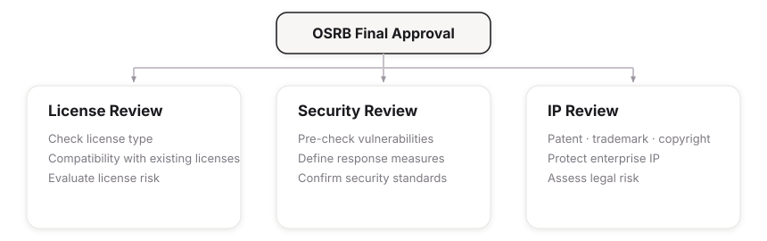

## What is OSRB?

OSRB (Open Source Review Board) is a decision-making body made up of leaders from technology, legal, infrastructure, security, and IP to manage open source across the enterprise.

While OSPO (Open Source Program Office) handles open source operations and guidance, OSRB is the governance body responsible for major policy decisions and risk management. It systematically reviews license, security, and IP risks before deciding whether to approve new open source adoption or releases.

## Core Roles of OSRB

### 1. Policy Establishment and Process Definition

OSRB establishes basic policies for usage, contribution, and release, defines license policy and compatibility guidelines, and sets security and IP policy. It also defines the open source review/approval process and the security vulnerability response process.

OSRB further defines the roles of OSPO, development teams, legal, and security teams through R&R (Roles & Responsibilities), so open source management stays consistent across the organization.

### 2. Risk Review and Approval

OSRB reviews risk across three areas and grants final approval.

- **License review**: Evaluating license type, compatibility, and risk level for new open source
- **Security review**: Pre-examining vulnerabilities, defining response measures, checking against security standards
- **IP review**: Deliberating patent, trademark, and copyright issues, and reviewing IP protection measures

### 3. Issue Management and Response

OSRB analyzes issues that arise during open source management and defines a rapid response. Legal disputes are handled together with the legal team, with external experts consulted as needed. Critical issues are reported to executives to finalize an enterprise-wide response.

## SK Telecom's OSRB Composition

### Organizational Structure and Roles

SK Telecom's OSRB is chaired by the IPR Team, with the DevOps, Security, and HR teams participating.

- **IPR Team** (chair): Reviews open source licenses, protects IP, checks legal compliance
- **DevOps Team**: Evaluates infrastructure/environment-related open source, reviews deployment and operations risk
- **Security Team**: Reviews security vulnerabilities, confirms compliance with security and information security policy
- **HR Team**: Runs open source training and capability development, supports open source culture, checks policy consistency

### Regular Meetings and Decision-Making

OSRB holds monthly meetings to review the month's open source activity, discuss major issues and risks, and refine policy and process. Long-term strategy, community contribution, and enterprise-wide compliance status are also reviewed. Emergency meetings are convened as needed for security issues, legal disputes, or policy violations.

## Contact and Communication

All inquiries regarding SK Telecom's OSRB and open source management can be directed to opensource@sktelecom.com. We respond within 2-3 business days.

For more detailed information, please refer to the following links:

- [OSPO (Open Source Program Office)](/about/ospo/) - Responsible for open source operations and guidance
- [Contact](/about/contact/) - Additional contact information
- [Compliance](/compliance/) - Open source license notices and compliance information
