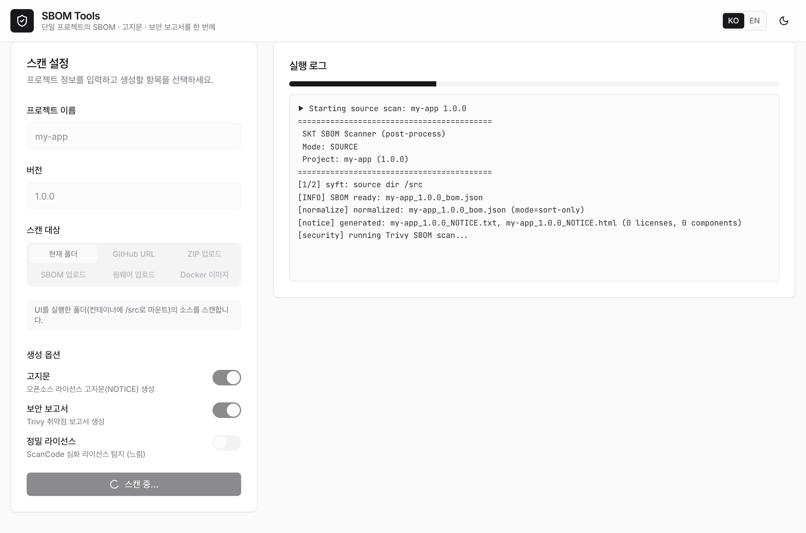

Hello.

SK Telecom has released [BomLens](https://github.com/sktelecom/bomlens), a supply chain security tool it developed in-house, as open source. BomLens analyzes the components of your software and automatically produces a CycloneDX 1.6 SBOM (Software Bill of Materials).

As software supply chain security grows in importance, knowing exactly which open source components and versions are included becomes increasingly critical. BomLens automates this process, easing the burden for both the producer and the receiver of software.



## What It Can Do

BomLens does two jobs from a single Docker image.

First, it scans the software you build. It analyzes source code, a container image, or a binary and produces a CycloneDX SBOM, an open-source notice, and a security report. It supports many languages such as Java, Python, Node.js, Go, Rust, .NET, and C/C++, and accepts inputs in various forms including a source folder, a GitHub URL, a ZIP archive, and a Docker image.

Second, it analyzes the software you receive. It examines an SBOM or firmware received from a supplier and produces an open-source risk report covering licenses and known vulnerabilities. Every scan emits the risk report by default.

## How to Use It

All you need is a Docker engine. Even without command-line experience, you can use the browser-based Web UI: enter the project name and scan target, run it, and download the results while watching live logs.

```bash
git clone https://github.com/sktelecom/bomlens.git
cd bomlens
docker pull ghcr.io/sktelecom/sbom-generator:latest

# Run from the folder where results should be saved; it opens http://localhost:8080
/path/to/bomlens/scripts/scan-sbom.sh --ui
```

A CLI workflow for CI/CD pipelines is also provided, and a double-click desktop app is available for Windows and macOS. For more details, see the [BomLens project page](/en/project/sbom-generator/) and the [getting started guide](https://github.com/sktelecom/bomlens/blob/main/docs/getting-started.en.md).

We hope BomLens helps with your software supply chain security and open source compliance work. If you have feedback or suggestions, please share them anytime on [GitHub](https://github.com/sktelecom/bomlens).

Thank you.
