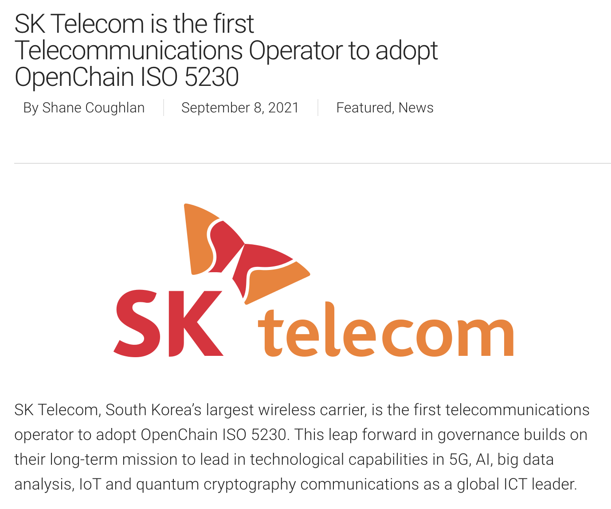

SK telecom supports and actively participates in the spirit of the Linux Foundation [OpenChain Project] (https://www.openchainproject.org/) to improve the level of open source compliance in the software supply chain.



<i>https://www.openchainproject.org/</i>



In August 2021, SK telecom created an open source policy and established an open source compliance process in consideration of the requirements of the [ISO/IEC 5230:2020 OpenChain Specification](https://www.iso.org/standard/81039.html).  Hereby, SK telecom affirms the followings:
* satisfies all requirements of [ISO/IEC 5230:2020 OpenChain Specification](https://www.iso.org/standard/81039.html).
* reviews and supplements open source policiy and open source compliance processes at least every 18 months to ensure continuity.



<i>https://www.iso.org/standard/81039.html</i>



SK Telecom is the first telecommunications operator to adopt ISO/IEC 5230. 

[https://www.openchainproject.org/featured/2021/09/08/sk-telecom](https://www.openchainproject.org/featured/2021/09/08/sk-telecom)
