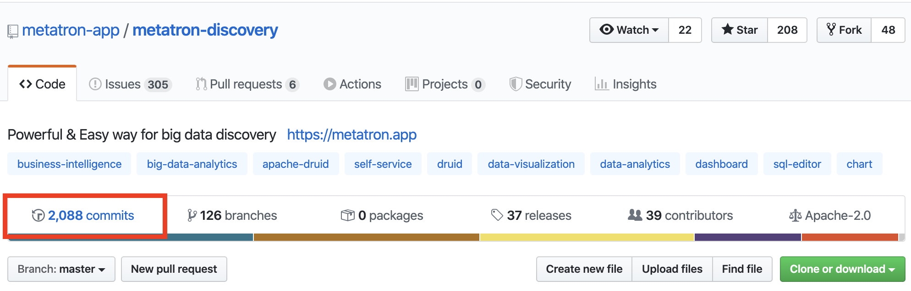
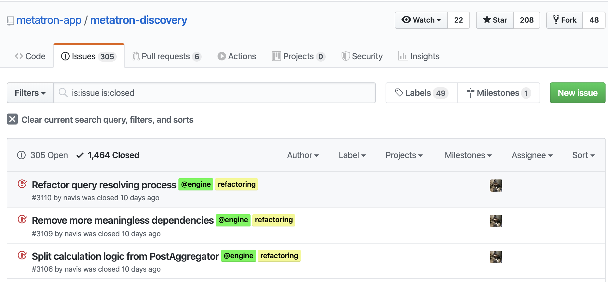
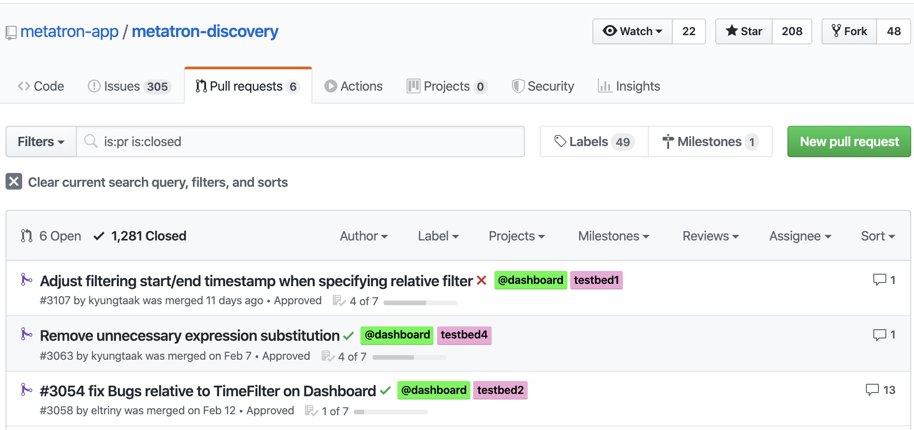

{}
This page was written with reference to [GitHub's Open Source Guide](https://opensource.guide/).
{}

Naturally, you should contribute to open source projects that are related to your work or in an area of technical interest. If there are several such projects, it is also worth considering which one is worth contributing to. Otherwise, your hard-earned contribution may be buried without any response.

The following is a checklist for determining whether an open source project you are interested in is suitable for contribution activity.

## 1. Is There an Open Source License File?

* [x] Is there a LICENSE file? Typically, there is a file named LICENSE in the root directory of the repository.

A project to which no open source license applies is not open source. Only when the software's copyright holder grants, through an open source license, the right for anyone to use and distribute it can a company use that software freely. Using software without an open source license at will can create legal risks such as copyright infringement.

## 2. Is the Project Actively Receiving Contributions?

* [x] When was the most recent commit?
* [x] How many contributors are there?
* [x] How frequent are the commits?

If there are few contributors or there have been no commits for several years, the project can be considered unmaintained.

On GitHub, you can check the commit status under "Commits" at the top of the screen.

## 3. Check the Project's Issues

* [x] How many issues are open?
* [x] When an issue is opened, do maintainers respond quickly?
* [x] Is there active discussion on the issues?
* [x] Are the issues recent?
* [x] Are issues being closed?

If issues are not being opened, or if they are opened but not responded to, the project can be considered unmaintained.

On GitHub, you can check the status of closed issues by looking at the "closed" tab on the Issues page.

## 4. Check the Project's Pull Requests

* [x] How many Pull Requests are open?
* [x] When a Pull Request is opened, do maintainers respond quickly?
* [x] Is there active discussion on the Pull Requests?
* [x] Are the Pull Requests recent?
* [x] How recently have Pull Requests been merged?

On GitHub, you can see closed Pull Requests by clicking the "closed" tab on the Pull Request page.

## 5. Does the Project Have a Welcoming Atmosphere for Contributions?
* [x] Do maintainers give helpful answers to questions about issues?
* [x] Are people friendly in issues, forums, and chat (such as Slack)?
* [x] When you submit a Pull Request, does a review take place?
* [x] Do maintainers show appreciation for people's contributions?

A project that does not have a welcoming atmosphere for contributions is unlikely to develop well over the long term. This can also be a criterion for judging whether a project is worth contributing to.
