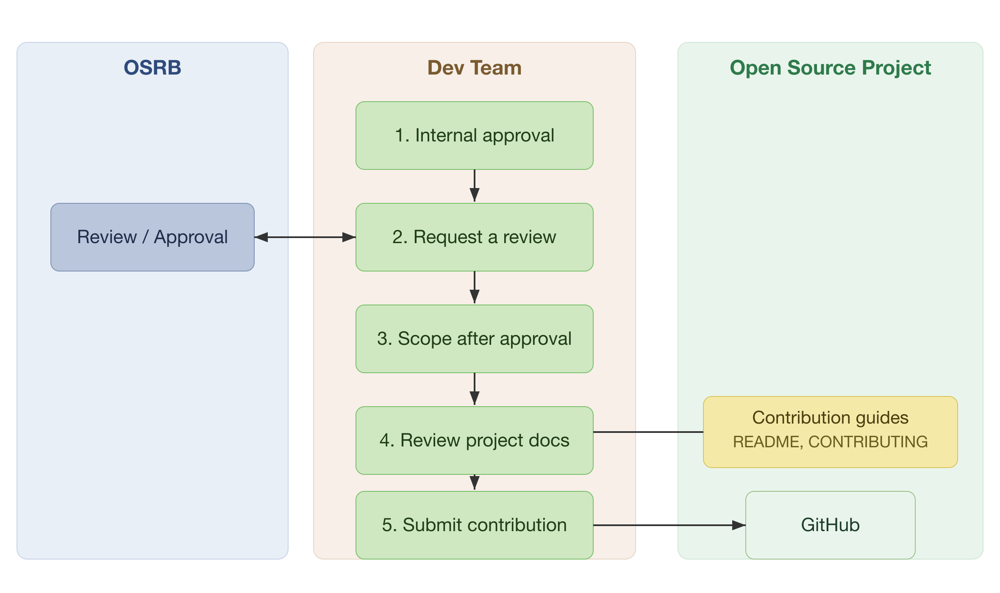

In accordance with SK Telecom's open source contribution rules, members follow the contribution process below when contributing to external open source projects.

{}
However, for simple matters such as the following, the risk of copyright infringement is not significant, so members may contribute at their own discretion without the review process.

* Small code snippets of 10 lines or fewer
* Questions / answers on Stack Overflow
* Management activities on GitHub: creating issues, reviewing / approving Pull Requests, etc.
{}

## 1. Internal Approval Within Your Organization
Before starting to contribute to an open source project, obtain approval from the responsible executive or leader of your organization.

## 2. Request an OSPO Review
After obtaining approval within your organization, request a review from the OSPOOpen Source Program Office: [Support (opensource@sktelecom.com)](https://sktelecom.github.io/about/contact/)

* When requesting a review, include the following: [Template]
  * Open source project name
  * Repository
  * License
  * Purpose of contribution
  * Details of contribution
* The OSPO reviews the open source project's License / CLA and approves it if there are no issues.
* The OSPO compiles the status of open source projects to which SK Telecom members are contributing. The compiled data is used as an expert pool for each open source project.

{}
Once you have received an OSPO review and approval for an open source project you want to contribute to, you may contribute to that open source project at the member's discretion thereafter.
{}

## 3. Review the Project's Contribution Documents

The required process differs slightly from one open source project to another.

* Each project has various guidelines on coding style, language, formatting, bug/ticket management, release timing, and so on.
* Some projects require signing a CLA, while others require a DCO Signed-off-by.
* As for how patches are accepted, most projects now use GitHub Pull Requests, but some still use a mailing list.

For this reason, to properly understand the process of the project you want to contribute to, you must first carefully review the documents the project provides. Most projects provide these documents as a CONTRIBUTING or README file. For example, Kubernetes provides a detailed guide for contributors. ([contributing.md](https://github.com/kubernetes/community/blob/master/contributors/guide/contributing.md): a guide for contributing to Kubernetes) The better you comply with the requirements in the documents, the more likely your contribution is to be accepted.

## 4. Comply with the Open Source Contribution Rules
Review the [SK Telecom Open Source Contribution Rules](/en/guide/contribute/rule) and improve the code you will contribute accordingly.

## 5. Submit Your Contribution
Now submit your contribution according to the process required by the project's documentation. For how to contribute to a typical open source project, refer to the following pages.

* [Detailed Contribution Submission Process](/en/guide/contribute/process/submit)
* [How to Communicate](/en/guide/contribute/background/communication)
