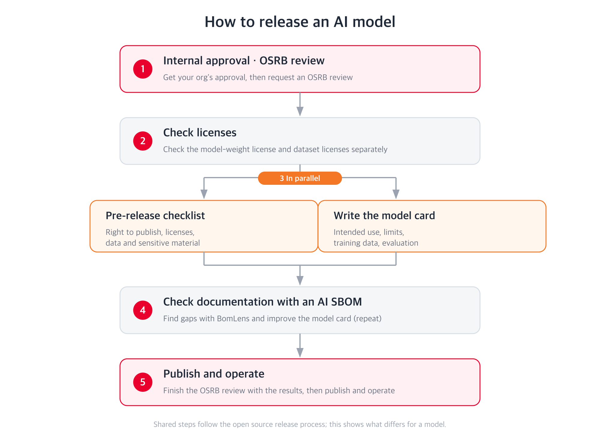

{}
This page covers releasing a trained AI model (its weights). For source code, see
[Releasing Open Source](../). If you are consuming an external open source model rather than
publishing one, see [AI Model Licenses](/guide/use/obligation/#7-ai-model-licenses).
{}

Releasing an AI model follows most of the same steps as releasing source code. You obtain
organizational approval, confirm you have the right to publish, remove sensitive information, and
assign someone to support the project afterwards. For those shared steps, follow
[the release process](../process/) and the [release rules](../rule/).

This page covers only what differs because the artifact is a model.

## What differs from a code release

| Aspect | Source code | AI model |
|---|---|---|
| What you publish | Source code | Weight files and a model card |
| Licensing | One license for the code | Model license and training dataset licenses, judged separately |
| Documentation | README, contribution guide | Model card covering intended use, limits, bias, evaluation |
| Sensitive material | Code and commit history | Also personal data and copyrighted works inside the training data |
| Regulation | Export control (ECCN) | Also the documentation duties of the EU AI Act and Korea's AI Framework Act |

Training datasets are where teams most often get stuck. Even with the model license settled, the
license of the data you trained on may restrict redistribution or commercial use. Check the two
separately.

## Summary

1. Obtain internal approval and request an OSRB review (stage A of [the release process](../process/)).
2. Confirm the license of both the model and every training dataset.
3. Work through the [pre-release checklist](checklist/).
4. Write the [model card](model-card/). It is the document your users will read first.
5. If you need to prepare for regulation, check your documentation with an [AI SBOM](ai-sbom/).
6. Publish the repository and operate it (stage D of [the release process](../process/)).

## Checking your model before you publish

Work through the rights and data items on the [pre-release checklist](checklist/) first. A private
repository is still an upload to an outside service, and pushing weights that turn out to contain
something you cannot publish is hard to undo.

After that, you can check the model yourself while the repository is still private. Push the
model privately and run BomLens, the SBOM generator, with your own Hugging Face token (`HF_TOKEN`);
it reports what is missing and how to fill it. Strengthen the model card with that result ahead of
time, and the OSRB review has the documentation it needs and goes more smoothly. The command to run
BomLens, how to prepare the token, and how to read the result are in [AI SBOM](ai-sbom/).

## Related pages

- [Release process](../process/) — the shared path from approval to operation
- [Release rules](../rule/) — what to satisfy before publishing
- [Sensitive information checklist](../process/scrub-checklist/) — cleaning code and commit history
- [AI Model Licenses](/guide/use/obligation/#7-ai-model-licenses) — RAIL, Llama and similar licenses

## Contact

For questions and review requests about releasing an AI model, contact the OSRB
(opensource@sktelecom.com).
