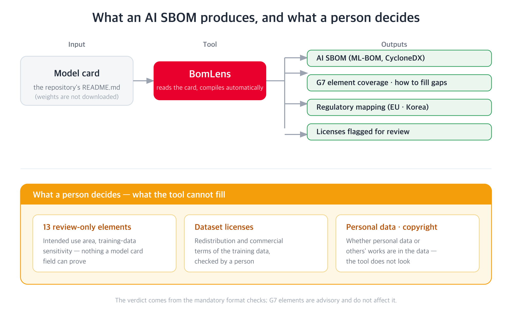

An AI SBOM is a machine-readable inventory of a model, its training datasets, and their provenance
and licenses. Where a software SBOM carries package dependencies, an AI SBOM carries the layers a
software SBOM cannot express: model weights and training data.

It is built from what the model card says, so a thin model card yields a thin AI SBOM.

## Why produce one

It serves two purposes.

For the publisher it is a self-check on how complete the documentation is. Seeing what is missing as
a list means you can close the gaps before release.

For the recipient it is evidence for a review. Just as SK Telecom asks suppliers for an SBOM, other
organizations have begun asking the same of AI models.

## The G7 minimum elements

In May 2026, CISA and G7 partners jointly published "Software Bill of Materials for AI — Minimum
Elements", led by Germany's BSI and Italy's ACN. It defines 50 minimum elements in seven clusters
that a model's inventory should carry. It is a non-binding recommendation, not a regulation.

| Cluster | Elements | Needing human judgement | Content |
|---|---:|---:|---|
| Metadata | 10 | 0 | Who produced the inventory, when, with which tool |
| System-level properties | 9 | 4 | System name, application area, data flow |
| Models | 13 | 0 | Model identifier, license, integrity, training properties |
| Dataset properties | 10 | 5 | Dataset provenance, statistics, sensitivity, license |
| Infrastructure | 2 | 0 | Software dependencies and hardware |
| Security properties | 4 | 3 | Security controls, policy, vulnerability handling |
| Key performance indicators | 2 | 1 | Security metrics and operational performance |

Thirteen of the 50 have no automated source. Things like the intended application area or the
sensitivity of the training data cannot be proven by any model card field, so a person has to
supply them.

## How it relates to regulation

The G7 elements are advisory, but they overlap substantially with the technical documentation actual
regulations require.

{}
An AI SBOM and its regulatory mapping do not certify or determine compliance with any regulation.
They make documentation gaps visible so a person can prepare. Interpreting them against a specific
system's legal obligations is a person's job; when in doubt, consult Legal and the OSRB.
{}

| Regulation | Effective | Key provisions |
|---|---|---|
| EU AI Act | High-risk and transparency duties from 2 August 2026 | Article 11, Annex IV |
| Korea's AI Framework Act | In effect since 22 January 2026 | Article 31 (transparency), 32 (safety), 33–34 (high-impact AI), 35 (impact assessment) |

The EU AI Act is specific about technical documentation through Article 11 and Annex IV: it must
cover a system's purpose and architecture, the provenance and processing of its training data, and
its performance and limits. The G7 system-level, model, and dataset clusters correspond to these.

Korea's AI Framework Act keeps its detailed documentation requirements in the enforcement decree, so
the correspondence is coarser than the EU's. Article 32 (safety) applies only to systems trained
above a compute threshold set by that decree, so a linked element points at the subject of the duty
rather than establishing that the duty applies.

## Producing one

Give BomLens a model id and it reads the model card, builds a CycloneDX AI SBOM, and reports G7
element coverage alongside the regulatory mapping. It fetches model-card metadata only and does not
download the weights.

```bash
./scripts/scan-sbom.sh --project my-llm --version 1.0.0 \
  --model "my-org/my-llm" --generate-only
```

Scanning an AI model needs a separate image, and it can also be run from a web interface. Setup,
usage and how to read the reports are covered in the
[BomLens AI model guide](https://sktelecom.github.io/bomlens/guides/ai-model/); this page does not
repeat them.

A private repository needs a token with read access. How to pass it as `HF_TOKEN`, and what a gated
repository additionally requires, are in
[Private and gated models](https://sktelecom.github.io/bomlens/guides/ai-model/#private-and-gated-models).
Scope the token to that single repository rather than one that opens your whole account, and if your
organization enforces a token approval policy, an administrator has to approve it first, so start
the token request early.

You get:

- an AI SBOM covering the model and its datasets
- per-element coverage, and how to supply what is missing
- the mapping to the EU AI Act and Korea's AI Framework Act
- components whose license needs human review



## Reading the result

An overall pass does not mean every G7 element is filled. G7 elements are all advisory and do not
move the verdict. Read the covered count and the gap count separately.

Gaps come in two kinds: those you close by writing in the model card, and those a person has to
judge. Start with the first kind.

## Related pages

- [Model card](../model-card/) — the input to an AI SBOM
- [Pre-release checklist](../checklist/) — what to confirm before release
- [What is an SBOM](/guide/supply-chain/sbom/what-is-sbom/) — SBOMs in general
- [BomLens AI model guide](https://sktelecom.github.io/bomlens/guides/ai-model/) — setup, usage, reading the reports
- [BomLens](/guide/supply-chain/for-suppliers/skt-scanner/) — the tool, and its supplier-facing usage

## References

- [Software Bill of Materials for AI — Minimum Elements](https://www.bsi.bund.de/SharedDocs/Downloads/EN/BSI/KI/SBOM-for-AI_minimum-elements.pdf?__blob=publicationFile&v=4) (G7, May 2026)
- [Regulation (EU) 2024/1689 (AI Act)](https://eur-lex.europa.eu/eli/reg/2024/1689/oj)
- [AI Framework Act (Korea)](https://www.law.go.kr/법령/인공지능발전과신뢰기반조성등에관한기본법)

## Contact

For questions about producing or reading an AI SBOM, contact the OSRB
(opensource@sktelecom.com).
