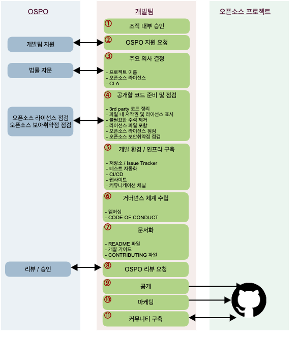

  - [1. 소속 조직 내부 승인](#1-소속-조직-내부-승인)
  - [2. OSPO 지원 요청](#2-ospo-지원-요청)
  - [3. 주요 의사 결정](#3-주요-의사-결정)
    - [프로젝트 이름 결정](#프로젝트-이름-결정)
    - [라이선스 결정](#라이선스-결정)
    - [CLA 결정](#cla-결정)
  - [4. 공개할 코드 준비 및 점검](#4-공개할-코드-준비-및-점검)
    - [3rd party 코드 정리](#3rd-party-코드-정리)
    - [파일 내 저작권 및 라이선스 표시](#파일-내-저작권-및-라이선스-표시)
    - [불필요한 주석 제거](#불필요한-주석-제거)
    - [라이선스 파일 포함](#라이선스-파일-포함)
    - [오픈소스 라이선스 점검](#오픈소스-라이선스-점검)
    - [오픈소스 보안취약점 점검](#오픈소스-보안취약점-점검)
  - [5. 개발 환경 / 인프라 구축](#5-개발-환경--인프라-구축)
    - [저장소/Issue Tracker](#저장소issue-tracker)
    - [테스트 자동화](#테스트-자동화)
    - [CI/CD](#cicd)
    - [웹사이트](#웹사이트)
    - [커뮤니케이션 채널](#커뮤니케이션-채널)
  - [6. 거버넌스 체계 수립](#6-거버넌스-체계-수립)
    - [멤버십](#멤버십)
    - [CODE OF CONDUCT](#code-of-conduct)
  - [7. 문서화](#7-문서화)
    - [README 파일](#readme-파일)
    - [개발 가이드](#개발-가이드)
    - [CONTRIBUTING 파일](#contributing-파일)
  - [8. OSPO 리뷰 요청](#8-ospo-리뷰-요청)
  - [9. 공개](#9-공개)
  - [10. 마케팅](#10-마케팅)
  - [11. 커뮤니티 활성화](#11-커뮤니티-활성화)

### 1. 소속 조직 내부 승인
소프트웨어를 오픈소스로 공개하기 위해 소속 조직의 담당 임원 혹은 리더에게 승인을 받는다. 

### 2. OSPO 지원 요청
오픈소스 공개를 결정하고 소속 조직의 승인을 받은 후, OSPO에 지원을 요청한다. : [Support (opensource@sk.com)](https://link-removed/)

OSPO는 이 가이드의 내용 위주로 오픈소스 공개 Rule 및 절차를 설명하고, 필요 사항을 지원한다. 

### 3. 주요 의사 결정

#### 프로젝트 이름 결정
듣기 좋고 외우기 쉬우며, 어떤 프로젝트인지 나타낼 수 있는 이름으로 짓는게 좋다. 문제가 될 소지가 있는 이름은 피해야 한다. 자세한 사항은 다음 페이지를 참고한다.
* [오픈소스 프로젝트 이름 결정](/guide/release/process/name)

#### 라이선스 결정
소프트웨어를 오픈소스로 공개하기 위해서는 라이선스를 부여해야 한다. 그래야 다른 사람들도 소프트웨어를 사용, 복사, 수정 및 배포할 수 있다. 또한, 라이선스는 법적인 문제로부터 기여자를 보호한다. 따라서, 오픈소스 프로젝트를 시작할 때 적절한 오픈소스 라이선스를 선택하고 이를 프로젝트에 적용해야 한다.‌

SK텔레콤은 소프트웨어를 오픈소스로 공개 시 기본적으로 [Apache-2.0](http://www.apache.org/licenses/LICENSE-2.0)를 적용한다. Apache-2.0는 사용자에게 광범위한 자유를 제공하면서 명시적인 특허 허여 조항 등 법적인 관점에서도 잘 작성된 라이선스이다.

단, 예외적으로 다음과 같은 경우는 Apache-2.0 외의 라이선스도 적용할 수 있다.‌

* 커뮤니티에서 주로 사용하는 라이선스가 지정되어 있는 경우도 있다. 예를 들어, Node.JS 프로젝트는 MIT 라이선스를 사용한다. 이때는 해당 라이선스를 적용할 수 있다.

* 어떤 프로젝트는 GPL 라이선스의 라이브러리와의 종속성이 있어서 GPL로 공개해야 하는 경우도 있다. 이때는 GPL을 적용할 수 있다.

참고로, GitHub에서는 오픈소스 공개 시 라이선스 선택에 대한 가이드를 제공하고 있다. : https://choosealicense.com

{}
만약, 이외의 다른 라이선스를 선택해야 할 상황이라면 OSPO(Open Source Program Office)에 문의하라. : [Support (opensource@sk.com)](https://link-removed/)
{}

#### CLA 결정
오픈소스로 공개한 프로젝트를 운영하면서 어떤 이유에서든지 기존의 오픈소스 라이선스를 다른 라이선스로 변경해야 할 상황이 발생할 수 있다. 이때는 프로젝트의 Leader라고 해도 임의로 라이선스를 변경할 수 없으며, 프로젝트에 저작물을 기여한 모든 저작권자의 동의를 얻어야 가능하다. 오랜 기간동안 많은 기여자로부터 저작물을 기여 받은 프로젝트의 경우 모든 저작권자에게 동의를 받는 것은 사실상 거의 불가능하고, 따라서 오픈소스 라이선스의 변경 또한 불가능하다. 

이와 같이 다수의 기여자의 저작물을 관리하면서 발생할 수 있는 분쟁을 줄이기 위해 기여자에게 사전에 동의를 구하는 약정서가 CLA (Contributor License Agreement)이며, 주로 기여자로부터 다음 사항의 동의를 구하는 내용을 담고 있다. 

~~~
- 나(또는 소속 기업)는 내가 기여하려고 하는 기여물을 프로젝트에 기여할 권리가 있다. (즉, 이 기여물의 저작자이다.)
- 나(또는 소속 기업)는 나의 기여물을 프로젝트가 수정, 배포, 관리할 수 있는 권한을 프로젝트에 부여한다.
- 나(또는 소속 기업)는 부여한 권한을 철회하지 않는다.
- 나(또는 소속 기업)는 프로젝트가 향후 필요에 따라 라이선스를 변경할 수 있는 권한을 프로젝트에 부여한다.
~~~

기여자에게 CLA 서명을 요구할 경우, 프로젝트가 기여자의 저작물을 관리하기 용이해지는 장점이 있지만, CLA 서명을 거부하는 기여자로부터 기여를 받을 수 없다는 단점이 있다. 

SK텔레콤은 첨부의 CLA를 사용하고 있다. SK텔레콤 템플릿
* 프로젝트에 CLA를 사용할지 여부는 프로젝트 목적 및 환경에 따라 공개하는 조직에서 결정한다. 
* (1) 향후 오픈소스 라이선스를 변경할 계획이 없거나, (2) 다수의 기업이 참여하고 저작권 분쟁이 발생할 가능성이 크지 않을 경우, CLA를 사용하지 않아도 된다. 

### 4. 공개할 코드 준비 및 점검
‌오픈소스로 코드를 공개하기 전에 불필요하게 이슈가 될 부분은 사전에 제거하는 등 정리하라. 

#### 3rd party 코드 정리
프로젝트에 3rd party 코드를 포함해야 하는 경우라면, 즉, SK텔레콤이 저작권을 갖고 있지 않은 코드를 프로젝트에 포함해야 한다면 먼저 SK텔레콤이 재배포할 수 있는 권한이 있는지 확인하라. 이미 오픈소스 라이선스가 적용된 코드라면 라이선스 의무를 준수하는 조건으로 재배포할 수 있다. 

* 재배포할 수 있는 권한 확인에 대한 도움이 필요하다면 OSPO(Open Source Program Office)에 문의하라. : [Support (opensource@sk.com)](https://link-removed/)

SK텔레콤이 재배포할 수 있는 3rd party 코드인 경우, 기존 코드와는 다른 디렉토리(예: third_party)에 위치시킨다. 이는 라이선스 관점에서 프로젝트의 투명성을 증대시키며, 향후 사용자도 3rd party 코드를 쉽게 찾게 찾게 되어 정확한 라이선스 요구사항을 준수할 수 있게 한다.

3rd party 디렉토리에 있는 모든 디렉토리는 각각 LICENSE 파일 (저작권 정보와 라이선스 전문을 포함하는 텍스트 파일)을 포함해야 한다. 예를 들어, Repository에서 third_party 디렉토리의 구조는 다음과 같다.

~~~
[Root Directory]
|-- SKT source code
|-- ....
`-- third_party
    `-- [external library A]
    |   |-- `LICENSE`
    |   `-- ...
    `-- [external library B]
        |-- `LICENSE`
        `-- ...
~~~

#### 파일 내 저작권 및 라이선스 표시
‌소스 코드를 포함하는 모든 파일은 저작권 및 라이선스 표기를 포함하라. 이는 몇몇 파일만 복사해서 사용하려는 사용자들도 라이선스 의무를 준수하는데 도움이 된다. 자세한 내용은 다음 페이지를 참고하라.
* [저작권 및 라이선스 표시](/guide/release/process/copyright)

#### 불필요한 주석 제거
공개하려는 코드에 회사의 영업 비밀이나 문제를 일으킬만한 불필요한 주석이 포함되지 않도록 확인하라.‌

* (굳이 외부에 공개할 필요가 없는) SK텔레콤 구성원의 이름과 이메일 주소를 삭제하라.
* 내부 정보를 삭제하라. (내부 코드 파일 이름 / 경로, 내부 호스트 / IP정보 등)

참고로, 아래의 명령어를 사용하면, 불필요한 주석을 쉽게 찾을 수 있다.

~~~perl
### 회사 웹사이트, 이메일, IP 주소 검색
$ egrep -r '\.sktelecom\.com|@sk\.com|@sktelecom\.com|([0-9]+\.){3}[0-9]+' <path-to-source-directory>

### Java/C/C++/Go/Objective-C/Objective-C++/Swift/Kotlin 주석 검색
$ find <path-to-source-dir> -type f | egrep '\.(c|cc|h|cpp|go|java|kt|m|mm|swift)' | \
  while read f; do echo "------------ $f ------------------"; sed -n -e '/\/\*.*\*\// {p; b}' \
  -e '/\/\*/,/\*\//p' -e '/\/\//p' "$f"; done

### Python/Bash 주석 검색
$ find <path-to-source-dir> -type f | egrep '\.(py|sh)' | while read f; \
  do echo "------------ $f ------------------"; grep -o "#.*" "$f"; done
~~~

#### 라이선스 파일 포함
라이선스 사본을 담고 있는 LICENSE라는 이름의 텍스트 파일을 최상위 디렉토리에 포함한다.

{}
* Apache License의 경우, [공식 라이선스 사본 파일](http://www.apache.org/licenses/LICENSE-2.0.txt)을 그대로 복사해서 사용하면 된다.
* 다른 라이선스를 적용하기로 한 경우, 라이선스 사본은 [SPDX License List](https://spdx.org/licenses/)에서 받을 수 있다.
{}

#### 오픈소스 라이선스 점검
오픈소스 라이선스 점검 도구를 이용하여 공개할 소스 코드를 점검하여 다음 사항을 확인한다. 

* 고지 / 소스 코드 공개 의무를 요구하는 라이선스 하의 다른 오픈소스 포함 여부
* 여러분이 공개할 권리가 없는 3rd party 소스 코드 포함 여부
* 여러분이 적용할 오픈소스 라이선스와 충돌하는 라이선스하의 코드 포함 여부

{}
오픈소스 라이선스 점검은 OSRB에 요청한다. : [Support (opensource@sk.com)](https://link-removed/)
{}

#### 오픈소스 보안취약점 점검
오픈소스 보안취약점 점검 도구를 이용하여 공개할 소스 코드에 보안취약점 이슈가 있는 오픈소스가 포함되어 있는지 확인한다. 

{}
오픈소스 보안 취약점 점검은 OSRB에 요청한다. : [Support (opensource@sk.com)](https://link-removed/)
{}

### 5. 개발 환경 / 인프라 구축
#### 저장소/Issue Tracker
프로젝트를 위한 저장소를 준비하라. 많은 프로젝트가 GitHub 또는 GitLab repository를 사용하거나 Gerrit과 같은 도구를 사용하여 자체 저장소를 제공한다. Bug, issue, feature tracking을 위한 기능도 인프라 계획의 일부로 포함되어야 한다.

SK텔레콤 GitHub Repository를 이용할 것을 권장한다. : https://github.com/sktelecom

* GitHub 멤버 등록은 OSRB에 요청한다. : [Support (opensource@sk.com)](https://link-removed/)

#### 테스트 자동화
오픈소스 개발은 원격지의 다수가 비동기로 협업해야 하는 특성을 갖는다. 그러면서도 우수한 품질을 유지하기 위해서는 테스트 자동화가 필수이다. 다음과 같은 테스트를 제공하고 자동화하라. 

* Unit Test
* Integration Test
* End-to-End Test

#### CI/CD
테스트 뿐만 아니라 빌드, 배포까지 개발 라이프 사이클 전체에 걸쳐 지속적인 자동화와 모니터링을 제공하는 환경을 구축하라. 다시 말하지만 오픈소스 프로젝트의 성공과 지속을 위해서는 자동화된 개발, 빌드, 테스트와 배포 환경이 필수이다. 

#### 웹사이트
사용자 가이드를 제공하고 프로젝트를 홍보하기 위한 웹사이트를 구축하라. 프로젝트의 리더십, 거버넌스 세부 사항 등에 대한 내용도 제공할 수 있다.

[GitHub Pages](https://pages.github.com/)는 간단히 웹사이트를 제작하고 호스팅할 수 있는 방법을 제공한다. 

#### 커뮤니케이션 채널
커뮤니티에서 원활한 커뮤니케이션이 가능하도록 채널을 제공하는 것이 중요하다. 또한 코드 체크인, 오류 로그 등 기타 작업에 대한 알림을 주는 등 전체 개발 Work Flow에 통합할 수 있는 도구가 필요하다. 이는 프로젝트를 실시간으로 진행하는 중요한 수단이 된다.

* 우수한 도구 중 하나는 [Slack](https://slack.com/)이다. Slack은 사용자가 메시지와 파일을 공유하고, Work Flow 구성, 정보 검색 등의 작업을 수행할 수 있게 하는 온라인 프로젝트 관리 및 통신 플랫폼이다. 그러나 Slack은 상용 도구이며 유지 관리 비용이 발생한다.

* 오픈소스로 공개된 도구들로는 IRC, [Gitter.im,](https://gitter.im/) [Rocket.Chat](https://rocket.chat/) 등이 있다. Rocket.Chat은 오픈소스이며 Slack과 유사한 기능을 제공한다.

단, Slack과 같은 타사 서비스에서는 회사의 기밀 정보를 논의해서는 안된다. 이러한 커뮤니케이션 채널은 공개 토론으로만 사용해야하며 회사 내부 조직의 논의 도구로는 사용하지 않는다. 

### 6. 거버넌스 체계 수립
#### 멤버십
오픈소스 프로젝트는 여러 지역의 다양한 인원이 모여서 협업을 수행한다. 효과적인 협업을 위해서는 참여 인원의 명확한 역할 구분이 필요하다. 이를 위해 어떤 멤버십을 구성할지 결정하라. 

* 일반적인 오픈소스 프로젝트의 멤버십은 다음 페이지를 참고하라. : [오픈소스 프로젝트 멤버십](/guide/contribute/background/membership)
* 또한, 멤버십의 한 예로 [HANU 오픈소스 프로젝트의 멤버십](https://github.com/openinfradev/community/blob/main/governance/membership.md)을 참고할 수 있다.

#### CODE OF CONDUCT
CODE OF CONDUCT는 행동수칙, 행동강령이라고도 불리며 프로젝트가 건강하게 유지되기 위한 참가자의 행동 규칙을 정의한 문서이다. 예를 들어 성별, 인종, 종교, 나이 등의 차별이 있어서는 안 되고 누구나 따뜻하게 환영받고, 안전한 활동을 보장하기 위해 행동해야 함을 강조한다. 그리고 누군가 그 규칙을 어길 경우, 신고할 방법을 안내한다. 

다음은 SK텔레콤의 오픈소스 프로젝트에서 사용할 수 있는 CODE OF CONDUCT 템플릿이다. : 

### 7. 문서화 
오픈소스 프로젝트가 많은 사용자와 기여자를 확보하기 위해 가장 중요한 부분이 문서화이다. 얼마나 자세하고 정확한 문서를 제공하느냐가 프로젝트의 품질로 인식된다. 소프트웨어의 기능이 아무리 우수하더라도 이를 문서로 성실하게 표현하지 않으면 사용자는 발길을 돌리고 말 것이다. 

#### README 파일
여러분이 공개한 오픈소스를 많은 사용자들이 사용하기를 원하는가? 그렇다면 사람들이 쉽게 시작할 수 있도록 README 파일을 제공하라. README 파일은 새로운 사람들에게 프로젝트에 대해 설명하는 가장 중요한 문서이다.

README에서는 다음 질문에 답할 수 있는 내용을 포함해야 한다.‌

* 이 프로젝트는 무엇을 하는 프로젝트 인가?
* 왜 이 프로젝트가 유용한가?
* 어떻게 시작하면 되나?
* 도움이 필요하면 어디서 도움을 받을 수 있나?

프로젝트 사용자의 배경지식은 매우 다양한다. 프로젝트를 막 시작하여 경험이 없는 사람도 쉽게 이해할 수 있도록 자세하게 문서를 제공하는 것이 좋다. 문서가 충실하게 제공될 수록 더 많은 사용자와 기여자를 확보할 수 있음을 기억하라.

{}
* README 템플릿 참고 : [README Template](https://gist.github.com/PurpleBooth/109311bb0361f32d87a2)
* README 작성 가이드 참고 : [Make a README](https://www.makeareadme.com/)
{}

#### 개발 가이드
프로젝트에 참여할 의지가 있는 예비 기여자들을 위해 개발 가이드를 제공하라. 이 문서에는 다음 내용을 포함한다. 

* How to build
* Testing Guide
* Coding Convention
* CI/CD
* Release

개발 가이드의 예는 [HANU 프로젝트 Developing 문서](https://github.com/openinfradev/community/tree/main/developing)를 참고한다. 

#### CONTRIBUTING 파일
기여자들이 참고할 수 있는 "How to Contribute"에 대한 내용을 제공하는 파일이다. CONTRIBUTING 파일이 충실하지 않다면 프로젝트로의 기여에 관심이 있던 사용자들도 열정을 잃게 된다.‌

CONTRIBUTING 파일은 다음과 같은 사항을 포함한다.

* 버그 리포트를 제출하는 방법 (Issue 생성 / Pull Request 제출 방법)
* 새로운 기능을 제안하는 방법
* 개발 환경을 설정하고 테스트를 실행하는 방법‌

또한, 다음과 같이 기여자들로부터 기여받기를 바라는 바에 대해 안내할 수 있다.

* 원하는 기여 유형
* 프로젝트의 비전과 로드맵
* 기여자들이 프로젝트 관리자에게 연락을 취할 수 있는 방법

프로젝트의 초기 단계에서의 CONTRIBUTING 파일은 간단해도 된다. 단, 버그 리포트 및 이슈 제기 방법과 사전 테스트와 같이 기여를 하기 위한 필수 조건에 대해서는 꼭 설명해야 한다.

그리고, 따뜻하고 친근한 분위기의 문서를 제공하라. 이러한 문서가 잠재적인 기여자들에게 프로젝트에 참여하고 싶은 기분이 들게 한다. 예를 들어, [Active Admin](https://github.com/activeadmin/activeadmin/)이라는 프로젝트의 [Contributing 가이드](https://github.com/activeadmin/activeadmin/blob/master/CONTRIBUTING.md)는 다음과 같이 시작한다.

> "먼저 Active Admin에 기여하는 것을 고려해주셔서 감사한다. Active Admin을 훌륭한 도구가 될 수 있는건 바로 당신 때문이다!"

{}
* CONTRIBUTING 파일 템플릿 : CONTRIBUTING-template.md
* CONTRIBUTING 파일 (예)
  * [Atom editor contribution guidelines](https://github.com/atom/atom/blob/master/CONTRIBUTING.md)
  * [Ruby on Rails contribution guidelines](https://github.com/rails/rails/blob/master/CONTRIBUTING.md)
  * [Open Government contribution guidelines](https://github.com/opengovernment/opengovernment/blob/master/CONTRIBUTING.md)
{}

CONTRIBUTING 파일도 README와 마찬가지로 프로젝트 Repository내 최상이 폴더에 위치시킨다. 그리고, 사용자들이 접근하기 쉽도록 README 파일 내에 링크를 제공하라.

### 8. OSPO 리뷰 요청

위의 절차를 통하여 공개할 준비가 되면 다음 정보를 OSPO에 제공하고 리뷰를 요청한다. OSPO는 SK텔레콤의 소프트웨어를 오픈소스로 올바르게 공개하고 커뮤니티를 활성화하기 위해 지원한다. : [Support (opensource@sk.com)](https://link-removed/)

{}
1. 현재 소스 코드 확인할 수 있는 프로젝트의 Repository 링크 (OSPO 인원이 접근할 수 있도록 권한 부여)
2. 공개 예정인 저장소 링크 (예: github.com/?)
3. 적용할 오픈소스 라이선스
4. 이 프로젝트를 오픈소스로 공개 시 기대할 수 있는 비즈니스 가치는 무엇인가?
5. SK텔레콤 구성원이 작성하지 않은 코드가 있나? 있다면 어느 파일이고, 포함되어야 하는 이유 설명.
6. 개발팀 담당 임원으로부터 오픈소스 공개에 대한 승인을 받았나?
7. 이 코드가 사용된 제품 혹은 서비스는 무엇인가? (만약 사용되지 않았다면 그 이유)
8. 오픈소스 공개 후 지원할 인력이 지정되었나?
9. 가이드에 따라 공개 준비가 완료되었나?
10. 프로젝트 공개를 알리기 위한 방법은 무엇인가? (예: Blog post, 콘퍼런스 발표)
11. 공개하려는 코드와 관련한 특허가 있나?
12. 보안 취약점을 검토하고 미비점을 보완하였나?
{}

한번 공개를 하면 이를 되돌리는 것은 쉽지 않다. 그렇기 때문에 가능한 충분한 시간을 갖고 코드를 검토하고 준비하라. 물론 완벽한 코드를 요구하는 것은 아니다. 공개한 후 후회하는 부분이 없도록 실수를 줄여야 한다.

검토 과정에서 문제가 없다면 승인 과정은 매우 간단하며 신속하게 진행한다. OSPO는 오픈소스 공개를 막는 것이 아니라 장려하고 돕기 위한 서비스를 제공한다.

‌OSPO 승인이 된 후 프로젝트 공개를 진행하라.

### 9. 공개
모든 준비와 검토 단계를 마친 후에는 최종적으로 다음 사항을 확인한다.

* 공개를 위한 Repository에 모든 코드와 문서가 존재하는지 확인하라.
* 모든 프로젝트 인프라가 실행 중이고, 안전하며, 확장 가능한지 확인하라.
* 개발자가 커뮤니케이션 채널 (IRC, Mailing List 등)에 참여하고 모니터링할 수 있는지 확인하라.

그리고, 오픈소스 프로젝트를 런칭한다. OSPO의 안내에 따라 https://github.com/sktelecom에 소스 코드 저장소를 Public하게 공개하라. (개발팀의 필요에 따라 다른 repository를 이용하여 공개할 수 있다.)

### 10. 마케팅
프로젝트를 계속 진행하기 위해서는 마케팅이 필수적이다. 마케팅에는 프로젝트 홍보, 성공적인 운영 전략 수립, 현실적인 예산 및 프로젝트 브랜딩 제공, 소셜 미디어 계정 활성화 등 장기적인 성공을 위한 활동 등이 포함된다. 여기에서는 프로젝트를 공개하고 이를 알리기 위한 몇가지 방법을 안내한다.

1. 프로젝트와 관련이 있는 커뮤니티의 메일링 리스트나 포럼에 프로젝트가 공개되었음을 알린다.
2. SK텔레콤 기술 블로그(https://sktelecom.github.io/)에 프로젝트에 대해 소개한다. 
3. 프로젝트의 소셜 미디어(Twitter, Facebook, LinkedIn 등)를 통해 홍보한다. SK텔레콤의 소셜 미디어 계정을 활용할 수도 있다. 
4. 프로젝트와 관련이 있는 오픈소스 컨퍼런스에서 주제 발표를 한다.

### 11. 커뮤니티 활성화
이제 프로젝트를 홍보하고 사람들에게 프로젝트를 사용할 수 있도록 알리는 것은 여러분의 임무이다. 얼마나 많은 사람이 프로젝트에 참여하여 코드를 사용하고, 버그를 수정하고, 문제를 보고하는지에 따라 프로젝트의 성공을 판단할 수 있다. 

* 커뮤니티 구축은 자동으로 이루어지지 않다. 커뮤니티 구축을 위한 세부 활동은 다음 페이지를 참고하라. : (커뮤니티 활성화 가이드는 준비 중 : haksung@sk.com )
* 또한, 이를 위해 프로젝트를 측정할 수 있어야 한다. 측정 지표와 측정 방법에 대한 세부 내용은 다음 페이지를 참고하라. : (오픈소스 측정 가이드는 준비 중 : haksung@sk.com )