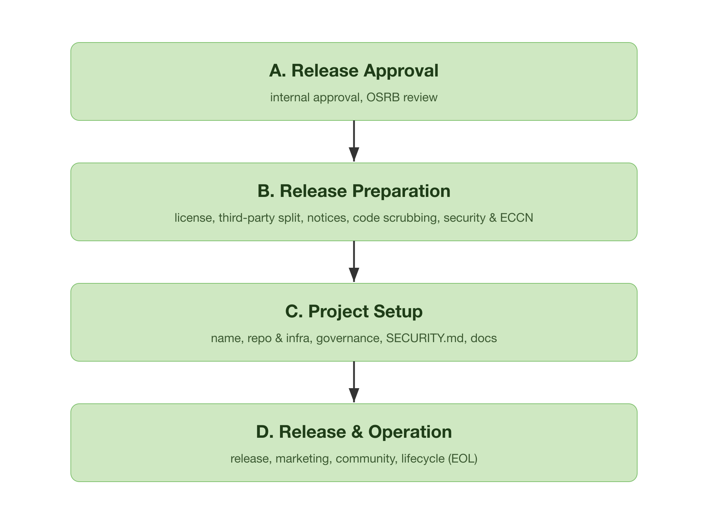

  - [1. Internal Approval from Your Organization](#1-internal-approval-from-your-organization)
  - [2. Request OSPO Support](#2-request-ospo-support)
  - [3. Key Decisions](#3-key-decisions)
    - [Deciding the Project Name](#deciding-the-project-name)
    - [Deciding the License](#deciding-the-license)
    - [Deciding on a CLA](#deciding-on-a-cla)
  - [4. Preparing and Reviewing the Code to Be Released](#4-preparing-and-reviewing-the-code-to-be-released)
    - [Cleaning Up 3rd Party Code](#cleaning-up-3rd-party-code)
    - [Copyright and License Notices in Files](#copyright-and-license-notices-in-files)
    - [Removing Unnecessary Comments](#removing-unnecessary-comments)
    - [Including a License File](#including-a-license-file)
    - [Open Source License Inspection](#open-source-license-inspection)
    - [Open Source Security Vulnerability Inspection](#open-source-security-vulnerability-inspection)
  - [5. Building the Development Environment / Infrastructure](#5-building-the-development-environment--infrastructure)
    - [Repository / Issue Tracker](#repository--issue-tracker)
    - [Test Automation](#test-automation)
    - [CI/CD](#cicd)
    - [Website](#website)
    - [Communication Channels](#communication-channels)
  - [6. Establishing a Governance Structure](#6-establishing-a-governance-structure)
    - [Membership](#membership)
    - [CODE OF CONDUCT](#code-of-conduct)
  - [7. Documentation](#7-documentation)
    - [README File](#readme-file)
    - [Development Guide](#development-guide)
    - [CONTRIBUTING File](#contributing-file)
  - [8. Request OSPO Review](#8-request-ospo-review)
  - [9. Release](#9-release)
  - [10. Marketing](#10-marketing)
  - [11. Growing the Community](#11-growing-the-community)

### 1. Internal Approval from Your Organization
To release software as open source, obtain approval from the executive or leader in charge of your organization.

### 2. Request OSPO Support
After deciding to release open source and obtaining approval from your organization, request support from the OSPO: [Support (opensource@sktelecom.com)](https://sktelecom.github.io/about/contact/)

The OSPO explains the open source release rules and process based mainly on the contents of this guide and provides the support you need.

### 3. Key Decisions

#### Deciding the Project Name
It is best to choose a name that sounds good, is easy to remember, and conveys what the project is. Avoid names that could cause problems. For details, refer to the following page.
* [Deciding the Open Source Project Name](/en/guide/release/process/name)

#### Deciding the License
To release software as open source, you must grant a license. Only then can others use, copy, modify, and distribute the software. A license also protects contributors from legal issues. Therefore, when starting an open source project, you must choose an appropriate open source license and apply it to the project.

By default, SK Telecom applies [Apache-2.0](http://www.apache.org/licenses/LICENSE-2.0) when releasing software as open source. Apache-2.0 provides users with broad freedom while also being a well-drafted license from a legal standpoint, including an explicit patent grant clause.

However, in exceptional cases such as the following, a license other than Apache-2.0 may be applied.

* Some communities have a designated license that they primarily use. For example, the Node.JS project uses the MIT license. In such cases, you can apply that license.

* Some projects have a dependency on a library under the GPL license and therefore must be released under the GPL. In such cases, you can apply the GPL.

For reference, GitHub provides a guide on choosing a license when releasing open source: https://choosealicense.com

{}
If you find yourself in a situation where you need to choose a license other than these, contact the OSPO (Open Source Program Office): [Support (opensource@sktelecom.com)](https://sktelecom.github.io/about/contact/)
{}

#### Deciding on a CLA
While operating a project released as open source, a situation may arise in which, for whatever reason, the existing open source license must be changed to a different license. In such a case, even the project Leader cannot change the license arbitrarily; it is only possible with the consent of all copyright holders who contributed works to the project. For a project that has received contributions from many contributors over a long period, obtaining consent from all copyright holders is in practice nearly impossible, and therefore changing the open source license is also impossible.

To reduce such disputes that can arise while managing the works of many contributors, a CLA (Contributor License Agreement) is an agreement that obtains contributors' consent in advance, and it typically contains content seeking the contributor's consent to the following.

~~~
- I (or the company I belong to) have the right to contribute the contribution I intend to make to the project. (That is, I am the author of this contribution.)
- I (or the company I belong to) grant the project the right to modify, distribute, and manage my contribution.
- I (or the company I belong to) will not revoke the rights granted.
- I (or the company I belong to) grant the project the right to change the license in the future as needed.
~~~

Requiring contributors to sign a CLA has the advantage of making it easier for the project to manage contributors' works, but it has the disadvantage that contributions cannot be accepted from contributors who refuse to sign the CLA.

SK Telecom uses the attached CLA. SK Telecom template
* Whether to use a CLA for a project is decided by the releasing organization, depending on the project's purpose and environment.
* If (1) there is no plan to change the open source license in the future, or (2) multiple companies participate and the likelihood of a copyright dispute is not high, you do not have to use a CLA.

### 4. Preparing and Reviewing the Code to Be Released
Before releasing code as open source, clean it up in advance—for example, by removing parts that could unnecessarily become issues.

#### Cleaning Up 3rd Party Code
If you need to include 3rd party code in the project—that is, if you need to include code to which SK Telecom does not hold the copyright—first verify whether SK Telecom has the right to redistribute it. If the code is already under an open source license, it can be redistributed on the condition that the license obligations are met.

* If you need help verifying redistribution rights, contact the OSPO (Open Source Program Office): [Support (opensource@sktelecom.com)](https://sktelecom.github.io/about/contact/)

In the case of 3rd party code that SK Telecom can redistribute, place it in a directory separate from the existing code (for example, third_party). This increases the transparency of the project from a licensing standpoint and allows future users to easily find the 3rd party code and comply with the exact license requirements.

Every directory within the 3rd party directory must include its own LICENSE file (a text file containing the copyright information and the full text of the license). For example, the structure of the third_party directory in a Repository is as follows.

~~~
[Root Directory]
|-- SKT source code
|-- ....
`-- third_party
    `-- [external library A]
    |   |-- `LICENSE`
    |   `-- ...
    `-- [external library B]
        |-- `LICENSE`
        `-- ...
~~~

#### Copyright and License Notices in Files
Include a copyright and license notice in every file that contains source code. This helps users who want to copy and use only a few files comply with the license obligations as well. For details, refer to the following page.
* [Copyright and License Notices](/en/guide/release/process/copyright)

#### Removing Unnecessary Comments
Make sure that the code you are about to release does not contain the company's trade secrets or unnecessary comments that could cause problems.

* Remove the names and email addresses of SK Telecom members (which do not need to be exposed externally).
* Remove internal information (internal code file names / paths, internal host / IP information, etc.).

For reference, the commands below make it easy to find unnecessary comments.

~~~perl
### Search for company website, email, and IP addresses
$ egrep -r '\.sktelecom\.com|@sk\.com|@sktelecom\.com|([0-9]+\.){3}[0-9]+' <path-to-source-directory>

### Search for Java/C/C++/Go/Objective-C/Objective-C++/Swift/Kotlin comments
$ find <path-to-source-dir> -type f | egrep '\.(c|cc|h|cpp|go|java|kt|m|mm|swift)' | \
  while read f; do echo "------------ $f ------------------"; sed -n -e '/\/\*.*\*\// {p; b}' \
  -e '/\/\*/,/\*\//p' -e '/\/\//p' "$f"; done

### Search for Python/Bash comments
$ find <path-to-source-dir> -type f | egrep '\.(py|sh)' | while read f; \
  do echo "------------ $f ------------------"; grep -o "#.*" "$f"; done
~~~

#### Including a License File
Include a text file named LICENSE containing a copy of the license in the top-level directory.

{}
* For the Apache License, you can simply copy and use the [official license copy file](http://www.apache.org/licenses/LICENSE-2.0.txt).
* If you decide to apply a different license, you can obtain a copy of the license from the [SPDX License List](https://spdx.org/licenses/).
{}

#### Open Source License Inspection
Use an open source license inspection tool to examine the source code to be released and confirm the following.

* Whether it includes other open source under a license that requires notice / source code disclosure obligations
* Whether it includes 3rd party source code that you do not have the right to release
* Whether it includes code under a license that conflicts with the open source license you will apply

{}
Request an open source license inspection from the OSRB: [Support (opensource@sktelecom.com)](https://sktelecom.github.io/about/contact/)
{}

#### Open Source Security Vulnerability Inspection
Use an open source security vulnerability inspection tool to check whether the source code to be released includes any open source with security vulnerability issues.

{}
Request an open source security vulnerability inspection from the OSRB: [Support (opensource@sktelecom.com)](https://sktelecom.github.io/about/contact/)
{}

### 5. Building the Development Environment / Infrastructure
#### Repository / Issue Tracker
Prepare a repository for the project. Many projects use a GitHub or GitLab repository, or provide their own repository using a tool such as Gerrit. Features for bug, issue, and feature tracking should also be included as part of the infrastructure plan.

We recommend using SK Telecom's GitHub Repository: https://github.com/sktelecom

* Request GitHub member registration from the OSRB: [Support (opensource@sktelecom.com)](https://sktelecom.github.io/about/contact/)

#### Test Automation
Open source development has the characteristic that many people in remote locations must collaborate asynchronously. To maintain excellent quality nonetheless, test automation is essential. Provide and automate the following tests.

* Unit Test
* Integration Test
* End-to-End Test

#### CI/CD
Build an environment that provides continuous automation and monitoring across the entire development life cycle—not only testing but also building and deployment. Again, an automated development, build, test, and deployment environment is essential for the success and continuity of an open source project.

#### Website
Build a website to provide a user guide and promote the project. It can also provide information such as the project's leadership and governance details.

[GitHub Pages](https://pages.github.com/) provides an easy way to create and host a website.

#### Communication Channels
It is important to provide channels that enable smooth communication within the community. You also need tools that can be integrated into the entire development work flow, such as providing notifications for code check-ins, error logs, and other tasks. These become an important means of advancing the project in real time.

* One excellent tool is [Slack](https://slack.com/). Slack is an online project management and communication platform that lets users share messages and files, configure work flows, search for information, and perform other tasks. However, Slack is a commercial tool and incurs maintenance costs.

* Tools released as open source include IRC, [Gitter.im,](https://gitter.im/) and [Rocket.Chat](https://rocket.chat/). Rocket.Chat is open source and provides functionality similar to Slack.

However, you must not discuss the company's confidential information on third-party services such as Slack. These communication channels should be used only for public discussion and not as discussion tools for internal company organizations.

### 6. Establishing a Governance Structure
#### Membership
An open source project brings together diverse people from various regions to collaborate. For effective collaboration, the roles of the participants must be clearly distinguished. To this end, decide what membership to set up.

* For the membership of a typical open source project, refer to the following page: [Open Source Project Membership](/en/guide/contribute/background/membership)
* In addition, as an example of membership, you can refer to the [membership of the HANU open source project](https://github.com/openinfradev/community/blob/main/governance/membership.md).

#### CODE OF CONDUCT
A CODE OF CONDUCT, also called a behavior code or code of conduct, is a document that defines the rules of conduct for participants so that the project remains healthy. For example, it emphasizes that there must be no discrimination based on gender, race, religion, age, and so on, and that everyone must act to ensure that all are warmly welcomed and able to participate safely. It also explains how to report someone who breaks those rules.

The following is a CODE OF CONDUCT template that can be used in SK Telecom's open source projects:

### 7. Documentation
The most important part of attracting many users and contributors to an open source project is documentation. How detailed and accurate the documentation is perceived as the quality of the project. No matter how excellent the software's features are, if they are not faithfully expressed in documentation, users will turn away.

#### README File
Do you want many users to use the open source you have released? Then provide a README file so that people can easily get started. The README file is the most important document for explaining the project to newcomers.

The README should include content that can answer the following questions.

* What does this project do?
* Why is this project useful?
* How do I get started?
* Where can I get help if I need it?

The background knowledge of project users varies widely. It is best to provide detailed documentation so that even people who are just starting out and have no experience can easily understand it. Remember that the more thorough the documentation, the more users and contributors you can attract.

{}
* README template reference: [README Template](https://gist.github.com/PurpleBooth/109311bb0361f32d87a2)
* README writing guide reference: [Make a README](https://www.makeareadme.com/)
{}

#### Development Guide
Provide a development guide for prospective contributors who are willing to participate in the project. This document includes the following.

* How to build
* Testing Guide
* Coding Convention
* CI/CD
* Release

For an example of a development guide, refer to the [HANU project Developing documentation](https://github.com/openinfradev/community/tree/main/developing).

#### CONTRIBUTING File
This is a file that provides content about "How to Contribute" for contributors to refer to. If the CONTRIBUTING file is not thorough, even users who were interested in contributing to the project will lose their enthusiasm.

The CONTRIBUTING file includes the following.

* How to submit a bug report (how to create an Issue / submit a Pull Request)
* How to propose a new feature
* How to set up the development environment and run tests

In addition, you can provide guidance on what kinds of contributions you would like to receive from contributors, such as the following.

* The types of contributions you want
* The project's vision and roadmap
* How contributors can reach the project maintainers

In the early stages of a project, the CONTRIBUTING file can be simple. However, you must explain the essential conditions for contributing, such as how to submit bug reports and raise issues, and how to run preliminary tests.

Also, provide documentation with a warm and friendly tone. Such documentation makes potential contributors feel like participating in the project. For example, the [Contributing guide](https://github.com/activeadmin/activeadmin/blob/master/CONTRIBUTING.md) of a project called [Active Admin](https://github.com/activeadmin/activeadmin/) begins as follows.

> "First of all, thank you for considering contributing to Active Admin. It's people like you who make Active Admin such a great tool!"

{}
* CONTRIBUTING file template: CONTRIBUTING-template.md
* CONTRIBUTING files (examples)
  * [Atom editor contribution guidelines](https://github.com/atom/atom/blob/master/CONTRIBUTING.md)
  * [Ruby on Rails contribution guidelines](https://github.com/rails/rails/blob/master/CONTRIBUTING.md)
  * [Open Government contribution guidelines](https://github.com/opengovernment/opengovernment/blob/master/CONTRIBUTING.md)
{}

Like the README, the CONTRIBUTING file is placed in the top-level folder within the project Repository. And to make it easy for users to access, provide a link to it within the README file.

### 8. Request OSPO Review

Once you are ready to release through the procedures above, provide the following information to the OSPO and request a review. The OSPO provides support to correctly release SK Telecom's software as open source and to grow the community: [Support (opensource@sktelecom.com)](https://sktelecom.github.io/about/contact/)

{}
1. A link to the project's Repository where the current source code can be reviewed (grant access so that OSPO members can access it)
2. A link to the repository where it will be released (e.g., github.com/?)
3. The open source license to be applied
4. What business value can be expected from releasing this project as open source?
5. Is there any code not written by SK Telecom members? If so, which files, and an explanation of why they must be included.
6. Have you obtained approval for the open source release from the executive in charge of the development team?
7. What products or services use this code? (If it is not used, the reason why.)
8. Have personnel been assigned to provide support after the open source release?
9. Has the release preparation been completed according to the guide?
10. What methods will be used to announce the project release? (e.g., blog post, conference presentation)
11. Are there any patents related to the code to be released?
12. Have you reviewed security vulnerabilities and addressed any shortcomings?
{}

Once you release something, it is not easy to reverse it. For that reason, review and prepare the code with as much time as possible. Of course, perfect code is not required. You should minimize mistakes so that there is nothing you regret after the release.

If there are no problems during the review, approval proceeds simply and quickly. The OSPO provides a service to encourage and help open source releases, not to block them.

After OSPO approval, proceed with releasing the project.

### 9. Release
After completing all preparation and review steps, finally confirm the following.

* Confirm that all code and documentation exist in the Repository to be released.
* Confirm that all project infrastructure is running, secure, and scalable.
* Confirm that developers can join and monitor the communication channels (IRC, Mailing List, etc.).

Then, launch the open source project. Following the OSPO's guidance, publicly release the source code repository at https://github.com/sktelecom. (Depending on the development team's needs, you may release it using a different repository.)

### 10. Marketing
Marketing is essential to keep a project going. Marketing includes promoting the project, establishing a successful operating strategy, providing a realistic budget and project branding, activating social media accounts, and other activities for long-term success. Here are a few methods for releasing a project and making it known.

1. Announce that the project has been released on the mailing lists or forums of communities related to the project.
2. Introduce the project on the SK Telecom tech blog (https://sktelecom.github.io/).
3. Promote it through the project's social media (Twitter, Facebook, LinkedIn, etc.). You may also leverage SK Telecom's social media accounts.
4. Give a topic presentation at an open source conference related to the project.

### 11. Growing the Community
Now it is your mission to promote the project and let people know they can use it. You can judge the project's success by how many people participate in the project, use the code, fix bugs, and report problems.

* Community building does not happen on its own. For detailed activities for community building, refer to the following page: (The community growth guide is in preparation: haksung@sk.com)
* In addition, to do this, you must be able to measure the project. For details on metrics and measurement methods, refer to the following page: (The open source measurement guide is in preparation: haksung@sk.com)
