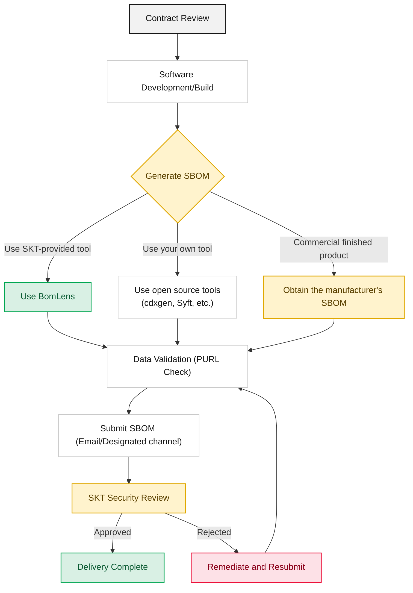

To strengthen the transparency and security of its software supply chain, SK Telecom asks suppliers to submit an SBOM (Software Bill of Materials) for all software components and dependencies they deliver. This guide explains how suppliers can generate and submit an SBOM in a format that meets SK Telecom's security policy.

## Quick Start: Five Steps to Submission

1. Check the accepted formats (CycloneDX JSON recommended) and required data fields in the [Submission Requirements](requirements/).
2. Generate the SBOM following [How to Generate an SBOM](creation-guide/), choosing the tool that fits your delivery. If setting up a tool environment is a burden, we recommend [BomLens](skt-scanner/).
3. If you deliver a server with an application on top of an OS, generate per layer and merge, following [Server SBOM](server-delivery/).
4. Verify PURLs and transitive dependency coverage with the [Validation Checklist](checklist/).
5. Name the file and submit it following the [Submission Process](submission/).

If you supply commercial software or a finished product made by a third party and have no access to the source code, skip steps 2–3 and follow [Commercial Software](commercial-software/) to obtain the SBOM from the manufacturer and submit it. If your submission is rejected, check [Common Rejection Reasons](rejection-reasons/) for the cause and how to fix it.

## Scope of Application

All suppliers (including developers and resellers) that deliver the following types of software are subject to these guidelines.

*   Source code: Applications written in Java, Python, JavaScript, Go, C/C++, etc.
*   Container images: Docker images or OCI-compliant containers
*   Executables: Compiled binaries (.jar, .dll, .so) and libraries
*   Embedded systems: Firmware images, RootFS, device drivers
*   Servers: A system combining an OS (rootfs and installed packages) with an application and statically linked libraries
*   Commercial software and finished products: packaged software or appliances made by a third party (including reseller and distributor deliveries)

## SBOM Submission Process

We ask suppliers to follow the procedure below, from the time of contract through final delivery.

## Related Documents

- [SK Telecom Supply Chain Security Policy](/en/guide/supply-chain/overview/policy/): Background and principles of the mandatory SBOM submission policy
- [Global Regulatory Trends](/en/guide/supply-chain/overview/regulations/): Domestic and international regulatory landscape related to SBOM
</content>
