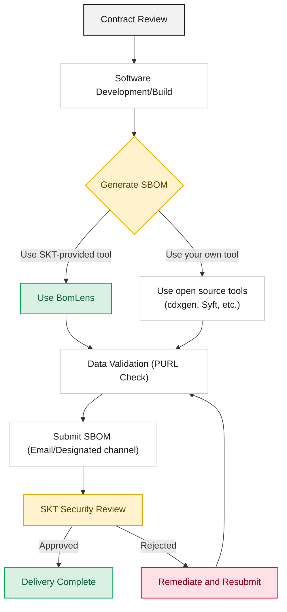

To strengthen the transparency and security of its software supply chain, SK Telecom asks suppliers to submit an SBOM (Software Bill of Materials) for all software components and dependencies they deliver. This guide explains how suppliers can generate and submit an SBOM in a format that meets SK Telecom's security policy.

## Quick Start: Five Steps to Submission

1. Check the accepted formats (CycloneDX JSON recommended) and required data fields in the [Submission Requirements](requirements/).
2. Generate the SBOM with [BomLens](skt-scanner/). If you have your own build pipeline, use [open source tools](creation-guide/).
3. If you deliver a server with an application on top of an OS, generate per layer and merge, following [Server SBOM](server-delivery/).
4. Verify PURLs and transitive dependency coverage with the [Validation Checklist](checklist/).
5. Name the file and submit it following the [Submission Process](submission/).

## Scope of Application

All suppliers (including developers and resellers) that deliver the following types of software are subject to these guidelines.

*   Source code: Applications written in Java, Python, JavaScript, Go, C/C++, etc.
*   Container images: Docker images or OCI-compliant containers
*   Executables: Compiled binaries (.jar, .dll, .so) and libraries
*   Embedded systems: Firmware images, RootFS, device drivers
*   Servers: A system combining an OS (rootfs and installed packages) with an application and statically linked libraries

## SBOM Submission Process

We ask suppliers to follow the procedure below, from the time of contract through final delivery.

## Guide Structure

This section is organized as follows.

1. [Submission Requirements](requirements/): Defines the required formats (CycloneDX, SPDX) and data fields that SK Telecom requires.
2. [BomLens](skt-scanner/): Explains how to use SK Telecom's SBOM generation tool.
3. [Using Open Source Tools](creation-guide/): Explains how to generate an SBOM using general-purpose open source tools (cdxgen, Syft, etc.).
4. [Server SBOM](server-delivery/): Explains how to generate the OS, application, and static-link layers separately and merge them into one.
5. [Validation Checklist](checklist/): Provides a checklist of essential items to verify before submission.
6. [Submission Process](submission/): Explains the naming conventions and submission channels for the generated SBOM file.
7. [Common Rejection Reasons](rejection-reasons/): Causes and fixes for each rejection reason, with a passing example file.

## Related Documents

- [SK Telecom Supply Chain Security Policy](/en/guide/supply-chain/overview/policy/): Background and principles of the mandatory SBOM submission policy
- [Global Regulatory Trends](/en/guide/supply-chain/overview/regulations/): Domestic and international regulatory landscape related to SBOM
</content>
