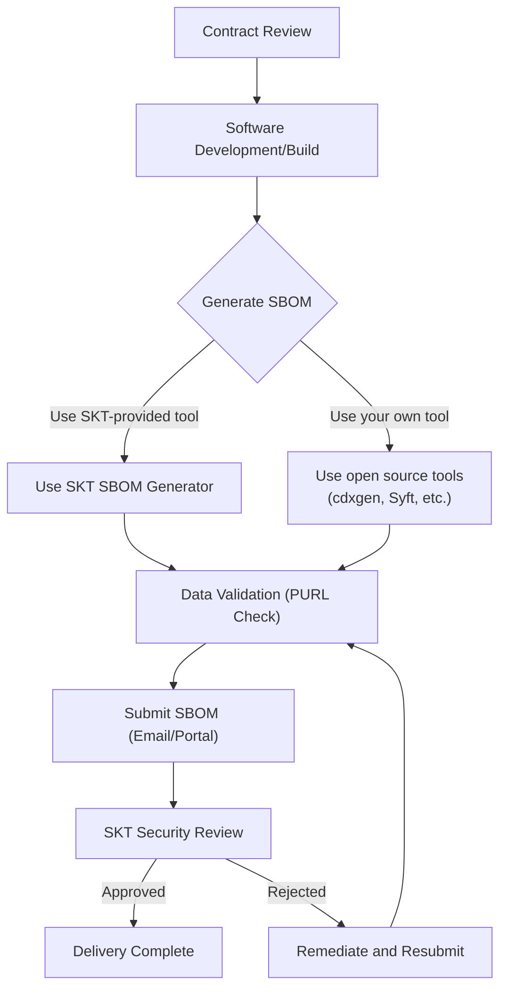

To strengthen the transparency and security of its software supply chain, SK Telecom requires the submission of an SBOM (Software Bill of Materials) for all software components and dependencies delivered by suppliers. This guide explains in detail how suppliers can generate and submit a properly formatted SBOM in compliance with SK Telecom's security policy.

## Scope of Application

All suppliers (including developers and resellers) that deliver the following types of software are subject to these guidelines.

*   Source code: Applications written in Java, Python, JavaScript, Go, C/C++, etc.
*   Container images: Docker images or OCI-compliant containers
*   Executables: Compiled binaries (.jar, .dll, .so) and libraries
*   Embedded systems: Firmware images, RootFS, device drivers

## SBOM Submission Process

Suppliers must follow the procedure below, from the time of contract through final delivery.

## Guide Structure

This section is organized as follows.

1. [Submission Requirements](requirements/): Defines the required formats (CycloneDX, SPDX) and data fields that SK Telecom requires.
2. [SKT SBOM Generator (Easy Mode)](skt-scanner/): Explains how to use the standard generation tool, which is ready to use without complex configuration.
3. [Using Open Source Tools](creation-guide/): Explains how to generate an SBOM using general-purpose open source tools (cdxgen, Syft, etc.).
4. [Validation Checklist](checklist/): Provides a checklist of essential items to verify before submission.
5. [Submission Process](submission/): Explains the naming conventions and submission channels for the generated SBOM file.

## Related Documents

- [SK Telecom Supply Chain Security Policy](/en/guide/supply-chain/overview/policy/): Background and principles of the mandatory SBOM submission policy
- [Global Regulatory Trends](/en/guide/supply-chain/overview/regulations/): Domestic and international regulatory landscape related to SBOM
</content>
