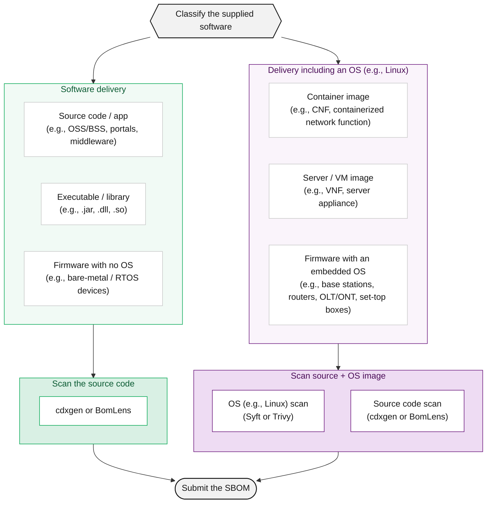

> If you are not comfortable setting up a tool environment and you have Docker installed, consider reviewing [BomLens](../skt-scanner/) first.

## Tool Selection Guide



Source code and apps, executables or libraries, and firmware with no OS are all scanned from the source code you developed with cdxgen or [BomLens](../skt-scanner/). Scanning a finished binary directly yields no package manager metadata, so purls are omitted and the SBOM is rejected.

When you ship an OS or base image as part of the delivery (a container image, a server, or firmware with an embedded OS), split it into two layers and scan each. Scan the image or rootfs as shipped with Syft or Trivy for the OS layer, scan the source code (the app layer) with cdxgen or BomLens, then merge and submit. The OS-layer scan target is not the original base image you received but the image or rootfs actually delivered after the build, because it must include the OS packages installed during the build. For the full procedure, see [Server SBOM](../server-delivery/).

Statically linked libraries and manually vendored binaries are a blind spot that none of the scans above catch. For how to handle this case, see the statically linked libraries section of [Server SBOM](../server-delivery/).

If you supply commercial software or a finished product made by a third party and have no access to the source code, obtain the SBOM from the manufacturer instead of scanning. See [Commercial Software](../commercial-software/).

## Major Tools

### cdxgen (recommended for source code analysis)

Automatically analyzes projects in various languages such as Java, Python, Node.js, and Go, and generates an SBOM in CycloneDX format.

- Official documentation: [https://cdxgen.github.io/cdxgen](https://cdxgen.github.io/cdxgen)
- GitHub: [https://github.com/CycloneDX/cdxgen](https://github.com/CycloneDX/cdxgen)
- Supported languages: Java (Maven/Gradle), Python, Node.js, Go, Ruby, PHP, Rust, .NET, C/C++, etc.

> cdxgen statically parses lockfiles and manifests. For accurate results, run it when dependencies are installed or resolved (a lockfile is present, or after a build). Scanning pure source without resolved dependencies may omit some components or purls.

### Syft (recommended for container image and binary analysis)

Analyzes built container images and build artifacts that include package manager metadata to identify both OS packages and application libraries. Supports CycloneDX and SPDX formats.

- Official documentation: [https://github.com/anchore/syft](https://github.com/anchore/syft)
- Recommended analysis targets: built Docker images, OCI images, tar files

{}
If you use `syft dir:` mode to scan an installation directory or a collection of binaries that has no
package manager metadata (`package.json`, `go.mod`, `*.jar`, RPM/DEB package DB, etc.), Syft cannot
identify the ecosystem and produces an **SBOM with empty PURLs**. Because SK Telecom's system maps
vulnerabilities by PURL, such an SBOM fails matching entirely and is rejected.

For a real case rejected this way, see [Common Rejection Reasons](../rejection-reasons/).

Run Syft against the following targets.

```bash
# Recommended: scan a built image (PURL and ecosystem identified automatically)
syft <image-name>:<tag> -o cyclonedx-json=sbom.json

# Not recommended: scan an installation directory or raw files (rejected due to missing PURL)
syft dir:/root/nag_pkg   # without package manager metadata, PURL count becomes 0
```

Immediately after generation, be sure to check the PURL count. See the [Validation Checklist](../checklist/) for how to verify.
{}

A server that delivers an application on top of an OS (such as CentOS) is generated as two layers — OS (rootfs/image) and application — with statically linked libraries covered separately, then merged. As the warning above notes, the OS layer must target a rootfs or image that has a package database. For the full procedure, see [Server SBOM](../server-delivery/).

### Trivy (container image analysis)

An all-in-one tool that can perform container image analysis and vulnerability scanning together.

- Official documentation: [https://aquasecurity.github.io/trivy/](https://aquasecurity.github.io/trivy/)
- GitHub: [https://github.com/aquasecurity/trivy](https://github.com/aquasecurity/trivy)

{}
In March 2026, a supply chain attack occurred in which an attacker re-pointed existing release tags
of `aquasecurity/trivy` to inject malware. **The GitHub release v0.69.4 (3/19) and the DockerHub images
v0.69.5 and v0.69.6 (3/22) have been confirmed as compromised, so please stop using them.**

To use Trivy safely, follow these principles.

- **GitHub Actions**: Use a pinned commit SHA or a verified version tag instead of mutable tags (`@master`, `@latest`, `@v1`, etc.).

  ```yaml
  # Recommended: pin to a verified version
  - uses: aquasecurity/trivy-action@0.35.0
  # Safer: pin to a commit SHA
  - uses: aquasecurity/trivy-action@<commit-sha>
  ```

- **Docker images**: Specify a particular version tag, or pin to an image digest (`@sha256:...`).

  ```bash
  docker run aquasecurity/trivy:<verified-version> image <target-image>
  ```

- **Official channels**: Check the latest security advisories through the [GitHub Security Advisory](https://github.com/aquasecurity/trivy-action/security/advisories).

This incident shows that if you do not pin versions when adopting an open source tool, you can be exposed to a supply chain attack at any time. Always specify the version of every external tool and verify its integrity before use.
{}

### Language-Specific Dedicated Plugins

Using a build tool plugin lets you extract more accurate dependency information.

| Language/Build Tool | Plugin/Tool | Official Documentation |
|---|---|---|
| Java (Maven) | cyclonedx-maven-plugin | [Link](https://github.com/CycloneDX/cyclonedx-maven-plugin) |
| Java (Gradle) | cyclonedx-gradle-plugin | [Link](https://github.com/CycloneDX/cyclonedx-gradle-plugin) |
| Python | cyclonedx-bom | [Link](https://github.com/CycloneDX/cyclonedx-python) |
| Node.js | @cyclonedx/cyclonedx-npm | [Link](https://github.com/CycloneDX/cyclonedx-node-npm) |
| Go | cyclonedx-gomod | [Link](https://github.com/CycloneDX/cyclonedx-gomod) |

## Common Precautions

Verify the following before using a tool.

- Transitive dependency inclusion: Generate the SBOM after the build (package installation) is complete so that transitive dependencies are included. Missing dependencies are grounds for rejection; for the per-language build commands to run first, see the dependency scope section of the [Submission Requirements](../requirements/).
- PURL inclusion: Verify that the generated SBOM includes a `purl` field for every component. SK Telecom's system maps vulnerabilities based on PURL. For the verification commands and the regeneration procedure, see the [Validation Checklist](../checklist/).
- Output format: CycloneDX JSON format is recommended. (Use `-o cyclonedx-json` or an equivalent option)
- Project information: Verify that the metadata accurately records the name and version of the delivered project.

## Related Documents

- [Server SBOM](../server-delivery/): How to generate and merge the layers of a server that combines an OS, an application, and static-link libraries
- [Submission Requirements](../requirements/): The required data fields that must be included in the SBOM
- [Validation Checklist](../checklist/): Items to verify before submission
- [BomLens](../skt-scanner/): SK Telecom's SBOM generation tool
</content>
