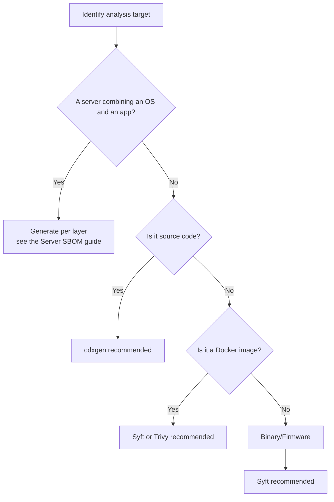

If you cannot use the SKT-provided tool, or you already have your own build pipeline, you can use open source tools directly. Below is a list of the major open source tools validated by SK Telecom, along with links to their official documentation.

> If you are not comfortable setting up a tool environment and you have Docker installed, consider reviewing [BomLens](../skt-scanner/) first.

## Tool Selection Guide



A server that combines an OS and an application is not done in one scan. For the full per-layer procedure, see [Server SBOM](../server-delivery/).

## Major Tools

### cdxgen (recommended for source code analysis)

Automatically analyzes projects in various languages such as Java, Python, Node.js, and Go, and generates an SBOM in CycloneDX format.

- Official documentation: [https://cdxgen.github.io/cdxgen](https://cdxgen.github.io/cdxgen)
- GitHub: [https://github.com/CycloneDX/cdxgen](https://github.com/CycloneDX/cdxgen)
- Supported languages: Java (Maven/Gradle), Python, Node.js, Go, Ruby, PHP, Rust, .NET, C/C++, etc.

### Syft (recommended for container image and binary analysis)

Analyzes built container images and build artifacts that include package manager metadata to identify both OS packages and application libraries. Supports CycloneDX and SPDX formats.

- Official documentation: [https://github.com/anchore/syft](https://github.com/anchore/syft)
- Recommended analysis targets: built Docker images, OCI images, tar files

{}
If you use `syft dir:` mode to scan an installation directory or a collection of binaries that has no
package manager metadata (`package.json`, `go.mod`, `*.jar`, RPM/DEB package DB, etc.), Syft cannot
identify the ecosystem and produces an **SBOM with empty PURLs**. Because SK Telecom's system maps
vulnerabilities by PURL, such an SBOM fails matching entirely and is rejected.

In one real case, a supplier scanned an installation directory with `syft dir:/root/nag_pkg`, and the
submitted SBOM had no PURL on any of its 261 components, so all 251 vulnerability matches failed.

Run Syft against the following targets.

```bash
# Recommended: scan a built image (PURL and ecosystem identified automatically)
syft <image-name>:<tag> -o cyclonedx-json=sbom.json

# Not recommended: scan an installation directory or raw files (rejected due to missing PURL)
syft dir:/root/nag_pkg   # without package manager metadata, PURL count becomes 0
```

Immediately after generation, be sure to check the PURL count. See the [Validation Checklist](../checklist/) for how to verify.
{}

A server that delivers an application on top of an OS (such as CentOS) is generated as two layers — OS (rootfs/image) and application — with statically linked libraries covered separately, then merged. As the warning above notes, the OS layer must target a rootfs or image that has a package database. For the full procedure, see [Server SBOM](../server-delivery/).

### Trivy (container image analysis)

An all-in-one tool that can perform container image analysis and vulnerability scanning together.

- Official documentation: [https://aquasecurity.github.io/trivy/](https://aquasecurity.github.io/trivy/)
- GitHub: [https://github.com/aquasecurity/trivy](https://github.com/aquasecurity/trivy)

{}
In March 2026, a supply chain attack occurred in which an attacker re-pointed existing release tags
of `aquasecurity/trivy` to inject malware. **The GitHub release v0.69.4 (3/19) and the DockerHub images
v0.69.5 and v0.69.6 (3/22) have been confirmed as compromised, so please stop using them.**

To use Trivy safely, follow these principles.

- **GitHub Actions**: Use a pinned commit SHA or a verified version tag instead of mutable tags (`@master`, `@latest`, `@v1`, etc.).

  ```yaml
  # Recommended: pin to a verified version
  - uses: aquasecurity/trivy-action@0.35.0
  # Safer: pin to a commit SHA
  - uses: aquasecurity/trivy-action@<commit-sha>
  ```

- **Docker images**: Specify a particular version tag, or pin to an image digest (`@sha256:...`).

  ```bash
  docker run aquasecurity/trivy:<verified-version> image <target-image>
  ```

- **Official channels**: Check the latest security advisories through the [GitHub Security Advisory](https://github.com/aquasecurity/trivy-action/security/advisories).

This incident shows that if you do not pin versions when adopting an open source tool, you can be exposed to a supply chain attack at any time. Always specify the version of every external tool and verify its integrity before use.
{}

### Language-Specific Dedicated Plugins

Using a build tool plugin lets you extract more accurate dependency information.

| Language/Build Tool | Plugin/Tool | Official Documentation |
|---|---|---|
| Java (Maven) | cyclonedx-maven-plugin | [Link](https://github.com/CycloneDX/cyclonedx-maven-plugin) |
| Java (Gradle) | cyclonedx-gradle-plugin | [Link](https://github.com/CycloneDX/cyclonedx-gradle-plugin) |
| Python | cyclonedx-bom | [Link](https://github.com/CycloneDX/cyclonedx-python) |
| Node.js | @cyclonedx/cyclonedx-npm | [Link](https://github.com/CycloneDX/cyclonedx-node-npm) |
| Go | cyclonedx-gomod | [Link](https://github.com/CycloneDX/cyclonedx-gomod) |

## Verifying Transitive Dependency Inclusion

> An SBOM submitted to SK Telecom must include transitive dependencies.

Transitive dependencies are libraries that the project does not declare directly, but on which the libraries it uses depend internally. If these are omitted, hidden vulnerabilities cannot be detected and the SBOM may be rejected.

Key principle: Generate the SBOM after the build (package installation) is complete.

When only source code is present, transitive dependencies may be omitted. Refer to the table below and complete the prerequisite steps before generating the SBOM.

### Transitive Dependency Support by Tool

| Tool / Method | Transitive Dependencies Included | Prerequisite Before SBOM Generation |
|---|:---:|---|
| cdxgen (source code) | Included automatically | No separate build required (auto-detected) |
| cdxgen (Java/Maven) | Conditional | Run `mvn package` or `mvn dependency:resolve` first |
| cdxgen (Java/Gradle) | Conditional | Run `./gradlew dependencies` first |
| cdxgen (Python) | Conditional | Activate the virtual environment, then run `pip install -r requirements.txt` first |
| cdxgen (Node.js) | Conditional | Run `npm install` or `yarn install` first |
| Syft (Docker image) | Included automatically | Scan after the image build is complete (includes both OS and app packages) |
| Syft (file system) | Conditional | Only deployment artifacts that include package manager metadata work; an installation directory or collection of raw files results in missing PURLs |
| Maven plugin | Included automatically | Generated automatically during the `mvn package` phase |
| Gradle plugin | Included automatically | Run `./gradlew cyclonedxBom` |

> Recommendation: When delivering as a Docker image, scanning the built image with Syft can include more complete transitive dependencies than source code analysis.

## Common Precautions

Verify the following before using a tool.

- Transitive dependency inclusion: Refer to the table above and complete the prerequisite steps before generating the SBOM. Missing dependencies are grounds for rejection.
- PURL inclusion: Verify that the generated SBOM includes a `purl` field for every component. SK Telecom's system maps vulnerabilities based on PURL. Before submission, count the components that have a PURL with `jq '[.components[] | select(.purl)] | length' sbom.json` and confirm it matches the total component count; if it is 0 or significantly lower, regenerate following the procedure in the [Validation Checklist](../checklist/).
- Output format: CycloneDX JSON format is recommended. (Use `-o cyclonedx-json` or an equivalent option)
- Project information: Verify that the metadata accurately records the name and version of the delivered project.

## Related Documents

- [Server SBOM](../server-delivery/): How to generate and merge the layers of a server that combines an OS, an application, and static-link libraries
- [Submission Requirements](../requirements/): The required data fields that must be included in the SBOM
- [Validation Checklist](../checklist/): Items to verify before submission
- [BomLens](../skt-scanner/): SK Telecom's SBOM generation tool
</content>
