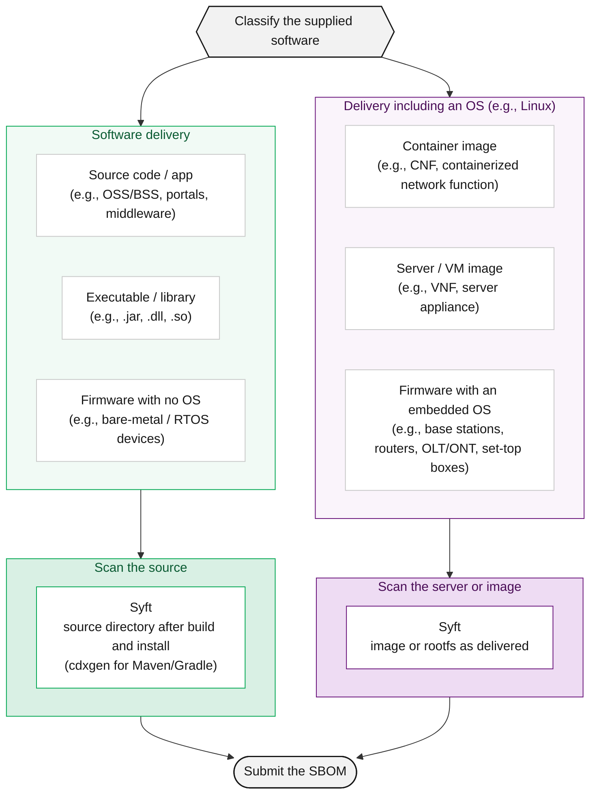

> If you are not comfortable setting up a tool environment and you have Docker installed, consider reviewing [BomLens](../skt-scanner/) first.

## Tool Selection Guide


```mermaid
graph TD
    A{{"Classify the supplied software"}}

    subgraph G1["Software delivery"]
      direction LR
      T1["Source code / app<br>(e.g., OSS/BSS, portals, middleware)"]
      T2["Executable / library<br>(e.g., .jar, .dll, .so)"]
      T3["Firmware with no OS<br>(e.g., bare-metal / RTOS devices)"]
    end

    subgraph G2["Delivery including an OS (e.g., Linux)"]
      direction LR
      T4["Container image<br>(e.g., CNF, containerized network function)"]
      T5["Server / VM image<br>(e.g., VNF, server appliance)"]
      T6["Firmware with an embedded OS<br>(e.g., base stations, routers, OLT/ONT, set-top boxes)"]
    end

    %% Left: source scan with an inner box
    subgraph M1["Scan the source"]
      M1_Sub["Syft<br>source directory after build and install<br>(cdxgen for Maven/Gradle)"]
    end

    %% Right: server or image scan with an inner box
    subgraph M2["Scan the server or image"]
      M2_Sub["Syft<br>image or rootfs as delivered"]
    end

    A --> G1
    A --> G2
    
    %% Connect only to the group borders (one arrow per box)
    G1 --> M1
    G2 --> M2
    
    %% Groups flow to the next step
    M1 --> P(["Submit the SBOM"])
    M2 --> P

    classDef start fill:#F2F2F2,stroke:#171717,color:#171717,stroke-width:1.5px
    classDef typebox fill:#ffffff,stroke:#c8c8c8,color:#171717,stroke-width:1px
    classDef submit fill:#F2F2F2,stroke:#171717,color:#171717,stroke-width:1.5px
    
    %% White inner-box styles (left/right border colors)
    classDef subwhite_left fill:#ffffff,stroke:#00A651,color:#171717,stroke-width:1px
    classDef subwhite_right fill:#ffffff,stroke:#68127A,color:#171717,stroke-width:1px

    class A start
    class T1,T2,T3,T4,T5,T6 typebox
    class M1_Sub subwhite_left
    class M2_Sub subwhite_right
    class P submit

    style G1 fill:#F1FAF5,stroke:#00A651,stroke-width:1px,color:#0A5A32
    style G2 fill:#FAF4FB,stroke:#68127A,stroke-width:1px,color:#4A0D57
    
    %% Outer group boxes keep their fill and border colors
    style M1 fill:#D9F0E4,stroke:#00A651,stroke-width:1px,color:#0A5A32
    style M2 fill:#EEDCF3,stroke:#68127A,stroke-width:1px,color:#4A0D57

```

Source code and apps, executables or libraries, and firmware with no OS are scanned with Syft against the source directory after the build and dependency install are complete. One exception: for Maven and Gradle, dependencies live in a local repository outside the project, so Syft reads only what `pom.xml` declares directly and transitive dependencies are lost. Use cdxgen or a language-specific CycloneDX plugin in that case. Scanning a finished binary directly yields no package manager metadata, so purls are omitted and the SBOM is rejected.

When you ship an OS or base image as part of the delivery (a container image, a server, or firmware with an embedded OS), scan the image or rootfs as delivered with Syft. A single scan captures both the OS packages (from the rpm/dpkg/apk database) and the application dependencies installed on top of them. The scan target is not the original base image you received but the image or rootfs actually delivered after the build, because it must include the OS packages installed during the build. Covering statically linked libraries, merging several SBOMs, and the submission unit for a cluster are in [Server SBOM](../server-delivery/).

If you supply commercial software or a finished product made by a third party and have no access to the source code, obtain the SBOM from the manufacturer instead of scanning. See [Commercial Software](../commercial-software/).

## Major Tools

### Syft (recommended by default)

Analyzes images, rootfs directories, and source directories where installation is complete, identifying OS packages and application libraries together. Supports CycloneDX and SPDX formats.

- Official documentation: [https://github.com/anchore/syft](https://github.com/anchore/syft)
- Recommended analysis targets: container images as delivered, OCI images, tar files, rootfs directories

```bash
# Image
syft <image-name>:<tag> -o cyclonedx-json=sbom.json

# rootfs or a directory where installation is complete
syft dir:/path/to/server-rootfs -o cyclonedx-json=sbom.json
```

{}
If you use `syft dir:` mode to scan an installation directory or a collection of binaries that has no
package manager metadata (`package.json`, `go.mod`, `*.jar`, RPM/DEB package DB, etc.), Syft cannot
identify the ecosystem and produces an **SBOM with empty PURLs**. Because SK Telecom's system maps
vulnerabilities by PURL, such an SBOM fails matching entirely and is rejected.

```bash
# Not recommended: an installation directory with no package database
syft dir:/root/nag_pkg   # PURL count becomes 0
```

For a real case rejected this way, see [Common Rejection Reasons](../rejection-reasons/). Immediately after generation, be sure to check the PURL count. See the [Validation Checklist](../checklist/) for how to verify.
{}

Two Syft defaults affect the result, so check them in advance.

- npm development dependencies are excluded by default. Set `SYFT_JAVASCRIPT_INCLUDE_DEV_DEPENDENCIES=true` if you need them included.
- For Maven and Gradle projects, Syft reads only what `pom.xml` or the build script declares directly, because dependencies live in a local repository outside the project. Use cdxgen or a language-specific plugin to capture transitive dependencies.

### cdxgen (when the build tool must resolve dependencies)

Invokes the build tool directly to resolve dependencies, so use it for the Maven and Gradle family where Syft cannot capture transitive dependencies.

- Official documentation: [https://cdxgen.github.io/cdxgen](https://cdxgen.github.io/cdxgen)
- GitHub: [https://github.com/CycloneDX/cdxgen](https://github.com/CycloneDX/cdxgen)
- Supported languages: Java (Maven/Gradle), Python, Node.js, Go, Ruby, PHP, Rust, .NET, C/C++, etc.

```bash
cd /path/to/app-source
cdxgen -o app_bom.json
```

> cdxgen also needs dependencies installed or resolved (a lockfile is present, or after a build) to be accurate. Scanning pure source without resolved dependencies may omit some components or purls.

### Trivy (container image analysis)

An all-in-one tool that can perform container image analysis and vulnerability scanning together.

- Official documentation: [https://aquasecurity.github.io/trivy/](https://aquasecurity.github.io/trivy/)
- GitHub: [https://github.com/aquasecurity/trivy](https://github.com/aquasecurity/trivy)

{}
In March 2026, a supply chain attack occurred in which an attacker re-pointed existing release tags
of `aquasecurity/trivy` to inject malware. **The GitHub release v0.69.4 (3/19) and the DockerHub images
v0.69.5 and v0.69.6 (3/22) have been confirmed as compromised, so please stop using them.**

To use Trivy safely, follow these principles.

- **GitHub Actions**: Use a pinned commit SHA or a verified version tag instead of mutable tags (`@master`, `@latest`, `@v1`, etc.).

  ```yaml
  # Recommended: pin to a verified version
  - uses: aquasecurity/trivy-action@0.35.0
  # Safer: pin to a commit SHA
  - uses: aquasecurity/trivy-action@<commit-sha>
  ```

- **Docker images**: Specify a particular version tag, or pin to an image digest (`@sha256:...`).

  ```bash
  docker run aquasecurity/trivy:<verified-version> image <target-image>
  ```

- **Official channels**: Check the latest security advisories through the [GitHub Security Advisory](https://github.com/aquasecurity/trivy-action/security/advisories).

This incident shows that if you do not pin versions when adopting an open source tool, you can be exposed to a supply chain attack at any time. Always specify the version of every external tool and verify its integrity before use.
{}

### Language-Specific Dedicated Plugins

Using a build tool plugin lets you extract more accurate dependency information.

| Language/Build Tool | Plugin/Tool | Official Documentation |
|---|---|---|
| Java (Maven) | cyclonedx-maven-plugin | [Link](https://github.com/CycloneDX/cyclonedx-maven-plugin) |
| Java (Gradle) | cyclonedx-gradle-plugin | [Link](https://github.com/CycloneDX/cyclonedx-gradle-plugin) |
| Python | cyclonedx-bom | [Link](https://github.com/CycloneDX/cyclonedx-python) |
| Node.js | @cyclonedx/cyclonedx-npm | [Link](https://github.com/CycloneDX/cyclonedx-node-npm) |
| Go | cyclonedx-gomod | [Link](https://github.com/CycloneDX/cyclonedx-gomod) |

## Common Precautions

Verify the following before using a tool.

- Transitive dependency inclusion: Generate the SBOM after the build (package installation) is complete so that transitive dependencies are included. Missing dependencies are grounds for rejection; for the per-language build commands to run first, see the dependency scope section of the [Submission Requirements](../requirements/).
- PURL inclusion: Verify that the generated SBOM includes a `purl` field for every component. SK Telecom's system maps vulnerabilities based on PURL. For the verification commands and the regeneration procedure, see the [Validation Checklist](../checklist/).
- Output format: CycloneDX JSON format is recommended. (Use `-o cyclonedx-json` or an equivalent option)
- Project information: Verify that the metadata accurately records the name and version of the delivered project.

## Related Documents

- [Server SBOM](../server-delivery/): How to choose the scan target for a server delivery and cover statically linked libraries
- [Submission Requirements](../requirements/): The required data fields that must be included in the SBOM
- [Validation Checklist](../checklist/): Items to verify before submission
- [BomLens](../skt-scanner/): SK Telecom's SBOM generation tool
</content>
