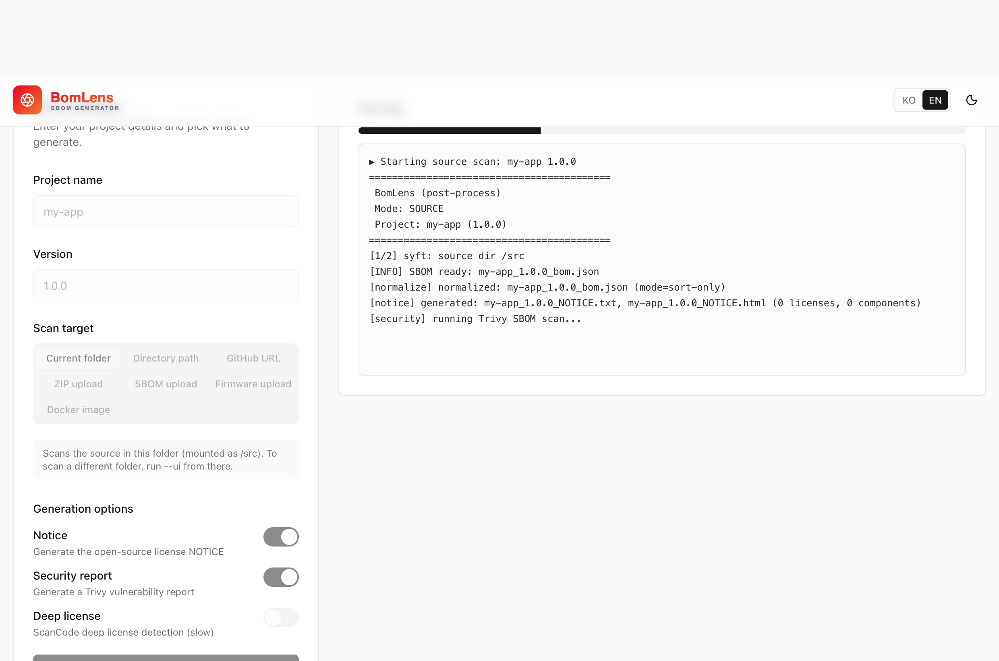

## BomLens

BomLens is an open source tool that lets suppliers generate deliverables that meet SK Telecom policy in a Docker environment. You do not need to install per-language tools locally; it analyzes multiple languages and produces a CycloneDX (JSON) deliverable.

This page covers only the quick start. For installation, the full set of options, language-specific guides, input scenarios, the web UI, and other details, see the official repository documentation.

> [github.com/sktelecom/sbom-tools](https://github.com/sktelecom/sbom-tools)
>
> Bug reports, feature suggestions, and Pull Request contributions are welcome.

## Deliverables Generated

A single run generates the following three deliverables together (the `--all` option).

| Deliverable | File | Purpose |
|--------|------|------|
| SBOM | `{project}_{version}_bom.json` | CycloneDX 1.6 component specification (the delivery baseline) |
| Open Source Notice | `{project}_{version}_NOTICE.{txt,html}` | Notice document for fulfilling license obligations |
| Open Source Risk Analysis Report | `{project}_{version}_risk-report.{md,html}` | Aggregation of license and vulnerability risks |

## Prerequisites

BomLens runs on Docker. Install and run Docker Engine 20.10 or later. On Windows without Docker, we recommend Rancher Desktop, which is free. The first run downloads a scanner image (about 3–4 GB), so it takes roughly 5–15 minutes.

## Getting Started on Windows (No Command Line)

If you are not comfortable with the command line, you can generate an SBOM in one of two ways. For the full procedure, see the [Windows quick start guide](https://github.com/sktelecom/sbom-tools/blob/main/docs/notice-quickstart.md).

- Executable: Download `SBOM-Generator-*.exe` from the [latest release](https://github.com/sktelecom/sbom-tools/releases/latest) and double-click it. The file is not yet code-signed, so if Windows SmartScreen warns, click "More info" and then "Run anyway".
- Repository ZIP: From the repository's `Code` button, choose `Download ZIP`, unzip it, and double-click `scripts\sbom-ui.bat`; the browser opens `http://localhost:8080`.

In the web UI, the progress log is shown in real time on the right, and you can download the deliverables when it finishes.



## Quick Start (CLI)

On macOS and Linux, download and run the script from a shell.

```bash
curl -O https://raw.githubusercontent.com/sktelecom/sbom-tools/main/scripts/scan-sbom.sh
chmod +x scan-sbom.sh
cd /path/to/my-project
/path/to/scan-sbom.sh --project "MyApp" --version "1.0.0" --all --generate-only
```

- `--generate-only` creates files only locally, without uploading them to the portal (recommended until submission).
- For the web UI, run `./scan-sbom.sh --ui` (the browser opens `http://localhost:8080`).
- On Windows, run the same commands through `scripts\scan-sbom.bat` (it forwards them via Git Bash, so Git for Windows is required).
- For other input forms such as a GitHub URL, source ZIP, Docker image, firmware, or binary, and the full set of options, see the [Usage Guide](https://github.com/sktelecom/sbom-tools/blob/main/docs/usage-guide.md).

## Learn More

The authoritative source for using the tool is the repository documentation.

| Topic | Document |
|------|------|
| Installation, first SBOM, web UI | [getting-started](https://github.com/sktelecom/sbom-tools/blob/main/docs/getting-started.md) |
| Full options, by language, CI/CD | [usage-guide](https://github.com/sktelecom/sbom-tools/blob/main/docs/usage-guide.md) |
| Scenarios by input form | [scenarios-guide](https://github.com/sktelecom/sbom-tools/blob/main/docs/scenarios-guide.md) |
| Notice, security, web UI | [notice-security-ui-guide](https://github.com/sktelecom/sbom-tools/blob/main/docs/notice-security-ui-guide.md) |

## Next Steps

After generating the SBOM, verify the file with the [Validation Checklist](../checklist/) and submit it following the [Submission Process](../submission/). For the required data fields, see the [Submission Requirements](../requirements/); to use tools such as cdxgen or Syft directly instead of the SKT tool, see [Using Open Source Tools](../creation-guide/).
