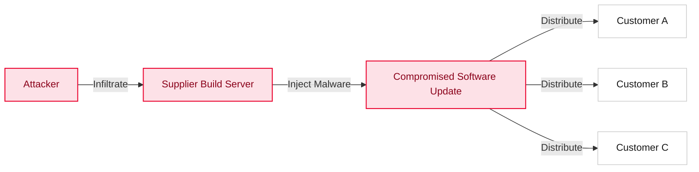

## 1. What Is a Software Supply Chain Attack?

A software supply chain attack is a cyberattack technique in which an attacker infiltrates the systems of a software developer or supplier, or the development process itself, to plant malicious code or exploit vulnerabilities.

Whereas traditional attacks directly target end users, supply chain attacks contaminate trusted software updates or development tools, thereby simultaneously infecting the many downstream companies and users that rely on them.

## 2. Notable Attack Cases

The major security incidents of recent years have impressed the importance of supply chain security on the entire world.

### The SolarWinds Incident (2020)
- Overview: The build system of SolarWinds Orion, a network monitoring solution, was hacked, and a backdoor was planted in legitimate update files.
- Impact: Some 18,000 organizations worldwide were affected, including U.S. government agencies and Fortune 500 companies.
- Lesson: It demonstrated that even officially signed software from a trusted vendor may not be safe.

### The Log4j Vulnerability (2021)
- Overview: A critical vulnerability enabling remote code execution (RCE), known as Log4Shell, was discovered in Log4j, a Java-based logging library.
- Impact: Hundreds of millions of devices and servers worldwide that use this library directly or indirectly were exposed to risk.
- Lesson: It became a turning point that made organizations realize how important it is to understand which open source components their systems use, through an SBOM (Software Bill of Materials).

### The 3CX Supply Chain Attack (2023)
- Overview: The desktop app of the VoIP software 3CX was distributed while infected with a trojan.
- Characteristics: The attackers first hacked the PC of a 3CX employee and then moved laterally into the development environment to tamper with the binaries.

## 3. Why Supply Chain Security?

Modern software development environments are built on top of complex, interwoven dependencies.

1.  Growing open source dependencies: 70-90% of modern application code consists of open source components.
2.  Ripple effect: When a single common component is compromised, the damage spreads worldwide.
3.  Difficulty of detection: Code that is compromised during the development and build stages can easily bypass traditional security checks (firewalls, antivirus, etc.).

Accordingly, SK Telecom has established and enforces SBOM adoption and a rigorous supply chain security policy in order to ensure transparency across the supply chain and to manage risk.

## Related Documents

- [Global Regulatory Trends](regulations/): Key regulatory developments such as U.S. EO 14028 and the EU CRA
- [SK Telecom Supply Chain Security Policy](policy/): SK Telecom's specific requirements
- [Supplier Guide](/en/guide/supply-chain/for-suppliers/): Guidance on SBOM generation and submission for suppliers
