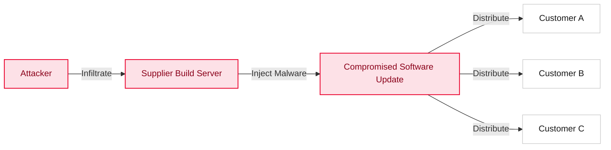

{}
This page is learning material that explains the background of supply chain security. If you are looking for how to generate and submit an SBOM, go straight to the [Supplier Guide](/en/guide/supply-chain/for-suppliers/).
{}

## 1. What Is a Software Supply Chain Attack?

A software supply chain attack is a cyberattack technique in which an attacker infiltrates the systems of a software developer or supplier, or the development process itself, to plant malicious code or exploit vulnerabilities.

Whereas traditional attacks directly target end users, supply chain attacks contaminate trusted software updates or development tools, thereby simultaneously infecting the many downstream companies and users that rely on them.

## 2. Notable Attack Cases

- The SolarWinds incident (2020): The build system was hacked and a backdoor was planted in officially signed updates, affecting some 18,000 organizations worldwide including U.S. government agencies. It demonstrated that even software from a trusted vendor may not be safe.
- The Log4j vulnerability (2021): A remote code execution vulnerability in a widely used logging library exposed hundreds of millions of servers worldwide. It drove home the need for a way to know which open source components your systems use — that is, an SBOM.

## 3. Why Supply Chain Security?

70-90% of modern application code consists of open source components. When a single common component is compromised the damage spreads worldwide, and code compromised at the build stage is hard to catch with traditional security checks such as firewalls and antivirus. To manage this risk, SK Telecom has adopted SBOMs and enforces a supply chain security policy.

## Related Documents

- [Global Regulatory Trends](regulations/): Key regulatory developments such as U.S. EO 14028 and the EU CRA
- [SK Telecom Supply Chain Security Policy](policy/): SK Telecom's specific requirements
- [Supplier Guide](/en/guide/supply-chain/for-suppliers/): Guidance on SBOM generation and submission for suppliers
