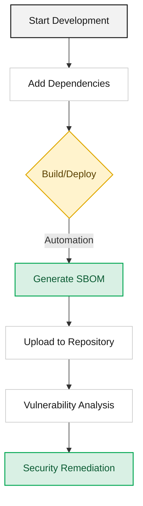

## Overview

This section is a learning guide for those encountering an SBOM (Software Bill of Materials) for the first time. It covers what an SBOM is, why it is needed, and how the industry-standard formats differ from each other.

## Guide Structure

1. [Concept and Necessity](what-is-sbom/): Explains what an SBOM is and the fundamental reasons why we need it now.
2. [Standards Comparison (SPDX vs CycloneDX)](standards/): Understand the differences between the industry-standard formats so you can choose the format that fits the nature of your project.

For the practical side — actually generating, validating, and submitting an SBOM — see the [Supplier Guide](../for-suppliers/).

Below is the full lifecycle an SBOM flows through, from development to security remediation.

