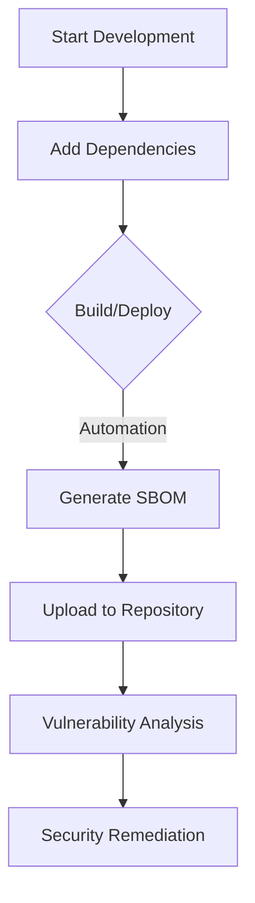

## Overview

This section is a practical SBOM (Software Bill of Materials) guide for members of the organization. Beyond simply complying with policy, it covers how to use SBOMs to improve the security of projects and the efficiency of dependency management.

## Guide Structure

This guide is organized step by step, from the adoption of SBOMs to their operation.

1. [Concept and Necessity](what-is-sbom/): Explains what an SBOM is and the fundamental reasons why we need it now.
2. [Standards Comparison (SPDX vs CycloneDX)](standards/): Understand the differences between the industry-standard formats so you can choose the format that fits the nature of your project.
3. Generating a Project SBOM: Guides you through the practical methods for extracting an SBOM directly from a project under development.
4. CI/CD Integration: Covers how to automate SBOM generation in CI/CD pipelines such as Jenkins and GitHub Actions.
5. SBOM Management: Introduces strategies for storing generated SBOMs in a central repository and managing them by version.

## SBOM Generation

For detailed SBOM generation methods and technical guidance, please refer to the following documents.

- [Supplier Guide (For Suppliers)](../../for-suppliers/)
- [How to Generate an SBOM](../../for-suppliers/creation-guide/)
