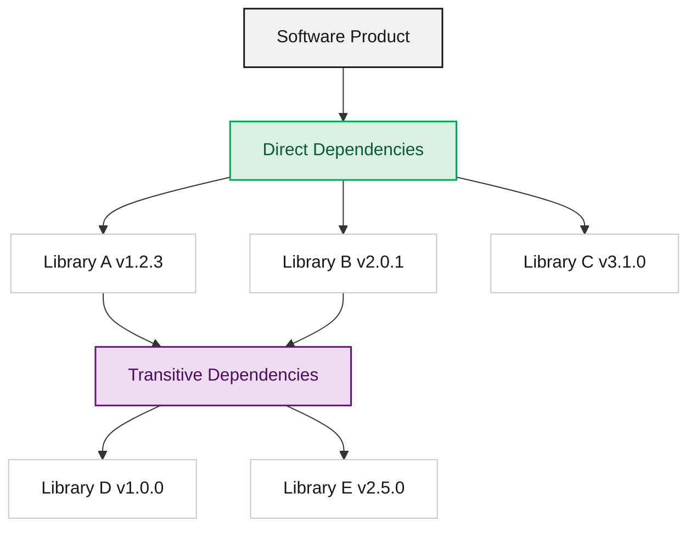

## Definition of an SBOM

An SBOM (Software Bill of Materials) is a formalized specification that describes the list of all components, libraries, modules, and so on that make up a piece of software, along with the dependency relationships among them. It applies the manufacturing concept of a BOM (Bill of Materials), used to manage a product's parts list, to software engineering.

## Key Components of an SBOM

An SBOM document carries the following information.

- Component information: name, version, supplier, license
- Unique identifiers: standardized identifiers that pinpoint a component. Package URL (purl) is the most widely used (e.g., `pkg:maven/org.springframework/spring-core@5.3.20`)
- Dependency relationships: direct dependencies (used by the project itself) and transitive dependencies (what the direct dependencies depend on)
- Metadata: generation tool, generation time, author

For submissions to SK Telecom, which items are required and in what form is defined by the [Submission Requirements](/en/guide/supply-chain/for-suppliers/requirements/).

## Why Is It Needed?

An SBOM is not merely a document; it is core data for software transparency.

### 1. Rapid Identification of Security Vulnerabilities
When a new vulnerability is disclosed (e.g., the Log4j incident), you can immediately determine where in your services the affected library is being used. Without an SBOM, you would have to conduct an exhaustive inspection of every server and codebase one by one, and you would miss the golden window for response.

### 2. License Risk Management
Open source license violations can lead to legal disputes. Through an SBOM, you can identify all licenses included in a project and block, in advance, the use of incompatible licenses (e.g., combining GPL with commercial code).

### 3. Software Quality and Obsolescence Management
By identifying old and unsupported (EOL, End-of-Life) components, you can manage technical debt and maintain the health of your software.

Against this backdrop, regulations in the United States, Europe, and elsewhere are also moving toward mandatory SBOM submission. See [Regulatory Trends](/en/guide/supply-chain/overview/regulations/) for details.

## Related Documents

- [SBOM Standards Comparison (SPDX vs CycloneDX)](../standards/)
- [Supplier Guide](/en/guide/supply-chain/for-suppliers/): How to generate and submit an SBOM

## References

- [NTIA SBOM Minimum Elements](https://www.ntia.gov/files/ntia/publications/sbom_minimum_elements_report.pdf)
- [CISA SBOM Sharing Lifecycle](https://www.cisa.gov/sbom)
- [Linux Foundation: SBOM Guide](https://www.linuxfoundation.org/tools/the-state-of-software-bill-of-materials-sbom-and-cybersecurity-readiness/)
