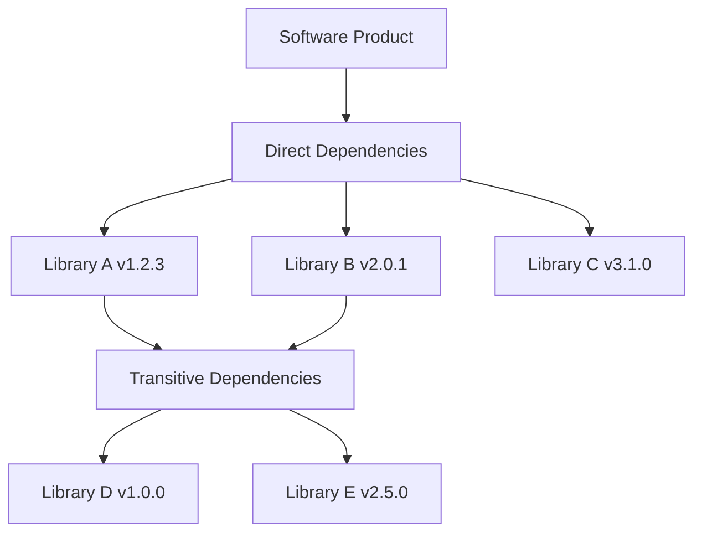

## Definition of an SBOM

An SBOM (Software Bill of Materials) is a formalized specification that describes the list of all components, libraries, modules, and so on that make up a piece of software, along with the dependency relationships among them. It applies the manufacturing concept of a BOM (Bill of Materials), used to manage a product's parts list, to software engineering.



## Key Components of an SBOM

### Component Information

Includes basic information about each software component.

- Name: The official name of the component
- Version: The exact version number
- Supplier: The organization or individual that provided the component
- License: The applicable open source license

### Unique Identifiers

Standardized identifiers are used to clearly identify components.

Package URL (purl)

This is the most commonly used identifier format.

```
pkg:maven/org.springframework/spring-core@5.3.20
pkg:npm/express@4.18.2
pkg:pypi/django@4.1.0
```

CPE (Common Platform Enumeration)

Used to integrate with security vulnerability databases.

```
cpe:2.3:a:apache:log4j:2.14.1:*:*:*:*:*:*:*
```

### Dependency Relationships

Specifies the dependency relationships among components.

- Direct Dependencies: Libraries that the project uses directly
- Transitive Dependencies: Libraries that the direct dependencies, in turn, depend on

### Metadata

Includes information about the SBOM itself.

- Generation tool: The name and version of the tool that generated the SBOM
- Generation time: The date and time the SBOM was generated
- Author: The organization or individual that generated the SBOM

## Why Is It Needed?

An SBOM is not merely a document; it is core data for software transparency.

### 1. Rapid Identification of Security Vulnerabilities
When a new vulnerability is disclosed (e.g., the Log4j incident), you can immediately determine where in your services the affected library is being used. Without an SBOM, you would have to conduct an exhaustive inspection of every server and codebase one by one, and you would miss the golden window for response.

### 2. License Risk Management
Open source license violations can lead to legal disputes. Through an SBOM, you can identify all licenses included in a project and block, in advance, the use of incompatible licenses (e.g., combining GPL with commercial code).

### 3. Software Quality and Obsolescence Management
By identifying old and unsupported (EOL, End-of-Life) components, you can manage technical debt and maintain the health of your software.

### 4. Regulatory Compliance

Various organizations, including the U.S. federal government, are mandating SBOM submission.

- U.S. Executive Order 14028 (federal government suppliers)
- EU Cyber Resilience Act
- FDA approval for medical devices

## Related Documents

- [SBOM Standards Comparison (SPDX vs CycloneDX)](../standards/)
- [Supplier Guide](/en/guide/supply-chain/for-suppliers/): How to generate and submit an SBOM

## References

- [NTIA SBOM Minimum Elements](https://www.ntia.gov/files/ntia/publications/sbom_minimum_elements_report.pdf)
- [CISA SBOM Sharing Lifecycle](https://www.cisa.gov/sbom)
- [Linux Foundation: SBOM Guide](https://www.linuxfoundation.org/tools/the-state-of-software-bill-of-materials-sbom-and-cybersecurity-readiness/)
