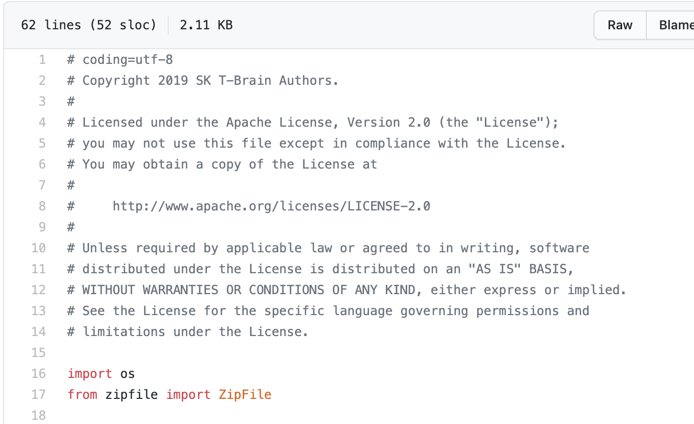
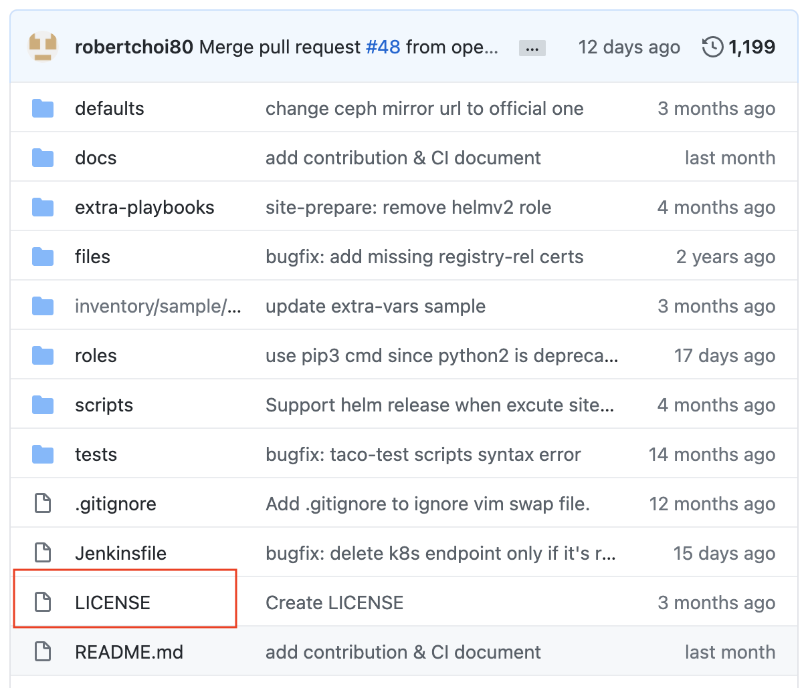
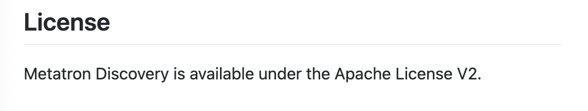

An open source license can be checked in several ways. You can check it manually without using analysis tools, or you can check it efficiently using automation tools.

## Manual Methods

### Method 1. Check the Comments at the Top of the Source Code File

Typical open source displays copyright and license information in the comments at the top of the source code file.


(https://github.com/SKTBrain/KoBERT/blob/master/kobert/pytorch_kobert.py)

You can identify the open source license from this content.

SK Telecom provides a tool called [FOSSology](https://www.fossology.org/) so that anyone can easily check the open source license at the top of a source code file.

### Method 2. Check the LICENSE (or COPYING) File in the Root Folder

Typical open source displays license information in a LICENSE or COPYING file in the root folder.


(https://github.com/openinfradev/tacoplay)

### Method 3. Check the License Information in the README or on the Website

Some open source provides license information in the README that describes the project or in documentation on the website.


(https://github.com/metatron-app/metatron-discovery)

## Checking with Automation Tools

For large-scale projects or those with many dependencies, you can use automation tools to check licenses efficiently.

### Syft

Syft is a tool that generates an SBOM from container images and file systems and extracts license information.
```bash
syft dir:. -o json
```

### Trivy

Trivy is a tool that can check license information alongside vulnerability scanning.
```bash
trivy fs --scanners license .
```

> **Caution**: Tools such as Trivy can be exposed to supply chain attacks through release tag tampering.
> When installing the CLI, use the official release channels, and in GitHub Actions, use a verified pinned version
> or a commit SHA instead of mutable tags (`@latest`, `@master`, etc.).
> For reported cases and safe usage, refer to the [SBOM Generation Guide](/en/guide/supply-chain/for-suppliers/creation-guide/).

For automated SBOM generation, refer to the [SBOM Generation Guide](/en/guide/supply-chain/for-suppliers/creation-guide/).

## Priority of License Information

If the information indicated by Methods 1-3 differs from one another, base your judgment on Method 1 — that is, give priority to the license information shown within the file.
