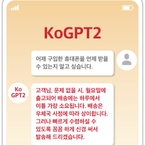

[GPT-2](https://github.com/openai/gpt-2) is a natural language processing model that uses machine learning algorithms to generate input sample text into text with syntactic, grammatical, and informational consistency. KoGPT-2, an open source-based GPT-2 model learned in Korean, can improve machine learning performance of various applications that require Korean interpretation, such as generating responses to questions, completing sentences, and chatbots.

KoGPT-2 can be used to build chatbots, predict text sentiment, and generate responses based on text analysis, and interested developers can download models and related sources and apply or modify them to projects.

SK telecom decided to develop and release KoGPT-2 as part of its social mission and to contribute to the growth of the machine learning community.

* GitHub : https://github.com/SKT-AI/KoGPT2