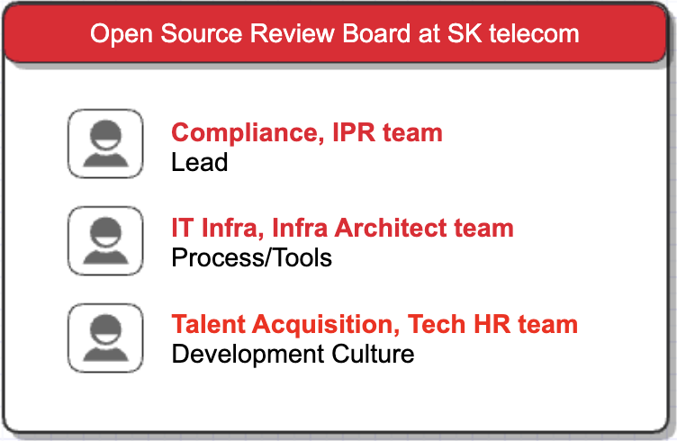

OSRB(Open Source Review Board)는 기업의 오픈소스 관리를 위해 오픈소스 책임자와 법무팀, 특허팀, 개발팀, 인프라팀 등 관련 조직의 책임자로 구성된 협의체이다. 

* OSRB는 오픈소스 관리를 위한 정책과 프로세스를 만들고, 이를 수행하기 위한 기업 내의 R&R을 정의한다. 
* 기업 내 오픈소스 관리 이슈 발생 시, 해결 방안을 논의하고, 대응 방안을 마련한다.
* 필요 시, 임원진에 이슈를 보고하여 리스크 완화 방안에 대한 피드백을 받는다. 

# SK텔레콤 OSRB

SK텔레콤의 OSRB는 준법경영법무그룹에서 주관하고, ESG Tech Product Hub, Career그룹, Cloud Application 그룹, 정보보호담당에서 참여한다. 

