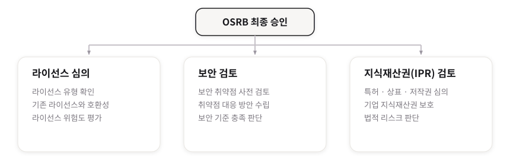

## OSRB란?

OSRB(Open Source Review Board, 오픈소스 심의위원회)는 기술, 법무, 인프라, 보안, 지식재산권 등 관련 부서의 책임자로 구성된 오픈소스 의사결정 협의체입니다.

OSPO(오픈소스 프로그램 사무소)가 오픈소스 운영과 가이드를 담당한다면, OSRB는 주요 정책 결정과 리스크 관리를 담당하는 거버넌스 조직입니다. 새로운 오픈소스 도입이나 공개 시 발생할 수 있는 라이선스, 보안, 지식재산권 리스크를 체계적으로 검토한 후 의사결정을 내립니다.

## OSRB의 핵심 역할

### 1. 정책 수립 및 프로세스 정의

사용/기여/공개에 대한 기본 정책, 라이선스 정책과 호환성 가이드, 보안·지식재산권 정책을 수립합니다. 오픈소스 검토·승인 프로세스와 보안 취약점 대응 프로세스도 함께 정의합니다.

또한 OSPO, 개발팀, 법무팀, 보안팀 등 각 조직의 역할과 의사결정 권한을 정하는 R&R(Roles & Responsibilities)을 수립해, 오픈소스 관리가 조직 전체에서 일관되게 이루어지도록 합니다.

### 2. 리스크 검토 및 승인

라이선스, 보안, 지식재산권 세 영역에서 리스크를 검토하고 최종 승인을 내립니다.

- **라이선스 심의**: 신규 오픈소스의 라이선스 유형, 호환성, 위험도 평가
- **보안 검토**: 보안 취약점 사전 검토, 대응 방안 수립, 보안 기준 충족 여부 판단
- **지식재산권(IPR) 검토**: 특허·상표·저작권 이슈 심의, 기업 지식재산권 보호 방안 검토

### 3. 이슈 관리 및 대응

오픈소스 관리 중 발생하는 이슈를 분석하고 신속한 대응 방안을 마련합니다. 라이선스 분쟁 등 법적 이슈는 법무팀과 협력해 처리하며, 필요시 외부 전문가 자문을 조율합니다. 중요 이슈는 경영진에 보고해 전사 차원의 대응 방안을 확정합니다.

## SK텔레콤 OSRB 구성

### 조직 구조 및 역할

SK텔레콤의 OSRB는 IPR팀이 의장을 맡고, DevOps팀, 보안팀, HR팀이 참여하는 구조로 운영됩니다.

- **IPR팀**(의장): 오픈소스 라이선스 검토, 지식재산권 보호, 법적 컴플라이언스 점검
- **DevOps팀**: 인프라·개발 환경 관련 오픈소스 평가, 배포·운영 리스크 검토
- **보안팀**: 보안 취약점 검토, 보안 기준·정보보안 정책 준수 확인
- **HR팀**: 오픈소스 교육과 역량 개발, 오픈소스 문화 지원, 정책 일관성 점검

### 정기 회의 및 의사결정

OSRB는 월 1회 정기 회의를 열어 당월 오픈소스 검토 현황과 주요 이슈·리스크를 논의하고, 정책·프로세스 개선 방안을 검토합니다. 장기 전략, 커뮤니티 기여도, 전사 컴플라이언스 상태도 함께 점검합니다. 보안 이슈나 법적 분쟁 등 긴급 사안은 임시 회의를 소집해 신속히 심의합니다.

## 문의 및 연락처

SK텔레콤의 OSRB 및 오픈소스 관리에 대한 문의는 opensource@sktelecom.com으로 연락하실 수 있습니다. 영업일 기준 2-3일 내에 응답을 드립니다.

더 자세한 정보는 다음 링크들을 참고하시기 바랍니다:

* [OSPO (오픈소스 프로그램 사무소)](/about/ospo/) - 오픈소스 운영 및 가이드 담당
* [Contact](/about/contact/) - 기타 연락처 정보
* [Compliance](/compliance/) - 오픈소스 라이선스 고지 및 컴플라이언스 정보
