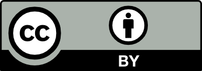

> 안녕하세요!  
> 
> 2021년 4월, 독일의 유명한 오픈소스 변호사인 Till Jaeger는 Dockerfile이 생성하는 Docker image내 포함될 오픈소스에 대한 라이선스 컴플라이언스 책임은 누구에게 있는가에 대한 글을 [발표](https://jolts.world/index.php/jolts/article/view/147)하였습니다. Till은 독일법과 유럽 연합 사법 재판소CJEU의 판례를 근거로 Dockerfile 제공자가 라이선스 의무를 준수해야 한다고 설명하였습니다. 
> 
> 여기서는 Till의 영어 원본을 국문으로 번역하였습니다. 이해를 돕기 위해 이미지를 추가하였고, 군데군데 개인 의견을 인용구(높임말)로 작성하였습니다. 
> 
> * 번역 오류나 문의는 이메일로 연락주시기 바랍니다. : haksung@sk.com 
> * 감수에 도움 주신 카카오의 [Sean](https://www.linkedin.com/in/%EC%98%81%ED%99%98-%EA%B9%80-4069b5135/)에게 깊이 감사드립니다. ^^

---

{}
This paper was translated by Haksung Jang from the English version available at the [Distribution of Dockerfiles: ](https://jolts.world/index.php/jolts/article/view/147).  The original document is licensed under [CC-BY-4.0](https://creativecommons.org/licenses/by/4.0/). The original author, Till Jaeger, has not reviewed this translation.
{}

{}
컨테이너 기술은 Target 시스템과 관계 없이 통합 소프트웨어 배포를 가능하게 한다. 이런 장점으로 Docker를 이용하는 배포가 점점 더 인기를 얻고 있다. 그런데 이때 FOSS 라이선스 컴플라이언스에 대한 새로운 의문이 제기되었다. Docker 환경에서는 "Docker image" 형태의 전체 소프트웨어를 배포하는 것뿐만 아니라, Dockerfile만을 배포할 수도 있다. Dockerfile은 스크립트 파일과 유사한 형태로 외부 저장소로부터 소프트웨어를 다운로드받게 하는 일종의 명령만을 포함하고 있다. 이러한 분산형 배포decentralized distribution의 형태는 라이선스 컴플라이언스를 누가 책임을 져야 하는지에 대한 의문을 제기하였다. 이 글에서는 프리 라이선스를 설명하기 위한 출발점으로 유럽 저작권법에 따른 "배포distribution"의 개념을 설명한다. 연구를 통해 저작권법 의미에서의 배포가 항상 물리적인 배포여야 하는 것은 아니라는 점이 밝혀졌다. 

이 글은 [OSADL](https://www.osadl.org/)Open Source Automation Development Lab로부터 자금 지원을 받고, 공동으로 작성하였다. 
{}

## 1. 소개 및 문제점

Docker 기술과 관련된 FOSS 라이선스 컴플라이언스 문제는 최근 몇 년 동안 주요 연구 대상이 되었다. 특히 Docker의 기술적 토대를 설명하고 관련된 라이선스 컴플라이언스 문제를 제기한 Armijn Hemel의 백서인 “[Docker Containers for Legal Professionals](https://www.linuxfoundation.org/wp-content/uploads/Docker-Containers-for-Legal-Professionals-Whitepaper_042420.pdf)”[^armijn]는 광범위한 분석 내용을 제공한다. Hemel은 Dockerfile의 수신자가 이를 사용하기 위하여 제삼자로부터 소스 파일을 다운로드받게 되는데, 이때 다운받는 소프트웨어 컴포넌트에 대한 라이선스 컴플라이언스 책임은 누구에게 있는가에 대해 공개적으로 질문을 제기하였다. 

[^armijn]: Hemel, Armijn, (2020), ‘Docker Containers for Legal Professionals,’ [pdf] Available at: <https://www.linuxfoundation.org/wp-content/uploads/Docker-Containers-for-Legal-Professionals-Whitepaper_042420.pdf> [Accessed 16 February 2021]. See also Peterson, Scott, (2020), ‘Making compliance scalable in a container world.’ Available at: <https://opensource.com/article/20/7/compliance-containers> [Accessed 16 February 2021].

거의 모든 FOSS 라이선스는 라이선스 의무 준수를 "배포distribution" (또는 GPL-3.0의 "전달conveying"와 연결시킨다. 대부분의 라이선스는 라이선스 내에서 "배포" 또는 "전달"이 무엇인지에 대해 추가로 정의하지는 않기 때문에, "배포"의 정의는 적용되는 저작권법에 따라 판단해야 한다[^convey]. 

[^convey]: Sec. 0 GPL-3.0 provides as follows: “To ‘convey'‘ a work means any kind of propagation that enables other parties to make or receive copies.” and “To ’propagate’ a work means to do anything with it that, without permission, would make you directly or secondarily liable for infringement under applicable copyright law, except executing it on a computer or modifying a private copy.”

> 대부분의 오픈소스 라이선스는 오픈소스를 "재배포"하는 시점에 준수해야 할 라이선스 의무 사항을 요구합니다. 즉, 오픈소스를 재배포하지 않는다면 라이선스 의무 준수가 요구되지 않습니다.
> "배포"의 범위를 어디까지로 판단해야 할지는 해당 지역에 적용되는 저작권법에 따라 해석해야 합니다. 

라이선스 컴플라이언스에 대한 중요성 때문에 "배포"라는 용어는 계속해서 법적인 분석 대상이 되고 있다. Heather Meeker는 미국 저작권 관점에서 [오픈소스 라이선스에서의 배포](http://dx.doi.org/10.5033/ifosslr.v4i1.66)를 주제로 글을 작성하였다[^heather]. 많은 오픈소스 라이선스가 미국 저작권법을 배경으로 작성되었지만, 유럽 법원은 CJEU(유럽 연합 사법 재판소)Court of Justice of the European Union에서 정교하게 설명한 "배포"에 대한 정의를 바탕으로 판결할 것으로 예상한다.

[^heather]: Meeker, Heather (2012), ‘The Gift that Keeps on Giving – Distribution and Copyleft in Open Source Software Licenses’, JOLTS, 4(1), pp 29 – 40, [DOI: 10.5033/ifosslr.v4i1.66].

이 글에서는 먼저 Docker의 기술적인 기본 사항에 대한 개요와 유럽 저작권법에 따른 "배포"라는 용어에 대한 해석을 제공한다. 이어서 Dockerfile을 배포할 때 라이선스 컴플라이언스를 누가 책임져야 하느냐에 대해 논의하겠다. 

## 2. Docker의 기술적 배경

Docker는 컨테이너에 프로그램을 설치하고 배포하는 기술이다. 모든 Dependency가 하나의 기술 Unit에 존재하고, 호스트 시스템과 대부분 독립적이라는 장점이 있다. Hypervisor를 통한 가상화와 달리 Docker 컨테이너에는 운영 체제 커널이 포함되어 있지 않다. 대신 특정 운영 체제 명령을 사용하면 컨테이너의 파일 시스템 트리가 컨테이너의 모든 프로그램에 대한 루트 디렉터리로 표시된다. 따라서 컨테이너 외부의 나머지 파일 시스템은 컨테이너 프로그램에서 보이지 않게 된다. Docker 컨테이너에는 Unix 계열 운영 체제가 필요하며 주로 Linux 커널과 함께 사용하도록 되어 있다. 

### Docker image

사전에 구성된 컨테이너는 "Docker image"로 배포될 수 있으며, 기본 프로그램 외에 애플리케이션, 프로그램 코드로서의 Dependency, 필요한 경우 유틸리티 및 구성 파일도 포함할 수 있다. Docker image는 개별적으로 배포될 수 있지만 "Docker Hub"와 같은 공용 저장소를 통해서도 배포될 수 있다. 이는 C 라이브러리, Package Manager, Shell 및 디렉터리 트리와 같은 필수 시스템 구성 요소를 포함하고 특정 Linux 배포를 참조하는 이른바 "Base Image"에도 해당된다. 이 Base image 위에, 추가 기능은 개별 보관 파일로 별도로 배포될 수 있지만 서로 빌드되어 완전한 Docker image를 형성하는 이른바 "레이어"로 추가될 수 있다.



<i>레이어 저장방식 : https://cultivo-hy.github.io/docker/image/usage/2019/03/14/Docker정리/</i>



### Dockerfile

"Dockerfile"은 스크립트와 유사하게 Docker image를 만들기 위한 단계별 명령을 포함하는 텍스트 파일이다. Dockerfile은 일반적으로 Dockerfile 자체에만 적용되는 자체 라이선스를 가질 수 있으며, 이 라이선스는 Docker 컨테이너에 포함되는 프로그램에는 적용되지 않는다. 



<i>Dockerfile : https://www.slideshare.net/vincenzoferme/using-docker-containers-to-improve-reproducibility-in-software-and-web-engineering</i>



### Docker 엔진

Docker 컨테이너용 관리 소프트웨어인 "Docker 엔진"은 Dockerfile의 명령을 순차적으로 처리하여 Docker image를 생성한다. 일반적으로, Base image나 개별 레이어를 위한 각 컴포넌트는 내부 또는 외부 저장소에서 다운로드된다. 이는 제공자가 Dockerfile을 제공하더라도 물리적인 프로그램 코드를 전달하지 않는 것이 가능함을 의미하고, 이런 일은 실제로 관례적이다. 고객은 전달받은 Dockerfile을 가지고 자체적으로 공개 저장소로부터 전체 혹은 일부 프로그램 코드를 받아와서 Docker 컨테이너를 구축할 수 있다. 



<i>https://cultivatehq.com/posts/docker/</i>



여기서 이러한 Dockerfile을 사용하여 빌드한 Docker image에 포함된 FOSS의 라이선스 의무를 Dockerfile 제공자가 준수해야 하는지 여부와 어떤 라이선스 의무를 준수해야 하는지에 대한 의문이 제기될 수 있다. 

## 3. 법적 배경 - EU 법률에 따른 배포 권한

거의 모든 FOSS 라이선스는 저작권법에 따라 소프트웨어를 배포distributing 또는 전달conveying 행위를 위한 조건으로 라이선스 의무 준수를 요구한다. 즉, 프로그램의 사본을 제삼자에게 전달할 때 라이선스 의무를 준수해야 한다. 일부 라이선스는 "배포distribution"에 대한 정의를 라이선스 내에 포함(예: GPL-3.0은 "전달convey"이라는 용어 정의를 포함함)하지만, 대부분의 라이선스는 이에 대해 정의하지 않고 있다. 따라서, 해당하는 저작권법이 배포를 어떻게 해석하는가를 참조하는 것이 일반적이다. 독일에서는 독일 저작권법의 §69c no 3 UrhG에서 배포를 "`Verbreitung`"라는 용어로 사용하여 "컴퓨터 프로그램의 원본 또는 사본을 배포하는 모든 형태(임대 포함)"라고 정의한다. 여기서 "`Verbreitung`"은 §17 (1) UrhG에서와 같이 컴퓨터 프로그램 말고도 일반적인 저작물을 사용할 수 있는 권리를 제공하는 것으로 이해할 수 있다.

{}
<i>"배포권right of distribution은 저작물의 원본 또는 사본을 일반 대중에게 제안offer하거나 유통할 수 있는 권리이다"

“The right of distribution is the right to offer the original or copies of the work to the public or to put it into circulation.”</i>
{}

이는 컴퓨터 프로그램의 법적 보호에 관한 유럽 의회 및 이사회의 지침 [2009/24/EG 4조](https://eur-lex.europa.eu/legal-content/EN/TXT/HTML/?uri=CELEX:32009L0024)Directive 2009/24/EG of the European Parliament and of the Council에 비추어 해석되었다[^directive2009]. 독일 및 유럽 최고 법원인 독일 연방 사법 재판소German Federal Court of Justice, Bundesgerichtshof (BGH)와 유럽 연합 사법 재판소Court of Justice of the European Union (CJEU)는 수많은 법원 판결에서 배포권을 해석하는 데 도움이 되는 기여를 했다. 이에 대해서는 아래에서 자세히 설명한다. 

[^directive2009]: Directive 2009/24/EC on the legal protection of computer programs (codified version). Available at: <https://eur-lex.europa.eu/legal-content/EN/TXT/HTML/?uri=CELEX:32009L0024> [Accessed 16 February 2021].

## 4. Dockerfile의 배포 - 분석

이 섹션에서는 먼저 저작권법에 따른 배포가 프로그램 코드의 물리적인 전송을 반드시 요구하는지 여부에 대해 살펴본다. 이후에는 Docker image의 다양한 구성 요소, 즉, Base image, 프로그램 라이브러리, 패치 및 업데이트에 관해 설명한다. 

### 4.1 프로그램 코드의 물리적인 배포가 있어야만 배포인가? 

아래의 첫번째 경우뿐만 아니라 두번째 경우도 "배포"에 대한 책임은 Dockerfile 제공자에게 있다. 
- 저작권 법에서 정의된 배포의 개념인 프로그램 복사본의 "물리적" 배포
- 제삼자로부터 프로그램 복사본을 취득하게 하는 기타 행위

독일과 EU의 최고 법원이 다음의 두가지를 모두 고려되어야 한다는 판결을 자주 했음을 주목하자. 
- 물리적 행위
- 복제 또는 배포와 법적으로 관련된 행위를 물리적으로 수행하는 제삼자는 단순히 당사자의 "도구"로 간주됨

이러한 측면에는 특히 CJEU가 "필수적 역할essential role"이라고 부르는 조직적 통제organizational control를 포함한다[^opinion]. 한가지 예는 독일 연방 사법 재판소BGH의 "인터넷 라디오 음악 녹음 서비스" 판결이다. 이 판결은 인터넷 서비스에 의한 디지털 라디오 방송국의 완전 자동 녹음이 클라이언트의 개인 복사본인지 (허가) 혹은 서비스 제공자의 복사본인지에 (무허가) 대해 다룬다. 이에 대해 BGH는 다음과 같이 명시하였다[^bgh20200305]. 

[^opinion]: See the ‘Opinion of Advocate General Saugmandsgaard Øe in the joined Cases C‑682/18 and C‑683/18 (Frank Peterson v Google LLC et al), ECLI:EU:C:2020:586. Available at: <https://eur-lex.europa.eu/legal-content/EN/TXT/HTML/?uri=CELEX:62018CC0682> [Accessed 16 February 2021].

{}
<i>"이러한 맥락에서, 결정적인 요소는 제조사가 '복제 기기를 대신taking the place of the reproduction device'하여 상대방의 '필요한 도구necessary tool'로 행위하는 것에 국한되는지 (이 경우 복제는 구매자에게 귀속되어야 함) 또는 사적 이용으로 정당화될 수 없을 정도의 범위와 강도로 저작권 침해 사용을 요구하는지 (이 경우 복제는 제조사에 귀속되어야 함) 여부이다. 규범적 판단에 근거한 이번 조사에서는 녹음 과정에 대한 조직적 주도권organizational sovereignty을 고객이 가졌는지 여부도 판단해야 한다. 

“In this context, the decisive factor is whether the manufacturer is limited to ’taking the place of the reproduction device’ and acting as a ‘necessary tool’ of the other party - in which case the reproduction is to be attributed to the purchaser - or whether he opens up a copyright-relevant use to an extent and intensity that cannot be reconciled with the considerations that justify the privileges of private use - then the reproduction is to be attributed to the manufacturer. Within the framework of this examination, which is based on normative standards, it must also be determined whether the client has organizational sovereignty over the recording process.”</i>
{} 

[^bgh20200305]: BGH (German Federal Court of Justice), judgment of 2020-03-05 - I ZR 32/19 – Internet radio recorder. Available at: <https://openjur.de/u/2202077.html> [Accessed 16 February 2021].

> 인터넷 라디오 음악 녹음 서비스에 대한 세부 내용은 한국저작권위원회의 [2019년 자료](http://www.copyright.or.kr/information-materials/trend/the-copyright/download.do?brdctsno=44381&brdctsfileno=15929)[^streaming]를 참고할 수 있습니다.   
> 
> 이 판결의 원고는 음반 제작자인 독일 소니 뮤직(Sony Music)이며, 피고는 인터넷 라디오에서 방송되는 음악을 녹음하여 제공하는 서비스를 운영하는 MusicMonster.FM입니다.   
> 
> 독일 법원은 피고의 서비스는 복제를 위한 기술적 수단을 단순히 제공하는 것을 넘어서고 사적 이용으로 정당화되는 범위를 초과하기 때문에 피고가 복제 및 공중접근의 행위자이고, 피고가 원고의 복제권과 전송권을 침해하였다고 판결하였습니다. 

[^streaming]: 독일 지방법원, 인터넷 라디오 음악 녹음 서비스(stream ripping) 제공자는 복제권과 전송권을 침해한다 : http://www.copyright.or.kr/information-materials/trend/the-copyright/download.do?brdctsno=44381&brdctsfileno=15929

CJEU는 저작권 침해 행위와 관련하여 누가 "필수적 역할essential role"을 하였는지에 대한 몇 가지 판단을 근거로 삼았다. 이는 특히 §17 UrhG(독일 저작권법)에서 명백하게 드러난다. UrhG는 단순한 "제안offer" 행위, 즉 물리적 배포의 준비 행위preparatory act of a physical distribution도 배포 행위act of distribution라고 지정하였다[^CJEU20150513]. 

{}
<i>"이러한 정황을 고려했을 때, 법원은 일반 대중에게 배포하는 것은 적어도 매매 계약 체결부터 공공의 구성원에게 전달하기까지의 일련의 행위들로 구성된다는 것을 구체적으로 발견하였다. 이러한 상황에서 판매자trader는 배포 저작물을 (저작권으로 보호하는 회원국의) 일반 대중에게로 배포를 유발한 자신이 (또는 자신을 대신하여 누군가) 수행한 모든 행위에 대한 책임이 있다. …   

이러한 일련의 행위에는 제안offer을 하기 위한 권유 또는 해당 물건의 판매를 목적으로 취해진 보호 대상에 대한 구속력이 없는 광고도 포함한다. … 

전술한 고려사항에 비추어볼 때, 언급된 질문에 대한 대답으로는 2001/29의 지침 제4조 제1항은 다음과 같은 의미로 해석해야 한다. 저작권 보유자에게 저작물 배포를 위한 독점적 권리를 허용하고, 이는 제삼자가 해당 저작물 원본 또는 사본의 판매 제안이나 광고하는 것을 방지할 수 있다. 이는 해당 저작물을 저작권으로 보호하는 회원국의 소비자를 대상으로 광고하는 한 해당 광고로 인해 EU 구매자가 보호 대상 저작물을 구매하게 되었다는 사실이 입증되지 않은 경우에도 마찬가지이다."

"Taking that context into account, the Court specifically found that distribution to the public is characterised by a series of acts going, at the very least, from the conclusion of a contract of sale to the performance thereof by delivery to a member of the public. A trader in such circumstances bears responsibility for any act carried out by him or on his behalf giving rise to a distribution to the public in a Member State where the goods distributed are protected by copyright. … As regards an invitation to submit an offer, or a non-binding advertisement for a protected object, those also fall under the series of acts taken with the objective of making a sale of that object. … In the light of the foregoing considerations, the answer to the questions referred is that Article 4(1) of Directive 2001/29 must be interpreted as meaning that it allows a holder of an exclusive right to distribute a protected work to prevent an offer for sale or a targeted advertisement of the original or a copy of that work, even if it is not established that that advertisement gave rise to the purchase of the protected work by an EU buyer, in so far as that that advertisement invites consumers of the Member State in which that work is protected by copyright to purchase it."</i>
{} 

[^CJEU20150513]: CJEU of 2015-05-13, C-516/13 – Dimensione Direct Sales and Labianca. Available at:
<https://eur-lex.europa.eu/legal-content/EN/TXT/PDF/?uri=CELEX:62013CJ0516&qid=1607613372933&from=EN> [Accessed 16 February 2021].

CJEU의 이 판결과 다른 판결들은 기술적으로 배포하는 것뿐만 아니라, 배포를 위한 준비 행위도, 적어도 배포자가 배포 과정에서 "필수적 역할"을 하는 경우라면, 배포가 될 수 있다는 것을 보여준다. Dockerfile의 경우가 정확히 그렇다. Dockerfile은 (의도된 용도에 따라) Dockerfile의 수신자에게 완전한 기능의 시스템complete functioning system을 전송하기 위해 조직된 명령을 제공하기 때문에 Dockerfile 제공자는 Docker image에 포함된 소프트웨어의 배포에 필수적인 역할을 하는 것이다. 이런 점에서, 조직적 통제권organizational control을 가진 것은 Dockerfile 제공자이다. 따라서, Dockerfile 제공자는 이러한 형태로 배포되는 (Docker image에 포함될) FOSS의 라이선스 의무를 준수해야 한다.

Dockerfile의 제공자가 Dockerfile이 참조하는 소프트웨어를 배포한다는 사실이, Base image나 레이어를 다운로드할 수 있는 저장소의 운영자도 각각 프로그램 코드의 배포 행위를 수행하거나 "공개적으로 이용할 수 있게 한다"는 사실과 충돌하는건 아니다[^distributionright]. 이는 대부분의 Base image나 레이어는 특정 컨테이너를 위해서만이 아니라 일반적인 다운로드도 제공하기 때문이다. 일반적인 다운로드의 경우, 저장소 운영자가 아닌 저장소를 통해 Base image나 레이어를 제공하는 개인 또는 단체가 배포(또는 대중과의 통신) 행위를 잠재적으로 수행하는 것으로 볼 수 있다. 

[^distributionright]: Please not that the “Right of communication to the public of works and right of making available to the public” in Art. 3 are independent rights from the “distribution right” in Art. 4 Directive 2001/29/EC. Available at: <https://eur-lex.europa.eu/legal-content/EN/TXT/HTML/?uri=CELEX:32001L0029> [Accessed 16 February 2021].

### 4.2 패치

추가 레이어를 사용하면 이미 설치된 프로그램도 수정할 수 있다. 이 경우, Docker 컨테이너는 수정되지 않은 프로그램을 한 레이어에 포함하고 수정한 프로그램을 다른 레이어에 포함하여 수정된 프로그램이 실행되도록 한다. 이러한 상황에서도 Dockerfile에는 적용될 수정사항이 정의되어 있기 때문에 Dockerfile 제공자는 "필수적 역할"의 책임을 맡아야 한다. 따라서, Dockerfile 제공자가 수정사항에 대한 라이선스 의무를 준수해야 한다.

이는 두 버전이 모두 수신자에게 배포되기 때문에 (수정된 버전만 실제 사용되더라도) 수정된 버전 뿐만 아니라 원 버전에도 적용된다는 사실에 주의해야 한다[^armijn19]. 프로그램이 새 레이어에 의해 제거되더라도 Docker image에 물리적으로 여전히 포함된 경우에도 마찬가지이다.

[^armijn19]: See Hemel Armijn, ibid n. 1, p. 19.

### 4.3 시스템 요구 사항 및 Base image

#### 시스템 요구 사항

이 섹션은 오픈소스 라이선스는 오픈소스 소프트웨어를 사용하는 데 필요하지만 라이선스 범위에 포함되지 않는 독립 프로그램에 대한 사용 권한을 부여하는 데까지는 확장되지 않는다는 점에서 출발한다. 애플리케이션을 실행하는 데 필요한 운영 체제 또는 웹 서버가 대표적인 예입니다. 이와 같이 애플리케이션 실행에 필요한 독립 프로그램을 "시스템 요구 사항"이라고 하겠다. Dockerfile을 배포하는 제공자는 Docker 엔진 또는 Linux 커널과 같은 시스템 요구 사항에 대한 라이선스 의무는 준수할 책임이 없다. 이런 시스템 요구 사항은 Dockerfile에서 참조하지도 않는다.

> 참고로, GPL-2.0 3조에서는 다음과 같이 컴파일러, 커널 등 운영 체제의 주요 컴포넌트는 소스 코드 공개 범위에 포함되지 않는다는 예외를 두고 있습니다. 
> 
> <i>"3. However, as a special exception, the source code distributed need not include anything that is normally distributed (in either source or binary form) with the major components (compiler, kernel, and so on) of the operating system on which the executable runs, unless that component itself accompanies the executable."</i>
> 
> https://www.gnu.org/licenses/old-licenses/gpl-2.0.html

#### Base image

Base image도 시스템 요구 사항으로 간주할 수 있을까? 일반적으로 Base image에 포함되는 프로그램은 Docker 컨테이너에서 실행되는 애플리케이션과 독립적이다. Base image에 포함된 프로그램이 수정되지 않은 형태로 사용되는 한, Dockerfile에 다운로드 명령이 포함되어 있다고 해도 Dockerfile 제공자가 Base image의 제공자는 아니기 때문에 Base image는 시스템 요구 사항으로 간주할 수 있다. 또한, 저장소 운영자가 액세스를 거부한다면 더 이상 다운로드가 불가능하다. 이런 사실에 비추어볼때 Base image는 Dockerfile 제공자의 통제를 벗어난다. 패치의 경우에도 비슷하지만 패치와 시스템 요구 사항은 다르게 처리해야 한다. 

컴퓨터 프로그램은 일반적으로 다른 독립 프로그램과 작동한다. 이는 다른 형태의 저작물과 구별되는 특징이다. 예를 들어 대부분의 애플리케이션은 운영 체제 없이 실행되지 않는다. 하지만 이러한 애플리케이션 실행을 위해 시스템 요구 사항을 설치해야 한다고 해서 애플리케이션 제공자가 시스템 요구 사항 배포의 필수적 역할essential role을 한다는 것을 의미하지는 않는다.

이런 상황은 다운로드 링크와 다소 비슷하다. 저작권이 있는 저작물을 다운로드하는 링크가 저작권법이 적용되는 관련 행위를 구성하는지, 즉 대중에게 전달하는 행위(따라서 저작권 침해를 초래할 가능성이 있음)에 해당하는지 여부에 대한 문제가 EU에서 치열하게 논의되고 있다. CJEU는 이에 대하여 일련의 복합적인 기준을 설정하였다[^cjeu14]. 이 기준은 특히 다음과 같은 사례별 질문을 제시한다. : 새로운 구매자 그룹에 공개되어 있는지 여부, 의도된 용도가 상업적 목적인지 여부, 해당 행위가 제안에 중요한 역할을 하는지 여부, 제안이 불법인지 여부. 이렇게 사례별로 다뤄야하며 포괄적인 판단은 거의 불가능하다. 사실 회원국에서는 이러한 기준을 고려하는 경우가 흔하지 않았다. 그럼에도 이런 기준을 만든건 아마도 인터넷 저작권의 법적 상황을 더 잘 조화시키려는 CJEU의 바람 때문일 것이다.

[^cjeu14]: As the CJEU, judgment of 14 June 2017 in case C-610/15 – Stichting Brein (The Pirate Bay) itself declares: “In order to determine whether a user is making a ‘communication to the public’ within the meaning of Article 3(1) of Directive 2001/29, it is necessary to take into account several complementary criteria, which are not autonomous and are interdependent. Consequently, those criteria must be applied both individually and in their interaction with one another, since they may, in different situations, be present to widely varying degrees.” Available at: <http://curia.europa.eu/juris/liste.jsf?language=en&T,F&num=c-610-15> [Accessed 16 February 2021].

지금까지 제시된 견해에 따르면, Base image의 저장소 운영자와 제공자는 Base image의 배포에 필수적인 역할을 하는 반면, Dockerfile이 단지 참조하는 Base image는 시스템 요구 사항을 쉽게 취득하게 하기 위한 것이다. 그러므로, 저장소의 운영자가 일반 대중에게 전달하는 행위를 수행하는 것이고, 저장소 운영자는, 최소한 이러한 제공이 합법적이라면, 포함된 FOSS의 라이선스 의무를 단독으로 준수해야 한다.

위에서 언급한 해석은 본 연구 저자의 법적 의견이다. 일반적으로 컴퓨터 프로그램 및 특히 Dockerfile에 대한 이러한 특정 상황에 관한 판례는 없다. 다른 해석들도 분명 논쟁의 여지가 있다(특히 Base image를 포함하는 모든 참조 레이어가 Dockerfile의 제공자에 의해 배포되는 경우). 

한가지 언급해야 할 사항은 현재 수많은 저장소 운영자들이 FOSS의 라이선스 의무를 올바르게 준수하지 않고 있으며 (예: GPL 및 LGPL 구성 요소의 소스 코드를 적절하게 제공하지 않음), 이는 저작권 침해의 책임이 있다는 점이다. 이 경우, 만약 Dockerfile의 제공자가 라이선스 위반을 알고 있다면 혹은 알고 있어야 한다면, 라이선스를 위반하는 참조를 포함하는 Dockerfile을 제공하는 것은 독립적인 배포 행위로 간주되거나 최소한 기여 저작권 침해(즉, 라이선스 위반에 대한 선동 또는 방조)로 간주될 수 있다. 따라서 Dockerfile 제공자는 지정된 저장소에서 제공하는 Base image가 라이선스를 준수하는지 여부를 검토해야 한다[^redhat]. 

Docker image를 단순히 조직 내부에만 사용하려는 수신자라면, FOSS 프로그램의 단순한 실행은 제한되지 않기 때문에, 문제없이 사용할 수 있다. 예를 들어, GPL-2.0 4조에서는 이를 명확히 말하고 있다[^gpl-4]. 그러나, 수신자가 Docker image를 재배포하려고 한다면, Dockerfile의 배포가 저작권을 침해하는 경우라면 배포권이 소진되는 것이 아니기 때문에, 재배포하려는 수신자는 라이선스 조건의 컴플라이언스를 보장해야 한다(아래의 4.6절 참조). 

[^redhat]: For efforts of Red Hat to improve the situation see Peterson, S., ibid.
[^gpl-4]: "However, parties who have received copies, or rights, from you under this License will not have their licenses terminated so long as such parties remain in full compliance."

### 4.4 프로그램 라이브러리

프로그램과 연결된 라이브러리의 경우, 이러한 라이브러리가 독립적인 프로그램으로 간주되는지 또는 링크된 프로그램의 일부가 되는건지에 대해서는 약간의 의견 차이가 있다[^link]. 이러한 맥락에서 다음과 같이 구분할 수 있다. 

[^link]: See for more details Jaeger, Till and Metzger, Aaxel, Open Source Software, 5th edition, 2020, 64 et seq; Meeker, Heather, Open Source for Business, A practical Guide to Open Source Software Licensing, 3rd edition 2020, 119 et seq; Working Paper on the legal implication of certain forms of
Software Interactions (a.k.a linking), Available at:  <https://www.ifosslr.org/public/LinkingDocument.odt> [Accessed 16 February 2021].

* 시스템 라이브러리
* GPL 및 AGPL 애플리케이션과  연결되는 비시스템 라이브러리non-system library
* GPL 및 AGPL 이외의 다른 라이선스의 애플리케이션과 연결되는 비시스템 라이브러리

GPL-2.0 섹션 3 및 GPL-3.0 섹션 1 (3)에는 라이선스 의무 중 소스 코드를 제공해야 하는 범위 내에 "시스템 라이브러리"는 면제하는 조항이 포함되어 있다[^exemption]. 따라서 Dockerfile이 Docker 컨테이너에서 수정되지 않은 이러한 시스템 라이브러리를 사용하라는 명령을 포함하는 경우, 이러한 시스템 라이브러리에 대한 라이선스 의무는 준수할 필요가 없다. 그러므로 이러한 시스템 라이브러리의 법적인 상황은 Base image에 적용되는 상황(위 4.3 참조)과 동일하며, 이때는 배포를 위한 필수적인 역할이 Dockerfile 제공자에게 있는 것은 아니다.

[^exemption]: The definition in section 1 GPL-3.0 reads as follows: ’The “System Libraries’ of an executable work include anything, other than the work as a whole, that (a) is included in the normal form of packaging a Major Component, but which is not part of that Major Component, and (b) serves only to enable use of the work with that Major Component, or to implement a Standard Interface for which an implementation is available to the public in source code form. A ‘Major Component’, in this context, means a major essential component (kernel, window system, and so on) of the specific operating system (if any) on which the executable work runs, or a compiler used to produce the work, or an object code interpreter used to run it.”

그러나 Dockerfile이 제삼자 저장소에서 (시스템 라이브러리 이외의) 라이브러리를 다운로드하고 이 라이브러리가 Docker 컨테이너 내에서 GPL-3.0 또는 AGPL-3.0 애플리케이션과 링크하는 레이어를 지정하는 경우라면, 이러한 라이브러리에 대해서는 각각 링크하는 애플리케이션의 라이선스(GPL-3.0 또는 AGPL-3.0) 의무를 준수해야 한다. 예를 들어 라이브러리의 소스 코드를 반드시 제공해야 한다 (cf. section 1 GPL-3.0: “Corresponding Source includes ..., and the source code for shared libraries and dynamically linked subprograms that the work is specifically designed to require, ...”). 이는 GPL-2.0에도 동일하게 적용된다. 라이브러리의 물리적 배포의 경우와 마찬가지로 (라이선스 충돌 문제가 없다면) 해당 라이선스 조건을 준수해야 한다. 즉, 분산형 배포 프로세스decentralized distribution process로 카피레프트 요구 사항을 회피할 수 없다.

Dockerfile 제공자는 프로그램 라이브러리를 Dependency로 선택하는 조직적 제어권organizational control을 가졌기 때문에 Dockerfile 제공자가 프로그램 라이브러리를 배포한다고 판단할 수 있다. 따라서, 프로그램 라이브러리의 배포 프로세스에서 Dockerfile 제공자가 필수적인 역할essential role을 한다. 

### 4.5 업데이트

업데이트 처리는 Dockerfile 제공자가 업데이트를 제어하는지 여부에 따라 달라진다. Dockerfile 제공자(또는 대리인)가 직접 저장소에 업데이트를 업로드하여 Dockerfile의 수신자가 이를 받아올 수 있게 하였다면 Dockerfile 제공자가 업데이트를 배포한다고 볼 수 있다. 반면, 저장소 운영자의 통제하에 업데이트가 제공된다면 (예 : Dockerfile이 "최신 버전"을 참조하는 경우) 이는 Dockerfile 제공자가 배포하는 것이 아니다. 이 경우, Dockerfile 제공자가 프로그램 버전을 선택하고 Dockerfile 내에 명명하는 것과는 대조적으로, Dockerfile 제공자는 업데이트의 내용에 관련해서 영향을 미치지 않는다.

### 4.6 라이선스 조건 준수 시점

라이선스 의무는 배포 (또는 대중에게 전달) 시점에 준수해야 한다. 같은 일련의 배포 단계에서 Dockerfile의 전달과 같은 준비 행위는 이미 배포로 간주 될 수 있으므로, 엄격히 말해서, Dockerfile 전달 시 라이선스 의무를 이행해야 한다. 그러나 저장소에서 다운로드 하는 시점에 라이선스 의무를 준수하는 것도 충분하다는 방식으로 오픈소스 라이선스를 해석할 수 있다. 특히 Dockerfile 배포 시, 다운로드되는 레이어에 어떤 프로그램 코드가 포함되는지 명확하지 않다는 점도 이러한 해석을 뒷받침한다. 예를 들어 프로그램 버전을 "latest"로 지정한 경우가 그렇다.

하지만, 만약 관련 저장소에서 라이선스 의무를 완전히 충족하지 않는다면, Dockerfile 제공자는 독립적으로 라이선스 의무를 준수하고 필요한 필수 정보(예 : 라이선스 텍스트, 저작권 고지, 소스 코드 제공)가 포함된 파일을 함께 제공하는 것이 좋다.

## 5. 결론

* Dockerfile을 배포하여 수신자가 공개적으로 접근할 수 있는 저장소로부터 소프트웨어를 다운로드하게 한다고 해서 Docker 컨테이너에 포함된 FOSS의 라이선스 조건 컴플라이언스에 대한 책임을 회피할 수는 없다. 
* 유럽 연합 사법 재판소Court of Justice of the European Union의 판례를 분석한 결과, Dockerfile 배포와 같은 준비 행위preparatory acts는 “배포”의 의미에 해당 할 수도 있다는 사실이 드러났다.
* 그럼에도 불구하고, 컴퓨터 프로그램 상호 작용의 특수성을 고려해야 한다. 예를 들어 시스템 요구 사항은 Dockerfile 제공자의 책임에 해당하지 않는다는 것을 볼 수 있다.
* 그러나 FOSS를 준수하지 않는 방식으로 Docker 레이어 자체를 제공하는 저장소는 이러한 저장소를 참조하는 Dockerfile 제공자에게도 위험을 초래한다.
* 따라서 FOSS 라이선스 컴플라이언스는 Dockerfile 제공자와 Docker 레이어에 대한 공개 저장소 간의 공동 책임이 된다.

{}
<i><b>Till Jaeger</b> has been a partner at JBB Rechtsanwälte since 2001 (www.jbb.de). He is a Certified Copyright and Media Law Attorney and advises large and medium-sized IT businesses as well as government authorities and software developers on matters involving contracts, licensing and IP rights.

One particular focus of Till Jaeger's work is on the legal issues created by free and open source software (FOSS). He is co-founder of the Institute for Legal Aspects of Free & Open Source Software, ifrOSS (www.ifross.org), contributing to its work with academic publications, lectures and seminars in the fields of software law and copyright law.

Till Jaeger is a lecturer at the Humboldt University Berlin in the subjects of IT law and IP law and general counsel of Open Source Automation Development Lab (OSADL) eG.

He represented the gpl-violations.org project in several lawsuits to enforce the GPL and has published articles and books related to legal questions of Free and Open Source Software (among them Jaeger/Metzger, Open Source Software - Rechtliche Rahmenbedingungen der Freien Software, 5th ed. Munich 2020, and Van den Brande/Coughlan/Jaeger - The International FOSS Law Book, 2nd ed. Munich 2014). He was member of the Committee C in the GPLv3 drafting process.</i>
{} 

{}

<b>Licence and Attribution</b>

This paper was published in the Journal of Open Law, Technology, & Society, Volume 12, Issue 1 (April 2021). It originally appeared online at http://www.jolts.world

This article should be cited as follows:

Jaeger, Till (2021) 'Distribution of Dockerfiles: Who is responsible for FOSS License Compliance?', Journal of Open Law, Technology, & Society, 12(1), pp 13 – 20
DOI: 10.5033/jolts.v12i1.147

Copyright © 2021 Till Jaeger

This article is licensed under a Creative Commons Attribution 4.0 CC-BY available at

https://creativecommons.org/licenses/by/4.0/

{}