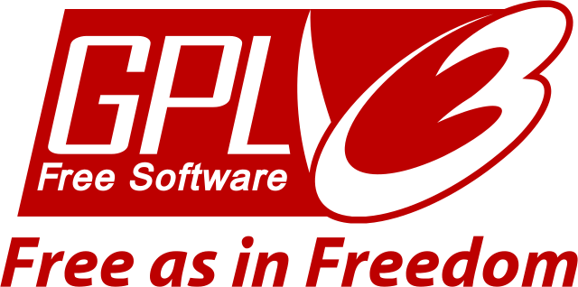
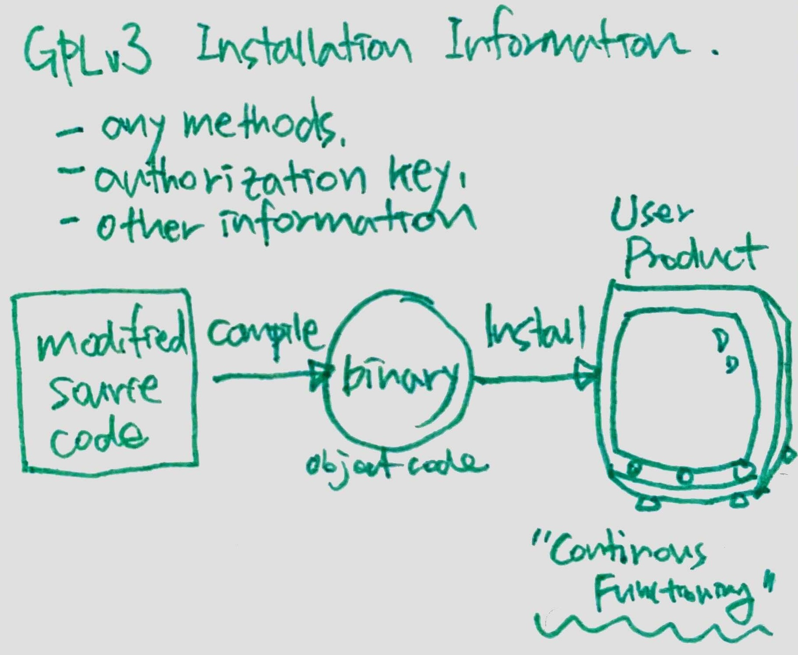

{}
This paper was translated by Haksung Jang from the English version available at this [article](https://jolts.world/index.php/jolts/article/view/149/270).  The original author, [P. McCoy Smith](https://www.linkedin.com/in/mccoysmith), has not reviewed this translation.
{}

---

> <i>안녕하세요, 장학성입니다. 
> 
> 미국의 저명한 오픈소스 라이선스 전문 변호사인 P. McCoy Smith는 최근 [JOLTS](https://jolts.world/)Journal of Open Law, Technology & Society에 GPLv2가 '설치정보'를 요구하는가에 대한 분석글을 게재하였습니다. 
> 
> 지난 2021년 3월, [SFC](https://sfconservancy.org/)Software Freedom Convervancy의 [블로그](https://sfconservancy.org/blog/)에 "[Understanding Installation Requirements in GPLv2](https://sfconservancy.org/blog/2021/mar/25/install-gplv2/)"라는 글에서 GPLv2에서도 설치 정보 제공을 요구한다는 글이 올라왔었는데, 이에 대한 분석과  <b>GPLv3의 '설치 정보' 요구 사항은 GPLv2에서는 해당하지 않는다는 의견</b>을 자세한 근거를 들어 설명하였습니다. 
> 
> 여기서는 원문을 번역하되 Readability를 고려하고 독자의 이해를 돕기 위해 가능한 배경 설명을 추가하여 작성하였습니다. 
> 
> 혹시, 오류를 발견하였거나 추가 의견이 있으신 분들은 언제든 연락주세요. haksung@sk.com 
> 
> 감사합니다. :) </i>

---

### Abstract

GPLv3GNU General Public License version 3 에서 추가된 주요 특징 중 하나는 소프트웨어 배포 시 소스 코드 뿐만 아니라 '설치 정보'를 제공해야 한다는 요구사항이다. 이는 GPLv2에 존재하는 loophole ([Tivoization](https://opensource.stackexchange.com/questions/7020/what-exactly-is-tivoization-and-why-did-linus-torvalds-not-like-it-in-gplv3))을 해결하기 위해 GPLv3에 새롭게 추가되었다. 그런데 최근에 이 설치 정보 요구 사항이 GPLv2에서도 요구한다고 봐야한다는 주장이 제기되었다. 

이 글에서는 GPLv3에 '설치 정보' 요구 사항을 포함하게된 역사적 근거를 검토하고, 이 요구 사항은 GPLv2가 아닌, GPLv3에서 새롭게 적용된 것임을 설명한다. 또한, GPLv2 텍스트 분석을 통해서도 동일한 결과를 도출한다.

## 1. Introduction

1991년 FSFFree Software Foundation에서 공개한 GPLv2GNU General Public License, version 2[^GNU-1991]은 Copyleft (혹은 Reciprocal) 라이선싱 방식을 채택하였다. Copyleft 방식은 정해진 시기에 지정된 방식대로 소스 코드를 공개하고, 소프트웨어를 재배포할 때에는 동일한 라이선스 적용을 요구한다. 이는 소프트웨어가 "free"로 유지되도록 보장하는 최고의 수단이며, 이는 오늘날에도 여전히 많은 사람들에게 인정되고 있다[^GPLv2_equal]. 여기서 "free"는 다음과 같다[^free]. 
- 수정 사항을 공유할 수 있는 자유
- 사용자가 코드로 수행할 수 있는 작업에 대한 자유
- 사용자가 원하는대로 코드를 수정할 수 있는 자유

[^GNU-1991]: GNU Operating System, ‘GNU Library General Public License, version 2.0,’ (June, 1991) https://www.gnu.org/licenses/old-licenses/lgpl-2.0.html (accessed March 8, 2021).

[^GPLv2_equal]: Although GPLv3 was designed to eventually supplant GPLv2, in the 14 years since GPLv3 was published, the use of GPLv3, by some measures, is roughly equal in measure to the use of GPLv2; GPLv3’s relative use is also declining while GPLv2 remains steady state. Johnson, Patricia, ‘Open Source Licenses in 2021: Trends and Predictions,’ WhiteSource (January 28, 2021) https://resources.whitesourcesoftware.com/blog-whitesource/open-source-licenses-trends-and-predictions (accessed March 30, 2021).

[^free]: See GNU Operating System, ‘What is free software? The Free Software Definition,’ https://www.gnu.org/philosophy/free-sw.en.html (accessed March 8, 2021).

그럼에도 불구하고 2005년, FSF는 GPLv2를 출시할 당시 고려하지 못한[^6] 법률적[^4] 그리고 기술적[^5] 문제를 해결하기 위해 라이선스 변경의 필요성을 인식하였다. 이에 따라 FSF는 2006년[^7]부터 2007년까지 GPL의 신규 버전을 만들기 위해 대규모의 협업과 다국적 노력을 시작하였으며, 2007년 6월 29일 GPLv3를 공개하였다[^8].

<!--  -->




[^4]: One example of a change in the law that the authors of  GPLv3 felt needed to be addressed in that license was the adoption in 1996 of the WIPO Copyright Treaty (WCT), and the passage in 1998 of its counterpart in the United States, the Digital Millennium Copyright Action (DMCA), particularly the provisions against circumvention of 'technological protection measures', See WCT Article 11; 17 U.S.C. § 1201 (1998). GPLv3, §  3 directly addresses these additions to copyright law.

[^5]: The technology in TiVo's devices,  preventing reinstallation of modified binaries on devices running GPLv2 software, was one example of technology developed long after the GPLv2 licence was drafted that was of concern to the drafters of GPLv3. Subsequent to the release of GPLv3, millions, if not billions, of devices continue to be distributed with a GPLv2-licensed Linux kernel that prevent the reinstallation of modified binaries. GPLv3 also addressed the outmoded language around distribution of source code in GPLv2, and GPLv3 ‒ in Section 6 ‒ added several additional mechanisms for fulfilling source code obligations more consistent with current mechanisms for software distribution. See GPLv3, § 6(d)-(e).

[^6]: Free Software Foundation, ‘Rationale for 1st  discussion draft,’ http://gplv3.fsf.org/gpl-rationale-2006-01-16.html (accessed March 22, 2021).

[^7]: Irish Free Software Organization, ‘Transcript of Opening session of first international GPLv3 conference,’ (January 16th 2006) http://www.ifso.ie/documents/gplv3-launch-2006-01-16.html (accessed March 22, 2021).

[^8]: GNU Operating System, ‘GNU General Public License, version 3,’ (‘GPLv3’) (June 29, 2007) https://www.gnu.org/licenses/gpl-3.0.html (accessed March 22, 2021).

## 2. GPLv3의 '설치 정보' 요구 사항

GPLv2가 광범위하게 사용되던 15년 동안 제기된 문제와 우려를 해결하기 위해 GPLv3에는 수많은 기능이 추가되었다. 그중에서도 가장 주목할만한 (그러면서도 가장 논란이 되는[^9]) 부분은 (1) '설치 정보'를 정의한 조항과 (2) GPLv3에 따라 라이센스가 부여된 소프트웨어를 '전달convey[^10]'할 때 어떤 상황에서 설치 정보를 제공해야 하는지를 명시한 조항이다. GPLv3에서의 '설치 정보' 요구 사항이 GPLv2에서 요구하는 요소를 어느 정도 포함하는지, 어느 것은 포함하지 않는지를 이해하려면 두 라이선스에서의 표현과 역사에 대한 자세한 검토가 필요하다. 

[^9]: Burnette, Ed, ‘Tivo and GPL: Beauty and the Beast?,’ ZDNet, (October 2, 2006) https://www.zdnet.com/article/tivo-and-gpl-beauty-and-the-beast/ (accessed March 29, 2021).

[^10]: ‘Convey’ is the activity defined in GPLv3 as triggering source code disclosure obligations. GPLv3, n. 6, §§ 4-6.

GPLv3, Section 6[^11](GPLv3 코드를 "Non-Source Form으로 Convey"시 의무 사항 명시)에서는 '설치 정보'를 위해 특별히 공개해야할 의무를 정의한다. 

~~~
“‘Installation Information’ ... means any methods, procedures, authorization keys, or other 
information required to install and execute modified versions of a covered work ... from a 
modified version of its Corresponding Source. The information must suffice to ensure that the 
continued functioning of the modified object code is in no case prevented or interfered with 
solely because modification has been made.”
~~~

<!--  -->




[^11]: GPLv3, n. 6 above, § 6.

GPLv3의 '설치 정보' 정의에서 주목할만한 것은 '인증 키authorization key' 및 '기타 정보'를 구체적으로 언급한 점이다. 이는 GPLv3를 만드는 프로세스가 시작될 당시 FSF가 우려했던 GPLv2 소프트웨어의 특정 남용 사례를 해결하기 위하여 포함된 것이다[^12]. 

[^12]: See ‘Transcript of Opening Session of First International GPLv3 Conference,’ (January 16th 2006) http://www.ifso.ie/documents/gplv3-launch-2006-01-16.html  (accessed May 5, 2021) at 0h 03m 59s

GPLv3의 '설치 정보' 의무에 대한 자세한 요구 사항이나 GPLv3에서 설치 정보 제공을 요구하는 방법과 시기는 이 글의 주제를 벗어난다[^13]. 그럼에도 불구하고 설치 정보 의무가 GPLv2에서도 해당된다고 주장할 수 있는 유사 부분은 무엇인지, 설치 정보 의무가 GPLv3에만 있는 고유한 부분임을 입증하는 근거는 무엇인지, 또 이런 내용이 어떤 과정을 통해 채택되었는지에 대한 일반적인 이해가 필요하다. 따라서 GPLv3에 '설치 정보' 의무가 추가되었던 역사적 배경과 GPLv3에 추가된 특정 표현이 무엇인지, 해당 표현이 GPLv2에 언급된 의무들과 어떻게 다른지 이해하는 것이 중요하다.

[^13]: Perhaps the most notable feature of the ‘Installation Information’ requirement, and an important feature in understanding how that requirement differs from the source code obligations in GPLv2, is that the ‘Installation Information’ requirement of GPLv3 applies only to a specified subset of products – ‘User Products’ upon which GPLv3 might be installed. See GPLv3, n. 6 above, at § 6.

## 3. '설치 정보' 요구사항의 역사적 배경: 'Tivoization'

2006년경 GPL의 새로운 버전인 GPLv3가 제안되었을 무렵, FSF는 'software freedom' 개념을 잠재적으로 훼손할 수 있는 관행에 대한 우려를 나타냈었다. FSF는 이 관행을 'Tivoization[^14]'이라고 명명하였으며, 당시 FSF는 DVRdigital video recorder 회사인 TiVo가 사용자의 자유를 침해한다고 보았다. 

<!--  -->

https://blog.codinghorror.com/tivoization-and-the-gpl/


[^14]: The Computer Language Company, ‘Tivoization,’ The Free Dictionary by Farlex https://encyclopedia2.thefreedictionary.com/Tivoization (accessed April 2, 2021).

2000년대 중반, TiVo의 특정 DVR 하드웨어 디바이스에는 GPLv2 라이선스인 Linux 커널이 설치되어 있었다. 이 디바이스에는 TiVo 하드웨어 장치에 설치할 Linux 커널 버전을 확인하는 메커니즘이 포함되어 있었다. 이 유효성 검사 메커니즘은 체크섬 또는 암호화 해시 함수를 사용하여 장치에 설치된 커널 버전과 비교하였고, 설치하려는 버전이 특정 체크섬 또는 암호화 해시[^15]와 일치하지 않으면 해당 버전의 Linux 커널 설치를 거부하였다. 이러한 방식으로 TiVo 디바이스는 (하드웨어 제조업체로써 내장된 체크섬 또는 해시값에 대한 필요한 정보를 가진 유일한 주체인) TiVo만 디바이스에 Linux 커널의 인증된 버전을 설치할 수 있도록 허용하였다. TiVo 디바이스 사용자(예: 디바이스를 구입한 고객)가 디바이스에 설치된 커널의 소스 코드를 가져와서 해당 커널을 수정한 후 재설치하려면 수정된 커널로는 체크섬 또는 해시가 틀려지게 되므로 수정된 커널이 다시 설치 또는 실행되지 않게 되었다[^16]. 

[^15]: Checksums and cryptographic hashes are techniques used to determine whether a received binary file is identical to, or deviates from, an expected binary file. Various techniques are used to generate a numerical value associated with the digits in the expected file to generate a value; that value is then compared at the receiving end to a stored representation of the same value.  In this way, any changes to the binary file, even so much as changing one bit from ‘0’ to ‘1’ or vice versa, will produce a different value which will not match the stored value, thus indicating at the received binary file is not identical to the expected binary file. See Fisher, T., ‘What Is a Checksum?’ Lifewire (June 14, 2021) https://www.lifewire.com/what-does-checksum-mean-2625825 (accessed June 14, 2021).

[^16]: Miller, Todd, ‘Using large disks with TiVo,’ Sudo Project (2008) https://web.archive.org/web/20120206023943/http://www.gratisoft.us/tivo/bigdisk.html (accessed April 2, 2021) (‘it is not possible to replace the kernel on a Series2 TiVo since the PROM requires that the kernel be cryptographically signed with a key from TiVo’). Note that although most of the commentary about the Series 2 TiVo devices of the mid-2000s indicate that they would not allow modified GPLv2 binaries to install or execute, at least one commentator has stated that that device allowed such binaries to be installed and run, but only prevented execution of non-GPLv2 proprietary code on that device. See Kuhn, Bradley & Webster, Behan, ‘Safely Copylefted Cars: Reexamining GPLv3 Installation Information Requirements,’ Linux Foundation Events (2017) at 13 https://events19.linuxfoundation.org/wp-content/uploads/2017/11/Safely-Copylefted-Cars-Reexamining-GPLv3-Installation-Information-Requirements-ALS-Bradley-Kuhn-Behan-Webster-1.pdf (accessed April 9, 2021)

이에 따라 FSF는 2006년, GPLv2 소프트웨어의 수정 버전을 기존 장치에 재설치할 수 없다는 것은 사용자가 소프트웨어에 대해 가져야 하는 자유를 침해하는 것으로 여겼고, 이 관행을 매우 경멸적인 용어로 설명하는 것을 주저하지 않았다.

> &nbsp;&nbsp;&nbsp;&nbsp;&nbsp;&nbsp;<i>“A <b>tyrant</b> is a malicious device that refuses to allow users to install a different operating system or a modified operating system. These devices have measures to block execution of anything other than the ‘approved’ system versions.”</i>[^17]


https://fsfe.org/activities/gplv3/brussels-rms-transcript.en.html


[^17]: GNU Operating System, ‘Proprietary Tyrants,’ https://www.gnu.org/proprietary/proprietary-tyrants.html (accessed April 2, 2021).

## 4. 역사적 분석: GPLv3의 '설치 정보' 의무와 GPLv2와의 관계

FSF는 'Tivoization'의 (수정한 바이너리를 재설치 할 수 없게 하는) 관행에 대해 오랫동안 반대해 왔지만, GPLv3 초안 작성 중, FSF의 회장, 수석 변호사 및 Executive Director의 성명을 통해 이러한 관행이 GPLv2에서는 허용될 수 있다는 점도 분명히 했다. 

> &nbsp;&nbsp;&nbsp;&nbsp;&nbsp;&nbsp;<i>“[T]he Tivo itself is the prototype of [T]ivoisation. The Tivo contains a small GNU/Linux operating system, thus, several programs under the GNU GPL[v2]. And, as far as I know, <b>the Tivo company does obey GPL version 2</b>. … [T]he trouble begins because the Tivo will not run modified versions, the Tivo contains hardware designed to detect that the software has been changed and shuts down.”</i>[^18]
> 
> &nbsp;&nbsp;&nbsp;&nbsp;&nbsp;&nbsp;<i>“TiVo is a provider of hardware and software …. Our concern with them is that they have rights as users, but they should respect the rights of the users to whom they sell. Having a personal video recorder … which won't run software if you modify the box … is not user-respecting conduct. <b>(TiVo) complied with GPL 2 by the skin of its teeth.”</b></i>[^19]
> 
> &nbsp;&nbsp;&nbsp;&nbsp;&nbsp;&nbsp;<i>“TiVoization is described by Peter Brown [Executive Director of FSF in 2006-07 during drafting of GPLv3] as circumventing GPL2 ‘in spirit, <b>not technically.</b>’”</i>[^20]

[^18]: Stallman, Richard, ‘Transcript of Richard Stallman at the 5th international GPLv3 conference,’ (November 21, 2006) https://fsfe.org/activities/gplv3/tokyo-rms-transcript#tivoisation (accessed April 2, 2021).

[^19]: Shankland, Stephen, ‘Defender of the GPL,’ CNet (January 19, 2006) https://www.cnet.com/news/defender-of-the-gpl/  (accessed April 2, 2021).

[^20]: Byfield, Bruce, ‘GPLv2 or GPLv3?: Inside the Debate,’ Datamation (June 17, 2007) https://www.datamation.com/trends/gplv2-or-gplv3-inside-the-debate/ (accessed April 9, 2021).

이러한 차이('Tivoization'을 금지하는 GPLv3와 허용하는 GPLv2간의 차이)는 Linux Kernel의 저작자인 Linus Torvalds가 GPLv3으로 라이선스를 변경하지 않고 'GPLv2 only'로 유지하게된 결정적인 이유였다. 


https://www.youtube.com/watch?v=bV3cKq26nKQ


> &nbsp;&nbsp;&nbsp;&nbsp;&nbsp;&nbsp;<i>“’The FSF is trying to make some things <b>no longer permissible under the GPLv3 that the GPLv2 left open</b>, and I just happen to think that those things were better off being left open.’”</i>[^21]
> 
> &nbsp;&nbsp;&nbsp;&nbsp;&nbsp;&nbsp;<i>“‘I don't think the GPL v3 conversion is going to happen for the kernel, since I personally don't want to convert any of my code.’  … ‘<b>I think it's insane to require people to make their private signing keys available</b>, for example. I wouldn't do it,’ [Torvalds] said.”</i>[^22]
> 
> &nbsp;&nbsp;&nbsp;&nbsp;&nbsp;&nbsp;<i>“[If] you can not <b>install</b> or <b>run</b> your changes on somebody else’s hardware … it in no way changes the fact that you got all the source code, and you can make changes (and use their changes) to it. <b>That requirement has always been there, even with plain GPLv2</b>. You have the source. The difference? The hardware may only run signed kernels. The fact that the hardware is closed is a <b>hardware</b> license issue. Not a software license issue. I’d suggest you take it up with your hardware vendor, and quite possibly just decide to not buy the hardware. Vote with your feet. … <b>[I]t’s important to realize that signed kernels that you can’t run in modified form under certain circumstances is not at all a bad idea in many cases.</b>”</i>[^23]

[^21]: Bennett, Amy, ‘Linux creator Torvalds still no fan of GPLv3,’ Computerworld (July 28, 2006) https://www.computerworld.com/article/2820022/linux-creator-torvalds-still-no-fan-of-gplv3.html (accessed April 7, 2021).

[^22]: Shankland, Stephen, ‘Torvalds rules out GPL3 for Linux,’ ZDNet UK (January 27, 2006) https://web.archive.org/web/20080424051024/http:/news.zdnet.co.uk/software/0,1000000121,39249370,00.htm (accessed April 7, 2021).

[^23]: Barr, Joe, ‘Torvalds versus GPLv3 DRM restrictions,’ Linux.com (February 2, 2006) https://www.linux.com/news/torvalds-versus-gplv3-drm-restrictions/ (accessed April 8, 2021).

GPLv3의 '설치 정보' 요구사항에 대해 Torvalds의 의견은 여러 주요 커널 개발자들에 의해 아래와 같이 공유되었다[^24]. Torvalds는 10년이 지난 후에도 일관된 입장을 유지했으며, 이는 오늘날까지 Linux Kernel이 'GPLv2 only' 라이선스를 유지하고 있는 이유 중 하나이다[^25]. 

> &nbsp;&nbsp;&nbsp;&nbsp;&nbsp;&nbsp;<i>“I give you source code, you give me your changes back; we’re even. … That’s my take on GPL version 2 and it’s that simple. … <b>Version 3 extended that in ways that I personally am really uncomfortable with.</b> Namely I give you source code, that means if you use that source code, you can’t use it on your device unless you follow my rules. And to me that’s a violation of everything version 2 stood for. And I understand why the FSF did it, because I know what the FSF wants, <b>but to me it’s not the same license at all</b>. So I was very upset, and made it very clear, and this was months before version 3 was actually published.”</i>[^26]

[^24]: Bottomley, James, et al., ‘Kernel developers' position on GPLv3,’ LWN.net (September 22, 2006) https://lwn.net/Articles/200422/ (accessed April 8, 2021). See also Bottomley, James, et al., 'The Dangers and Problems with GPLv3,' (September 15, 2006) https://lore.kernel.org/lkml/1158941750.3445.31.camel@mulgrave.il.steeleye.com (accessed May 27, 2021).

[^25]: Linux kernel licensing notice, https://elixir.bootlin.com/linux/latest/source/COPYING (accessed April 8, 2021).

[^26]: Deb Conf, ‘Linus Torvalds says GPL v3 violates everything that GPLv2 stood for,’ YOUTUBE (accessed May 5, 2021, at 0h 0m 34s) https://www.youtube.com/watch?v=PaKIZ7gJlRU.

FSF는 GPLv3를 만들고 공개하는 과정에서 GPLv2와는 달리 GPLv3에서는 'Tivoization'을 막을 수 있는 내용을 추가하고 있음을 분명히 하였다. 

> &nbsp;&nbsp;&nbsp;&nbsp;&nbsp;&nbsp;<i>“There are several primary areas <b>where version 3 is different from version 2. One is in regard to [T]ivoisation.</b>"[^27]
> 
> &nbsp;&nbsp;&nbsp;&nbsp;&nbsp;&nbsp;“The Tivo includes some GPL-covered software. …[Y]ou can get the source code for that, as required by the GPL … and once you get the source code, you can modify it, and there are ways to install the modified software in your Tivo and if you do that, it won't run, period. Because, it does a check sum of the software and it verifies that it's a version from them and if it's your version, it won't run at all. <b>So this is what we are forbidding, with the text we have written for GPL version three</b>. It says that the <b>source code they must give you includes whatever signature keys, or codes that are necessary to make your modified version run.</b>”</i>[^28]

[^27]: Stallman, Richard, ‘Transcript of Richard Stallman at the 3rd international GPLv3 conference,’ (June 22, 2006) https://fsfe.org/activities/gplv3/barcelona-rms-transcript.en.html#tivoisation (accessed April 2, 2021).

[^28]: Stallman, Richard, ‘Transcript of Richard Stallman speaking on GPLv3 in Torino,’ (March 18, 2006) https://fsfe.org/activities/gplv3/torino-rms-transcript.en.html#drm (accessed April 2, 2021).

FSF는 (GPLv3이 처음 제안되었을 때부터 이 글이 발표되는 날까지 계속해서) 실제로 GPLv3에는 GPLv2에 포함된 어떤 요구 사항보다 광범위한 '설치 정보' 요구 사항에 대한 정의가 있음을 분명히 하였다. 

> &nbsp;&nbsp;&nbsp;&nbsp;&nbsp;&nbsp;<i>“<b>GPLv2 did not address the use of technical measures to take back the rights that ... GPL[v2] granted</b>, because such measures did not exist in 1991 [when GPLv2 was written], and would have been irrelevant to the forms in which software was then delivered to users. … <b>GPLv3 must address these issues: free software is ever more widely embedded in devices that impose technical limitations on the user's freedom to change it.</b>”</i>[^29]
> 
> &nbsp;&nbsp;&nbsp;&nbsp;&nbsp;&nbsp;<i>“Does GPLv2 have a requirement about delivering installation information?...</i>
> 
> &nbsp;&nbsp;&nbsp;&nbsp;&nbsp;&nbsp;<i>“GPLv3 explicitly requires redistribution to include the full necessary ‘Installation Information.’ GPLv2 doesn't use that term, but it does require redistribution to include scripts used to control compilation and installation of the executable with the complete and corresponding source code. <b>This covers part, but not all, of what GPLv3 calls ‘Installation Information.’ Thus, GPLv3's requirement about installation information is stronger.</b>”</i>[^30]

[^29]: Free Software Foundation, ‘Opinion on Digital Restrictions Management,’ (August, 2006) http://gplv3.fsf.org/drm-dd2.html (accessed March 17, 2021).

[^30]: GNU Project, ‘Frequently Asked Questions About the GNU Licenses,’ https://www.gnu.org/licenses/gpl-faq.html#InstInfo (accessed April 7, 2021)

Richard Stallman은 소프트웨어 개발자에게 GPLv2의 기존 문제를 해결하기 위해 라이선싱 정책을 GPLv3으로 "upgrade"할 것을 호소하였고, 개발자가 GPLv3으로 전환해야 하는 첫 번째 이유로 설치 정보 요구 사항이 새롭게 도입되었음을 언급하였다. 

> &nbsp;&nbsp;&nbsp;&nbsp;&nbsp;&nbsp;<i>““Keeping a program under GPLv2 won't create problems. <b>The reason to migrate is because of the existing problems which GPLv3 will address.</b></i>
> 
> &nbsp;&nbsp;&nbsp;&nbsp;&nbsp;&nbsp;<i>“One major danger that GPLv3 will block is tivoization. Tivoization means computers (called “appliances”) contain GPL-covered software that you can't change, because the appliance shuts down if it detects modified software. The usual motive for tivoization is that the software has features the manufacturer thinks lots of people won't like. The manufacturers of these computers take advantage of the freedom that free software provides, but they don't let you do likewise.</i>[^31]

[^31]: Stallman, Richard M. ‘Why Upgrade to GPL Version 3,’ (May 31, 2007) http://gplv3.fsf.org/rms-why.html (accessed May 6, 2021).

## 5. GPLv2의 소스 코드 공개 의무

1991년 공개된 GPLv2와 같은 Copyleft 라이선스의 가장 주목할만한 특징 중 하나는 GPLv2의 조건에 따라 라이선스가 부여된 코드를 배포distribute[s][^32]하는 모든 개인이나 단체는 '소스 코드'[^33]를 제공해야 하는 의무가 있다는 것이다. GPLv2의 Section 3은 GPLv2하의 코드가 object 혹은 executable code form으로 배포되는 경우 반드시 제공해야 하는 '소스 코드'의 구성 요소를 구체적으로 정의한다[^34]. 

~~~
“The source code for a work means the preferred form of the work for making modifications to it.
For an executable work, complete source code means all the source code for all modules it 
contains, plus any associated interface definition files, plus the scripts used to control 
compilation and installation of the executable.”
~~~

[^32]: GPLv3 uses the term ‘convey,’ n. 8 above, whereas GPLv2 uses the term ‘distribute,’ to articulate acts that trigger, among other things, obligations to provide source. Although there are subtle differences between the two terms, they are intended to cover the same acts. GNU Project, ‘Frequently Asked Questions About the GNU Licenses,’ https://www.gnu.org/licenses/gpl-faq.html#ConveyVsDistribute (accessed March 29, 2021).

[^33]: Brown, Neil, ‘GNU GPL 2.0 and 3.0: obligations to include licence text, and provide source code,’ JOLTS vol. 2, no. 1 (2010) DOI: 10.5033/ifosslr.v2i1.31 (accessed March 30, 2021).

[^34]: GPLv2, n. 1 above, § 3.

소스 코드를 제공해야 하는 의무에 대한 설명은 주로 컴퓨터 프로그래밍에서의 '소스 코드'가 무엇인지에 대한 일반적인 상식과 연결해서 이해할 수 있다. 

> &nbsp;&nbsp;&nbsp;&nbsp;&nbsp;&nbsp;<i>“Source Code: … The form in which a computer program (software) is written by the programmer. Source code is written in some formal programming language which can be compiled automatically into object code or machine code or executed by an interpreter.”</i>[^35]

[^35]: ‘Source Code,’ Computer Dictionary of Information Technology https://www.computer-dictionary-online.org/definitions-s/source-code.html (accessed March 30, 2021).

GPLv2에는 또한 라이선스의 '소스 코드' 정의에 해당하는 다른 두 항목도 포함하고 있다. 
* ‘associated interface definition files’
* ‘scripts used to control compilation and installation of the executable'  

GPLv2의 공개 의무가 GPLv3의 공개 의무와 어떻게 다른지 이해하기 위해서는 이러한 조항의 의미를 검토하는 것이 필요하다. 

## 6. 텍스트 분석: GPLv3의 '설치 정보' 의무와 GPLv2 의 소스 코드 의무

위에서 논의한 바와 같이, executable code 배포에 대한 GPLv3의 공개 의무에는 'Corresponding Source'[^36]와 '설치 정보'[^37]가 모두 포함된다. 

~~~
“[A]ll the source code needed to generate, install, and (for an executable work) run the object 
code and to modify the work, including scripts to control those activities.”
~~~

~~~
“[A]ny methods, procedures, authorization keys, or other information required to install and 
execute modified versions of a covered work ... from a modified version of its Corresponding 
Source.”
~~~

[^36]: GPLv3, n. 6 above, § 1.

[^37]: GPLv3, n. 6 above, § 6.

GPLv3의 원래 초안에서는 "Corresponding Source"의 정의 내에 인증 키를 제공해야 하는 의무가 포함되어 있었다[^38]. 그러나 인증 키와 같은 데이터를 소스 코드와 혼용하여 정의하는 것에 대한 반대 의견이 있었고, 이에 따라 FSF는 인증 키 요구 사항을 다른 section으로 옮겼다. 

> &nbsp;&nbsp;&nbsp;&nbsp;&nbsp;&nbsp;<i>“We have moved the technical restrictions provisions from section 1, where they formed part of the definition of Corresponding Source, to section 6, <b>where they are presented as a condition on the right to convey object code works</b>. Some critics of the provisions in our earlier drafts focused on what they regarded as <b>an inappropriate equation of cryptographic keys with source code</b>. Placing the requirements in section 6 should make their purpose and reasonableness more evident.”</i>[^39]

[^38]: Free Software Foundation, ‘GPLv3 First Discussion Draft,’ §1 (January 16, 2006) http://gplv3.fsf.org/gpl-draft-2006-01-16.html (accessed June 14, 2021).

[^39]: Free Software Foundation, ‘GPLv3 Third Discussion Draft Rationale,’ (March 28, 2007) http://gplv3.fsf.org/gpl3-dd3-rationale.pdf/download (accessed June 14, 2021).

따라서, GPLv3의 초안 변경 단계에서 FSF는 '설치 정보' 요구 사항이 GPLv2에 존재하다가 GPLv3에도 포함된 'Corresponding Source Code' 의무를 넘어서는 별도의 의무임을 인식하고 인정한 것이다. 

GPLv2의 소스 코드 공개 의무는 다음과 같다[^40]. 

~~~
“For an executable work, complete source code means all the source code for all modules it 
contains, plus any associated interface definition files, plus the scripts used to control 
compilation and installation of the executable.”
~~~




[^40]: GPLv2, n. 1 above, § 3.

GPLv2의 'corresponding source code' 요구 사항 내에서 GPLv3의 '설치 정보' 요구 사항과 유사한 부분이 있다면, 이는 별도로 명시된 아래의 두 가지 항목에 대한 것이다. 
* ‘any associated interface definition files’
* ‘scripts used to control compilation and installation of the executables.’

'interface definition file'은 컴퓨터 프로그래밍에서 흔하게 사용되는 용어이다(GPLv2에서는 이 용어에 대한 더 자세한 정의가 없다). 특정 소프트웨어의 프로그래밍 인터페이스에 대한 attribute와 definition을 포함하는 별도의 파일로 해석할 수 있다[^41]. GPLv2의 이러한 요구 사항이 수정된 바이너리의 설치 또는 실행을 허용하는데 필요한 인증 키나 체크섬 또는 기타 정보를 제공해야 하는 의무를 부과하는 것으로 보이지는 않는다. 대신, 배포한 바이너리에 대한 인터페이스를 이해하는데 필요한 정보를 공개할 것을 요구하는 것이다(이는 공개된 소스 코드만으로는 알아내기 어렵기 때문).

[^41]: E.g., Microsoft, ‘Interface Definition (IDL) File,’ Windows Developer Documentation (May 31, 2018) https://docs.microsoft.com/en-us/windows/win32/midl/interface-definition-idl-file (accessed April 8, 2021);
de St. Germain, H. James, ‘Interfaces in Object Oriented Programming Languages,’ University of Utah Computing Department https://www.cs.utah.edu/~germain/PPS/Topics/interfaces.html (accessed April 8, 2021).

반면에, 두번째 항목인 executable을 컴파일하고 설치하는데 사용되는 script는 분명 GPLv2 대상 executable의 설치와 관련된 자료이다. 다만, 이 요구 사항은 컴퓨팅에서 일반적으로 의미하는 'script' 자체에 대한 것이다. 

> &nbsp;&nbsp;&nbsp;&nbsp;&nbsp;&nbsp;<i>“A computer script is a list of commands that are executed by a certain program or scripting engine. Scripts may be used to automate processes on a local computer …. Script files are usually just text documents that contain instructions written in a certain scripting language. … [W]hen opened by the appropriate scripting engine, the commands within the script are executed.”</i>[^42]
> 
> &nbsp;&nbsp;&nbsp;&nbsp;&nbsp;&nbsp;<i>“Script[:] … a sequence of instructions or commands for a computer to execute … especially … one that automates a small task (such as assembling or sorting a set of data).”</i>[^43]

[^42]: Christensson, Per, ‘Script Definition,’" TechTerms. (2006) https://techterms.com/definition/script (accessed April 8, 2021).

[^43]: ‘Script,’ Merriam-Webster.com Dictionary, Merriam-Webster https://www.merriam-webster.com/dictionary/script (accessed April 8, 2021).

Installation script[^44]는 일반적으로 특정 장치에 특정 프로그램을 설치하는 프로세스를 자동화하는데 사용하는 작고 간단한 프로그램이다[^45]. 

[^44]: GPLv2’s requirement to provide ‘compilation’ scripts are not analysed in this article; compilation is part the process of converting source code into executable code, and is not related to the subsequent activities of installing, or executing, that executable code.

[^45]: Arthur, Ty, ‘How to Write a Simple Script to Install a Program,’ Techwalla https://www.techwalla.com/articles/how-to-write-a-simple-script-to-install-a-program (accessed April 8, 2021)

따라서, 텍스트 해석의 관점에서, GPLv2의 ‘scripts used to control … installation of the executable’ 제공 의무가 GPLv2 executable code를 설치하는데 필요한 체크섬, 해시, 승인/서명 키, 또는 기타 숫자 데이터를 포함하여 제공하는 것으로 해석될 수 없다는 것은 의심의 여지가 없어 보인다. 이러한 데이터는 'script'에 대한 일반적인 범위에 속하지 않는다. 

차라리 이보다 흥미로운 해석상의 문제라고 한다면, 어떤 형태로든 executable의 유효성 검증을 위한 설치 프로그램을 실행하는 펌웨어가 하드웨어 디바이스 자체에 포함되어 있는 경우이다(예를 들어, executable에 수정을 가했을 경우, 유효하지 않은 것으로 판단하여 설치를 제한시키는 기능). 하지만 이런 경우라고 하더라도 GPLv3의 초안 작성 및 공개 과정 동안 FSF와 Linux Kernel 개발자 모두가 오랜 기간 동안 일관되게 GPLv2하에서는 (TiVo와 같이 PROM-loaded information을 사용한 경우 등) 어떠한 설치 유효성 검사도 허용된다는 입장을 고수했음을 고려하면, 펌웨어에서 즉시 검사하는 기능이 있더라도 이것이 GPLv2의 'scripts used to … installation of the executable' 요건에 의해 설치 정보를 제공해야 한다고 주장하기는 어려울 것이다. 

## 7. 설치 정보 요구 사항을 GPLv2로 Backporting

어떤이는 GPLv3의 전체 '설치 정보' 정의 부분을 GPLv2의 소스 코드 의무 부분 내에 backporting하려고 하기도 하는데, 이런 노력은 역사적, 텍스트 해석적으로 잘못된 결과를 초래한다. 완전한 전체 '설치 정보' 정의를 GPLv2의 Section 3에 포함시켰다고 가정해보자. 그런데 그렇게 하는 순간 딜레마에 빠지게 된다. GPLv3의 '설치 정보' 요구 사항은 의무가 적용되는 대상이 특정 제품으로 한정되어 있다. 바로 'User Product'[^46]이다. GPLv3에서의 '설치 정보' 제공 요구 사항은 오직 'User Product'에만 적용되며 다른 제품에는 적용되지 않는다[^47]. 

~~~
“If you convey an object code work under this section in, or with, or specifically for use in, 
a User Product ... the Corresponding Source conveyed under this section must be accompanied by the 
Installation Information.”
~~~




[^46]: ‘User Products’ in GPLv3 are subject to a rigorous definition which excludes a large class of products which can, and currently do, use code licensed under one of the GPL family of licences: “A ‘User Product’ is either (1) a ‘consumer product’, which means any tangible personal property which is normally used for personal, family, or household purposes, or (2) anything designed or sold for incorporation into a dwelling. … A product is a consumer product regardless of whether the product has substantial commercial, industrial or non-consumer uses, unless such uses represent the only significant mode of use of the product.” GPLv3, n. 6 above, at Section 6.

[^47]: GPLv3, n. 6 above, at Section 6.

반면에 GPLv2에는 소스 코드 의무가 적용되는 제품 유형에 대한 정의나 제한이 없다. 'User Product'이든지 아니든지 모두 GPLv2의 의무에 따라 소스 코드를 제공해야 한다. 따라서, GPLv3의 완전한 '설치 정보' 의무 정의가 GPLv2의 기존 공개 의무를 되풀이하거나 명확히 하는 것에 불과했다면 GPLv3은 이러한 공개 의무가 존재할 수 있는 상황을 줄여버리게 된 것이다. 그렇다면 결과적으로 GPLv3은 GPLv2에 비해 더 적은 범위의 일부 소프트웨어만 적용되는 것이 때문에 'software freedom' 측면에서 범위가 축소된 것이 된다. 이러한 해석은 최초 GPLv3을 만들고자했던 목표와 정반대가 되는 것이다. 

> &nbsp;&nbsp;&nbsp;&nbsp;&nbsp;&nbsp;<i> “As a free software license ... this license [GPLv3] intrinsically disfavours technical attempts to restrict users freedom to copy, modify, and share copyrighted works. Each of [the licenses] provisions shall be interpreted in light of this specific declaration of the licensor's intent. We wish courts all over the world to understand that our intent [in creating GPLv3] <b>is to maximise freedom</b>, not to restrict it, and that everything should be so understood when effect is given to its terms”</i>[^48]

[^48]: Transcript of Opening Session of First International GPLv3 Conference, see n.10 above, at 0h 23m 30s.

다시 말하지만, GPLv3는 '설치 정보' 의무 자체가 GPLv2의 공개 의무를 넘어 'freedom'을 확장하는 경우여야 원래의 취지대로 freedom을 극대화할 수 있다. 그렇지 않다면, GPLv2 의무가 오히려 특정 제품 유형에 국한되지 않기 때문에, User Product에 대해서만 의무를 부과하는 GPLv3는 'freedom' 범위를 축소한 것이 된다는 해석의 딜레마에 빠지게 된다. 

## 8. GPLv2의 텍스트 및 역사적 수정주의Revisionism

위에서 상세히 설명한 바와 같이, 텍스트 분석과 과거 기록을 검토한 결과, GPLv3의 '설치 정보' 의무는 GPLv2의 소스 코드 의무에는 존재하지 않는 것이며, 어떤 방식으로도 이를 GPLv2에 backport할 수 없음은 명확하다. 이러한 사실에도 불구하고, 최근 과거 기록을 변경하고, GPLv2의 요구 사항을 재해석하여, GPLv2의 소스 코드 의무를 GPLv3의 '설치 정보' 요구 사항과 동일시하려는 노력이 있다. 

> &nbsp;&nbsp;&nbsp;&nbsp;&nbsp;&nbsp;<i> “GPLv2 §3 requires that the source code include ‘meta-material’ like scripts, interface definitions, <b>and other material that is used to ‘control compilation and installation’</b> of the binaries.”</i>[^49]
>
> &nbsp;&nbsp;&nbsp;&nbsp;&nbsp;&nbsp;<i> “GPLv2 included a clear obligation to provide ‘the scripts used to control … installation’ that function for the GPLv2'd works. GPLv2 assures, to the purchaser of an embedded product, their absolute right to receive the <b>information necessary to install a modified version of the GPLv2'd works.</b> … The GPLv2 was designed to assure bug-fixing. Furthermore, the drafters knew that, on embedded systems and devices, you need to know how to install those fixes. Scripts can be technical [artefacts] like shell scripts, <b>but can also be merely a recipe and/or guidance — written instructions that explain how to succeed at install.</b>”</i>[^50]

[^49]: Kuhn, Bradley, et al., ‘Copyleft and the GNU General Public License: A Comprehensive Tutorial and Guide,’ Copyleft.org at § 5.2 (2003-2018) https://copyleft.org/guide/comprehensive-gpl-guidech6.html#x9-460005.2 (accessed April 9, 2021).

[^50]: Gingerich, Denver, ‘Understanding Installation Requirements in GPLv2,’ Software Freedom Conservancy (March 25, 2021) https://sfconservancy.org/blog/2021/mar/25/install-gplv2/ (accessed April 9, 2021).

이러한 진술에서와 같이 GPLv3의 (executable을 설치하고 실행하기 위한 정보, recipe, 가이드, 설명 등) '설치 정보' 요구 사항 개념을 GPLv2에 포함시켜서 GPLv2에서도 설치를 위한 'script'를 제공하게 하려는 노력이 현재 진행 중이다. 이러한 노력은 모두 GPLv2의 실제 요구 사항에 반대되는 텍스트conter-textual일뿐만 아니라 반역사적이다. 다시 말하지만 GPLv2 의 작성자는 GPLv2로는 Tivo에게 수정한 executable을 Tivo 디바이스에 다시 설치하기 위한 필요 정보의 제공을 의무화할 수 없음을 인정하였다[^51]. 

[^51]: See above nn. 17 and 22-23.

## 9. Conclusion

* GPLv3의 텍스트와 역사적 기록은 GPLv2에는 없는 새로운 요구 사항인 '설치 정보' 제공을 추가하기 위해 GPLv3이 특별히 설계되었음을 분명히 한다. 
* 이러한 역사적 기록은 또한 GPLv2에서는 (GPLv2 코드의 수정 버전 설치를 막을 수 있는 인증키 또는 기타 하드웨어 내장 정보와 같은) 설치 정보를 제공하지 않고 배포하는 것이 완벽하게 허용되었고, 단지 좁은 범위의 정보 (설치 script)만 요구한다는 것을 분명히 하였다. 
* GPLv3의 '설치 정보' 요구 사항을 GPLv2로 backporting하려는 노력은 모두 반역사적인 것이며, GPLv3이 GPLv2보다 'freedom'을 제한하게 하는 반직관적인 결과를 초래한다. 이는 처음부터 결코 GPLv3을 만든 목적이 아니다. 
* 이러한 반직관적인 결과를 주장하는 자들은 software freedom을 사랑하는 개발자들에게 GPLv3보다 GPLv2를 선호하도록 조언했을 것이며, 이는 GPLv3을 만들고 출시하려는 모든 목적에 반대되는 결과이다. 

GPLv2에 대한 반역사적이고 텍스트로 뒷받침되지 않는 해석이 어디까지나 단순한 이론적 논쟁인지, 아니면 컴플라이언스 소송의 결과로 재판소에서 최종적으로 판단을 받을 것인지는 두고 봐야 할 일이다. (위에서 자세히 설명한) GPLv3 초안을 만들면서 작성된 많은 진술과 GPLv2의 실제 표현들이 GPLv2의 소스 코드 의무의 범위에 대한 모든 결정에 근거가 될 것이다. 

### About the author

<i><b>P. McCoy Smith</b> is Founding Attorney at Lex Pan Law ([www.lexpan.law](http://www.lexpan.law/)), a full-service intellectual property law firm in Portland, Oregon, U.S.A., that has a sub-speciality in free and open source licensing, as well as Founder at Opsequio ([www.opsequ.io](http://www.opsequ.io/)), an software licence compliance consultancy. As a member of [GPLv3 Discussion Committee B](http://gplv3.fsf.org/discussion-committees/B/memberlist), he was an active participant in the debate over, and revision of, the ‘Installation Information’ requirement in that licence.</i>

{}
<b>Licence and Attribution</b>

This paper was published in the Journal of Open Law, Technology, & Society, Volume 12, Issue 1 (April 2021). It originally appeared online at https://www.jolts.world

This article should be cited as follows:

Smith, P. McCoy (2021) 'Does GPLv2 Include an “Installation Information” Obligation? A Textual & Historical Analysis', Journal of Open Law, Technology & Society, 12(1), pp 21 – 31

DOI: [10.5033/jolts.v12i1.149ㅊㅊ](https://doi.org/10.5033/jolts.v12i1.149)

Copyright © 2021 P. McCoy Smith.

This article is licensed under a Creative Commons Attribution 4.0 CC-BY available at

https://creativecommons.org/licenses/by/4.0/

{}