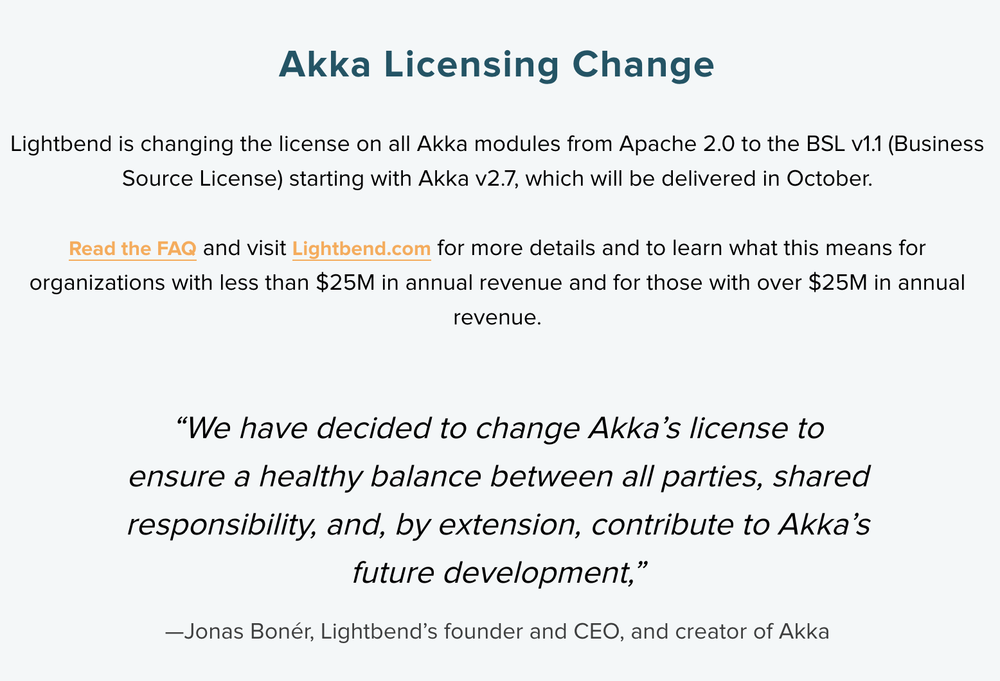

> 오픈소스로 시작한 소프트웨어 기업이 라이선스 정책을 변경하는 사례가 증가하고 있는데요, 그동안 Apache-2.0으로 오픈소스 라이선스 정책을 유지해오던 미국의 Lightbend사도 2022년 9월, Akka의 라이선스를 BUSL-1.1 (Business Source License)로 변경한다고 발표하였습니다.  
> Business Source License가 무엇인지, Lightbend가 Akka의 라이선스를 BSL로 변경한 배경과 그 영향은 무엇인지에 대해 알아보겠습니다. 

## Akka란? 

[Akka](https://github.com/akka/akka)는 JVM에서 여러 개의 thread가 동시에 작업하는 분산 애플리케이션을 [Actor Model](https://doc.akka.io/docs/akka/current/typed/guide/actors-intro.html)을 기반으로 단순화하는 툴킷으로 live chatting 등 주로 고성능이 요구되는 백엔드 플랫폼에 사용된다고 합니다. 

## 라이선스 변경

미국의 Ligntbend 사는 2022년 9월 Akka의 라이선스를 [변경](https://akka.io/)하였습니다. 

라이선스 변경의 주요 내용은 다음과 같습니다. 

- 오픈소스(Apache-2.0)이었던 Akka가 v2.7 부터 새로운 라이선스가 적용된다. 
- 새로운 라이선스는 [BUSL-1.1](https://spdx.org/licenses/BUSL-1.1.html) (Business Source License)이다. 
- 상업적 목적이 아닌 경우 무료로 사용할 수 있으나, 상업용에 대해서는 라이선스 비용을 지불해야 한다. 

Lightbend는 지난 십여 년간 Apache-2.0으로 Akka 오픈소스 프로젝트를 지원해 왔지만 이를 지속하기가 어려워졌다고 [밝혔습니다](https://www.lightbend.com/blog/why-we-are-changing-the-license-for-akka). 

> Over the years, Lightbend has steadily borne more of the support for Akka. With Akka now considered critical infrastructure for many large organizations, the Apache 2.0 model becomes increasingly risky when a small company solely carries the maintenance effort. Balancing the global demands of our corporate community while supporting these needs of a vast open source base is a tremendous weight to bear.

결국 Lightbend도 Apache-2.0 오픈소스 모델을 지속하는 것을 포기하고, BUSL-1.1이란 "Source Available" 라이선스를 도입하여 커뮤니티에는 소스 코드를 공개하지만, 기업 사용자에게는 라이선스 비용을 청구하여 수익을 창출하고자 하였습니다. 오픈소스로 소프트웨어를 개발하는 기업이 수익성을 향상하기 위해 라이선스 정책을 변경하는 사례는 2018년 이후 증가하고 있습니다. MongoDB의 SSPL이 대표적인 사례이며, Elasticsearch는 Elastic License를 도입하였습니다. 이에 대한 세부 내용은 이전 글, '[Elastic License 2.0 (부제: 진화하는 오픈소스 라이선스)](https://devocean.sk.com/opensource/techBoardDetail.do?ID=163055)'에서 확인하실 수 있습니다. Lightbend도 이러한 배경과 수익성을 고려하여 라이선스 변경을 결정하였다고 추측할 수 있습니다. 

BUSL-1.1은 Akka 이전에도 여러 오픈소스이었던 프로젝트에 적용된 바 있습니다. 
- [MariaDB](https://mariadb.com/bsl-faq-mariadb/)
- [CockroachDB](https://www.cockroachlabs.com/blog/oss-relicensing-cockroachdb/)
- [Sentry](https://blog.sentry.io/2019/11/06/relicensing-sentry/)
- [materialize](https://github.com/MaterializeInc/materialize/blob/main/LICENSE)

## Business Source License

[BUSL-1.1](https://spdx.org/licenses/BUSL-1.1.html)은 오픈소스 라이선스와 무엇이 다를까요? 

### non-production use에 한하여 사용 권리 부여

BUSL-1-1은 일반적인 오픈소스 라이선스와는 달리 `non-production use`에 한하여 복사, 수정, 재배포 등을 할 수 있는 권리를 부여합니다.

> The Licensor hereby grants you the right to copy, modify, create derivative works, redistribute, and make non-production use of the Licensed Work.

`non-production use`에 해당하지 않을 경우, Licensor에게 commercial license를 구매할 것을 요구합니다. 

> If your use of the Licensed Work does not comply with the requirements currently in effect as described in this License, you must purchase a commercial license from the Licensor, ...

따라서, BUSL-1.1이 적용된 Akka 버전 (v2.7 이후)를 사용하는 기업은 더 이상 무료로 Akka를 사용할 수 없으며, Lightbend에게 [상용 라이선스를 구매](https://www.lightbend.com/akka#pricing)해야 합니다. 

### Change Date, Change License

BUSL-1.1 또 다른 특징은 `Change Date`와 `Change License`입니다. BUSL-1.1이 적용된 버전의 소프트웨어가 릴리즈된 이후 `Change Date`가 지나면 `Change License`가 적용되며 더 이상 BUSL-1.1이 적용되지 않게 됩니다.

> Effective on the Change Date, or the fourth anniversary of the first publicly available distribution of a specific version of the Licensed Work under this License, whichever comes first, the Licensor hereby grants you rights under the terms of the Change License, and the rights granted in the paragraph above terminate.

[Akka의 BUSL-1.1](https://www.lightbend.com/akka/license)의 경우 `Change Date`는 릴리즈 후 3년이며, `Change License`는 Apache-2.0입니다.

예를 들어, Akka 2.8이 2023년 1월 1일에 릴리즈되었다면, 3년이 지난 후, 2026년 1월 1일부터는 Apache-2.0이 적용되어 기업도 무료로 사용이 가능합니다. BUSL-1.1은 이러한 `Change License` 조항을 제공하여 신규 버전을 사용하려면 돈을 내고 써야 하지만 오래된 버전은 상용 목적의 사용이라고 하더라도 무료로 사용할 수 있게 하였습니다. 이는 소프트웨어의 Heavy user인 대기업에는 비용을 청구하겠다는 의지로 보입니다. 

### Additional Use Grant

BUSL-1.1은 Licensor가 일정 조건 하에 상용 목적의 사용자에게 권리를 부여할 수 있도록 하는 `Additioanl Use Grant` 조항을 갖고 있습니다. 

> The Licensor may make an Additional Use Grant, above, permitting limited production use.

따라서, Licensor는 필요에 따라 사용자의 상용 목적의 소프트웨어 사용을 허락할 수 있습니다. 예를 들어, Lightbend는 [Play Framework](https://www.playframework.com/)를 사용하여 application을 개발하는 과정에서 akka가 활용되는 경우는 akka를 사용할 수 있다고 [허용하였습니다](https://www.lightbend.com/akka/license). 

> Additional Use Grant:	If you develop an application using a version of Play Framework that utilizes binary versions of akka-streams and its dependencies, you may use such binary versions of akka-streams and its dependencies in the development of your application only as they are incorporated into Play Framework and solely to implement the functionality provided by Play Framework; provided that, they are only used in the following way: Connecting to a Play Framework websocket and/or Play Framework request/response bodies for server and play-ws client.

## Akka의 라이선스 FAQ

Lightbend는 Akka의 라이선스 변경과 관련한 [FAQ를 제공](https://www.lightbend.com/akka/license-faq)하고 있는데요, 여기서는 몇 가지 주요한 내용만 소개하겠습니다. 

### 스타트업 규모의 회사에는 무료로 제공

먼저 [Akka의 가격표](https://www.lightbend.com/akka#pricing)를 보면 연간 매출이 2,500만 달러 미만의 스타트업 회사에는 무료로 제공됩니다. 

### 이전 버전의 Akka는 계속 사용할 수 있나? 

이전 버전의 라이선스는 변경 없이 Apache-2.0입니다. 그러나 추가적인 기능, 개선 사항, non-critical security updates, non-critical bug fix는 제공되지는 않습니다. 2.6.x 버전의 경우, 향후 1년간, 즉 2023년 9월까지만 Apache-2.0으로 critical security updates와 critical bug fix만 제공됩니다. 

### Production을 위해 사용하기도 하고, 개발, 테스트 나 Staging으로사용하기도 합니다. 어떤 경우에 상용 라이선스가 필요한가요? 

Production을 위해 사용하는 소프트웨어 사본에 대한 상용 라이선스만 있으면 됩니다. 

### 수익과 관련 없는 정부 부처에서 일하는데, 상용 라이선스 구매가 필요한가요? 

`non-production use`가 아닌 production에 Akka를 사용한다면 정부 부처에서도 상용 라이선스 구매가 요구됩니다. 

> Government departments using Akka in production will require a commercial license.

### BUSL-1.1이 적용된 소프트웨어의 일부를 Apache-2.0이 적용된 older version에 backport해도 되나요? 

아니요, 이는 Lightbend의 저작권을 침해하는 것뿐만 아니라 Apache-2.0을 위반하는 것입니다. 

> No. In this circumstance, you would either violate Lightbend’s copyright by re-releasing the code under Open Source, or you would violate the earlier Akka version’s Apache license by introducing incompatible BSL code (i.e., code subject to a use limitation not allowed by the Open Source Apache 2.0 license).

## 마치며

기업의 오픈소스 거버넌스 역할은 갈수록 중요해지고 있습니다. 오픈소스를 제품에 사용하면서 오픈소스 라이선스의 의무를 준수하여 오픈소스 고지, 소스 코드 공개 등의 활동은 기업이 지켜야 할 기본적인 컴플라이언스 활동입니다. 그런데 얼마 전부터는 오픈소스 라이선스 의무 준수뿐만 아니라 오픈소스이었던 소프트웨어가 BUSL-1.1과 같이 상용 구매를 요구하는 라이선스로 변경되는 사례가 증가하고 있습니다. 따라서, 오픈소스를 사용하여 제품/서비스를 개발하는 기업은 이러한 라이선스 변경 소프트웨어에 대한 빠른 대처가 필요합니다. 그렇지 않을 경우, 라이선스 위반으로 큰 손실이 발생 될 수 있음을 기억해야 합니다. 

특히 기업은 SBOM(Software Bill of Materials) 관리 체계를 구축하여, 이번 Akka와 같이 라이선스 변경 사례를 확인하였을 경우, 기업 내 어느 제품/서비스 혹은 내부 시스템에 Akka가 사용되고 있는지, 그 버전은 무엇인지를 바로 확인하고, 필요한 조치 (older version 사용, 혹은 사용 라이선스 구매)를 취할 수 있어야 하겠습니다. 

감사합니다. 