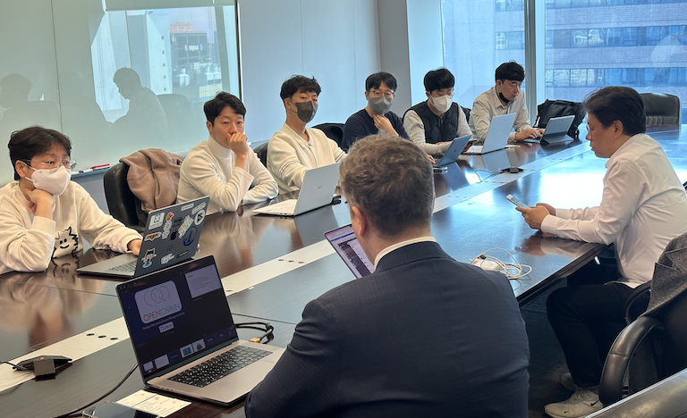
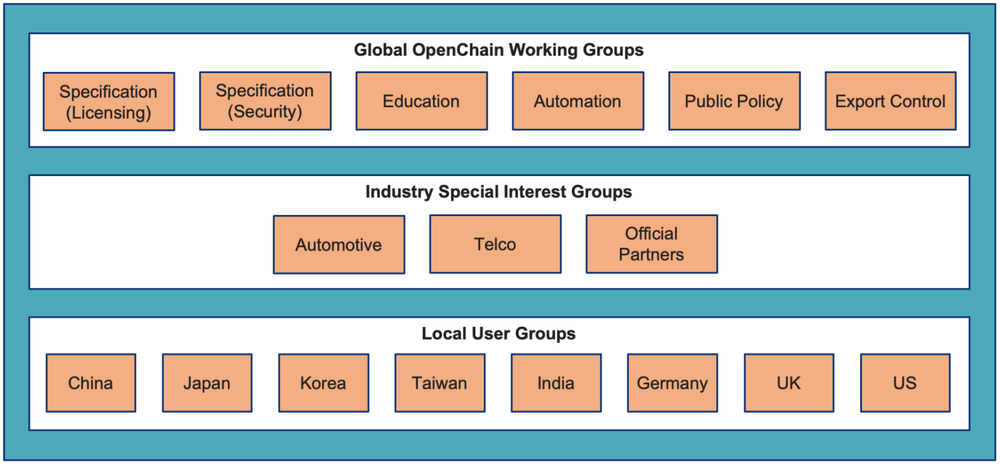
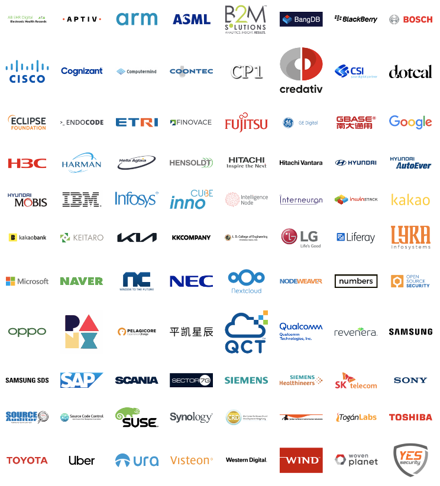
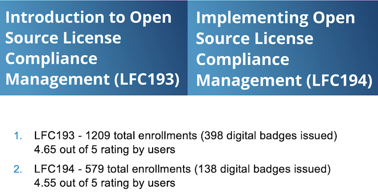
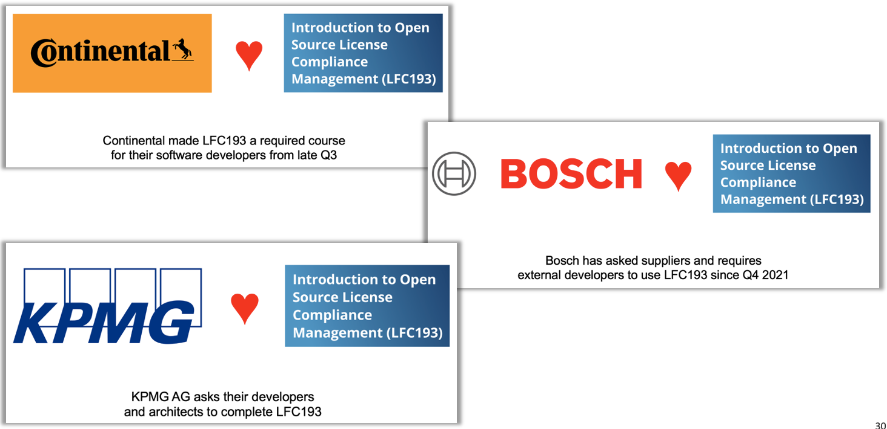
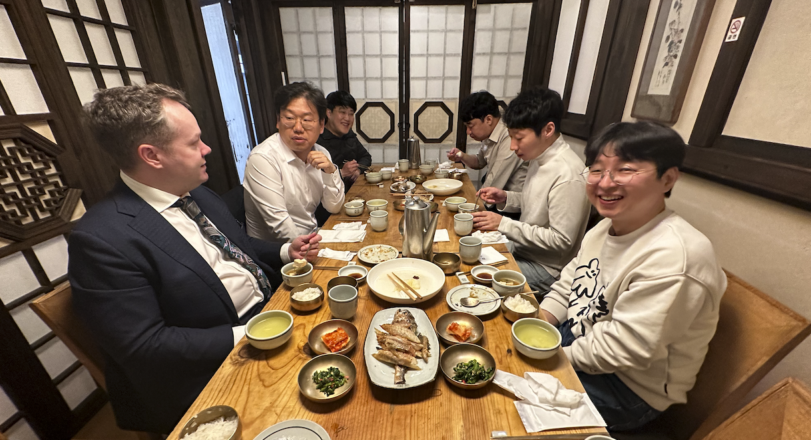

기업이 개발하는 제품 소프트웨어의 93% 이상이 오픈소스를 사용한다고 할 정도로 현대 소프트웨어 개발에 오픈소스를 사용하는 건 거의 필수적입니다. 그런데, 사용하는 오픈소스의 53%는 라이선스 컴플라이언스 이슈가 있고, 81%는 보안 취약점을 갖고 있다는 [보고가 있습니다](https://www.synopsys.com/blogs/software-security/open-source-trends-ossra-report/). 복잡한 현대 소프트웨어의 개발환경과 방대한 Software Supply Chain을 고려한다면, 기업이 오픈소스로 제품을 개발하면서 라이선스 컴플라이언스와 보안 취약점 리스크 최소화를 위한 오픈소스 관리 노력이 필요한데요, [Linux Foundation](https://www.linuxfoundation.org/)의 [OpenChain Project](openchainproject.org)는 이러한 노력을 커뮤니티 차원에서 여러 기업이 공유와 협업으로 함께 하기 위한 Project입니다. 

2023년 3월 27일, OpenChain Project의 General Manager인 [Shane Coughlan](https://github.com/shanecoughlan)이 SK텔레콤을 방문하여 OpenChain Project의 주요 활동, 오픈소스 관련 국제 표준 및 글로벌 동향에 관해 설명하는 시간을 가졌습니다. 

이 자리에는 SK텔레콤 [OSRB](https://sktelecom.github.io/about/osrb/)와 SK그룹 오픈소스 협의체 멤버(SK플래닛, SK쉴더스, SK(주), Supex추구협의회 등)가 참여하여 다양한 의견을 나누었는데요, 

이날 Shane은 OpenChain Project에 대해 소개하고, 어떻게 글로벌 협력을 통해 Software Supply Chain에서의 오픈소스 관리 이슈를 공동으로 해결해 가는지 설명하였습니다. 이 글에서는 주요 내용을 소개하려고 합니다. 

## OpenChain Project Global Community

Software Supply Chain 이슈 관리를 위해 OpenChain Project를 통해 여러 글로벌 기업이 협력하고 있습니다. : [https://www.openchainproject.org/community](https://www.openchainproject.org/community)

### Platinum Members

### Community Structure

OpenChain Project에는 [다수의 Work Group](https://www.openchainproject.org/participate)이 있으며, 각 Work Group에서는 오픈소스 관리를 위한 표준을 만들고 자동화 도구를 함께 개발하고 있습니다. 또한 국가별로 Work Group이 결성되어 있습니다. 

## OpenChain Standard

### ISO/IEC 5230:2020, ISO/IEC DIS 18974

가장 가시적인 결과는 오픈소스 관리를 위한 최초의 국제 표준을 개발한 것입니다. 2020년 12월, [ISO/IEC 5230](https://www.iso.org/standard/81039.html)이 오픈소스 컴플라이언스를 위한 유일한 국제 표준으로 등록되었습니다. [ISO/IEC DIS 18974](https://www.iso.org/standard/86450.html)는 오픈소스 보안 보증 컴플라이언스를 위한 사실상의 표준이며, 2023년 하반기에 ISO 표준으로 공식 등록될 예정입니다. 

이들 표준은 기업이 오픈소스를 관리하는데 꼭 필요한 핵심 요구사항을 정의하고 있습니다. 기업은 이 표준의 요구사항을 준수함으로 Software Supply Chain 내에서 오픈소스 관리가 이뤄지고 있음을 투명하게 나타낼 수 있습니다. 

### Self-Certification

OpenChain Project에서는 [Self-Certification](https://github.com/OpenChain-Project/Reference-Material/tree/master/Self-Certification)을 위한 Checklist도 제공하는데요. 기업은 Checklist 항목을 하나하나 준수해 가면서 기업의 오픈소스 관리 수준을 높일 수 있습니다. 

### Adoption of OpenChain ISO/IEC 5230:2020

Checklist의 모든 항목을 준수하는 기업이라면, ISO/IEC 5230 준수 기업으로 선언할 수 있게 됩니다. ISO/IEC 5230을 채택하였다고 선언한 기업 리스트는 다음과 같습니다. LG전자, 카카오, 삼성전자, 네이버, SK텔레콤, NCSOFT, 현대자동차그룹 등 여러 국내 기업도 볼 수 있습니다. 

## Other Interesting Items

### Online Webinar

OpenChain Project에서는 오픈소스 관리에 대한 [온라인 웨비나](https://www.openchainproject.org/webinars)를 계속하고 있습니다. 

### Training Courses

오픈소스 라이선스 컴플라이언스를 위한 [Free Training Course](https://www.openchainproject.org/resources)가 제공되고 있으며, 이수 시 Badge도 취득할 수 있습니다. 

이러한 Training Course는 여러 기업이 소속 직원 혹은 Supplier에게 이수를 요구하는 등 다양하게 활용되기도 합니다. 

## Update on China and Japan

### China

중국에서도 OpenChain Project와의 협력이 활발히 일어나고 있습니다. 특히 [CAICT](http://www.caict.ac.cn/english/)와 [CESI](https://www.cc.cesi.cn/english.aspx)와 같은 중국 정부 기관과도 협력 방안을 논의하고 있습니다. 

OpenChain China Work Group에는 Huawie, Honor 및 OPPO와 같은 기업도 활발히 참여하고 있으며, 약 250명의 멤버로 구성되어 있습니다. 

2023년 2분기부터 매 분기 OpenChain과 CAICT가 공동 주관하는 이벤트가 예정되어 있으며, [OIN](https://openinventionnetwork.com/)과 함께하는 Asian Legal Network (ALN)도 다시 시작하기로 하였다고 합니다. 

### Japan

[OpenChain Japan Work Group](https://openchain-project.github.io/OpenChain-JWG/)은 약 190명의 멤버가 참여하고 있습니다. Fujitsu, Hitachi, NEC, Panasonic, Sony, Toshiba 및 Toyota가 지속적으로 지원하고 있으며, 격월로 커뮤니티 이벤트가 개최됩니다. 

[TODO Group](https://todogroup.org/)과 협력하여 2주마다 OSPO 이벤트도 개최하고 있습니다. 

## Korea market - challenge and opportunities

### Current situation

[OpenChain Korea Work Group](https://openchain-project.github.io/OpenChain-KWG/)은 규모나 열정 측면에서 일본에 이어 세계에서 두 번째로 영향력 있는 훌륭한 Work Group입니다. SK텔레콤, LG전자, 삼성전자, 현대자동차 등 주요 기업이 참여하고 있으며, NIPA에서도 후원 등의 방식으로 참여하고 있습니다. 

그러나 글로벌 경기 침체에서 한국도 자유롭지 못하다는 위기는 있습니다. 또한, [OpenChain Board](https://www.openchainproject.org/community)에 한국 기업 멤버가 없다는 점도 아쉽습니다. 

### Opportunities

OpenChain Korea Work Group이 지금처럼 커뮤니티 미팅과 활동을 지속한다면 기회는 계속될 것입니다. 가능하다면, 일본과 중국처럼 정부의 오픈소스 정책에 OpenChain 표준을 포함시키기 위해 노력하고 이를 위해 정부 기관의 참여를 촉진하면 좋을 것입니다. 

끝으로, OpenChain Board에 한국 기업이 참여한다면, OpenChain Project의 전략적 다양성이 증대되고, 글로벌 Supply Chain에서의 영향력을 키울 수 있을 것입니다. 

## 글을 마치며

OpenChain Project는 기업의 오픈소스 관리 영역도 오픈소스의 공유와 협업 방식을 적용하여 모두 함께 적은 비용과 리소스로 높은 수준의 리스크 관리 practice를 달성하기 위한 커뮤니티입니다. 이러한 취지에 공감하는 기업들이 모여 있는 곳이 [OpenChain Korea Work Group](https://openchain-project.github.io/OpenChain-KWG/)입니다. OpenChain Korea Work Group에는 100명에 가까운 기업의 오픈소스 담당자들이 메일링리스트에 가입하여 활동하고 있습니다. 마침 코로나 이후 3년만에 오프라인 모임이 3월 28일에 있었습니다. 다음 글에서 이에 대해 자세히 다루겠습니다. 

Shane과의 미팅 세션 이후에는 SK텔레콤 Tech HR팀의 후원으로 맛있는 점심을 즐겼습니다. ([상기](https://kr.linkedin.com/in/ksangki)님 감사합니다~ ^^ )

감사합니다.