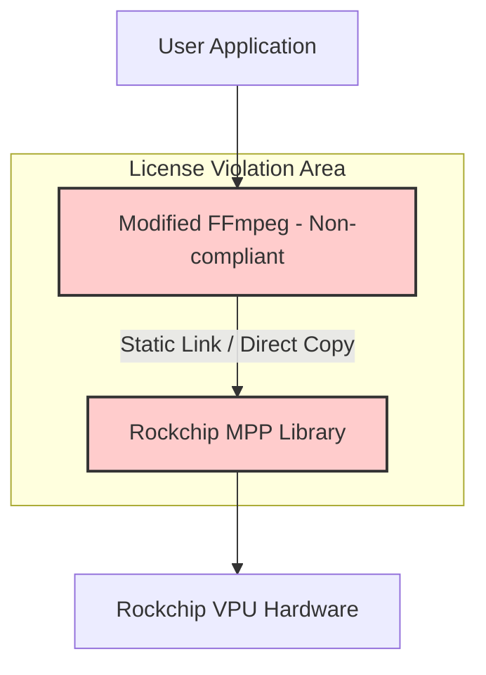
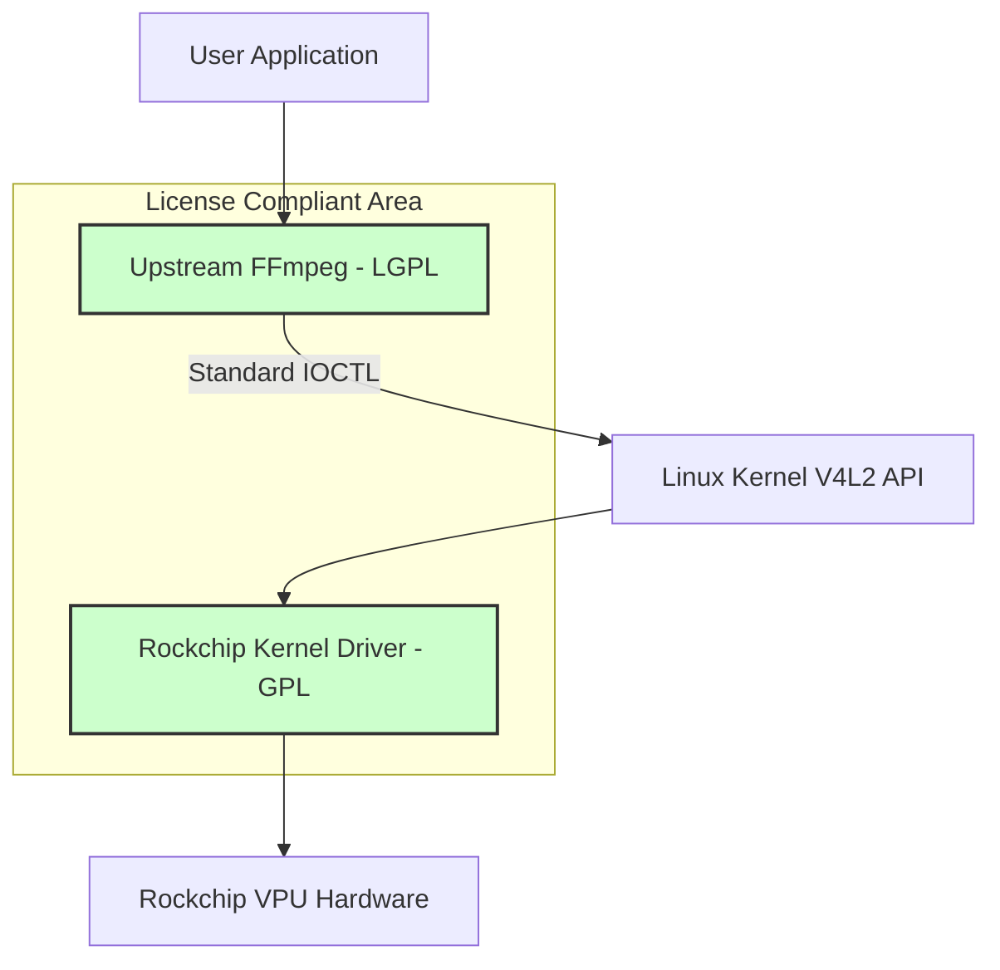

안녕하세요.

최근 임베디드 리눅스 업계에서 화제가 된 Rockchip과 FFmpeg의 라이선스 분쟁(2025-2026) 사례를 정리해 보았습니다. 이 사례는 단순히 한 기업의 실수가 아니라, 하드웨어 벤더(SoC Vendor)가 제공하는 SDK/BSP를 그대로 사용할 때 발생할 수 있는 공급망 리스크를 보여줍니다. [hackaday](https://hackaday.com/2026/01/05/github-disables-rockchips-linux-mpp-repository-after-dmca-request/)

## 1. 사건 개요: 2025년 GitHub 리포지토리 강제 중단

2025년 12월, 중국의 대표적인 반도체 기업 Rockchip의 GitHub 리포지토리 중 하나인 `rockchip-linux/mpp` (Media Process Platform)가 GitHub에 의해 비활성화(disabled)되는 사건이 발생했습니다. 이는 FFmpeg 개발자가 제출한 DMCA(Digital Millennium Copyright Act) Takedown 요청에 따른 조치였습니다. [github](https://github.com/github/dmca/blob/master/2025/12/2025-12-18-ffmpeg.md)

| 구분 | 내용 |
| :--- | :--- |
| 발생 시기 | 2025년 12월 18일(DMCA 공지 게시) → 2025년 12월 26일(GitHub 리포지토리 비활성화) |
| 대상 프로젝트 | Rockchip Linux MPP (Media Process Platform) |
| 문제 제기자 | FFmpeg 개발자 및 FFmpeg 커뮤니티 |
| 핵심 위반 사항 | LGPL 코드 무단 도용 및 라이선스 세탁 (LGPL 2.1 → Apache-2.0) |

### 무엇이 문제였나?

Rockchip은 자사 칩셋(RK3588 등)의 하드웨어 영상 가속을 위해 `mpp`라는 미들웨어 라이브러리를 제공해 왔습니다. 문제는 이 라이브러리의 소스 코드 중 상당 부분이 FFmpeg의 `libavcodec` (특히 H.265, AV1, VP9 디코더 관련 코드)을 그대로 복사해 온 것으로 FFmpeg 측에서 주장했다는 점입니다. [byteiota](https://byteiota.com/ffmpeg-files-dmca-against-rockchip-2-year-gpl-standoff/)

단순 복사가 문제가 된 것이 아니라, 다음 세 가지 행위가 결합되어 치명적인 컴플라이언스 위반이 되었습니다. [techprovidence](https://www.techprovidence.com/github-disables-rockchip-linux-mpp-dmca-ffmpeg/)

1. 저작권 고지 삭제: 원본 코드(FFmpeg)에 있던 저작권자·저작권 표시를 제거함. [techprovidence](https://www.techprovidence.com/github-disables-rockchip-linux-mpp-dmca-ffmpeg/)
2. 저작자 허위 주장: Rockchip이 해당 코드의 저작자인 것처럼 코멘트·헤더를 변경함. [byteiota](https://byteiota.com/ffmpeg-files-dmca-against-rockchip-2-year-gpl-standoff/)
3. 라이선스 변경: 원래 LGPL 2.1인 코드를 Apache 2.0 라이선스로 재배포함. [linuxiac](https://linuxiac.com/github-takes-down-rockchip-mpp-repository-after-ffmpeg-copyright-claim/)

FFmpeg 커뮤니티는 2024년 2월부터 “FFmpeg 코드를 그대로 복사해 사용하고 있다”는 문제를 공식적으로 제기했지만, Rockchip은 의미 있는 수정 없이 사실상 대응을 미루었고, 결국 법적 수단인 DMCA Takedown으로 이어졌습니다. [it.slashdot](https://it.slashdot.org/story/25/12/26/193244/ffmpeg-developer-files-dmca-against-rockchip-after-two-year-wait-for-license-fix)

> DMCA Takedown의 특성상, 실제 침해 여부가 법원에서 확정되기 전이라도, 호스팅 플랫폼(GitHub)은 일단 콘텐츠를 차단해야 합니다. Rockchip MPP 리포지토리는 현재도 비활성화 상태로 남아 있습니다. [hackaday](https://hackaday.com/2026/01/05/github-disables-rockchips-linux-mpp-repository-after-dmca-request/)

## 2. 왜 ‘라이선스 세탁’이 위험한가?

많은 기업 담당자들이 “Apache 2.0으로 공개된 코드는 안전하다”고 생각하기 쉽습니다. 하지만 이번 사례는 저작권 출처가 불투명한 Apache 2.0 코드가 오히려 큰 법적 리스크가 될 수 있음을 보여줍니다. [byteiota](https://byteiota.com/ffmpeg-files-dmca-against-rockchip-2-year-gpl-standoff/)

### Rockchip의 잘못된 접근 방식

Rockchip은 자사의 VPU를 구동하기 위해 FFmpeg의 고도로 최적화된 어셈블리/C 코드를 가져와 자신의 미들웨어(`mpp`)에 통합했습니다. 이 과정에서 FFmpeg 소스 일부를 사실상 직접 포함(복사-붙여넣기)하면서도, 마치 Rockchip이 작성한 코드인 것처럼 재라이선싱한 것이 핵심 문제였습니다. [techprovidence](https://www.techprovidence.com/github-disables-rockchip-linux-mpp-dmca-ffmpeg/)

여기서 핵심은 “LGPL 코드를 어디까지 어떻게 썼는가”입니다.

- LGPL 코드를 가져와 수정한 경우, 해당 수정·파생 코드(파생 저작물)는 LGPL(또는 양립 가능한 GPL 계열 라이선스)에 따라 배포해야 합니다. [linux-sunxi](https://linux-sunxi.org/GPL_Violations)
- 또한 원저작자의 저작권 고지와 라이선스를 삭제하거나, 자신 명의로 바꾸어서는 안 됩니다. [linux-sunxi](https://linux-sunxi.org/GPL_Violations)

Rockchip은 이 기본 원칙을 무시하고, FFmpeg 기반 코드를 독점적이거나 더 느슨한 라이선스(Apache-2.0)로 바꾼 뒤 배포하려 했다는 점에서 비판을 받았습니다. [linuxiac](https://linuxiac.com/github-takes-down-rockchip-mpp-repository-after-ffmpeg-copyright-claim/)

### 올바른 접근 방식: V4L2 표준 준수

리눅스 커널은 이러한 하드웨어 가속을 위해 V4L2 (Video for Linux 2)라는 표준 인터페이스를 제공합니다. 이상적인 구조는 애플리케이션과 FFmpeg는 사용자 공간에 그대로 두고, 하드웨어 의존 코드는 커널 드라이버(V4L2)로 밀어 넣는 것입니다. [mankier](https://www.mankier.com/1/v4l2-compliance)

- 이 구조에서는 FFmpeg를 “그대로”(Upstream 그대로 또는 최소 수정) 사용하고, 하드웨어 가속은 커널의 표준 인터페이스(V4L2 M2M 등)를 통해 호출합니다. [github](https://github.com/Joshua-Riek/ubuntu-rockchip/issues/246)
- FFmpeg와 커널 드라이버가 명확한 User/Kernel 경계로 분리되므로, FFmpeg 코드 자체를 벤더가 뜯어고쳐 배포할 필요가 줄어들고 라이선스 리스크도 크게 감소합니다. [man.archlinux](https://man.archlinux.org/man/extra/v4l-utils/v4l2-compliance.1.en)

현재 커뮤니티와 일부 업체는 Rockchip의 기존 `mpp` 사용자 공간 스택을 걷어내고, 메인라인 리눅스 커널의 V4L2 드라이버를 기반으로 한 “더 투명한” 미디어 스택으로 전환하려는 움직임을 보이고 있습니다. [collabora](https://www.collabora.com/news-and-blog/blog/2024/02/21/almost-a-fully-open-source-boot-chain-for-rockchips-rk3588/)

## 3. 과거 사례와의 비교: Allwinner CedarX (2015)

이번 사건은 10년 전 Allwinner 사태와도 매우 유사합니다. 역사적으로 여러 임베디드 칩 벤더들이 멀티미디어 코덱 라이선스 문제에서 반복해서 같은 실수를 저질러 왔습니다. [cnx-software](https://www.cnx-software.com/2015/02/26/allwinners-new-media-codec-library-cedarx-may-infringe-on-open-source-licenses-and-copyrtights/)

| 비교 항목 | Allwinner (CedarX, 2015) | Rockchip (MPP, 2025-2026) |
| :--- | :--- | :--- |
| 문제 라이브러리 | CedarX (바이너리 블롭 형태, 사용자 공간 라이브러리) | MPP (소스코드 공개 형태, GitHub에서 배포) |
| 위반 내용 | 커널 트리에 바이너리 블롭 포함으로 GPL 위반, 사용자 공간 CedarX 라이브러리에 FFmpeg `libavcodec` 일부를 무단 포함, LGPL 의무 불이행 | FFmpeg `libavcodec` 코드를 직접 복사, 저작권 고지 제거, Rockchip 명의로 변경, LGPL 코드를 Apache-2.0으로 재라이선싱 |
| 커뮤니티 대응 | 리버스 엔지니어링을 통한 오픈소스 드라이버(Cedrus) 개발, 커널 쪽 GPL 위반 지적 및 정리 요구 | DMCA Takedown, Rockchip MPP 리포지토리 비활성화, V4L2 기반 오픈 드라이버 개발 가속화 |
| 교훈 | 바이너리 블롭·비공개 배포는 GPL·LGPL 위반을 감추기 쉽지만, 결국 커뮤니티에 의해 드러나고 대체 구현이 등장함 | 소스 공개라도 ‘라이선스 세탁’(출처 은폐, 재라이선싱)은 명백한 위반이며, 오히려 증거가 남기 때문에 더 빠르게 문제화될 수 있음 |

Allwinner 사례에서도 CedarX 라이브러리 내부에 FFmpeg `libavcodec`의 코드가 섞여 있는 것이 확인되었고, LGPL 의무에 따라 전체 라이브러리 소스를 공개해야 한다는 지적이 있었습니다. Rockchip MPP는 “바이너리 블롭”이 아닌 “공개 소스” 형태였다는 점에서 겉보기에는 더 좋아 보였지만, 공개된 코드 안에서 그대로 드러난 위반이라는 점에서 오히려 더 명확하게 문제가 된 셈입니다. [securityonline](https://securityonline.info/open-source-standoff-github-freezes-rockchips-code-after-two-year-ffmpeg-license-battle/)

## 4. 기업 담당자를 위한 Action Item

여러분이 사용하는 SoC 벤더의 SDK나 BSP가 이와 같은 문제를 안고 있을 수 있습니다. 다음 세 가지 항목을 반드시 점검해 보시기 바랍니다. [linuxnews](https://linuxnews.de/ffmpeg-reicht-dmca-takedown-gegen-rockchip-ein/)

### 1) 공급망(Supply Chain) 라이선스 감사

- 벤더가 제공한 “오픈소스” 라이브러리(특히 멀티미디어, 그래픽, AI 가속 관련)가 실제 원저작자의 라이선스를 그대로 유지하고 있는지 확인해야 합니다. [linux-sunxi](https://linux-sunxi.org/GPL_Violations)
- 벤더가 Apache 2.0, MIT 등 “안전해 보이는” 라이선스를 주장하더라도, 내부 코드가 FFmpeg이나 다른 GPL/LGPL 프로젝트에서 복사된 것이라면, 여러분의 제품 전체가 법적 위험에 노출될 수 있습니다. [byteiota](https://byteiota.com/ffmpeg-files-dmca-against-rockchip-2-year-gpl-standoff/)

### 2) ‘Upstream First’ 정책 확인

- 벤더가 제공하는 드라이버가 리눅스 메인라인 커널(Upstream)에 병합되어 있는지 확인하십시오. 최소한, 메인라인에 병합을 목표로 개발되고 있는지 여부는 확인할 수 있습니다. [collabora](https://www.collabora.com/news-and-blog/news-and-events/rockchip-rk3588-upstream-support-progress-future-plans.html)
- 메인라인에 병합된 코드는 전 세계 개발자들에 의해 코드 리뷰와 라이선스 검토를 거친 것이므로, 벤더가 자체적으로 운영하는 GitHub 리포지토리보다 상대적으로 신뢰도가 높습니다. [collabora](https://www.collabora.com/news-and-blog/news-and-events/rockchip-rk3588-upstream-support-progress-future-plans.html)

### 3) 내부 개발팀 가이드: “복사 붙여넣기” 금지

- 사내 개발자가 외부 오픈소스 코드를 가져올 때, 파일 상단의 저작권 헤더를 삭제하거나, 회사 명의로 바꿔서 커밋하는 행위는 절대 허용해서는 안 됩니다. 이는 고의적인 저작권 침해로 간주될 수 있으며, 이후 분쟁에서 치명적인 증거가 됩니다. [linux-sunxi](https://linux-sunxi.org/GPL_Violations)
- 코드 통합이 필요한 경우, 가능한 한 링크 방식(라이브러리 의존)으로 사용하고, 원저작자의 라이선스와 저작권 표시는 유지한 채로 사용하는 패턴을 표준으로 삼을 필요가 있습니다. [cnx-software](https://www.cnx-software.com/2015/02/26/allwinners-new-media-codec-library-cedarx-may-infringe-on-open-source-licenses-and-copyrtights/)

## 요약

Rockchip 사례는 “소스 코드를 공개하는 것”과 “오픈소스 라이선스를 준수하는 것”이 전혀 다른 문제임을 명확히 보여줍니다. LGPL 코드는 저작권자 동의 없이 Apache 2.0 등 다른 라이선스로 재라이선싱할 수 없으며, 저작권 고지 삭제와 저작자 위조는 그 자체로 심각한 침해 행위가 됩니다. [hackaday](https://hackaday.com/2026/01/05/github-disables-rockchips-linux-mpp-repository-after-dmca-request/)

SoC 벤더가 제공하는 소프트웨어를 그대로 신뢰하기보다는, 내부적으로 소스 코드 분석 도구를 활용해 벤더 제공 코드 안에 어떤 라이선스와 저작권 고지가 포함되어 있는지를 주기적으로 스캔하고, 결과를 바탕으로 벤더와 책임 범위를 명확히 하는 프로세스를 구축하는 것이 필요합니다. [securityonline](https://securityonline.info/open-source-standoff-github-freezes-rockchips-code-after-two-year-ffmpeg-license-battle/)