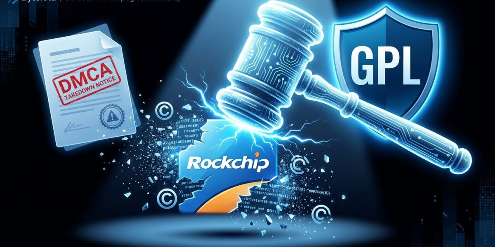
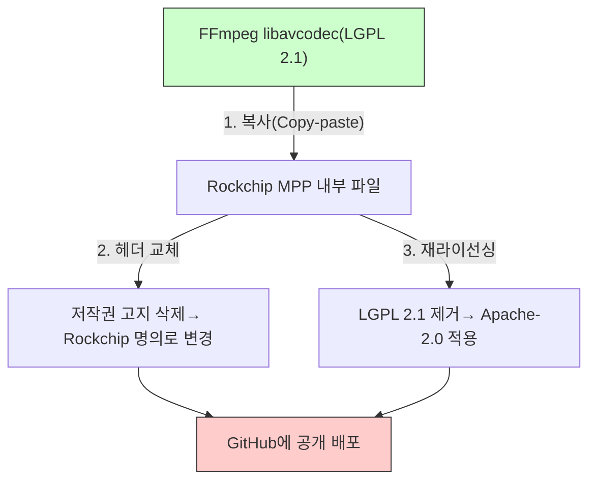
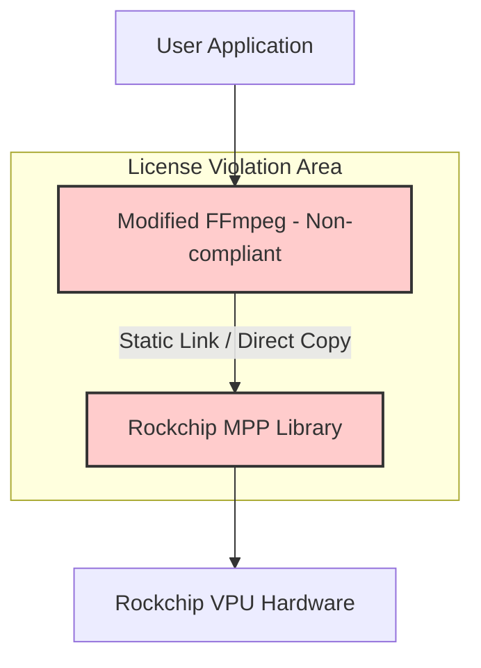
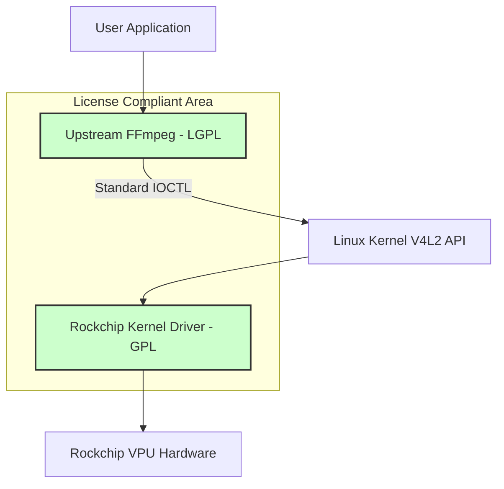

안녕하세요.

최근 임베디드 리눅스 업계에서 화제가 된 Rockchip과 FFmpeg의 라이선스 분쟁(2025-2026) 사례를 
정리해 보았습니다. 이 사례는 단순히 한 기업의 실수가 아니라, 하드웨어 벤더(SoC Vendor)가 
제공하는 SDK/BSP를 그대로 사용할 때 발생할 수 있는 공급망 리스크를 보여줍니다.



## 1. 사건 개요: 2025년 GitHub 리포지토리 강제 중단

2025년 12월, 중국의 대표적인 반도체 기업 Rockchip의 GitHub 리포지토리 중 하나인 
`rockchip-linux/mpp` (Media Process Platform)가 GitHub에 의해 비활성화(disabled)되는 
사건이 발생했습니다. 이는 FFmpeg 개발자가 제출한 DMCA(Digital Millennium Copyright Act) 
Takedown 요청에 따른 조치였습니다.

| 구분 | 내용 |
| :--- | :--- |
| 발생 시기 | 2025년 12월 18일(DMCA 공지 게시) → 2025년 12월 26일(GitHub 리포지토리 비활성화) |
| 대상 프로젝트 | Rockchip Linux MPP (Media Process Platform) |
| 문제 제기자 | FFmpeg 개발자 및 커뮤니티 |
| 핵심 위반 사항 | LGPL 코드 무단 도용 및 라이선스 세탁 (LGPL 2.1 → Apache-2.0) |

### 무엇이 문제였나?

Rockchip은 자사 칩셋(RK3588 등)의 하드웨어 영상 가속을 위해 `mpp`라는 미들웨어 
라이브러리를 제공해 왔습니다. 문제는 이 라이브러리의 소스 코드 중 상당 부분이 FFmpeg의 
`libavcodec` (특히 H.265, AV1, VP9 디코더 관련 코드 수천 줄)을 그대로 복사한 것으로 
FFmpeg 측은 주장했습니다.

단순 복사가 문제가 된 것이 아니라, 다음 세 가지 행위가 결합되어 치명적인 컴플라이언스 
위반이 되었습니다.

1. 저작권 고지 삭제: 원본 코드(FFmpeg)에 있던 저작권자·저작권 표시를 제거함.
2. 저작자 허위 주장: Rockchip이 해당 코드의 저작자인 것처럼 코멘트·헤더를 변경함.
3. 라이선스 변경: 원래 LGPL 2.1인 코드를 Apache 2.0 라이선스로 재배포함.

FFmpeg 커뮤니티는 2024년 2월 23일 GitHub Issue #530을 통해 이 문제를 공개적으로 제기하며 
측면-by-측면(Side-by-Side) 코드 비교 증거까지 첨부했습니다. 그러나 Rockchip은 22개월간 
사실상 묵묵부답이었고, 결국 법적 수단인 DMCA Takedown으로 이어졌습니다.

> **참고: DMCA Takedown이란?**  
> DMCA Takedown의 특성상, 실제 침해 여부가 법원에서 확정되기 전이라도, 호스팅 
> 플랫폼(GitHub)은 요청 접수 후 24~72시간 내에 콘텐츠를 차단해야 합니다. Rockchip MPP 
> 리포지토리는 현재도 비활성화 상태로 남아 있습니다.


## 2. 코드 레벨 침해 분석: 무엇이 복사되었나?

### 침해 대상 파일 목록

DMCA 공지(2025-12-18)에는 침해된 파일이 명시되어 있습니다. 아래는 보고된 주요 침해 
파일과 FFmpeg 원본 파일의 대응 관계입니다.

| 코덱 | Rockchip MPP 침해 파일 | 원본 FFmpeg 파일 |
|:---|:---|:---|
| **AV1** | `mpp/codec/dec/av1/av1d_codec.h` | `libavcodec/av1dec.h` |
| **AV1** | `mpp/codec/dec/av1/av1d_cbs.c` | `libavcodec/cbs_av1.c` |
| **AV1** | `mpp/codec/dec/av1/av1d_cbs.h` | `libavcodec/cbs_av1.h` |
| **AV1** | `mpp/codec/dec/av1/av1d_parser2_syntax.c` | `libavcodec/av1_parse.c` |
| **H.265** | `mpp/codec/dec/h265/h265d_codec.h` | `libavcodec/hevcdec.h` |
| **H.265** | `mpp/codec/dec/h265/h265d_parser.c` | `libavcodec/hevc_parser.c` |
| **H.265** | `mpp/codec/dec/h265/h265d_ps.c` | `libavcodec/hevc_ps.c` |
| **VP9** | `mpp/codec/dec/vp9/vp9d_codec.h` | `libavcodec/vp9.h` |
| **VP9** | `mpp/codec/dec/vp9/vp9d_parser.c` | `libavcodec/vp9_parser.c` |
| **VP9** | `mpp/codec/dec/vp9/vp9data.h` | `libavcodec/vp9data.h` |
| **VP9** | `mpp/codec/dec/vp9/vpx_rac.c` | `libavcodec/vpx_rac.c` |
| **VP9** | `mpp/codec/dec/vp9/vpx_rac.h` | `libavcodec/vpx_rac.h` |

### 침해 패턴 1: 저작권 헤더 교체

가장 직접적인 증거는 파일 상단의 저작권 헤더(Copyright Header)입니다.  
FFmpeg의 원본 헤더를 삭제하고 Rockchip 명의로 교체하는 방식으로 이루어졌습니다.

**FFmpeg 원본 (`libavcodec/vpx_rac.h`):**

```c
/*
 * Copyright (C) 2006  Aurelien Jacobs <aurel@gnuage.org>
 *
 * This file is part of FFmpeg.
 *
 * FFmpeg is free software; you can redistribute it and/or
 * modify it under the terms of the GNU Lesser General Public
 * License as published by the Free Software Foundation; either
 * version 2.1 of the License, or (at your option) any later version.
 */
```

**Rockchip MPP (`mpp/codec/dec/vp9/vpx_rac.h`) — 교체 후:**

```c
/*
 * Copyright 2022 Rockchip Electronics Co. LTD
 *
 * Licensed under the Apache License, Version 2.0 (the "License");
 * you may not use this file except in compliance with the License.
 * You may obtain a copy of the License at
 *
 *      http://www.apache.org/licenses/LICENSE-2.0
 */
```

저작권자 이름(`Aurelien Jacobs`), LGPL 2.1 조항, FFmpeg 언급이 사라지고 
Rockchip 명의의 Apache-2.0 헤더로 대체되었습니다.

### 침해 패턴 2: 코드 내부에 남겨진 FFmpeg 흔적

헤더만 바꾸었을 뿐, 코드 내부 로직에는 FFmpeg 함수명이 주석이나 참조 형태로 그대로 
남아 있었습니다. DMCA 공지는 이 점을 다음과 같이 명시합니다.

> *"the code's origin is evident from identical structures, comments, and even 
> commented-out calls referencing FFmpeg functions by their original names."*

```c
// Rockchip MPP 코드 내부에서 발견된 FFmpeg 흔적 패턴 (보고된 내용 기반)

// ff_hevc_decode_nal_vps 와 동일 구조 참조
static int h265d_decode_nal_vps(H265dContext *s, ...) {
    // ff_get_buffer 대신 mpp_buffer_get 사용
    // av_log → mpp_log 로 교체
    ...
}
```

- `ff_`로 시작하는 FFmpeg 고유 함수명이 주석에 잔류
- `av_log`, `av_malloc`, `AVCodecContext` 등 FFmpeg 전용 타입·함수가  
  Rockchip 자체 API로 교체되었지만, 교체 흔적(주석)이 코드에 남아 있음

### 침해 패턴 3: 구조·알고리즘의 완전 일치

아래는 `vpx_rac.c` (VP9 Range Arithmetic Coder)의 핵심 함수 구조 비교입니다.  
이 수준의 일치는 수동 재구현(독립 저작)으로는 나오기 어렵다는 것이 커뮤니티의 
공통된 평가입니다.

**FFmpeg `libavcodec/vpx_rac.c`:**

```c
static av_always_inline int vpx_rac_get_prob(VPXRangeCoder *c, uint8_t prob)
{
    unsigned int split = (c->range * prob + (256 - prob)) >> 8;
    if (c->value < split) {
        c->range = split;
        return 0;
    } else {
        c->value -= split;
        c->range -= split;
        return 1;
    }
}
```

**Rockchip MPP `mpp/codec/dec/vp9/vpx_rac.c` (보고된 구조 기반):**

```c
static MPP_INLINE RK_S32 vpx_rac_get_prob(VPXRangeCoder *c, RK_U8 prob)
{
    RK_U32 split = (c->range * prob + (256 - prob)) >> 8;
    if (c->value < split) {
        c->range = split;
        return 0;
    } else {
        c->value -= split;
        c->range -= split;
        return 1;
    }
}
```

변경된 것은 딱 두 가지입니다.

- `av_always_inline` → `MPP_INLINE` (Rockchip 자체 매크로)
- `uint8_t`, `unsigned int` → `RK_U8`, `RK_U32` (Rockchip 자체 타입 정의)

알고리즘 로직, 변수명, 연산 순서, 비트 연산 방식은 완전히 동일합니다.

> **법적 시사점: "타입을 바꾼다고 새 코드로 인정되지는 않는다"**  
> 이 수준의 수정은 저작권법의 "실질적 유사성(Substantial Similarity)" 평가를 
> 통과하지 못합니다. 알고리즘 구조와 표현이 동일한 경우, 타입명·매크로 치환만으로는 
> 독립 저작물로 인정받을 수 없습니다. 사내 코드베이스에 외부 오픈소스를 "내재화"할 때 
> 이와 같은 방식을 사용하는 경우가 있는데, 이번 사례는 그 위험성을 명확히 보여줍니다.

### 3가지 침해 행위 요약



| 침해 행위 | 위반 조항 |
|:---|:---|
| 저작권 고지 삭제 | LGPL 4조 — 저작권 고지 유지 의무 |
| 저작자 허위 표기 | 저작권법상 성명표시권(저작인격권) 침해 |
| LGPL → Apache-2.0 재라이선싱 | LGPL 2조 — 동일 라이선스 배포 의무 |
| 수정 사실 미고지 | LGPL 2조 — 수정 여부 명시 의무 |


## 3. 왜 '라이선스 세탁'이 위험한가?

많은 기업 담당자들이 "Apache 2.0으로 공개된 코드는 안전하다"고 생각하기 쉽습니다.  
하지만 이번 사례는 저작권 출처가 불투명한 Apache 2.0 코드가 오히려 큰 법적 리스크가 
될 수 있음을 보여줍니다.

### Rockchip의 잘못된 접근 방식



- LGPL 코드를 가져와 수정한 경우, 해당 파생 저작물은 LGPL(또는 양립 가능한 GPL)로 
  배포해야 합니다.
- 원저작자의 저작권 고지와 라이선스를 삭제하거나, 자신 명의로 바꾸어서는 안 됩니다.

### 올바른 접근 방식: V4L2 표준 준수

리눅스 커널은 하드웨어 가속을 위해 **V4L2 (Video for Linux 2)** 라는 표준 인터페이스를 
제공합니다. 이상적인 구조는 FFmpeg는 사용자 공간에 그대로 두고, 하드웨어 의존 코드는 
커널 드라이버(V4L2)로 분리하는 것입니다.



- FFmpeg를 수정 없이 사용하고, 하드웨어 가속은 커널의 표준 인터페이스(V4L2 M2M)를 
  통해 호출합니다.
- FFmpeg와 커널 드라이버가 명확한 User/Kernel 경계로 분리되므로, FFmpeg 코드 자체를 
  벤더가 뜯어고쳐 배포할 필요가 사라집니다.

현재 커뮤니티는 Rockchip의 `mpp` 사용자 공간 스택을 걷어내고, 메인라인 리눅스 커널의 
V4L2 드라이버 기반으로 전환하려는 움직임을 보이고 있습니다. 당장 Rockchip 하드웨어를 
사용하는 개발자라면, 올바른 라이선스로 배포되는 
[nyanmisaka/ffmpeg-rockchip](https://github.com/nyanmisaka/ffmpeg-rockchip) 포크를 
대안으로 고려할 수 있습니다.


## 4. 과거 사례와의 비교: Allwinner CedarX (2015)

이번 사건은 10년 전 Allwinner 사태와도 매우 유사합니다. 역사적으로 여러 임베디드 칩 
벤더들이 멀티미디어 코덱 라이선스 문제에서 반복해서 같은 실수를 저질러 왔습니다.

| 비교 항목 | Allwinner (CedarX, 2015) | Rockchip (MPP, 2025-2026) |
| :--- | :--- | :--- |
| 문제 라이브러리 | CedarX (바이너리 블롭 형태) | MPP (소스코드 공개 형태) |
| 위반 내용 | 커널 트리에 바이너리 블롭 포함으로 GPL 위반, 사용자 공간 CedarX 라이브러리에 FFmpeg `libavcodec` 코드를 무단 포함하고 LGPL 의무 불이행 | FFmpeg `libavcodec` 코드를 직접 복사, 저작권 고지 제거, Rockchip 명의로 변경, LGPL 코드를 Apache-2.0으로 재라이선싱 |
| 커뮤니티 대응 | 리버스 엔지니어링을 통한 오픈소스 드라이버(Cedrus) 개발, GPL 위반 공개 지적 | DMCA Takedown, 리포지토리 비활성화, V4L2 기반 오픈 드라이버 개발 가속화 |
| 교훈 | 바이너리 배포는 GPL·LGPL 위반을 감추기 쉽지만, 결국 커뮤니티에 의해 드러남 | 소스 공개라도 '라이선스 세탁'(출처 은폐, 재라이선싱)은 명백한 위반이며, 오히려 증거가 남기 때문에 더 빠르게 문제화됨 |

Allwinner 사례에서도 CedarX 라이브러리 내부에 FFmpeg `libavcodec` 코드가 섞여 있는 것이 
확인되었고, LGPL 의무에 따라 소스를 공개해야 한다는 지적이 있었습니다. Rockchip MPP는 
"바이너리 블롭"이 아닌 "공개 소스" 형태였지만, 공개된 코드 안에서 그대로 드러난 위반이라는 
점에서 오히려 더 명확하게 문제가 되었습니다.

> **집행 사례 선례:** 2024년 2월, 파리 법원은 Orange의 GPL 위반으로 인해 Entr'ouvert사에 
> 약 86만 유로(약 10억 원)를 배상하라고 판결했습니다. 이는 GPL/LGPL 위반이 실제 법적·재정적 
> 결과로 이어진다는 것을 보여주는 중요한 선례입니다.


## 5. 기업을 위한 Action Item

여러분이 사용하는 SoC 벤더의 SDK나 BSP가 이와 같은 문제를 안고 있을 수 있습니다.  
다음 세 가지 항목을 반드시 점검하십시오.

### 1) 공급망(Supply Chain) 라이선스 감사

- 벤더가 제공한 "오픈소스" 라이브러리(특히 멀티미디어, 그래픽, AI 가속 관련)가 실제 
  원저작자의 라이선스를 그대로 유지하고 있는지 확인해야 합니다.
- 벤더가 Apache 2.0이나 MIT 등 "안전해 보이는" 라이선스를 주장하더라도, 내부 코드가 
  FFmpeg이나 다른 GPL/LGPL 프로젝트에서 복사된 것이라면, 제품 전체가 법적 위험에 노출됩니다.
- Black Duck, FOSSID 등의 소스 코드 분석 도구로 벤더 제공 코드를 스캔하면, 내부에 남아 있는 
  원본 라이선스 고지나 저작권 표시를 찾아낼 수 있습니다.

### 2) 'Upstream First' 정책 확인

- 벤더가 제공하는 드라이버가 리눅스 메인라인 커널(Upstream)에 병합되어 있는지 확인하십시오.
- 메인라인에 병합된 코드는 전 세계 개발자들에 의해 코드 리뷰와 라이선스 검토를 거친 
  것이므로, 벤더가 자체적으로 운영하는 GitHub 리포지토리보다 상대적으로 신뢰도가 높습니다.

### 3) 내부 개발팀 가이드: "복사 붙여넣기" 금지

- 사내 개발자가 외부 오픈소스 코드를 가져올 때, 파일 상단의 저작권 헤더를 삭제하거나 
  회사 명의로 바꿔서 커밋하는 행위는 절대 허용해서는 안 됩니다. 이는 고의적인 저작권 
  침해로 간주될 수 있으며, 이후 분쟁에서 치명적인 증거가 됩니다.
- 코드 통합이 필요한 경우, 가능한 한 라이브러리 링크 방식으로 사용하고, 원저작자의 
  라이선스와 저작권 표시는 반드시 유지하는 것을 표준으로 삼으십시오.


## 요약

Rockchip 사례는 "소스 코드를 공개하는 것"과 "오픈소스 라이선스를 준수하는 것"이 전혀 
다른 문제임을 명확히 보여줍니다. LGPL 코드는 저작권자 동의 없이 Apache 2.0 등 다른 
라이선스로 재라이선싱할 수 없으며, 저작권 고지 삭제와 저작자 위조는 그 자체로 심각한 
침해 행위입니다.

SoC 벤더가 제공하는 소프트웨어를 그대로 신뢰하기보다는, Black Duck, FOSSID 등의 소스 
코드 분석 도구를 활용해 벤더 제공 코드 안에 어떤 라이선스와 저작권 고지가 포함되어 
있는지를 주기적으로 스캔하고, 결과를 바탕으로 벤더와 책임 범위를 명확히 하는 프로세스를 
구축하는 것이 필요합니다.


## 참고 자료

- [FFmpeg DMCA Notice on GitHub (2025-12-18)](https://github.com/github/dmca/blob/master/2025/12/2025-12-18-ffmpeg.md)
- [Hackaday: GitHub Disables Rockchip's Linux MPP Repository After DMCA Request](https://hackaday.com/2026/01/05/github-disables-rockchips-linux-mpp-repository-after-dmca-request/)
- [Byteiota: FFmpeg Files DMCA Against Rockchip](https://byteiota.com/ffmpeg-files-dmca-against-rockchip-2-year-gpl-standoff/)
- [Tom's Hardware: Rockchip Repository Disabled](https://www.tomshardware.com/software/chinese-semiconductor-outfit-has-linux-mpp-repository-on-github-disabled-after-a-dmca-takedown-request-ffmpeg-team-accuses-it-of-using-libavcodec-code-without-attribution)
- [CNX Software: Allwinner CedarX May Infringe on Open Source Licenses (2015)](https://www.cnx-software.com/2015/02/26/allwinners-new-media-codec-library-cedarx-may-infringe-on-open-source-licenses-and-copyrights/)
- [linux-sunxi.org: GPL Violations](https://linux-sunxi.org/GPL_Violations)
- [nyanmisaka/ffmpeg-rockchip (라이선스 준수 대안)](https://github.com/nyanmisaka/ffmpeg-rockchip)
