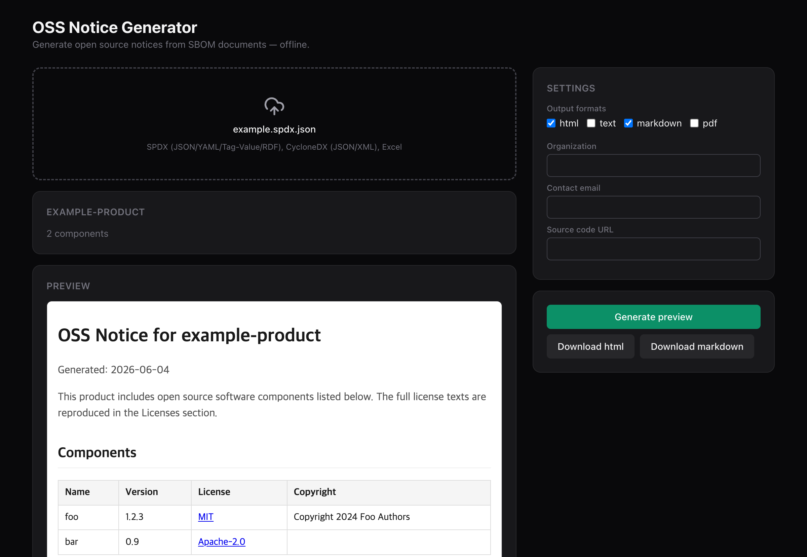

안녕하세요.

SK텔레콤과 카카오가 함께 개발한 오픈소스 고지문 생성 도구 [onot](https://github.com/sktelecom/onot)이 새롭게 개편되었습니다. onot은 SBOM(소프트웨어 구성 명세)을 읽어 오픈소스 고지문(OSS Notice)을 자동으로 만들어 주는 컴플라이언스 도구입니다. 이번 개편으로 입력 형식과 출력 형식이 넓어졌고, 명령줄 도구뿐 아니라 데스크톱 앱으로도 쓸 수 있게 되었습니다.

## 무엇이 새로워졌나요

### 더 많은 SBOM 형식을 읽습니다

기존에는 SPDX 문서만 입력으로 받았지만, 이제 [CycloneDX](https://cyclonedx.org)(JSON, XML)와 Excel 형식도 읽을 수 있습니다. SPDX는 JSON, YAML, Tag-Value, RDF를 지원합니다. 파일 확장자와 내용을 보고 입력 형식을 자동으로 판단하므로, 형식을 따로 지정하지 않아도 됩니다.

### PDF 고지문을 생성합니다

출력 형식에 PDF가 추가되었습니다. 이제 HTML, 텍스트, Markdown, PDF 가운데 필요한 형식을 골라 한 번에 생성할 수 있습니다. 고지문 언어도 한국어와 영어 중에서 선택할 수 있습니다.

### 네트워크 없이 완전히 동작합니다

라이선스 본문을 도구 안에 내장했습니다. 덕분에 인터넷이 차단된 폐쇄망에서도 고지문을 만들 수 있고, 분석 대상인 SBOM이 사용자의 기기를 벗어나지 않습니다. 라이선스 본문이 누락된 경우에만 `--online` 옵션으로 원격에서 가져오도록 할 수 있습니다.

### 데스크톱 앱과 로컬 API를 제공합니다

명령줄에 익숙하지 않은 사용자를 위해 Windows와 macOS용 데스크톱 앱을 제공합니다. 설치 후 SBOM 파일을 끌어다 놓으면 고지문을 미리 보고 내려받을 수 있습니다. 또한 다른 시스템과 연동할 수 있도록 로컬 API 사이드카도 함께 제공합니다.



## 어떻게 사용하나요

명령줄 도구는 PyPI에서 설치합니다.

```bash
pip install "onot[spdx,cyclonedx,excel,api]"

# SBOM 파일로부터 HTML과 Markdown 고지문 생성
onot generate -i sbom.spdx.json -f html -f markdown --output-dir ./output
```

데스크톱 앱은 [Releases](https://github.com/sktelecom/onot/releases)에서 설치 프로그램을 내려받아 바로 사용할 수 있습니다. 더 자세한 사용법은 [onot 프로젝트 소개](/project/onot/)와 [사용자 가이드](https://github.com/sktelecom/onot/blob/main/docs/USER_GUIDE.md)를 참고해 주세요.

오픈소스 컴플라이언스 업무에 onot이 도움이 되기를 바랍니다. 사용 중 의견이나 개선 제안이 있다면 [GitHub](https://github.com/sktelecom/onot)에서 언제든 남겨 주세요.

감사합니다.
