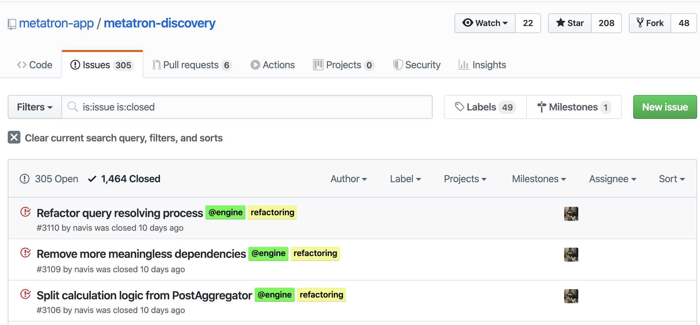

{}
이 페이지는 [GitHub의 Open Source Guide](https://opensource.guide/)의 내용을 참고로 작성하였다. 
{}

물론 업무와 연관이 있거나 기술적인 관심이 있는 분야의 오픈소스 프로젝트에 기여해야 한다. 그런 프로젝트가 여러 개일 경우, 어떤 프로젝트가 기여할 만한 프로젝트인지 확인하는 것도 필요하다. 그렇지 않으면 수고한 기여가 아무 응답도 받지 못하고 묻혀버릴 수도 있다.

다음은 관심 있는 오픈소스 프로젝트가 기여 활동에 적합한지 확인하기 위한 체크리스트이다.

## 1. 오픈소스 라이선스 파일이 있는가?  
   
* [x] LICENSE 파일이 있는가? 일반적으로 저장소의 루트 디렉터리 내에 LICENSE라는 파일이 있다.  

오픈소스 라이선스가 적용되지 않은 프로젝트라면 오픈소스가 아니다. 소프트웨어의 저작권자가 오픈소스 라이선스를 통해 누구나 사용하고 배포할 수 있는 권리를 부여해야 기업은 그 소프트웨어를 자유롭게 사용할 수 있다. 오픈소스 라이선스가 없는 소프트웨어를 임의로 사용한다면 저작권 침해 등의 법적 리스크를 유발할 수 있다.

## 2. 프로젝트가 활발히 기여를 받고 있는가?

* [x] 가장 최근 Commit은 언제인가?
* [x] 얼마나 많은 기여자가 있는가?
* [x] 얼마나 자주 Commit이 있는가?

기여자가 거의 없거나, 최근 수년간 Commit이 없다면 관리가 되지 않고 있는 프로젝트로 볼 수 있다.

GitHub에서의 Commit 현황은 화면 상단의 "Commits"에서 확인할 수 있다.

## 3. 프로젝트 이슈를 확인하라

* [x] 얼마나 많은 이슈가 오픈되어 있는가?
* [x] 이슈가 오픈되면 메인테이너는 신속히 대응하는가?
* [x] 이슈에 대한 활발한 토론이 있는가?
* [x] 이슈들은 최근 것인가?
* [x] 이슈들이 Close 되고 있는가?

이슈가 오픈되지 않고 있거나, 오픈되더라도 대응이 되지 않는다면 관리가 되지 않는 프로젝트로 볼 수 있다.

GitHub에서 Issues 페이지 내 "closed" tab을 보면 Close 된 이슈 현황을 확인할 수 있다.

## 4. 프로젝트의 Pull Request를 확인하라.

* [x] 얼마나 많은 Pull Request가 오픈되어 있는가?
* [x] Pull Request가 오픈되면 메인테이너는 신속히 대응하는가?
* [x] Pull Request에 대한 활발한 토론이 있는가?
* [x] Pull Request들은 최근 것인가?
* [x] 얼마나 최근의 Pull Request들이 머지되었는가?

GitHub에서 Pull Request 페이지 내 "closed" tab을 누르면 Close 된 Pull Request를 볼 수 있다.

## 5. 프로젝트가 기여를 환영하는 분위기인가?
* [x] 이슈 관련 질문에 대해 메인테이너가 도움이 되는 답변을 하는가?
* [x] 이슈, 포럼, 채팅 (슬랙 등)에서 사람들이 친절한가?
* [x] Pull Request를 하면 Review가 진행되는가?
* [x] 메인테이너가 사람들의 기여에 감사 표시를 하는가?

기여를 환영하지 않는 분위기인 프로젝트는 장기적으로 발전하기가 어렵다. 이런 부분도 기여할 만한 가치가 있는 프로젝트인지를 판단하는 기준이 될 수 있다.