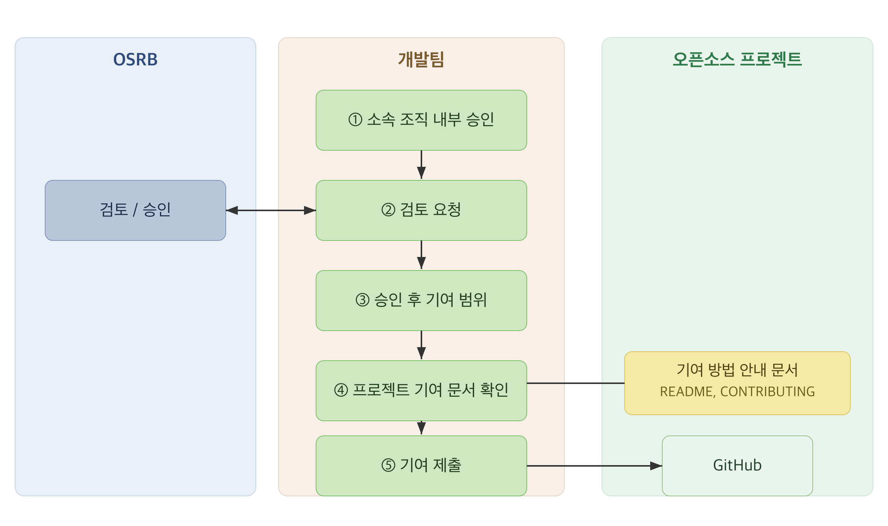

SK텔레콤 [기여 Rule](../rule/)에 따라, 구성원은 외부 프로젝트에 기여할 때 다음 절차를 따릅니다.
단, [개요](../)의 의사결정 흐름에서 승인 없이 바로 기여할 수 있는 경우에 해당하면 이 절차를
거치지 않아도 됩니다.



## 1. 소속 조직 내부 승인

하나의 오픈소스 프로젝트에 기여를 시작하기 전에, 소속 조직의 담당 임원이나 리더에게 승인을
받습니다.

## 2. 검토 요청

내부 승인을 받은 후 OSRB(opensource@sktelecom.com)에 검토를 요청합니다. 아래 체크리스트의
항목을 모두 채워 요청하면 검토가 빨라집니다.

### 제출 항목 체크리스트

- [ ] 오픈소스 프로젝트 이름
- [ ] Repository 주소
- [ ] 프로젝트 라이선스
- [ ] 기여 목적
- [ ] 기여 내용 요약
- [ ] 소속 조직 내부 승인 여부
- [ ] 프로젝트가 CLA 또는 DCO를 요구하는지 여부

### GitHub 이슈 템플릿

사내 이슈 트래커나 GitHub 조직에서 아래 템플릿으로 요청을 접수하면, 빈칸을 채우는 것만으로
제출 항목이 갖춰집니다.

```markdown
### 오픈소스 기여 검토 요청

- 프로젝트 이름:
- Repository:
- 라이선스:
- 기여 목적:
- 기여 내용 요약:
- 내부 승인(임원/리더):
- CLA/DCO 요구 여부:
```

### 처리 예상 소요

검토는 라이선스와 CLA 확인을 포함합니다. 단순 확인은 보통 짧게 끝나고, 추가 확인이 필요하면
더 걸릴 수 있습니다.

OSRB는 프로젝트의 라이선스와 CLA를 검토하고, 이상이 없으면 승인합니다.

## 3. 승인 후 기여 범위

한 번 승인받은 프로젝트에는 이후 구성원의 재량으로 기여할 수 있습니다. 프로젝트가 바뀌면 다시
검토를 요청합니다.

## 4. 프로젝트 기여 문서 확인

프로젝트마다 요구하는 절차가 조금씩 다릅니다. 기여 전에 프로젝트의 CONTRIBUTING이나 README를
확인해 다음을 파악합니다.

- 코딩 스타일, 언어, 포매팅, 이슈와 티켓 관리, 릴리스 시기 등의 가이드라인
- CLA 서명 또는 DCO Signed-off-by 요구 여부
- 패치 제출 방식(GitHub Pull Request 또는 메일링 리스트)

## 5. 기여 제출

[기여 Rule](../rule/)에 따라 코드를 다듬은 뒤, 프로젝트가 요구하는 방식으로 [기여를
제출](../submit/)합니다.
