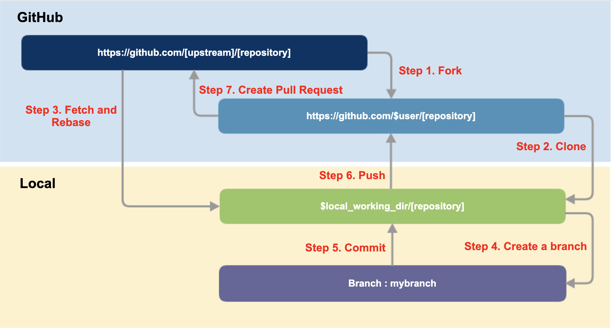

승인과 준비를 마쳤다면 프로젝트가 요구하는 방식으로 기여를 제출합니다. 아래는 GitHub 기반
프로젝트의 일반적인 절차입니다.

## 이전 이력 확인

제출하려는 기여가 이전에 다뤄진 적이 있는지 확인하세요. 프로젝트의 README, 이슈, 메일링
리스트에서 몇 가지 키워드를 검색하면 쉽게 확인할 수 있습니다. 관련 내용이 없다면 이슈를 열거나
Pull Request로 커뮤니케이션을 시작하세요.

작업을 시작하기 전에 먼저 이슈를 열어 어떤 작업을 하려는지 알리는 것이 좋습니다. 중복 작업이나
불필요한 작업을 피할 수 있습니다.

## 이슈 생성

보통 다음 상황에서 이슈를 생성합니다.

- 스스로 해결할 수 없는 오류 보고
- 새로운 기능이나 아이디어 제안
- 커뮤니티 비전이나 정책에 대한 토론

커뮤니케이션 팁은 다음과 같습니다.

- 다루려는 열린 이슈가 있다면 먼저 댓글을 남겨 중복 작업을 막으세요.
- 오래된 이슈는 이미 해결됐을 수 있으니 작업 전에 댓글로 확인하세요.
- 이슈를 연 뒤 스스로 답을 찾았다면, 답을 댓글로 남기고 이슈를 닫으세요. 이런 문서화도 기여입니다.

## Pull Request 생성

기여할 파일이 준비됐다면 Pull Request로 제출합니다. 작업을 일찍 공개해 피드백을 받는 것이
좋으며, 진행 중이라면 제목에 "WIP"(Work in Progress)를 표시하고 이후 커밋을 더할 수 있습니다.

GitHub 기반 프로젝트의 Pull Request 절차는 다음과 같습니다.

### Fork

Upstream Repository를 자신의 GitHub 계정으로 Fork 합니다.

### Clone

Fork한 Repository를 로컬 작업 디렉토리로 Clone 하고, Upstream을 remote에 추가합니다.

```bash
$ git clone https://github.com/$user/[repository]
$ cd [repository]
$ git remote add upstream https://github.com/[upstream]/[repository]
$ git remote -v
```

### 브랜치 생성

main 브랜치를 최신 상태로 맞춘 뒤 작업용 브랜치를 만듭니다.

```bash
$ git fetch upstream
$ git checkout main
$ git rebase upstream/main
$ git checkout -b myfeature
```

### 작업과 커밋

코드를 작업하고 커밋합니다. 프로젝트가 DCO를 요구하면 `-s` 옵션으로 Signed-off-by를 남깁니다.

```bash
$ git commit -s -m '[commit message]'
```

### Push

작업한 브랜치를 자신의 Repository에 push 합니다.

```bash
$ git push origin myfeature
```

이미 push한 브랜치를 rebase 등으로 다시 정리해 push해야 하는 드문 경우에만 force 옵션을 쓰되,
공유 브랜치에는 사용하지 않도록 주의하세요.

### Pull Request 생성

GitHub의 자신의 Repository에서 Compare & pull request 버튼으로 Pull Request를 생성합니다. 이후
Upstream 관리자가 검토하여 Merge 여부를 결정합니다.



## DCO와 CLA

기여물의 출처를 보증하는 방식으로 DCO와 CLA가 있습니다. 프로젝트가 무엇을 요구하는지 미리
확인하세요.

- DCO는 커밋에 Signed-off-by 한 줄을 남기는 경량 방식입니다. `git commit -s`로 자동 추가됩니다.
- CLA는 별도 약정서에 서명하는 방식입니다. 저작권 양도를 요구하는 CLA는 서명 전에
  [기여 Rule](../rule/)에 따라 OSRB에 검토를 요청하세요.

## 피드백 받기

기여를 제출하면 프로젝트로부터 피드백을 받습니다. 피드백은 기여의 수준을 높이는 과정이므로 열린
태도로 받아들이는 것이 좋습니다. 피드백은 보통 다음 넷 중 하나입니다.

### 응답이 없는 경우

기여 전에 프로젝트가 활발한지 확인하는 것이 좋습니다. 일주일 이상 응답이 없으면 같은 스레드에
정중하게 검토를 요청하세요. 적절한 담당자를 안다면 @-멘션을 쓰세요. 개인적으로 따로 연락하지
말고 공개 채널로 소통하세요. 그래도 반응이 없을 수 있으니, 다른 기여 방법이나 다른 프로젝트를
찾아보세요.

### 수정을 요청받는 경우

아이디어 설명이나 코드 수정을 요청받는 것은 일반적입니다. 누군가 시간을 내어 검토했으니 바로
응답하세요. 더 진행할 수 없다면 Maintainer에게 알려 다른 사람이 이어받게 하세요.

### 거절된 경우

기여가 수락되지 않을 수 있습니다. 이유가 이해되지 않으면 설명을 요청하되, 그 결정을 존중하세요.
끝내 이견이 좁혀지지 않으면 Fork 하여 자신의 프로젝트로 이어갈 수 있습니다. 거절을 다음 기여를
개선하는 기회로 삼으세요.

### 수락된 경우

축하합니다. 오픈소스 기여에 성공했습니다.

## 참고 자료

- [Make a Pull Request](http://makeapullrequest.com/)
- [First Contributions](https://github.com/Roshanjossey/first-contributions)
- [Kubernetes GitHub Workflow](https://github.com/kubernetes/community/blob/master/contributors/guide/github-workflow.md)
