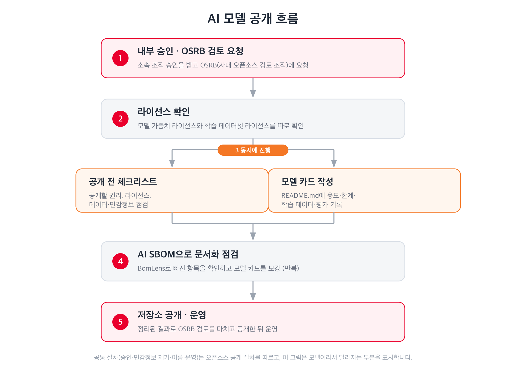

{}
이 페이지는 학습한 AI 모델(가중치)을 공개하는 경우를 다룹니다. 소스 코드를 공개하신다면
[오픈소스 공개하기](../)를 참고하세요. 외부 오픈소스 모델을 가져다 쓰는 경우라면
[AI Model 라이선스](/guide/use/obligation/#7-ai-model-라이선스)를 참고하세요.
{}

AI 모델을 공개하는 일은 소스 코드를 공개하는 일과 절차가 대부분 같습니다. 조직 승인을 받고,
공개할 권리를 확인하고, 민감정보를 걸러내고, 공개 후 지원 인력을 정합니다. 이 공통 절차는
[공개 절차](../process/)와 [공개 Rule](../rule/)을 그대로 따르시면 됩니다.

이 페이지는 모델이라서 달라지는 부분만 다룹니다.

## 코드 공개와 무엇이 다른가

| 항목 | 소스 코드 공개 | AI 모델 공개 |
|---|---|---|
| 공개물 | 소스 코드 | 가중치 파일과 모델 카드 |
| 라이선스 | 코드 라이선스 하나 | 모델 라이선스와 학습 데이터셋 라이선스를 따로 판단 |
| 설명 문서 | README, 기여 안내 | 모델 카드(용도, 한계, 편향, 평가 결과 포함) |
| 민감정보 | 코드와 커밋 이력 | 여기에 더해 학습 데이터에 섞인 개인정보와 저작물 |
| 규제 | 수출 통제(ECCN, 수출관리분류번호) | 여기에 더해 EU 인공지능법과 국내 인공지능 기본법의 문서화 요구 |

가장 자주 걸리는 곳은 학습 데이터셋입니다. 모델 라이선스를 정리했더라도 학습에 쓴 데이터셋의
라이선스가 재배포나 상업적 이용을 제한하는 경우가 있습니다. 둘은 별개로 확인하셔야 합니다.

## 한 장 요약

1. 소속 조직 내부 승인을 받고 OSRB(사내 오픈소스 검토 조직)에 검토를 요청합니다([공개 절차](../process/)의 A 단계).
2. 모델과 학습 데이터셋의 라이선스를 각각 확인합니다.
3. [공개 전 체크리스트](checklist/)로 빠진 항목을 점검합니다.
4. [모델 카드](model-card/)를 작성합니다. 공개 후 가장 많이 읽히는 문서입니다.
5. 규제 대응이 필요하면 [AI SBOM](ai-sbom/)으로 문서화 상태를 확인합니다.
6. 저장소를 공개하고 운영합니다([공개 절차](../process/)의 D 단계).

## 공개 전에 스스로 점검하려면

[공개 전 체크리스트](checklist/)의 권리와 데이터 항목을 먼저 확인하세요. 비공개 저장소라도
외부 서비스에 올리는 것이라, 공개할 수 없는 데이터가 섞인 채 올리면 되돌리기 어렵습니다.

그다음에는 비공개 상태에서 스스로 점검할 수 있습니다. 모델을 비공개 저장소에 올리고, 본인의
Hugging Face 토큰(`HF_TOKEN`)으로 SBOM 생성 도구 BomLens를 돌리면 빠진 항목과 채우는 방법이
정리되어 나옵니다.
그 결과로 모델 카드를 미리 보강해 두면, OSRB 검토에 필요한 문서를 갖춰 검토가 수월해집니다.
BomLens 실행 명령과 토큰 준비, 결과 읽는 법은 [AI SBOM](ai-sbom/)에 있습니다.

## 관련 문서

- [공개 절차](../process/) — 승인부터 운영까지 공통 절차
- [공개 Rule](../rule/) — 공개 전 지켜야 할 기준
- [민감정보 제거 체크리스트](../process/scrub-checklist/) — 코드와 커밋 이력 정리
- [AI Model 라이선스](/guide/use/obligation/#7-ai-model-라이선스) — RAIL, Llama 등 모델 라이선스 해설

## 문의

AI 모델 공개 관련 문의와 검토 요청은 OSRB(opensource@sktelecom.com)로 연락하세요.
