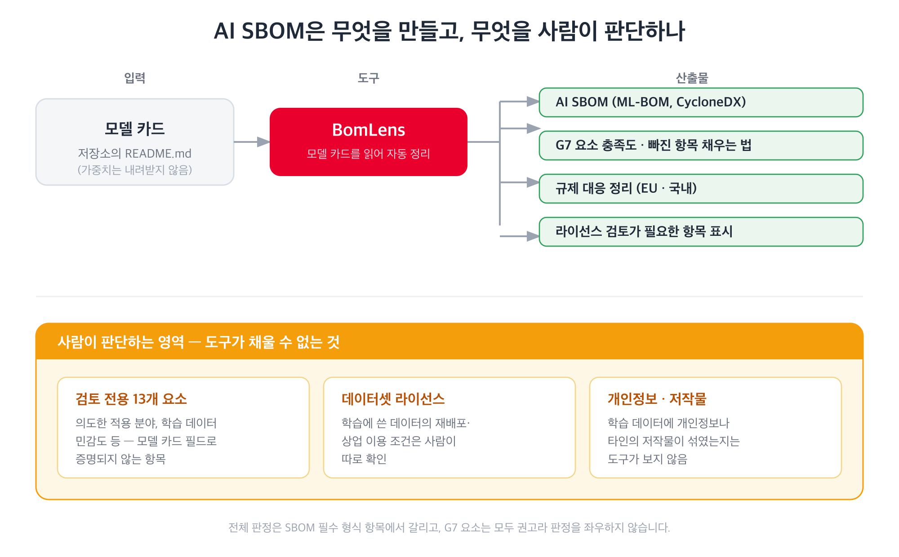

AI SBOM은 모델과 학습 데이터셋, 그 출처와 라이선스를 기계가 읽을 수 있게 정리한 명세입니다.

- [SBOM](/guide/supply-chain/sbom/what-is-sbom/)이 소프트웨어의 구성요소 목록이라면, AI SBOM은
  모델 가중치와 학습 데이터처럼 일반 SBOM이 다루지 않는 항목까지 포함합니다.
- 모델 카드에 적힌 내용에서 만들어지므로, 모델 카드가 부실하면 AI SBOM에도 빈 항목이 그만큼
  늘어납니다.

## 왜 만드는가

두 가지 쓰임이 있습니다.

1. 공개하는 쪽에서는 문서화가 얼마나 갖춰졌는지 확인하는 자기 점검 수단입니다. 무엇이 비어
   있는지 목록으로 보이므로 공개 전에 메울 수 있습니다.
2. 공개한 뒤에는 다른 팀이나 조직이 이 모델을 도입할 때 검토 근거가 됩니다. 코드에 SBOM을
   요구하듯 AI 모델에도 같은 문서를 요구하는 곳이 늘고 있습니다.

## 주요 규제

{}
이 페이지의 내용은 규제 준수를 인증하거나 판정하는 것이 아닙니다.

- 문서화가 어디까지 갖춰졌는지 드러내 사람이 준비할 수 있게 하는 자료입니다.
- 특정 시스템의 법적 의무를 해석하는 일은 사람의 몫이며, 판단이 필요하면 법무 부서와 OSRB에
  문의하시기 바랍니다.
{}

| 규제 | 적용 대상 | 적용 시점 | 관련 조문 |
|---|---|---|---|
| EU 인공지능법 (EU AI Act) | 범용으로 쓸 수 있는 모델을 공개하는 경우 | 2025년 8월 2일부터. 그 전에 공개한 모델은 2027년 8월 2일까지 | 제53조, 부속서 XI |
| EU 인공지능법 (EU AI Act) | 모델이 고위험 용도의 시스템에 들어가는 경우 | 부속서 III 단독형은 2027년 12월 2일, 부속서 I 제품 내장형은 2028년 8월 2일 | 제11조, 부속서 IV |
| 국내 인공지능 기본법 | 국내에서 인공지능 사업을 하는 경우 | 2026년 1월 22일 시행 | 제31조(투명성), 제32조(안전성), 제33조와 제34조(고영향 인공지능), 제35조(영향평가) |

- 모델을 공개하는 쪽이 먼저 볼 것은 제53조입니다. 기술 문서 작성(부속서 XI), 모델을 가져다
  쓰는 쪽에 제공할 정보(부속서 XII), 저작권 정책 수립, 학습 콘텐츠 요약 공개 네 가지를
  요구하며 2025년 8월 2일부터 이미 적용 중입니다.
- 가중치와 구조, 사용 방법을 무료·오픈소스 라이선스로 함께 공개하면 앞의 두 가지는 면제됩니다.
  저작권 정책과 학습 콘텐츠 요약 공개는 면제되지 않습니다. 시스템적 위험이 있는 모델로 지정되면
  면제 자체가 적용되지 않습니다(제53조 제2항, 제51조).
- 학습 콘텐츠 요약은 집행위원회 AI Office가 2025년 7월 24일 공개한 템플릿을 그대로 써야 하고,
  누구나 볼 수 있는 곳에 게시해야 합니다.
- 제11조와 부속서 IV는 고위험 시스템 제공자의 기술 문서 요건입니다. 모델 자체가 아니라 그
  모델이 들어간 시스템의 용도에 따라 걸리며, 적용일은 2026년 개정(Digital Omnibus on AI)으로
  미뤄졌습니다.
- 국내 인공지능 기본법은 세부 문서화 요구가 시행령에 있어 EU만큼 구체적이지 않습니다. 특히
  제32조(안전성)는 시행령이 정하는 연산량 임계치 이상으로 학습한 시스템에만 적용되므로, 해당
  항목이 걸린다고 해서 곧바로 의무 대상이 되는 것은 아닙니다.

## G7 최소 요구사항

2026년 5월 미국 사이버보안 기관 CISA와 G7 국가들이 "Software Bill of Materials for AI —
Minimum Elements"를 공동 발행했습니다. 독일 BSI, 이탈리아 ACN 같은 각국 사이버보안 기관이
주도했고, AI 모델의 명세가 갖춰야 할 최소 요소 50개를 일곱 묶음으로 정의합니다. 법적 구속력이
있는 규정이 아니라 권고입니다.

| 묶음 | 요소 수 | 사람이 판단해야 하는 수 | 내용 |
|---|---:|---:|---|
| 메타데이터 | 10 | 0 | 명세를 누가 언제 어떤 도구로 만들었는가 |
| 시스템 속성 | 9 | 4 | 시스템의 이름, 적용 분야, 데이터 흐름 |
| 모델 | 13 | 0 | 모델의 식별자, 라이선스, 무결성, 학습 속성 |
| 데이터셋 속성 | 10 | 5 | 데이터셋의 출처, 통계, 민감도, 라이선스 |
| 인프라 | 2 | 0 | 소프트웨어 의존성과 하드웨어 |
| 보안 속성 | 4 | 3 | 보안 통제, 정책, 취약점 대응 |
| 성능 지표 | 2 | 1 | 보안 지표와 운영 성능 |
| 계 | 50 | 13 | |

- 50개 중 13개는 자동으로 확인할 방법이 없습니다. 의도한 적용 분야나 학습 데이터의 민감도처럼
  모델 카드의 어떤 필드로도 증명되지 않는 항목이라, 사람이 판단해서 채워야 합니다.
- EU 인공지능법이 요구하는 기술 문서(범용 AI 모델은 부속서 XI, 고위험 시스템은 부속서 IV)에는
  G7 묶음 중 시스템 속성, 모델, 데이터셋 속성이 대응합니다. 이 대응 관계는 BomLens가 정리한
  해석이며, G7 원문에는 규제와의 대응이 나오지 않습니다.
- 권고이지만 요구하는 항목이 앞의 규제가 요구하는 기술 문서와 상당 부분 겹칩니다. G7 쪽을 채워
  두면 규제 대응에 필요한 문서도 함께 갖춰집니다.

## AI SBOM 생성 방법

SK텔레콤이 공개한 오픈소스인 [BomLens](https://github.com/sktelecom/bomlens)에 모델 id를 주면
모델 카드를 읽어 CycloneDX(SBOM 표준 형식) 형식의 AI SBOM을 만들고, G7 요소 충족도와 규제 대응
관계를 함께 정리합니다. (모델 가중치를 내려받지 않고 모델 카드만 조회)

- 설치와 실행 방법, 보고서를 읽는 방법은 [BomLens AI 모델 가이드](https://sktelecom.github.io/bomlens/ko/guides/ai-model/)에
  있습니다.
- 아래 명령은 BomLens를 설치한 상태에서 실행하는 예시입니다.

```bash
./scripts/scan-sbom.sh --project my-llm --version 1.0.0 \
  --model "my-org/my-llm" --generate-only
```

비공개 저장소는 읽기 권한이 있는 토큰이 필요합니다.

- 토큰을 `HF_TOKEN`으로 넘기는 방법과 게이트 저장소 조건은 [비공개 모델과 게이트 모델](https://sktelecom.github.io/bomlens/ko/guides/ai-model/#비공개-모델과-게이트-모델)에
  있습니다.

결과로 다음이 나옵니다.

- 모델과 데이터셋을 담은 AI SBOM
- 요소별 충족 여부와, 비어 있는 항목을 채우는 방법
- EU 인공지능법과 국내 인공지능 기본법 대응 관계 정리
- 라이선스 검토가 필요한 항목 표시



## 결과 확인

전체 판정이 통과로 나와도 G7 항목이 다 채워졌다는 뜻은 아닙니다. 통과와 실패는 SBOM이 갖춰야
할 필수 형식 항목에서 갈리고, G7 요소는 모두 권고라 판정을 좌우하지 않습니다. 그래서 채워진
수와 비어 있는 수를 따로 보셔야 합니다.

- 비어 있는 항목은 두 종류로 나뉩니다. 모델 카드에 쓰면 채워지는 것과, 사람이 판단해야 하는
  것입니다. 앞의 것부터 메우시면 됩니다.
- 보고서가 실제로 어떤 모습인지는 예시로 미리 볼 수 있습니다. 예시 모델을 스캔해 나온
  [적합성 보고서](https://sktelecom.github.io/bomlens/ko/samples/aether-7b-5attn_conformance.html)와
  [AI 준수 개요](https://sktelecom.github.io/bomlens/ko/samples/aether-7b-5attn_ai-profile.html)를
  브라우저에서 그대로 열어 볼 수 있습니다.

## 관련 문서

- [모델 카드](../model-card/) — AI SBOM의 재료
- [공개 전 체크리스트](../checklist/) — 공개 전 점검 항목
- [SBOM이란](/guide/supply-chain/sbom/what-is-sbom/) — SBOM 일반
- [BomLens AI 모델 가이드](https://sktelecom.github.io/bomlens/ko/guides/ai-model/) — 설치와 실행, 보고서 읽는 법
- [BomLens](/guide/supply-chain/for-suppliers/skt-scanner/) — SBOM 생성 도구 소개

## 참고 자료

- [Software Bill of Materials for AI — Minimum Elements](https://www.bsi.bund.de/SharedDocs/Downloads/EN/BSI/KI/SBOM-for-AI_minimum-elements.pdf?__blob=publicationFile&v=4) (G7, 2026-05)
- [Regulation (EU) 2024/1689 (AI Act)](https://eur-lex.europa.eu/eli/reg/2024/1689/oj)
- [학습 콘텐츠 요약 템플릿과 설명](https://digital-strategy.ec.europa.eu/en/library/explanatory-notice-and-template-public-summary-training-content-general-purpose-ai-models) (집행위원회 AI Office, 2025-07)
- [EU 인공지능법 이행 일정](https://ai-act-service-desk.ec.europa.eu/en/ai-act/timeline/timeline-implementation-eu-ai-act) (집행위원회)
- [인공지능 발전과 신뢰 기반 조성 등에 관한 기본법](https://www.law.go.kr/법령/인공지능발전과신뢰기반조성등에관한기본법)

## 문의

AI SBOM 생성과 해석에 관한 문의는 OSRB(opensource@sktelecom.com)로 연락하세요.
