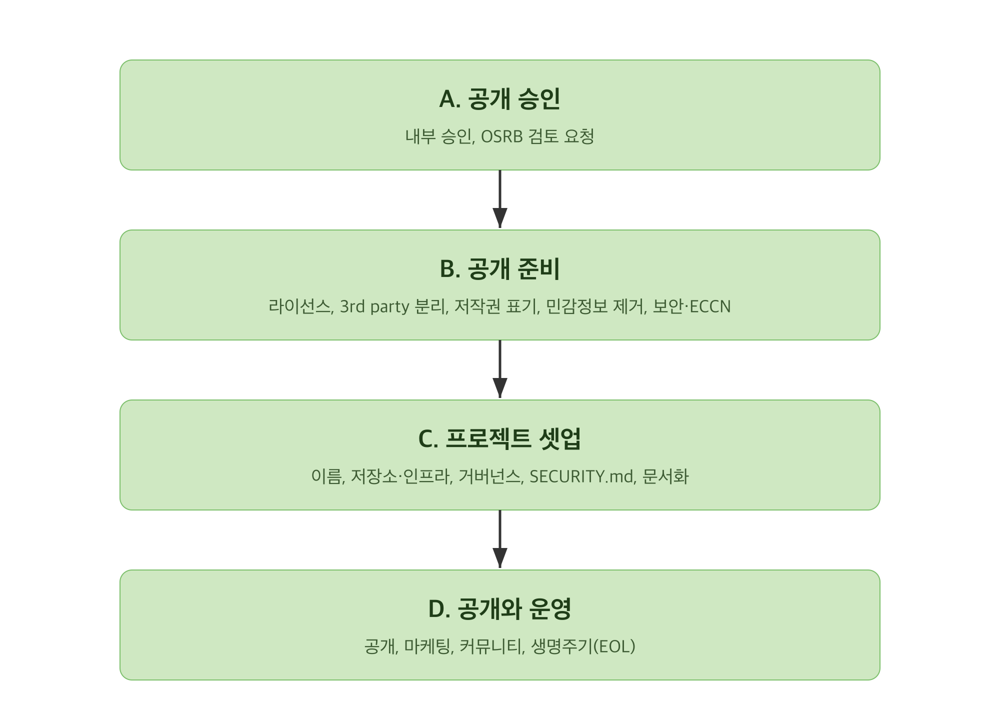

공개 절차는 네 묶음으로 진행합니다. 먼저 승인을 받고(A), 코드를 준비하고(B), 프로젝트를
갖춘 뒤(C), 공개하고 운영합니다(D).



## A. 공개 승인

### 소속 조직 내부 승인

소프트웨어를 공개하려면 소속 조직의 담당 임원이나 리더에게 승인을 받습니다.

### 검토 요청

내부 승인을 받은 후 OSRB(opensource@sktelecom.com)에 검토를 요청합니다. 아래 체크리스트를
모두 채워 요청하세요.

- [ ] 현재 소스 코드 Repository 링크
- [ ] 공개 예정 저장소 링크
- [ ] 적용할 오픈소스 라이선스
- [ ] 공개로 기대하는 비즈니스 가치
- [ ] SK텔레콤 구성원이 작성하지 않은 코드 설명
- [ ] 개발팀 담당 임원 승인 여부
- [ ] 코드가 쓰인 제품이나 서비스
- [ ] 공개 후 지원할 인력 지정 여부
- [ ] 공개 준비 완료 여부
- [ ] 공개 홍보 방법(블로그, 콘퍼런스 등)
- [ ] 관련 특허 여부
- [ ] 보안취약점 검토와 보완 여부
- [ ] 수출 통제 분류(ECCN) 확인 여부

처리 예상 소요는 검토 범위에 따라 다릅니다.

## B. 공개 준비

### 라이선스 결정

SK텔레콤은 기본적으로 Apache-2.0을 적용합니다. 커뮤니티 관례 라이선스가 있거나 GPL 라이브러리에
종속된 경우 등은 다른 라이선스를 적용할 수 있습니다. 선택 기준은 [라이선스 선택](license-select/)을
참고하세요.

### 3rd party 코드 분리

SK텔레콤이 재배포할 권리가 있는지 확인하고, 외부 라이브러리는 `third_party` 디렉토리로 분리해
각 디렉토리에 LICENSE 파일을 둡니다.

```
[Root Directory]
|-- SKT source code
|-- ...
`-- third_party
    |-- [external library A]
    |   |-- LICENSE
    |   `-- ...
    `-- [external library B]
        |-- LICENSE
        `-- ...
```

### 저작권과 라이선스 표기

모든 소스 파일에 저작권과 라이선스를 표기합니다. 형식은 REUSE 표준을 따릅니다. 자세한 방법은
[저작권 표시](copyright/)를 참고하세요. 프로젝트 루트에는 LICENSE 파일을 포함합니다. Apache-2.0은
공식 사본을, 그 외 라이선스는 [SPDX License List](https://spdx.org/licenses/)에서 받습니다.

### 민감정보 제거

공개 전에 주석에 남은 작성자 이름과 이메일, 내부 정보(파일 경로, 호스트, IP), 자격증명 같은
시크릿을 제거합니다. 점검 항목과 자동화 방법은 [민감정보 제거 체크리스트](scrub-checklist/)를
따릅니다.

### 라이선스 점검과 보안 점검 요청

고지나 소스 공개 의무가 있는 라이선스, 재배포 권리가 없는 3rd party 코드, 라이선스 충돌 여부를
점검합니다. 보안취약점이 있는 오픈소스가 포함됐는지도 확인합니다. 점검은 OSRB에
요청합니다.

### 수출 통제 분류(ECCN) 확인

암호 기능 등 수출 통제 대상 기술이 포함될 수 있으므로, 공개 전에 수출 통제 분류를 확인합니다.
한국 기업은 대외무역법상 전략물자 판정이 1차 기준이며, 미국산 기술이 포함되면 미국 수출관리규정(EAR)의
ECCN도 함께 확인합니다. 분류와 검토가 필요하면 OSRB를 통해 담당 부서의 확인을 받으세요.

## C. 프로젝트 셋업

### 이름 결정

기억하기 쉽고 프로젝트를 알리는 이름을 정합니다. 상표권 충돌 확인을 포함한 기준은 [이름
결정](name/)을 참고하세요.

### 저장소와 인프라

GitHub 또는 GitLab Repository를 권장합니다. SK텔레콤 GitHub 조직(https://github.com/sktelecom)에
멤버 등록이 필요하면 OSRB에 요청합니다. 다음을 갖춥니다.

- 이슈 트래커
- 테스트 자동화: Unit Test, Integration Test, End-to-End Test
- CI/CD: 빌드와 배포까지 포함한 지속적 자동화와 모니터링
- 웹사이트: 사용자 가이드와 홍보용. GitHub Pages 활용을 권장합니다
- 커뮤니케이션 채널: 회사 기밀은 공개 채널에서 논의하지 않습니다

### 거버넌스와 CODE_OF_CONDUCT

참여 인원의 역할을 명확히 구분합니다. 참가자의 행동 규칙을 정의한 CODE_OF_CONDUCT를 둡니다.
차별 금지, 안전한 활동 보장, 위반 시 신고 방법을 포함합니다. 행동강령은 사실상 표준인 Contributor
Covenant를 채택하고, 신고 연락처와 집행 절차를 함께 정합니다.

### 기여자 라이선스 정책(CLA/DCO) 결정

외부 기여를 받을 계획이라면 기여자 라이선스 정책을 정합니다. 기여물의 저작권과 라이선스 권리를
명확히 하기 위해 CLA(Contributor License Agreement)나 DCO(Developer Certificate of Origin) 중
하나를 채택합니다. DCO는 커밋에 Signed-off-by로 출처와 기여 권리를 증명하는 경량 방식이고, CLA는
별도 약정서로 권한을 정리하는 방식입니다. 저작권 양도를 요구하는 CLA는 회사 정책상 제약이 있으므로,
선택과 운영은 [기여 Rule의 CLA 설명](../../contribute/rule/)과 일관되게 정합니다.

### 취약점 제보 처리(SECURITY.md)

공개 프로젝트는 외부에서 보안취약점 제보를 받습니다. 제보 경로와 대응 절차를 SECURITY.md에
정의합니다.

```markdown
# Security Policy

## Reporting a Vulnerability
취약점은 공개 이슈로 올리지 말고 <보안 제보 연락처>로 비공개로 알려 주세요.
접수 후 <대응 기준일> 안에 회신합니다.

## Supported Versions
보안 수정을 제공하는 버전 범위를 적습니다.
```

GitHub 저장소는 비공개 취약점 제보(Private Vulnerability Reporting)를 켜서 제보 창구로 활용할 수
있습니다. 제보 접수와 회신 기준 시간, 조율된 공개(coordinated disclosure)의 원칙, 수정 후 CVE 발번과
보안 권고(advisory) 게시 절차를 함께 정합니다.

### 문서화

다음 문서를 갖춥니다.

- README: 무엇을 하는 프로젝트인지, 왜 유용한지, 어떻게 시작하는지, 도움을 어디서 받는지
- 개발 가이드: 빌드 방법, 테스트, 코딩 컨벤션, CI/CD, 릴리스
- CONTRIBUTING: 버그 리포트와 기능 제안 방법, 개발 환경 설정, 원하는 기여 유형, 비전과 로드맵,
  관리자 연락처

## D. 공개와 운영

### 공개 전 최종 확인

- 모든 코드와 문서가 Repository에 있는지 확인합니다
- 인프라가 실행 중이고 안전하며 확장 가능한지 확인합니다
- 개발자가 커뮤니케이션 채널에 참여할 수 있는지 확인합니다

### 공개

https://github.com/sktelecom 에 Public으로 공개합니다.

공개는 되돌리기 어렵습니다. 한 번 공개된 코드는 외부에서 복제되거나 보관될 수 있으므로, 공개 전 점검을 모두 마쳤는지 다시 확인하세요.

### 마케팅과 커뮤니티 활성화

관련 커뮤니티의 메일링 리스트나 포럼에 알리고, 기술 블로그와 소셜 미디어, 콘퍼런스로 홍보합니다.
프로젝트의 성공은 참여 인원과 기여의 양으로 가늠됩니다. 커뮤니티 구축에는 지속적인 노력이
필요합니다.

### 공개 후 생명주기 운영

공개로 끝이 아닙니다. 다음을 지속합니다.

- 정기 건강도 점검: 이슈와 PR 응답, 릴리스 주기 유지
- 보안과 버그 수정 지속: 제보된 취약점 대응
- 종료와 아카이빙(EOL): 더 이상 유지하지 않을 때는 상태를 명확히 알리고 저장소를 아카이브합니다
