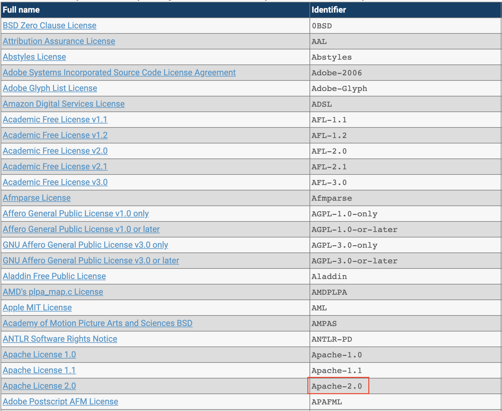

저작권은 저작물을 만들 때 자동으로 생깁니다. 다른 사용자가 쓰게 하려면 라이선스를 부여해야
합니다. 대부분의 오픈소스 라이선스가 저작권 표시를 요구하므로, SK텔레콤이 공개하는 모든 소스
파일에 저작권 표시와 라이선스 고지를 포함합니다. 표기는 REUSE 표준을 따릅니다.

## 저작권 표시

소스 파일 상단 헤더에 다음을 포함합니다.

```
SPDX-FileCopyrightText: Copyright {연도} SK TELECOM CO., LTD.
```

- `{연도}`는 최초 작성 연도를 적습니다.
- 연락처나 웹사이트를 덧붙일 수 있습니다(선택). 이 형식은 [기여 Rule의 저작권 표기](../../../contribute/rule/)와 동일합니다.

## 라이선스 고지

SPDX License List에서 라이선스 Identifier를 확인해 파일 상단에 표시합니다.

```
SPDX-License-Identifier: Apache-2.0
```

이 형식은 [기여 Rule의 저작권 표기](../../../contribute/rule/)와 동일합니다.



## 자동화 도구

파일이 많을 때는 도구로 일괄 적용합니다. REUSE 표준의 SPDX 태그(`SPDX-FileCopyrightText`,
`SPDX-License-Identifier`)를 생성하려면 [REUSE 도구](https://reuse.software/)의 `reuse annotate`를
사용합니다.

```bash
$ reuse annotate --copyright "SK TELECOM CO., LTD." --license Apache-2.0 [filename]
```

[addlicense](https://github.com/google/addlicense)는 기본적으로 라이선스 헤더 본문을 넣습니다.
SPDX 단문 형식이 필요하면 `-s` 옵션을 사용합니다.

```bash
$ addlicense -s -c "SK TELECOM CO., LTD." -l apache [filename]
```

Java 파일에 일괄 적용하는 예시입니다.

```bash
$ find . -type f -name \*.java -exec addlicense -s -c "SK TELECOM CO., LTD." -l apache {} \;
```
