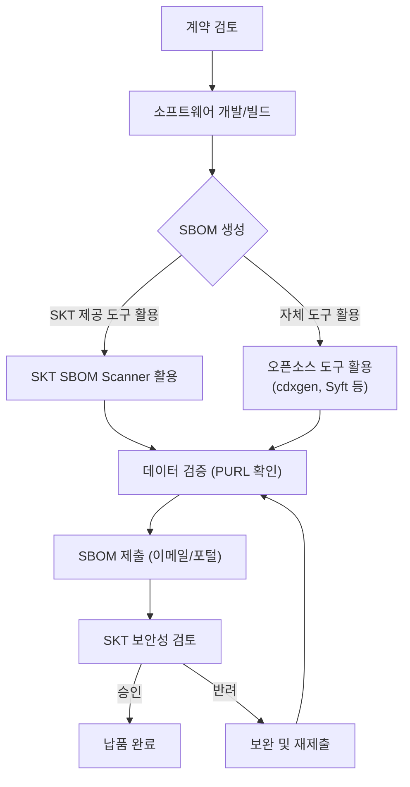

SK텔레콤은 소프트웨어 공급망의 투명성과 보안성을 강화하기 위해, 공급사로부터 납품받는 모든 소프트웨어 구성 요소 및 의존성에 대한 SBOM(Software Bill of Materials) 제출을 의무화하고 있습니다. 본 가이드는 공급사가 SK텔레콤의 보안 정책을 준수하여 올바른 형식의 SBOM을 생성하고 제출하는 방법을 상세히 안내합니다.

## 적용 대상

다음 형태의 소프트웨어를 납품하는 모든 공급사(개발사, 리셀러 포함)는 본 가이드라인의 적용을 받습니다.

*   소스코드: Java, Python, JavaScript, Go, C/C++ 등으로 작성된 애플리케이션
*   컨테이너 이미지: Docker 이미지 또는 OCI 호환 컨테이너
*   실행 파일: 컴파일된 바이너리(.jar, .dll, .so) 및 라이브러리
*   임베디드 시스템: 펌웨어 이미지, RootFS, 디바이스 드라이버

## SBOM 제출 프로세스

공급사는 계약 시점부터 최종 납품까지 아래의 절차를 준수해야 합니다.

## 가이드 구성

본 섹션은 다음과 같이 구성되어 있습니다.

1. [제출 요구사항](requirements/): SK텔레콤이 요구하는 필수 포맷(CycloneDX, SPDX)과 데이터 필드를 정의합니다.
2. [SKT 제공 도구 활용 (Easy Mode)](skt-scanner/): 복잡한 설정 없이 즉시 사용 가능한 표준 생성 도구 사용법을 안내합니다.
3. [오픈소스 도구 활용](creation-guide/): 범용 오픈소스 도구(cdxgen, Syft 등)를 활용한 생성 방법을 안내합니다.
4. [검증 체크리스트](checklist/): 제출 전 반드시 확인해야 할 필수 항목 점검표를 제공합니다.
5. [제출 절차](submission/): 생성된 SBOM 파일의 명명 규칙과 제출 채널을 안내합니다.

## 관련 문서

- [SK텔레콤 공급망 보안 정책](/guide/supply-chain/overview/policy/): SBOM 제출 의무화 정책 배경 및 원칙
- [글로벌 규제 동향](/guide/supply-chain/overview/regulations/): SBOM 관련 국내외 규제 현황
