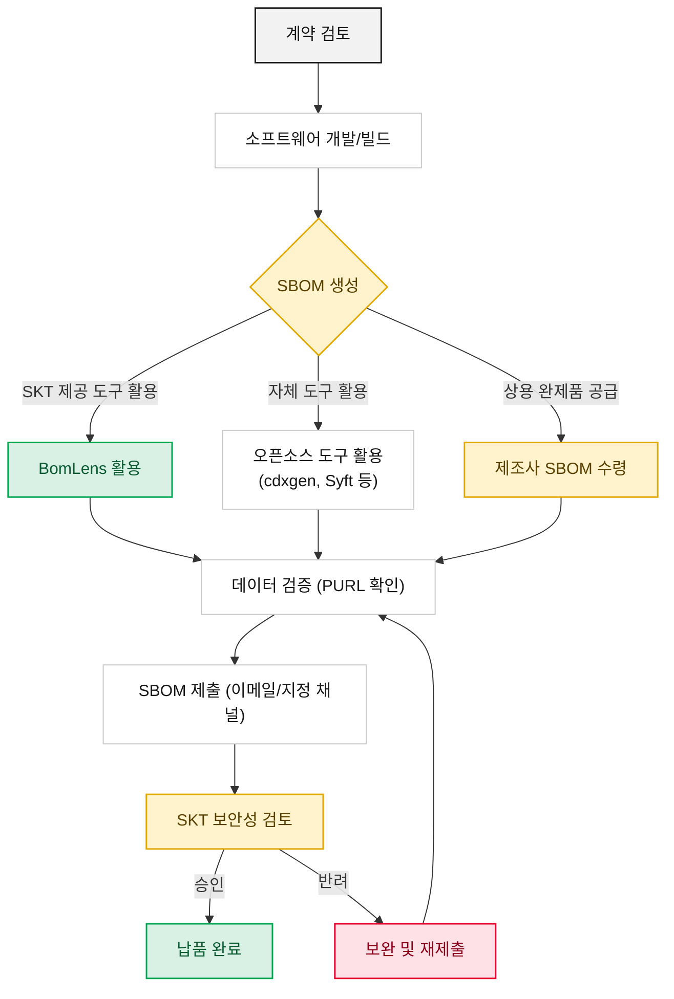

SK텔레콤은 소프트웨어 공급망의 투명성과 보안성을 강화하기 위해, 공급사로부터 납품받는 모든 소프트웨어 구성 요소 및 의존성에 대한 SBOM(Software Bill of Materials) 제출을 요청드리고 있습니다. 본 가이드는 공급사가 SK텔레콤의 보안 정책에 맞는 형식으로 SBOM을 생성하고 제출하는 방법을 안내합니다.

## 빠른 시작: 제출까지 5단계

1. [제출 요구사항](requirements/)에서 허용 포맷(CycloneDX JSON 권장)과 필수 데이터 필드를 확인합니다.
2. [SBOM 생성 방법](creation-guide/)에 따라 도구를 선택해 SBOM을 생성합니다. 도구 환경 구축이 부담스럽다면 [BomLens](skt-scanner/)를 권장합니다.
3. OS 위에 애플리케이션을 얹어 납품하는 서버라면 [서버 SBOM 생성](server-delivery/)에 따라 층별로 생성해 합칩니다.
4. [검증 체크리스트](checklist/)로 PURL과 전이 의존성 포함 여부를 점검합니다.
5. [제출 절차](submission/)에 따라 파일명을 정하고 제출합니다.

타사가 제조한 상용 소프트웨어나 완제품을 공급해 소스코드에 접근할 수 없다면, 2~3단계 대신 [상용 소프트웨어 공급](commercial-software/)에 따라 제조사로부터 SBOM을 받아 제출합니다. 제출한 SBOM이 반려되면 [자주 발생하는 반려 사유](rejection-reasons/)에서 원인별 해결 방법을 확인합니다.

## 적용 대상

다음 형태의 소프트웨어를 납품하는 모든 공급사(개발사, 리셀러 포함)는 본 가이드라인의 적용을 받습니다.

*   소스코드: Java, Python, JavaScript, Go, C/C++ 등으로 작성된 애플리케이션
*   컨테이너 이미지: Docker 이미지 또는 OCI 호환 컨테이너
*   실행 파일: 컴파일된 바이너리(.jar, .dll, .so) 및 라이브러리
*   임베디드 시스템: 펌웨어 이미지, RootFS, 디바이스 드라이버
*   서버: OS(rootfs와 설치 패키지) 위에 애플리케이션과 정적 링크 라이브러리가 결합된 시스템
*   상용 소프트웨어·완제품: 타사가 제조한 패키지 소프트웨어 또는 어플라이언스 장비 (리셀러·총판 공급 포함)

## SBOM 제출 프로세스

공급사는 계약 시점부터 최종 납품까지 아래의 절차에 따라 진행하시기 바랍니다.

```mermaid
flowchart TD
    A[계약 검토] --> B["소프트웨어 개발/빌드"]
    B --> C{SBOM 생성}
    C -->|SKT 제공 도구 활용| D[BomLens 활용]
    C -->|자체 도구 활용| E["오픈소스 도구 활용<br>(cdxgen, Syft 등)"]
    C -->|상용 완제품 공급| K[제조사 SBOM 수령]
    D --> F["데이터 검증 (PURL 확인)"]
    E --> F
    K --> F
    F --> G["SBOM 제출 (이메일/지정 채널)"]
    G --> H[SKT 보안성 검토]
    H -->|승인| I[납품 완료]
    H -->|반려| J[보완 및 재제출]
    J --> F

    classDef start fill:#F2F2F2,stroke:#171717,color:#171717,stroke-width:1.5px
    classDef proc fill:#ffffff,stroke:#c8c8c8,color:#171717,stroke-width:1px
    classDef decision fill:#FFF3CD,stroke:#E0A800,color:#5A4100,stroke-width:1.5px
    classDef good fill:#D9F0E4,stroke:#00A651,color:#0A5A32,stroke-width:1.5px
    classDef danger fill:#FDE1E7,stroke:#EA002C,color:#8A0019,stroke-width:1.5px
    classDef vendor fill:#FFF3CD,stroke:#E0A800,color:#5A4100,stroke-width:1.5px

    class A start
    class B,E,F,G proc
    class C,H decision
    class D,I good
    class J danger
    class K vendor

```

## 관련 문서

- [SK텔레콤 공급망 보안 정책](/guide/supply-chain/overview/policy/): SBOM 제출 의무화 정책 배경 및 원칙
- [글로벌 규제 동향](/guide/supply-chain/overview/regulations/): SBOM 관련 국내외 규제 현황
