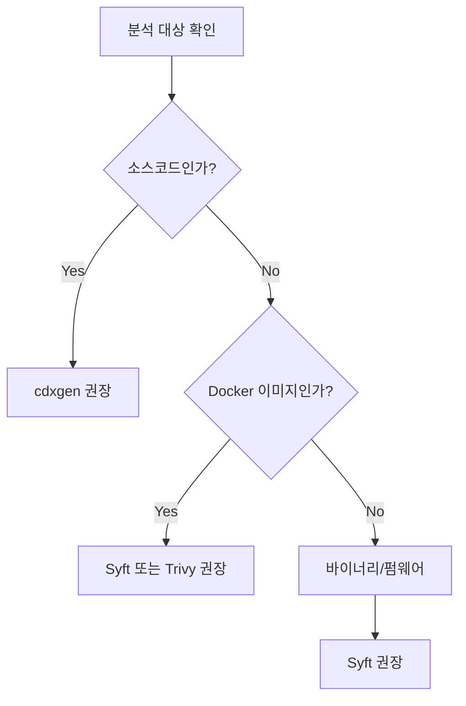

## 개요

SK텔레콤 제공 도구를 사용할 수 없거나, 이미 자체적인 빌드 파이프라인을 보유한 경우 오픈소스 도구를 활용할 수 있습니다. 본 가이드에서는 SK텔레콤이 검증한 오픈소스 도구들의 사용법을 안내합니다. 

> 도구 환경 구축에 익숙하지 않은 경우, Docker가 설치되어 있다면 [SK텔레콤 제공 도구](../skt-scanner/)를 참고하시기 바랍니다.

## 도구 선택 가이드

## 상세 가이드

하위 메뉴에서 각 도구별 상세 사용법을 확인하실 수 있습니다.

1. [빠른 시작 (cdxgen)](quickstart/): 가장 범용적으로 사용되는 cdxgen 도구 사용법
2. [언어별 가이드](languages/): Java, Python, Node.js 등 언어별 전용 도구 설정법
3. [Docker 이미지](docker/): 컨테이너 이미지 및 파일시스템 분석 방법
