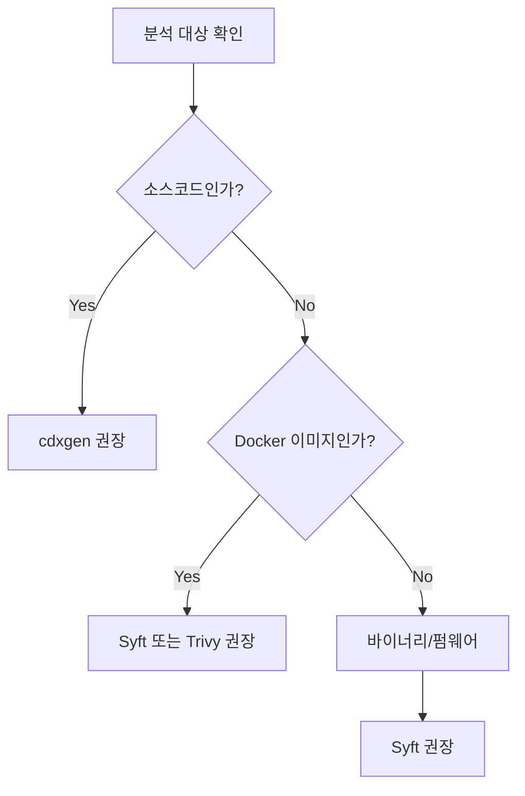

SKT 제공 도구를 사용할 수 없거나, 이미 자체적인 빌드 파이프라인을 보유한 경우 오픈소스 도구를 직접 활용할 수 있습니다. 아래는 SK텔레콤이 검증한 주요 오픈소스 도구 목록과 공식 사용법 링크입니다.

> 도구 환경 구축에 익숙하지 않은 경우, Docker가 설치되어 있다면 [SKT 제공 도구](../skt-scanner/)를 먼저 검토해 보시기 바랍니다.

## 도구 선택 가이드

## 주요 도구 안내

### cdxgen (소스코드 분석 권장)

Java, Python, Node.js, Go 등 다양한 언어 프로젝트를 자동 분석하여 CycloneDX 형식의 SBOM을 생성합니다.

- 공식 문서: [https://cyclonedx.github.io/cdxgen/](https://cyclonedx.github.io/cdxgen/)
- GitHub: [https://github.com/CycloneDX/cdxgen](https://github.com/CycloneDX/cdxgen)
- 지원 언어: Java (Maven/Gradle), Python, Node.js, Go, Ruby, PHP, Rust, .NET, C/C++ 등

### Syft (컨테이너 이미지 및 바이너리 분석 권장)

Docker 이미지, 파일시스템, 바이너리 파일을 분석하여 OS 패키지와 애플리케이션 라이브러리를 모두 식별합니다. CycloneDX 및 SPDX 형식을 지원합니다.

- 공식 문서: [https://github.com/anchore/syft](https://github.com/anchore/syft)
- 지원 대상: Docker 이미지, OCI 이미지, tar 파일, 파일시스템 디렉토리

### Trivy (컨테이너 이미지 분석)

컨테이너 이미지 분석과 취약점 스캔을 함께 수행할 수 있는 올인원 도구입니다.

- 공식 문서: [https://aquasecurity.github.io/trivy/](https://aquasecurity.github.io/trivy/)
- GitHub: [https://github.com/aquasecurity/trivy](https://github.com/aquasecurity/trivy)

### 언어별 전용 플러그인

빌드 도구 플러그인을 사용하면 더 정확한 의존성 정보를 추출할 수 있습니다.

| 언어/빌드 도구 | 플러그인/도구 | 공식 문서 |
|---|---|---|
| Java (Maven) | cyclonedx-maven-plugin | [링크](https://github.com/CycloneDX/cyclonedx-maven-plugin) |
| Java (Gradle) | cyclonedx-gradle-plugin | [링크](https://github.com/CycloneDX/cyclonedx-gradle-plugin) |
| Python | cyclonedx-bom | [링크](https://github.com/CycloneDX/cyclonedx-python) |
| Node.js | @cyclonedx/cyclonedx-npm | [링크](https://github.com/CycloneDX/cyclonedx-node-npm) |
| Go | cyclonedx-gomod | [링크](https://github.com/CycloneDX/cyclonedx-gomod) |

## 전이적 의존성 포함 확인

> **SK텔레콤 제출 SBOM은 전이적 의존성(Transitive Dependencies)을 반드시 포함해야 합니다.**

전이적 의존성이란 프로젝트가 직접 선언하지 않았지만, 사용하는 라이브러리가 내부적으로 의존하는 라이브러리를 말합니다. 이 항목이 누락되면 숨겨진 취약점을 탐지할 수 없어 SBOM이 반려될 수 있습니다.

**핵심 원칙: 빌드(패키지 설치) 완료 후 SBOM을 생성해야 합니다.**

소스코드만 있는 상태에서는 전이적 의존성이 누락될 수 있습니다. 아래 표를 참고하여 SBOM 생성 전에 선행 작업을 완료하십시오.

### 도구별 전이적 의존성 지원 현황

| 도구 / 방법 | 전이적 의존성 포함 | SBOM 생성 전 선행 작업 |
|---|:---:|---|
| **cdxgen** (소스코드) | 자동 포함 | 별도 빌드 불필요 (자동 감지) |
| **cdxgen** (Java/Maven) | 조건부 | `mvn package` 또는 `mvn dependency:resolve` 먼저 실행 |
| **cdxgen** (Java/Gradle) | 조건부 | `./gradlew dependencies` 먼저 실행 |
| **cdxgen** (Python) | 조건부 | 가상환경 활성화 후 `pip install -r requirements.txt` 먼저 실행 |
| **cdxgen** (Node.js) | 조건부 | `npm install` 또는 `yarn install` 먼저 실행 |
| **Syft** (Docker 이미지) | 자동 포함 | 이미지 빌드 완료 후 스캔 (OS/앱 패키지 모두 포함) |
| **Syft** (파일시스템/RootFS) |  자동 포함 | 배포 아티팩트 기준으로 스캔 |
| **Maven 플러그인** | 자동 포함 | `mvn package` 단계에서 자동 생성 |
| **Gradle 플러그인** | 자동 포함 | `./gradlew cyclonedxBom` 실행 |

> 💡 **권장**: Docker 이미지로 납품하는 경우, 빌드된 이미지를 Syft로 스캔하면 소스코드 분석보다 더 완전한 전이적 의존성을 포함할 수 있습니다.

## 공통 주의사항

도구를 사용하기 전 아래 사항을 확인하십시오.

- **전이적 의존성 포함 여부**: 위 표를 참고하여 SBOM 생성 전 선행 작업을 완료합니다. 의존성 누락은 반려 사유가 됩니다.
- **PURL 포함 여부**: 생성된 SBOM에 모든 컴포넌트의 `purl` 필드가 포함되어 있는지 확인합니다. SK텔레콤 시스템은 PURL을 기반으로 취약점을 매핑합니다.
- **출력 포맷**: CycloneDX JSON 형식을 권장합니다. (`-o cyclonedx-json` 또는 동등한 옵션 사용)
- **프로젝트 정보**: 메타데이터에 납품 프로젝트의 이름과 버전이 정확히 기입되었는지 확인합니다.

## 관련 문서

- [제출 요구사항](../requirements/): SBOM에 포함되어야 할 필수 데이터 필드
- [검증 체크리스트](../checklist/): 제출 전 확인 사항
- [SKT 제공 도구](../skt-scanner/): 설정 없이 바로 사용 가능한 SKT 표준 도구
