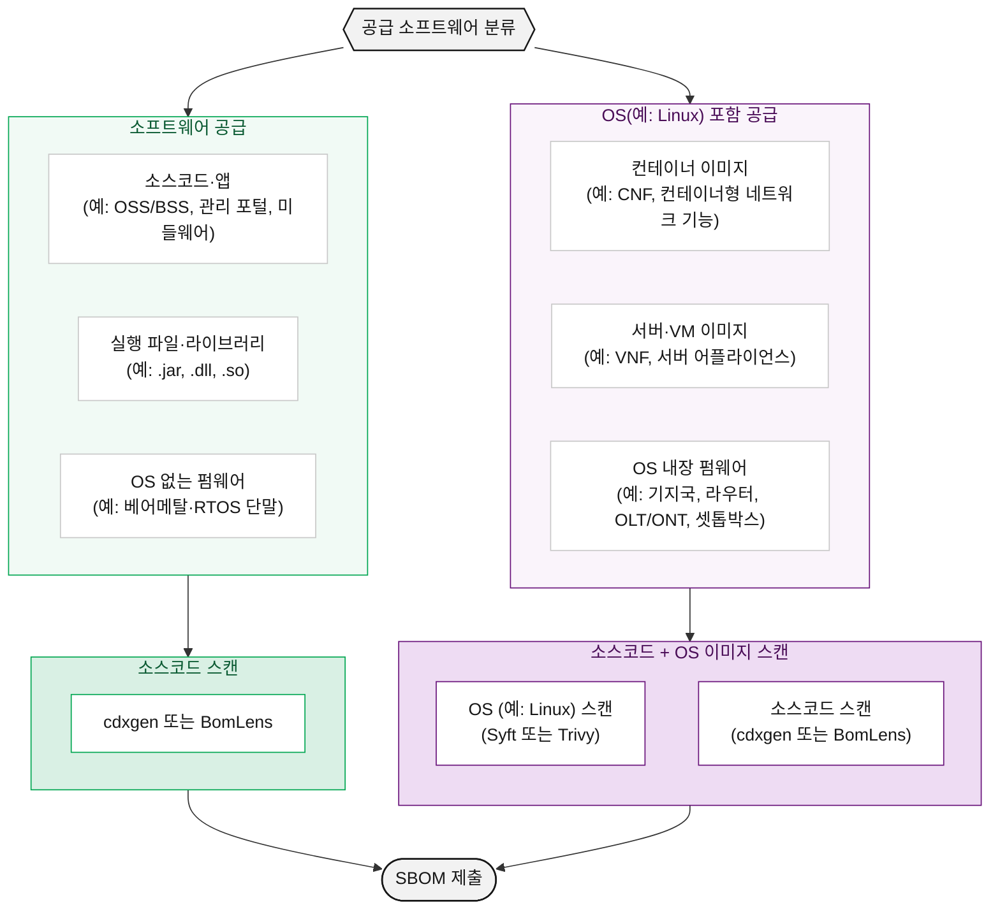

> 도구 환경 구축에 익숙하지 않은 경우, Docker가 설치되어 있다면 [BomLens](../skt-scanner/)를 먼저 검토해 보시기 바랍니다.

## 도구 선택 가이드


```mermaid
graph TD
    A{{"공급 소프트웨어 분류"}}

    subgraph G1["소프트웨어 공급"]
      direction LR
      T1["소스코드·앱<br>(예: OSS/BSS, 관리 포털, 미들웨어)"]
      T2["실행 파일·라이브러리<br>(예: .jar, .dll, .so)"]
      T3["OS 없는 펌웨어<br>(예: 베어메탈·RTOS 단말)"]
    end

    subgraph G2["OS(예: Linux) 포함 공급"]
      direction LR
      T4["컨테이너 이미지<br>(예: CNF, 컨테이너형 네트워크 기능)"]
      T5["서버·VM 이미지<br>(예: VNF, 서버 어플라이언스)"]
      T6["OS 내장 펌웨어<br>(예: 기지국, 라우터, OLT/ONT, 셋톱박스)"]
    end

    %% 좌측: 소스코드 스캔 서브 박스 구조
    subgraph M1["소스코드 스캔"]
      M1_Sub["cdxgen 또는 BomLens"]
    end

    %% 우측: 소스코드 + OS 이미지 스캔 서브 박스 구조 (세로 배치)
    subgraph M2["소스코드 + OS 이미지 스캔"]
      direction TB
      M2_Top["OS (예: Linux) 스캔<br>(Syft 또는 Trivy)"]
      M2_Bottom["소스코드 스캔<br>(cdxgen 또는 BomLens)"]
    end

    A --> G1
    A --> G2
    
    %% 그룹 박스 경계로만 연결 (박스당 화살표 1개)
    G1 --> M1
    G2 --> M2
    
    %% 그룹 박스에서 다음 단계로 연결
    M1 --> P(["SBOM 제출"])
    M2 --> P

    classDef start fill:#F2F2F2,stroke:#171717,color:#171717,stroke-width:1.5px
    classDef typebox fill:#ffffff,stroke:#c8c8c8,color:#171717,stroke-width:1px
    classDef submit fill:#F2F2F2,stroke:#171717,color:#171717,stroke-width:1.5px
    
    %% 내부 단일 박스용 흰색 스타일 정의 (좌/우 테두리 색상 구분)
    classDef subwhite_left fill:#ffffff,stroke:#00A651,color:#171717,stroke-width:1px
    classDef subwhite_right fill:#ffffff,stroke:#68127A,color:#171717,stroke-width:1px

    class A start
    class T1,T2,T3,T4,T5,T6 typebox
    class M1_Sub subwhite_left
    class M2_Top,M2_Bottom subwhite_right
    class P submit

    style G1 fill:#F1FAF5,stroke:#00A651,stroke-width:1px,color:#0A5A32
    style G2 fill:#FAF4FB,stroke:#68127A,stroke-width:1px,color:#4A0D57
    
    %% 외곽 박스 스타일 (배경색 및 테두리 유지)
    style M1 fill:#D9F0E4,stroke:#00A651,stroke-width:1px,color:#0A5A32
    style M2 fill:#EEDCF3,stroke:#68127A,stroke-width:1px,color:#4A0D57

```

소스코드·앱, 실행 파일이나 라이브러리, OS 없는 펌웨어는 모두 자기가 개발한 소스코드를 cdxgen 또는 [BomLens](../skt-scanner/)로 스캔합니다. 완성된 바이너리를 그대로 스캔하면 패키지 매니저 메타데이터가 없어 purl이 누락되고 반려됩니다.

OS나 베이스 이미지를 포함해 공급하는 경우(컨테이너 이미지, 서버, OS 내장 펌웨어)는 두 층으로 나눠 각각 스캔합니다. OS 층은 납품되는 상태의 이미지나 rootfs를 Syft 또는 Trivy로 스캔하고, 소스코드(앱 층)는 cdxgen 또는 BomLens로 스캔한 뒤 둘을 합쳐 제출합니다. 이때 OS 층의 스캔 대상은 받아온 원본 베이스가 아니라 빌드가 끝나 납품되는 이미지나 rootfs입니다. 빌드 과정에서 설치한 OS 패키지까지 포함해야 하기 때문입니다. 전체 절차는 [서버 SBOM 생성](../server-delivery/)을 참고하세요.

정적 링크된 라이브러리나 수동으로 넣은 바이너리는 위 어느 스캔으로도 잡히지 않는 사각지대입니다. 이 경우의 처리는 [서버 SBOM 생성](../server-delivery/)의 정적 링크 라이브러리 절을 참고하세요.

타사가 제조한 상용 소프트웨어나 완제품을 공급해 소스코드에 접근할 수 없는 경우는 스캔 대신 제조사로부터 SBOM을 받아 제출합니다. [상용 소프트웨어 공급](../commercial-software/)을 참고하세요.

## 주요 도구 안내

### cdxgen (소스코드 분석 권장)

Java, Python, Node.js, Go 등 다양한 언어 프로젝트를 자동 분석하여 CycloneDX 형식의 SBOM을 생성합니다.

- 공식 문서: [https://cdxgen.github.io/cdxgen](https://cdxgen.github.io/cdxgen)
- GitHub: [https://github.com/CycloneDX/cdxgen](https://github.com/CycloneDX/cdxgen)
- 지원 언어: Java (Maven/Gradle), Python, Node.js, Go, Ruby, PHP, Rust, .NET, C/C++ 등

> cdxgen은 lockfile이나 매니페스트를 정적으로 해석합니다. 정확한 결과를 얻으려면 의존성이 설치되거나 해결된 상태(lockfile이 있거나 빌드한 뒤)에서 실행하시기 바랍니다. 의존성이 해결되지 않은 순수 소스만 스캔하면 일부 컴포넌트나 purl이 누락될 수 있습니다.

### Syft (컨테이너 이미지 및 바이너리 분석 권장)

빌드된 컨테이너 이미지나 패키지 매니저 메타데이터가 포함된 빌드 산출물을 분석하여 OS 패키지와 애플리케이션 라이브러리를 모두 식별합니다. CycloneDX 및 SPDX 형식을 지원합니다.

- 공식 문서: [https://github.com/anchore/syft](https://github.com/anchore/syft)
- 권장 분석 대상: 빌드된 Docker 이미지, OCI 이미지, tar 파일

{}
`syft dir:` 모드로 패키지 매니저 메타데이터(`package.json`, `go.mod`, `*.jar`, RPM/DEB 패키지 DB 등)가
없는 설치 디렉터리나 바이너리 모음을 스캔하면, Syft가 생태계(ecosystem)를 식별하지 못해 **purl이 비어 있는
SBOM**이 생성됩니다. SK텔레콤 시스템은 purl로 취약점을 매핑하므로, 이런 SBOM은 매칭이 전량 실패하여 반려됩니다.

실제로 한 공급사가 `syft dir:/root/nag_pkg`로 설치 디렉터리를 스캔해 제출한 SBOM은 261개 컴포넌트 중 purl이
하나도 없어, 취약점 매칭 251건이 모두 실패했습니다.

Syft는 다음 대상으로 실행하시기 바랍니다.

```bash
# 권장: 빌드된 이미지 스캔 (purl과 생태계를 자동 식별)
syft <이미지명>:<태그> -o cyclonedx-json=sbom.json

# 비권장: 설치 디렉터리나 원시 파일 스캔 (purl 누락으로 반려)
syft dir:/root/nag_pkg   # 패키지 매니저 메타데이터가 없으면 purl이 0개가 됩니다
```

생성 직후 반드시 purl 개수를 확인하시기 바랍니다. 검증 방법은 [검증 체크리스트](../checklist/)를 참고하십시오.
{}

CentOS 등 OS 위에 애플리케이션을 올려 납품하는 서버는 OS(rootfs/이미지)와 애플리케이션 두 층으로 나눠 생성하고, 정적 링크 라이브러리는 별도로 보강한 뒤 하나로 합칩니다. OS 층은 위 경고대로 패키지 데이터베이스가 있는 rootfs나 이미지를 대상으로 해야 합니다. 전체 절차는 [서버 SBOM 생성](../server-delivery/)을 참고하세요.

### Trivy (컨테이너 이미지 분석)

컨테이너 이미지 분석과 취약점 스캔을 함께 수행할 수 있는 올인원 도구입니다.

- 공식 문서: [https://aquasecurity.github.io/trivy/](https://aquasecurity.github.io/trivy/)
- GitHub: [https://github.com/aquasecurity/trivy](https://github.com/aquasecurity/trivy)

{}
2026년 3월, 공격자가 `aquasecurity/trivy`의 기존 릴리즈 태그를 재지정하여 악성코드를 삽입하는
공급망 공격이 발생하였습니다. **GitHub 릴리즈 v0.69.4(3/19) 및 DockerHub 이미지
v0.69.5·v0.69.6(3/22)이 오염된 것으로 확인되었으므로 사용을 중단하시기 바랍니다.**

Trivy를 안전하게 사용하려면 다음 원칙을 따르시기 바랍니다.

- **GitHub Actions**: 가변 태그(`@master`, `@latest`, `@v1` 등) 대신 고정된 Commit SHA 또는 검증된 버전 태그를 사용합니다.

  ```yaml
  # 권장: 검증된 버전 고정
  - uses: aquasecurity/trivy-action@0.35.0
  # 더 안전: Commit SHA 고정
  - uses: aquasecurity/trivy-action@<commit-sha>
  ```

- **Docker 이미지**: 특정 버전 태그를 명시하거나 이미지 다이제스트(`@sha256:...`)로 고정합니다.

  ```bash
  docker run aquasecurity/trivy:<검증된-버전> image <대상-이미지>
  ```

- **공식 채널**: [GitHub Security Advisory](https://github.com/aquasecurity/trivy-action/security/advisories)를 통해 최신 보안 권고사항을 확인합니다.

이 사례는 오픈소스 도구를 도입할 때 버전을 고정하지 않으면 언제든 공급망 공격에 노출될 수 있음을 보여줍니다. 모든 외부 도구는 버전을 명시하고 무결성을 검증한 뒤 사용하시기 바랍니다.
{}

### 언어별 전용 플러그인

빌드 도구 플러그인을 사용하면 더 정확한 의존성 정보를 추출할 수 있습니다.

| 언어/빌드 도구 | 플러그인/도구 | 공식 문서 |
|---|---|---|
| Java (Maven) | cyclonedx-maven-plugin | [링크](https://github.com/CycloneDX/cyclonedx-maven-plugin) |
| Java (Gradle) | cyclonedx-gradle-plugin | [링크](https://github.com/CycloneDX/cyclonedx-gradle-plugin) |
| Python | cyclonedx-bom | [링크](https://github.com/CycloneDX/cyclonedx-python) |
| Node.js | @cyclonedx/cyclonedx-npm | [링크](https://github.com/CycloneDX/cyclonedx-node-npm) |
| Go | cyclonedx-gomod | [링크](https://github.com/CycloneDX/cyclonedx-gomod) |

## 전이적 의존성 포함 확인

어떤 도구를 쓰든 핵심 원칙은 하나입니다. 빌드(패키지 설치)가 완료된 상태에서 SBOM을 생성해야 전이적 의존성까지 포함됩니다. 소스코드만 있는 상태에서 생성하면 전이적 의존성이 누락되어 반려될 수 있습니다. Docker 이미지로 납품하는 경우, 빌드된 이미지를 Syft로 스캔하면 소스코드 분석보다 더 완전한 전이적 의존성을 포함할 수 있습니다.

의존성 범위 요구사항과 언어별 빌드 선행 명령은 [제출 요구사항](../requirements/)의 의존성 범위 절을 참고하세요.

## 공통 주의사항

도구를 사용하기 전 아래 사항을 확인하시기 바랍니다.

- 전이적 의존성 포함 여부: 빌드 완료 후 생성 원칙을 지킵니다. 의존성 누락은 반려 사유가 됩니다.
- PURL 포함 여부: 생성된 SBOM에 모든 컴포넌트의 `purl` 필드가 포함되어 있는지 확인합니다. SK텔레콤 시스템은 PURL을 기반으로 취약점을 매핑합니다. 확인 명령과 재생성 절차는 [검증 체크리스트](../checklist/)를 참고하세요.
- 출력 포맷: CycloneDX JSON 형식을 권장합니다. (`-o cyclonedx-json` 또는 동등한 옵션 사용)
- 프로젝트 정보: 메타데이터에 납품 프로젝트의 이름과 버전이 정확히 기입되었는지 확인합니다.

## 관련 문서

- [서버 SBOM 생성](../server-delivery/): OS·애플리케이션·정적 링크가 결합된 서버를 층별로 생성하고 합치는 방법
- [제출 요구사항](../requirements/): SBOM에 포함되어야 할 필수 데이터 필드
- [검증 체크리스트](../checklist/): 제출 전 확인 사항
- [BomLens](../skt-scanner/): SK텔레콤이 제공하는 SBOM 생성 도구
