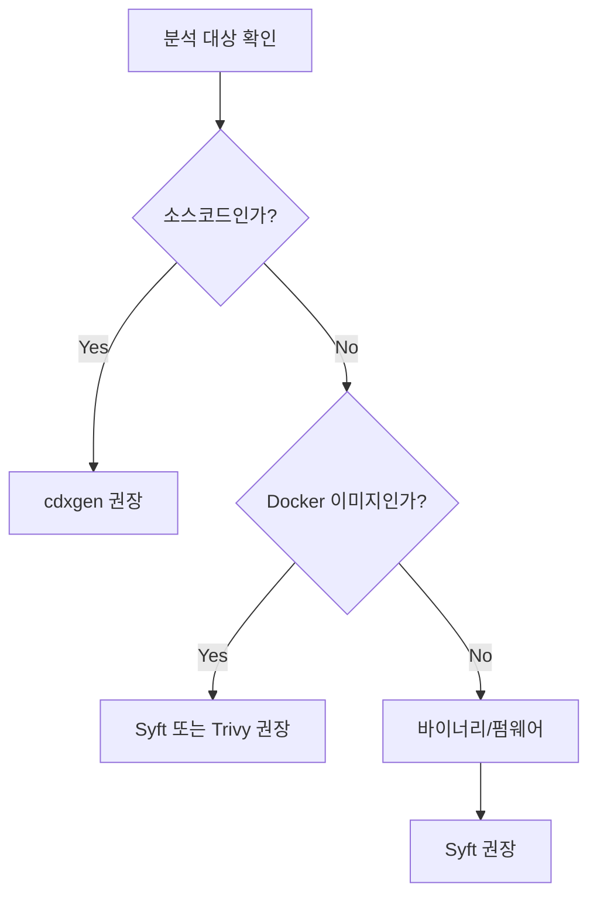

SKT 제공 도구를 사용할 수 없거나, 이미 자체적인 빌드 파이프라인을 보유한 경우 오픈소스 도구를 직접 활용할 수 있습니다. 아래는 SK텔레콤이 검증한 주요 오픈소스 도구 목록과 공식 사용법 링크입니다.

> 도구 환경 구축에 익숙하지 않은 경우, Docker가 설치되어 있다면 [BomLens](../skt-scanner/)를 먼저 검토해 보시기 바랍니다.

## 도구 선택 가이드


```mermaid
graph TD
    A[분석 대상 확인] --> B{소스코드인가?}
    B -- Yes --> C[cdxgen 권장]
    B -- No --> D{Docker 이미지인가?}
    D -- Yes --> E[Syft 또는 Trivy 권장]
    D -- No --> F[바이너리/펌웨어]
    F --> G[Syft 권장]
```

## 주요 도구 안내

### cdxgen (소스코드 분석 권장)

Java, Python, Node.js, Go 등 다양한 언어 프로젝트를 자동 분석하여 CycloneDX 형식의 SBOM을 생성합니다.

- 공식 문서: [https://cdxgen.github.io/cdxgen](https://cdxgen.github.io/cdxgen)
- GitHub: [https://github.com/CycloneDX/cdxgen](https://github.com/CycloneDX/cdxgen)
- 지원 언어: Java (Maven/Gradle), Python, Node.js, Go, Ruby, PHP, Rust, .NET, C/C++ 등

### Syft (컨테이너 이미지 및 바이너리 분석 권장)

빌드된 컨테이너 이미지나 패키지 매니저 메타데이터가 포함된 빌드 산출물을 분석하여 OS 패키지와 애플리케이션 라이브러리를 모두 식별합니다. CycloneDX 및 SPDX 형식을 지원합니다.

- 공식 문서: [https://github.com/anchore/syft](https://github.com/anchore/syft)
- 권장 분석 대상: 빌드된 Docker 이미지, OCI 이미지, tar 파일

{}
`syft dir:` 모드로 패키지 매니저 메타데이터(`package.json`, `go.mod`, `*.jar`, RPM/DEB 패키지 DB 등)가
없는 설치 디렉터리나 바이너리 모음을 스캔하면, Syft가 생태계(ecosystem)를 식별하지 못해 **purl이 비어 있는
SBOM**이 생성됩니다. SK텔레콤 시스템은 purl로 취약점을 매핑하므로, 이런 SBOM은 매칭이 전량 실패하여 반려됩니다.

실제로 한 공급사가 `syft dir:/root/nag_pkg`로 설치 디렉터리를 스캔해 제출한 SBOM은 261개 컴포넌트 중 purl이
하나도 없어, 취약점 매칭 251건이 모두 실패했습니다.

Syft는 다음 대상으로 실행하시기 바랍니다.

```bash
# 권장: 빌드된 이미지 스캔 (purl과 생태계를 자동 식별)
syft <이미지명>:<태그> -o cyclonedx-json=sbom.json

# 비권장: 설치 디렉터리나 원시 파일 스캔 (purl 누락으로 반려)
syft dir:/root/nag_pkg   # 패키지 매니저 메타데이터가 없으면 purl이 0개가 됩니다
```

생성 직후 반드시 purl 개수를 확인하시기 바랍니다. 검증 방법은 [검증 체크리스트](../checklist/)를 참고하십시오.
{}

### Trivy (컨테이너 이미지 분석)

컨테이너 이미지 분석과 취약점 스캔을 함께 수행할 수 있는 올인원 도구입니다.

- 공식 문서: [https://aquasecurity.github.io/trivy/](https://aquasecurity.github.io/trivy/)
- GitHub: [https://github.com/aquasecurity/trivy](https://github.com/aquasecurity/trivy)

{}
2026년 3월, 공격자가 `aquasecurity/trivy`의 기존 릴리즈 태그를 재지정하여 악성코드를 삽입하는
공급망 공격이 발생하였습니다. **GitHub 릴리즈 v0.69.4(3/19) 및 DockerHub 이미지
v0.69.5·v0.69.6(3/22)이 오염된 것으로 확인되었으므로 사용을 중단하시기 바랍니다.**

Trivy를 안전하게 사용하려면 다음 원칙을 따르시기 바랍니다.

- **GitHub Actions**: 가변 태그(`@master`, `@latest`, `@v1` 등) 대신 고정된 Commit SHA 또는 검증된 버전 태그를 사용합니다.

  ```yaml
  # 권장: 검증된 버전 고정
  - uses: aquasecurity/trivy-action@0.35.0
  # 더 안전: Commit SHA 고정
  - uses: aquasecurity/trivy-action@<commit-sha>
  ```

- **Docker 이미지**: 특정 버전 태그를 명시하거나 이미지 다이제스트(`@sha256:...`)로 고정합니다.

  ```bash
  docker run aquasecurity/trivy:<검증된-버전> image <대상-이미지>
  ```

- **공식 채널**: [GitHub Security Advisory](https://github.com/aquasecurity/trivy-action/security/advisories)를 통해 최신 보안 권고사항을 확인합니다.

이 사례는 오픈소스 도구를 도입할 때 버전을 고정하지 않으면 언제든 공급망 공격에 노출될 수 있음을 보여줍니다. 모든 외부 도구는 버전을 명시하고 무결성을 검증한 뒤 사용하시기 바랍니다.
{}

### 언어별 전용 플러그인

빌드 도구 플러그인을 사용하면 더 정확한 의존성 정보를 추출할 수 있습니다.

| 언어/빌드 도구 | 플러그인/도구 | 공식 문서 |
|---|---|---|
| Java (Maven) | cyclonedx-maven-plugin | [링크](https://github.com/CycloneDX/cyclonedx-maven-plugin) |
| Java (Gradle) | cyclonedx-gradle-plugin | [링크](https://github.com/CycloneDX/cyclonedx-gradle-plugin) |
| Python | cyclonedx-bom | [링크](https://github.com/CycloneDX/cyclonedx-python) |
| Node.js | @cyclonedx/cyclonedx-npm | [링크](https://github.com/CycloneDX/cyclonedx-node-npm) |
| Go | cyclonedx-gomod | [링크](https://github.com/CycloneDX/cyclonedx-gomod) |

## 전이적 의존성 포함 확인

> SK텔레콤 제출 SBOM은 전이적 의존성(Transitive Dependencies)을 반드시 포함해야 합니다.

전이적 의존성이란 프로젝트가 직접 선언하지 않았지만, 사용하는 라이브러리가 내부적으로 의존하는 라이브러리를 말합니다. 이 항목이 누락되면 숨겨진 취약점을 탐지할 수 없어 SBOM이 반려될 수 있습니다.

핵심 원칙: 빌드(패키지 설치) 완료 후 SBOM을 생성해야 합니다.

소스코드만 있는 상태에서는 전이적 의존성이 누락될 수 있습니다. 아래 표를 참고하여 SBOM 생성 전에 선행 작업을 완료하시기 바랍니다.

### 도구별 전이적 의존성 지원 현황

| 도구 / 방법 | 전이적 의존성 포함 | SBOM 생성 전 선행 작업 |
|---|:---:|---|
| cdxgen (소스코드) | 자동 포함 | 별도 빌드 불필요 (자동 감지) |
| cdxgen (Java/Maven) | 조건부 | `mvn package` 또는 `mvn dependency:resolve` 먼저 실행 |
| cdxgen (Java/Gradle) | 조건부 | `./gradlew dependencies` 먼저 실행 |
| cdxgen (Python) | 조건부 | 가상환경 활성화 후 `pip install -r requirements.txt` 먼저 실행 |
| cdxgen (Node.js) | 조건부 | `npm install` 또는 `yarn install` 먼저 실행 |
| Syft (Docker 이미지) | 자동 포함 | 이미지 빌드 완료 후 스캔 (OS/앱 패키지 모두 포함) |
| Syft (파일시스템) | 조건부 | 패키지 매니저 메타데이터가 포함된 배포 아티팩트만 가능. 설치 디렉터리나 원시 파일 모음은 purl이 누락됨 |
| Maven 플러그인 | 자동 포함 | `mvn package` 단계에서 자동 생성 |
| Gradle 플러그인 | 자동 포함 | `./gradlew cyclonedxBom` 실행 |

> 권장: Docker 이미지로 납품하는 경우, 빌드된 이미지를 Syft로 스캔하면 소스코드 분석보다 더 완전한 전이적 의존성을 포함할 수 있습니다.

## 공통 주의사항

도구를 사용하기 전 아래 사항을 확인하시기 바랍니다.

- 전이적 의존성 포함 여부: 위 표를 참고하여 SBOM 생성 전 선행 작업을 완료합니다. 의존성 누락은 반려 사유가 됩니다.
- PURL 포함 여부: 생성된 SBOM에 모든 컴포넌트의 `purl` 필드가 포함되어 있는지 확인합니다. SK텔레콤 시스템은 PURL을 기반으로 취약점을 매핑합니다. 제출 전 `jq '[.components[] | select(.purl)] | length' sbom.json`으로 purl 보유 컴포넌트 수를 세어 전체 컴포넌트 수와 일치하는지 확인하고, 0이거나 현저히 적으면 [검증 체크리스트](../checklist/)의 절차에 따라 재생성하시기 바랍니다.
- 출력 포맷: CycloneDX JSON 형식을 권장합니다. (`-o cyclonedx-json` 또는 동등한 옵션 사용)
- 프로젝트 정보: 메타데이터에 납품 프로젝트의 이름과 버전이 정확히 기입되었는지 확인합니다.

## 관련 문서

- [서버 SBOM 생성](../server-delivery/): OS·애플리케이션·정적 링크가 결합된 서버를 층별로 생성하고 합치는 방법
- [제출 요구사항](../requirements/): SBOM에 포함되어야 할 필수 데이터 필드
- [검증 체크리스트](../checklist/): 제출 전 확인 사항
- [BomLens](../skt-scanner/): SK텔레콤이 제공하는 SBOM 생성 도구
