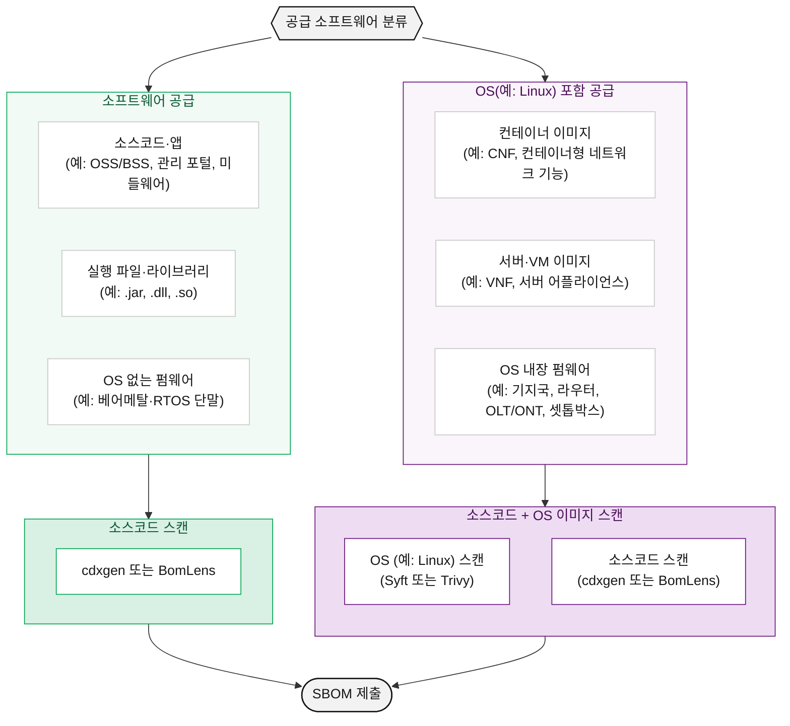

> 도구 환경 구축에 익숙하지 않은 경우, Docker가 설치되어 있다면 [BomLens](../skt-scanner/)를 먼저 검토해 보시기 바랍니다.

## 도구 선택 가이드


```mermaid
graph TD
    A{{"공급 소프트웨어 분류"}}

    subgraph G1["소프트웨어 공급"]
      direction LR
      T1["소스코드·앱<br>(예: OSS/BSS, 관리 포털, 미들웨어)"]
      T2["실행 파일·라이브러리<br>(예: .jar, .dll, .so)"]
      T3["OS 없는 펌웨어<br>(예: 베어메탈·RTOS 단말)"]
    end

    subgraph G2["OS(예: Linux) 포함 공급"]
      direction LR
      T4["컨테이너 이미지<br>(예: CNF, 컨테이너형 네트워크 기능)"]
      T5["서버·VM 이미지<br>(예: VNF, 서버 어플라이언스)"]
      T6["OS 내장 펌웨어<br>(예: 기지국, 라우터, OLT/ONT, 셋톱박스)"]
    end

    %% 좌측: 소스코드 스캔 서브 박스 구조
    subgraph M1["소스코드 스캔"]
      M1_Sub["cdxgen 또는 BomLens"]
    end

    %% 우측: 소스코드 + OS 이미지 스캔 서브 박스 구조 (세로 배치)
    subgraph M2["소스코드 + OS 이미지 스캔"]
      direction TB
      M2_Top["OS (예: Linux) 스캔<br>(Syft 또는 Trivy)"]
      M2_Bottom["소스코드 스캔<br>(cdxgen 또는 BomLens)"]
    end

    A --> G1
    A --> G2
    
    %% 그룹 박스 경계로만 연결 (박스당 화살표 1개)
    G1 --> M1
    G2 --> M2
    
    %% 그룹 박스에서 다음 단계로 연결
    M1 --> P(["SBOM 제출"])
    M2 --> P

    classDef start fill:#F2F2F2,stroke:#171717,color:#171717,stroke-width:1.5px
    classDef typebox fill:#ffffff,stroke:#c8c8c8,color:#171717,stroke-width:1px
    classDef submit fill:#F2F2F2,stroke:#171717,color:#171717,stroke-width:1.5px
    
    %% 내부 단일 박스용 흰색 스타일 정의 (좌/우 테두리 색상 구분)
    classDef subwhite_left fill:#ffffff,stroke:#00A651,color:#171717,stroke-width:1px
    classDef subwhite_right fill:#ffffff,stroke:#68127A,color:#171717,stroke-width:1px

    class A start
    class T1,T2,T3,T4,T5,T6 typebox
    class M1_Sub subwhite_left
    class M2_Top,M2_Bottom subwhite_right
    class P submit

    style G1 fill:#F1FAF5,stroke:#00A651,stroke-width:1px,color:#0A5A32
    style G2 fill:#FAF4FB,stroke:#68127A,stroke-width:1px,color:#4A0D57
    
    %% 외곽 박스 스타일 (배경색 및 테두리 유지)
    style M1 fill:#D9F0E4,stroke:#00A651,stroke-width:1px,color:#0A5A32
    style M2 fill:#EEDCF3,stroke:#68127A,stroke-width:1px,color:#4A0D57

```

소스코드·앱, 실행 파일이나 라이브러리, OS 없는 펌웨어는 모두 자기가 개발한 소스코드를 cdxgen 또는 [BomLens](../skt-scanner/)로 스캔합니다. 완성된 바이너리를 그대로 스캔하면 패키지 매니저 메타데이터가 없어 purl이 누락되고 반려됩니다.

OS나 베이스 이미지를 포함해 공급하는 경우(컨테이너 이미지, 서버, OS 내장 펌웨어)는 두 층으로 나눠 각각 스캔해 함께 제출합니다. OS 층은 납품되는 상태의 이미지나 rootfs를 Syft 또는 Trivy로, 소스코드(앱 층)는 cdxgen 또는 BomLens로 스캔합니다. 층별 명령과 파일 이름 규칙은 아래 [서버 납품](#서버-납품)에 있습니다.

정적 링크된 라이브러리나 수동으로 넣은 바이너리는 위 어느 스캔으로도 잡히지 않는 사각지대입니다. 처리 방법은 아래 [정적 링크 라이브러리](#정적-링크-라이브러리)에 있습니다.

타사가 제조한 상용 소프트웨어나 완제품을 공급해 소스코드에 접근할 수 없는 경우는 스캔 대신 제조사로부터 SBOM을 받아 제출합니다. [상용 소프트웨어 공급](../commercial-software/)을 참고하세요.

## 주요 도구 안내

### cdxgen (소스코드 분석 권장)

Java, Python, Node.js, Go 등 다양한 언어 프로젝트를 자동 분석하여 CycloneDX 형식의 SBOM을 생성합니다.

- 공식 문서: [https://cdxgen.github.io/cdxgen](https://cdxgen.github.io/cdxgen)
- GitHub: [https://github.com/CycloneDX/cdxgen](https://github.com/CycloneDX/cdxgen)
- 지원 언어: Java (Maven/Gradle), Python, Node.js, Go, Ruby, PHP, Rust, .NET, C/C++ 등

> cdxgen은 lockfile이나 매니페스트를 정적으로 해석합니다. 정확한 결과를 얻으려면 의존성이 설치되거나 해결된 상태(lockfile이 있거나 빌드한 뒤)에서 실행하시기 바랍니다. 의존성이 해결되지 않은 순수 소스만 스캔하면 일부 컴포넌트나 purl이 누락될 수 있습니다.

### Syft (컨테이너 이미지 및 바이너리 분석 권장)

빌드된 컨테이너 이미지나 패키지 매니저 메타데이터가 포함된 빌드 산출물을 분석하여 OS 패키지와 애플리케이션 라이브러리를 모두 식별합니다. CycloneDX 및 SPDX 형식을 지원합니다.

- 공식 문서: [https://github.com/anchore/syft](https://github.com/anchore/syft)
- 권장 분석 대상: 빌드된 Docker 이미지, OCI 이미지, tar 파일

{}
`syft dir:` 모드로 패키지 매니저 메타데이터(`package.json`, `go.mod`, `*.jar`, RPM/DEB 패키지 DB 등)가
없는 설치 디렉터리나 바이너리 모음을 스캔하면, Syft가 생태계(ecosystem)를 식별하지 못해 **purl이 비어 있는
SBOM**이 생성됩니다. SK텔레콤 시스템은 purl로 취약점을 매핑하므로, 이런 SBOM은 매칭이 전량 실패하여 반려됩니다.

이렇게 반려된 실제 사례는 [자주 발생하는 반려 사유](../rejection-reasons/)를 참고하십시오.

Syft는 다음 대상으로 실행하시기 바랍니다.

```bash
# 권장: 빌드된 이미지 스캔 (purl과 생태계를 자동 식별)
syft <이미지명>:<태그> -o cyclonedx-json=sbom.json

# 비권장: 설치 디렉터리나 원시 파일 스캔 (purl 누락으로 반려)
syft dir:/root/nag_pkg   # 패키지 매니저 메타데이터가 없으면 purl이 0개가 됩니다
```

생성 직후 반드시 purl 개수를 확인하시기 바랍니다. 검증 방법은 [검증 체크리스트](../checklist/)를 참고하십시오.
{}

### Trivy (컨테이너 이미지 분석)

컨테이너 이미지 분석과 취약점 스캔을 함께 수행할 수 있는 올인원 도구입니다.

- 공식 문서: [https://aquasecurity.github.io/trivy/](https://aquasecurity.github.io/trivy/)
- GitHub: [https://github.com/aquasecurity/trivy](https://github.com/aquasecurity/trivy)

{}
2026년 3월, 공격자가 `aquasecurity/trivy`의 기존 릴리즈 태그를 재지정하여 악성코드를 삽입하는
공급망 공격이 발생하였습니다. **GitHub 릴리즈 v0.69.4(3/19) 및 DockerHub 이미지
v0.69.5·v0.69.6(3/22)이 오염된 것으로 확인되었으므로 사용을 중단하시기 바랍니다.**

Trivy를 안전하게 사용하려면 다음 원칙을 따르시기 바랍니다.

- **GitHub Actions**: 가변 태그(`@master`, `@latest`, `@v1` 등) 대신 고정된 Commit SHA 또는 검증된 버전 태그를 사용합니다.

  ```yaml
  # 권장: 검증된 버전 고정
  - uses: aquasecurity/trivy-action@0.35.0
  # 더 안전: Commit SHA 고정
  - uses: aquasecurity/trivy-action@<commit-sha>
  ```

- **Docker 이미지**: 특정 버전 태그를 명시하거나 이미지 다이제스트(`@sha256:...`)로 고정합니다.

  ```bash
  docker run aquasecurity/trivy:<검증된-버전> image <대상-이미지>
  ```

- **공식 채널**: [GitHub Security Advisory](https://github.com/aquasecurity/trivy-action/security/advisories)를 통해 최신 보안 권고사항을 확인합니다.

이 사례는 오픈소스 도구를 도입할 때 버전을 고정하지 않으면 언제든 공급망 공격에 노출될 수 있음을 보여줍니다. 모든 외부 도구는 버전을 명시하고 무결성을 검증한 뒤 사용하시기 바랍니다.
{}

### 언어별 전용 플러그인

빌드 도구 플러그인을 사용하면 더 정확한 의존성 정보를 추출할 수 있습니다.

| 언어/빌드 도구 | 플러그인/도구 | 공식 문서 |
|---|---|---|
| Java (Maven) | cyclonedx-maven-plugin | [링크](https://github.com/CycloneDX/cyclonedx-maven-plugin) |
| Java (Gradle) | cyclonedx-gradle-plugin | [링크](https://github.com/CycloneDX/cyclonedx-gradle-plugin) |
| Python | cyclonedx-bom | [링크](https://github.com/CycloneDX/cyclonedx-python) |
| Node.js | @cyclonedx/cyclonedx-npm | [링크](https://github.com/CycloneDX/cyclonedx-node-npm) |
| Go | cyclonedx-gomod | [링크](https://github.com/CycloneDX/cyclonedx-gomod) |

## 서버 납품

OS 위에 애플리케이션을 올려 서버 형태로 납품하는 경우에만 해당합니다. 두 층을 각각 만들고, 어느 층에도 잡히지 않는 정적 링크 라이브러리를 보강해 함께 제출합니다.

| 층 | 대상 | 누락 시 증상 |
|----|------|--------------|
| OS | 운영체제와 설치된 패키지 전체 (예: RHEL과 rpm 데이터베이스의 모든 패키지) | OS 취약점 누락 |
| 애플리케이션 | 납품 애플리케이션과 패키지 매니저 의존성(직접·전이) | 앱 의존성 누락 |

### 두 층으로 나눠 스캔

OS 층은 서버의 rootfs(추출한 루트 파일시스템)나 그 컨테이너 이미지를 대상으로 합니다. 패키지 데이터베이스(rpm/dpkg/apk)를 읽어 설치된 패키지를 모두 실제 purl(`pkg:rpm/...`)로 식별합니다. 대상은 받아온 원본 베이스가 아니라 빌드가 끝나 납품되는 상태여야 합니다. 빌드 과정에서 설치한 OS 패키지까지 포함해야 하기 때문입니다. 설치 파일만 풀어 놓고 패키지 데이터베이스가 없는 폴더를 스캔하면 purl이 비어 반려됩니다.

대상은 rootfs의 루트여야 합니다. 하위 디렉터리만 지정하면 패키지 데이터베이스는 읽혀도 배포판이 판정되지 않습니다. Syft는 대상 안의 `/etc/os-release`로 배포판을 정하고 그 값을 purl에 넣습니다. 정상이라면 `pkg:rpm/rhel/bind@9.11.36-16.el8_10.6`처럼 타입과 패키지 이름 사이에 배포판이 들어갑니다. 이 자리가 비면 형식 검증은 통과하지만 SK텔레콤 시스템이 패키지를 식별하지 못해 OS 패키지가 전량 미매칭으로 반려됩니다. 스캔 전에 대상 안에 이 파일이 있는지 확인하시기 바랍니다.

```bash
# 대상 안에 배포판 정보가 있는지 먼저 확인
cat /path/to/server-rootfs/etc/os-release

# rootfs 디렉터리를 대상으로
syft dir:/path/to/server-rootfs -o cyclonedx-json=myserver_1.0.0_os.json

# 서버가 컨테이너 이미지로 패키징돼 있다면
syft myserver:7 -o cyclonedx-json=myserver_1.0.0_os.json
```

애플리케이션 층은 빌드를 마친 뒤 애플리케이션 소스를 스캔합니다. 패키지 매니저(Maven, npm, pip, Go modules, Conan 등)를 쓰면 전이 의존성까지 자동으로 해석됩니다.

```bash
cd /path/to/app-source
cdxgen -o myserver_1.0.0_app.json
```

OS 층 스캔에 파이썬이나 Node.js처럼 파일로 설치된 의존성이 함께 잡히기도 합니다. 그래도 애플리케이션 층은 따로 만드시기 바랍니다. C/C++처럼 소스에 라이브러리를 포함하는 방식은 OS 층 스캔으로 전혀 식별되지 않습니다.

{}
서버 납품인데 애플리케이션 소스 트리만 스캔해 제출하는 사례가 반복됩니다. 이 경우 설치된 rpm 패키지가 하나도 담기지 않아, OS를 업그레이드해도 그 결과가 SBOM에 나타나지 않습니다. 두 층을 모두 만들었는지 확인하시기 바랍니다.
{}

### 정적 링크 라이브러리

정적 링크된 라이브러리(빌드 시 바이너리에 포함된 openssl 등)는 패키지 매니저가 선언하지 않고 OS 패키지 데이터베이스에도 올라 있지 않아, 두 층의 스캔이 모두 놓치는 사각지대입니다. 이를 빠뜨리는 것이 서버 납품에서 가장 흔한 반려 원인입니다.

완전 자동 경로가 없으므로 두 가지를 함께 씁니다. 도구가 찾을 수 있는 만큼은 납품 바이너리를 분석하고, 그래도 빠지는 부분은 빌드 스크립트에서 소스와 버전(예: `openssl 1.1.1za`)을 직접 기재합니다.

```bash
syft file:/path/to/delivered-binary -o cyclonedx-json=myserver_1.0.0_static.json
```

정적 링크 구성요소의 정밀 식별은 바이너리 구성 분석(BDBA)의 몫이며, SK텔레콤이 보완 검증으로 수행합니다.

### 층별로 제출

층별 SBOM은 합치지 않고 그대로 제출합니다. SK텔레콤 시스템은 SBOM 문서 하나를 스캔 단위로 등록하고, 같은 제품 버전에 등록된 문서들을 합쳐 하나의 목록으로 봅니다. 층별로 포맷이 달라도 됩니다.

파일마다 이름이 달라야 하고, 재제출할 때는 같은 이름을 그대로 써야 합니다. SBOM 문서 이름이 스캔의 정체성이라, 이름이 바뀌면 이전 제출분이 지워지지 않고 남아 이미 조치한 취약점이 계속 집계됩니다. 층을 나타내는 접미어는 재제출해도 바뀌지 않으므로 안전하지만, 제출 회차를 나타내는 순번은 붙이지 마시기 바랍니다.

| 층 | 파일 이름 예 |
|----|--------------|
| OS | `myserver_1.0.0_os.json` |
| 애플리케이션 | `myserver_1.0.0_app.json` |
| 정적 링크 보강분 | `myserver_1.0.0_static.json` |

최상위 컴포넌트 이름(CycloneDX는 `metadata.component.name`, SPDX는 `DocumentName`)도 파일 이름과 같은 값으로 기재합니다. 이 값이 제출 건 전체에서 고유해야 하는 식별자입니다. 자세한 내용은 [제출 요구사항](../requirements/)의 메타데이터 절을 참고하세요.

클러스터처럼 노드가 여럿인 제품을 어떤 단위로 묶어 내는지는 [제출 절차](../submission/)의 제출 단위 절을 참고하세요.

## 공통 주의사항

도구를 사용하기 전 아래 사항을 확인하시기 바랍니다.

- 전이적 의존성 포함 여부: 빌드(패키지 설치)가 완료된 상태에서 생성해야 전이적 의존성까지 포함됩니다. 의존성 누락은 반려 사유가 되며, 언어별 빌드 선행 명령은 [제출 요구사항](../requirements/)의 의존성 범위 절을 참고하세요.
- PURL 포함 여부: 생성된 SBOM에 모든 컴포넌트의 `purl` 필드가 포함되어 있는지 확인합니다. SK텔레콤 시스템은 PURL을 기반으로 취약점을 매핑합니다. 확인 명령과 재생성 절차는 [검증 체크리스트](../checklist/)를 참고하세요.
- 출력 포맷: CycloneDX JSON 형식을 권장합니다. (`-o cyclonedx-json` 또는 동등한 옵션 사용)
- 프로젝트 정보: 메타데이터에 납품 프로젝트의 이름과 버전이 정확히 기입되었는지 확인합니다.

## 관련 문서

- [제출 요구사항](../requirements/): SBOM에 포함되어야 할 필수 데이터 필드
- [검증 체크리스트](../checklist/): 제출 전 확인 사항
- [BomLens](../skt-scanner/): SK텔레콤이 제공하는 SBOM 생성 도구
