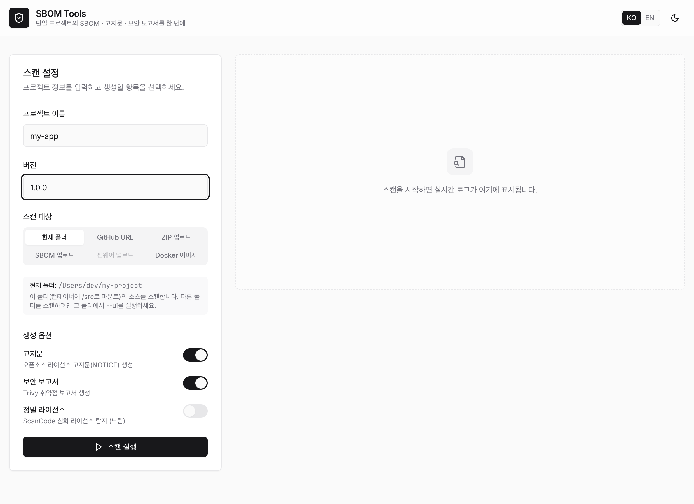

## SKT SBOM Generator

SKT SBOM Generator는 공급사가 별도의 도구 학습이나 환경 설정 없이도 Docker 하나로
SK텔레콤 정책에 부합하는 표준 준수 산출물을 즉시 생성할 수 있는 오픈소스 도구입니다.

- **환경 독립성**: Docker 컨테이너 기반으로 동작하여 로컬에 Java, Python 등을 설치할 필요가 없습니다.
- **다중 언어 지원**: Java, Python, Node.js, Go, Swift/iOS, Android 등 다양한 언어를 한 번에 분석합니다.
- **자동 표준 준수**: SK텔레콤 정책에 맞는 CycloneDX (JSON) 산출물을 자동으로 생성합니다.

> 이 페이지는 **빠른 시작**만 다룹니다. 설치·전체 옵션·언어별 가이드·입력 시나리오·웹 UI 등
> **상세 사용법은 공식 저장소 문서**를 정본으로 참고하세요.
>
> [github.com/sktelecom/sbom-tools](https://github.com/sktelecom/sbom-tools)
>
> 버그 제보, 기능 제안, Pull Request를 통한 기여를 환영합니다.

## 납품 산출물 3종

한 번의 실행으로 다음 **3종 산출물**이 함께 생성됩니다(`--all` 옵션).

| 산출물 | 파일 | 용도 |
|--------|------|------|
| **SBOM** | `{프로젝트}_{버전}_bom.json` | CycloneDX 1.6 구성요소 명세 (납품 기준 산출물) |
| **오픈소스 고지문** | `{프로젝트}_{버전}_NOTICE.{txt,html}` | 라이선스 의무 이행을 위한 고지문 |
| **오픈소스위험분석보고서** | `{프로젝트}_{버전}_risk-report.{md,html}` | 라이선스+취약점 위험 집계 (대응 기한: Critical 7일·High 30일) |

## 빠른 시작 (CLI)

사전 준비: **Docker 20.10 이상** 설치 및 실행. (첫 실행 시 이미지 다운로드로 5–10분 소요)

```bash
# 1) 스크립트 다운로드
curl -O https://raw.githubusercontent.com/sktelecom/sbom-tools/main/scripts/scan-sbom.sh
chmod +x scan-sbom.sh

# 2) 소스 디렉터리에서 3종 산출물 생성
cd /path/to/my-project
/path/to/scan-sbom.sh --project "MyApp" --version "1.0.0" --all --generate-only
```

- 결과: `MyApp_1.0.0_bom.json`, `MyApp_1.0.0_NOTICE.{txt,html}`, `MyApp_1.0.0_risk-report.{md,html}`
- GitHub URL · 소스 ZIP · Docker 이미지 · 기존 SBOM · 펌웨어 · 바이너리/RootFS 등 다른 입력 형태와
  전체 옵션은 [사용 가이드](https://github.com/sktelecom/sbom-tools/blob/main/docs/usage-guide.md)를 참고하세요.

> `--generate-only`는 포털 자동 업로드 없이 로컬에 파일만 생성합니다. 제출 전까지 권장합니다.

## 웹 UI로 생성 (CLI가 익숙하지 않은 경우)

명령줄이 부담스럽다면 브라우저 기반 웹 UI를 사용할 수 있습니다. 산출물을 저장할 폴더에서 한 줄로 실행합니다.

```bash
./scan-sbom.sh --ui     # http://localhost:8080 자동 열림
```

Windows에서는 `scripts\sbom-ui.bat`를 더블클릭합니다.

화면에서 **스캔 대상**(현재 폴더 / GitHub URL / ZIP / SBOM / 펌웨어 / Docker 이미지)을 선택하고
프로젝트명·버전을 입력한 뒤 실행하면, 진행 로그가 실시간으로 표시됩니다.



완료 후 **SBOM·고지문·오픈소스위험분석보고서**를 화면에서 보거나 내려받을 수 있습니다.


> 웹 UI의 입력별 상세와 산출물 설명은
> [고지문·보안·UI 가이드](https://github.com/sktelecom/sbom-tools/blob/main/docs/notice-security-ui-guide.md)를 참고하세요.

## 더 알아보기 (공식 저장소 문서)

도구 사용법의 정본은 저장소 문서입니다. 아래에서 필요한 주제를 확인하세요.

| 주제 | 문서 |
|------|------|
| 설치 · 첫 SBOM (웹 UI 포함) | [getting-started](https://github.com/sktelecom/sbom-tools/blob/main/docs/getting-started.md) |
| 전체 옵션 · 언어별 · 분석 모드 · CI/CD | [usage-guide](https://github.com/sktelecom/sbom-tools/blob/main/docs/usage-guide.md) |
| 입력 형태별 시나리오 | [scenarios-guide](https://github.com/sktelecom/sbom-tools/blob/main/docs/scenarios-guide.md) |
| 고지문 · 보안 · 웹 UI | [notice-security-ui-guide](https://github.com/sktelecom/sbom-tools/blob/main/docs/notice-security-ui-guide.md) |
| 공급사 SBOM 분석 (`--analyze`) | [supplier-sbom-analysis](https://github.com/sktelecom/sbom-tools/blob/main/docs/supplier-sbom-analysis.md) |

## 다음 단계

SBOM 파일 생성 완료 후:

1. [검증 체크리스트](../checklist/)로 파일 확인
2. [제출 절차](../submission/)에 따라 SK텔레콤에 제출

## 관련 문서

- [제출 요구사항](../requirements/): SBOM에 포함되어야 할 필수 데이터 필드
- [오픈소스 도구 활용](../creation-guide/): SKT 도구 대신 cdxgen·Syft 등 오픈소스 도구를 직접 사용하는 경우
- [검증 체크리스트](../checklist/): 제출 전 확인 사항
- [제출 절차](../submission/): 제출 방법 및 이메일 양식
